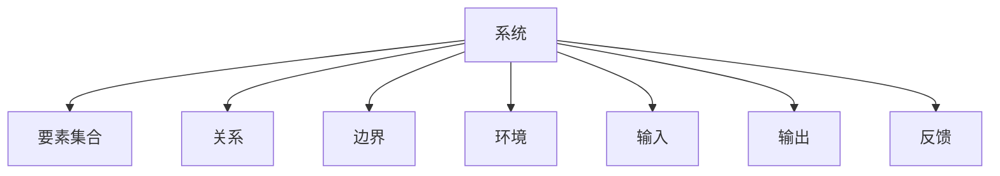

# 1.1.1 基本概念

## 1. 概念定义与背景

- **系统（System）**：由若干相互作用、相互依赖的要素组成的有机整体。系统具有边界、环境、输入、输出、反馈等基本特征。
- **子系统/超系统**：系统可递归分解为子系统，也可作为更大系统的组成部分。
- **开放系统/封闭系统**：根据与环境的交互程度分类。

## 2. 相关术语

- 子系统（Subsystem）：系统内部可独立分析的组成部分。
- 超系统（Supersystem）：包含当前系统的更大系统。
- 开放系统（Open System）：与环境有物质、能量、信息交换的系统。
- 封闭系统（Closed System）：与环境无交换的理想系统。

## 3. 结构化表达

- 概念图：

- 术语表：
| 编号 | 术语     | 定义 |
|------|----------|------|
| 1.1.1.1 | 系统     | 有机整体，包含要素、关系、边界、环境等 |
| 1.1.1.2 | 子系统   | 系统内部可独立分析的组成部分 |
| 1.1.1.3 | 超系统   | 包含当前系统的更大系统 |
| 1.1.1.4 | 开放系统 | 与环境有交换的系统 |
| 1.1.1.5 | 封闭系统 | 与环境无交换的理想系统 |

## 4. 发展脉络

- 20世纪40年代，冯·贝塔朗菲提出“系统论”，强调整体性、层次性、目的性。
- 控制论、信息论、复杂系统理论等相继发展，推动了系统科学的多学科融合。

## 5. 主要理论/流派

- 经典系统论：关注整体性、层次性、目的性。
- 控制论：研究系统的调节与反馈。
- 信息论：研究信息的传递与处理。
- 复杂系统理论：关注非线性、涌现、自组织等现象。

## 6. 关键问题与挑战

- 系统边界的确定
- 系统复杂性的度量
- 系统的可控性与可观测性

## 7. 典型案例

- 生物系统：细胞、器官、生态系统
- 工程系统：自动化生产线、计算机系统
- 社会系统：组织、经济体

## 8. 批判性分析

- 系统论的整体性与还原论的争论
- 形式化与经验主义的冲突
- 系统理论的适用边界

## 9. 形式化结构与符号表达

- 系统S = (E, R, B, En, In, Out, F)
  - E：要素集合
  - R：要素间关系
  - B：边界
  - En：环境
  - In/Out：输入/输出
  - F：反馈机制

## 10. 形式化证明与推理

- 命题：若系统S为开放系统，则存在En ≠ ∅。
- 证明：根据定义，开放系统与环境有输入/输出交互，故En非空。

## 11. 多表征

- 结构层次图、关系网络图、属性矩阵等

## 12. 形式语义

- “系统”语义：S的每个要素e∈E在R下有唯一结构角色。
- 语义模型：系统状态转移图
- 语义分析方法：一致性验证、自动化推理

---
> 本文件为递归细化与内容补全示范，后续可继续分解为1.1.1.1、1.1.1.2等子主题，支持持续递归完善。
