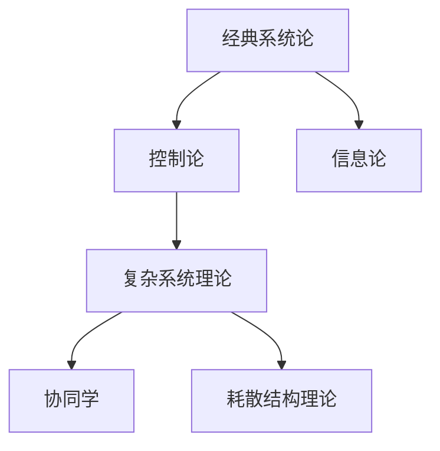

# 1.1.3 主要流派与理论

## 1. 主要流派

- **经典系统论**：强调系统的整体性、层次性、目的性。代表人物：冯·贝塔朗菲。
- **控制论**：关注系统的反馈、调节、信息流。代表人物：诺伯特·维纳。
- **信息论**：研究信息的传递、编码、熵。代表人物：克劳德·香农。
- **复杂系统理论**：研究非线性、涌现、自组织、适应性。代表人物：普里高津、哈肯。
- **协同学**：研究多要素协同作用下的有序结构形成。代表人物：哈肯。
- **耗散结构理论**：研究远离平衡态系统的自组织现象。代表人物：普里高津。

## 2. 理论比较

- **核心观点**：
  - 经典系统论：系统整体性优先于部分，强调层次和目的。
  - 控制论：系统的反馈调节机制。
  - 信息论：信息熵、编码、通信效率。
  - 复杂系统理论：非线性、涌现、自组织。
- **代表人物**：见上。
- **应用领域**：
  - 经典系统论：生物、社会、工程等广泛领域。
  - 控制论：自动化、机器人、神经科学。
  - 信息论：通信、计算机、数据科学。
  - 复杂系统理论：生态、经济、网络科学。
- **异同点分析**：
  - 共同点：都关注系统的整体性、要素间关系、动态演化。
  - 区别：理论侧重点不同，数学工具和应用领域各异。

## 3. 结构化表达

- **流派关系图**：

- **理论对比表**：
| 编号 | 理论流派 | 核心观点 | 代表人物 | 典型应用 |
|------|----------|----------|----------|----------|
| 1.1.3.1 | 经典系统论 | 整体性、层次性 | 贝塔朗菲 | 生物、社会 |
| 1.1.3.2 | 控制论 | 反馈、调节 | 维纳 | 自动化、神经科学 |
| 1.1.3.3 | 信息论 | 信息熵、编码 | 香农 | 通信、数据 |
| 1.1.3.4 | 复杂系统 | 非线性、涌现 | 普里高津、哈肯 | 生态、网络 |

## 4. 多表征

- 理论发展脉络图、对比表、关系网络图

## 5. 规范说明

- 内容需递归细化，支持多表征。
- 保留批判性分析、图表等。
- 如有遗漏，后续补全并说明。

> 本文件为递归细化与内容补全示范，后续可继续分解为1.1.3.1、1.1.3.2等子主题，支持持续递归完善。
