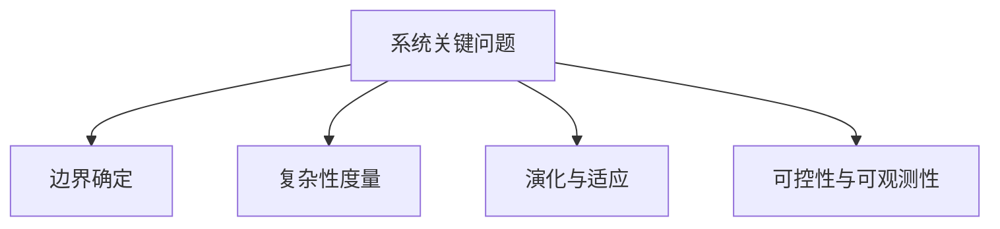

# 1.1.4 关键问题与挑战

## 1. 主要问题

- **系统边界的确定**：如何科学划定系统与环境的界限，避免分析过度或不足。
- **系统复杂性的度量**：如何用定量或定性方法描述系统的复杂性（如熵、网络度量等）。
- **系统演化与适应性**：系统如何在环境变化下自我调整、进化、保持稳定。
- **系统的可控性与可观测性**：哪些条件下系统能被有效控制、其状态能被准确观测。

## 2. 挑战分析

- **理论与实际的差距**：理论模型往往简化现实，实际系统中存在大量不可预见因素。
- **多学科交叉的难点**：系统科学涉及物理、生物、工程、社会等多领域，知识整合难度大。
- **未来发展趋势**：
  - 复杂性科学、人工智能、网络科学等新兴领域对系统理论提出新挑战。
  - 系统的自组织、自适应能力成为研究热点。

## 3. 结构化表达

- **问题树**：

- **挑战矩阵**：
| 编号 | 挑战 | 影响领域 | 典型难点 |
|------|------|----------|----------|
| 1.1.4.1 | 理论与实际差距 | 工程、社会 | 不确定性、模型失配 |
| 1.1.4.2 | 多学科交叉 | 复杂系统 | 知识整合、术语不统一 |
| 1.1.4.3 | 未来趋势 | 科学前沿 | 自组织、自适应、AI |

## 4. 多表征

- 问题树、挑战矩阵、趋势图、案例分析

## 5. 规范说明

- 内容需递归细化，支持多表征。
- 保留批判性分析、图表等。
- 如有遗漏，后续补全并说明。

> 本文件为递归细化与内容补全示范，后续可继续分解为1.1.4.1、1.1.4.2等子主题，支持持续递归完善。
