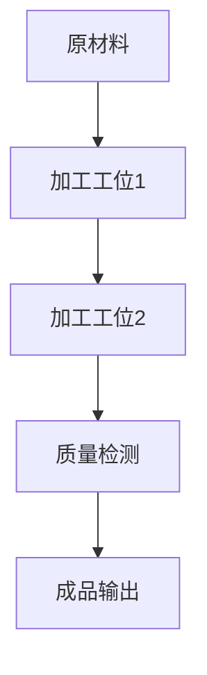

# 1.1.5 相关案例

## 1. 典型案例

- **工程系统案例**：自动化生产线、智能制造系统、交通信号控制系统。
- **生物系统案例**：细胞代谢网络、神经系统、生态系统。
- **社会系统案例**：企业组织结构、经济市场、城市交通。
- **信息系统案例**：互联网、分布式数据库、云计算平台。

## 2. 案例分析

### 2.1 工程系统案例：自动化生产线

- **案例背景**：现代工厂采用自动化生产线提升效率。
- **系统结构与要素**：传送带、机器人、传感器、控制单元。
- **关键问题与解决方案**：如何实现多工位协同、故障自恢复、实时调度。
- **案例启示**：系统集成与反馈机制是提升鲁棒性的关键。

### 2.2 生物系统案例：细胞代谢网络

- **案例背景**：细胞内部复杂的代谢反应网络。
- **系统结构与要素**：酶、底物、产物、调控因子。
- **关键问题与解决方案**：代谢通路的调控、能量分配、异常状态的自适应。
- **案例启示**：分布式调控与冗余机制提升系统稳定性。

### 2.3 社会系统案例：企业组织结构

- **案例背景**：大型企业的多层级组织管理。
- **系统结构与要素**：部门、岗位、信息流、决策链。
- **关键问题与解决方案**：信息传递效率、决策层级优化、激励机制。
- **案例启示**：层次结构与反馈机制影响组织效能。

## 3. 结构化表达

- **案例流程图**：

- **结构表**：
| 编号 | 案例类型 | 主要要素 | 关键机制 | 启示 |
|------|----------|----------|----------|------|
| 1.1.5.1 | 工程系统 | 机器人、传感器 | 协同、反馈 | 鲁棒性提升 |
| 1.1.5.2 | 生物系统 | 酶、底物、调控因子 | 分布式调控 | 稳定性提升 |
| 1.1.5.3 | 社会系统 | 部门、岗位、信息流 | 层次结构 | 效能优化 |

## 4. 多表征

- 案例流程图、结构表、对比分析、符号化描述

## 5. 规范说明

- 内容需递归细化，支持多表征。
- 保留批判性分析、图表等。
- 如有遗漏，后续补全并说明。

> 本文件为递归细化与内容补全示范，后续可继续分解为1.1.5.1、1.1.5.2等子主题，支持持续递归完善。
