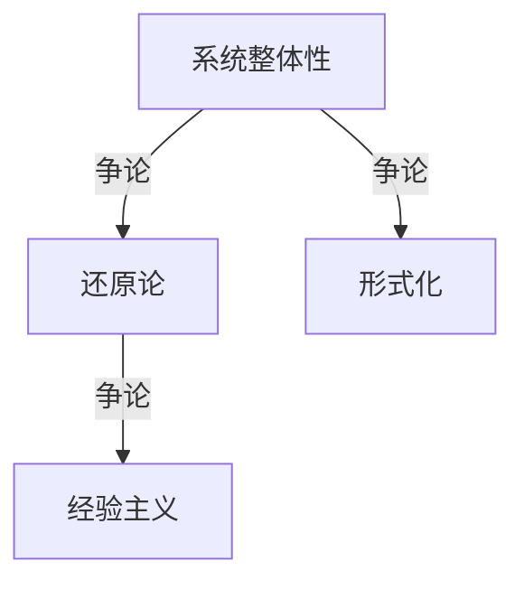

# 1.2.1 主要争议

## 1. 争议主题与背景

- **系统定义的边界与本质**：不同学科对“系统”边界和本质的理解存在分歧。
- **系统理论的科学性与适用性**：系统论是否具备严格的科学性？其适用范围和局限性如何？
- **形式化与经验主义的冲突**：系统理论应以形式化数学为主，还是以经验归纳为主？
- **系统整体性与还原论的争论**：整体性优先还是还原论优先？两者如何结合？

## 2. 典型观点

- **整体论观点**：系统整体性不可还原为部分之和。
- **还原论观点**：系统可分解为基本单元，整体性可由部分推导。
- **形式化派**：强调系统理论的数学表达和逻辑推理。
- **经验主义派**：强调实际案例、实验和归纳。

## 3. 结构化表达

- **争议对比表**：
| 编号 | 争议主题 | 主要观点 | 代表人物/学派 |
|------|----------|----------|--------------|
| 1.2.1.1 | 系统边界 | 整体论 vs 还原论 | 贝塔朗菲、维纳 |
| 1.2.1.2 | 科学性 | 形式化派 vs 经验派 | 香农、普里高津 |
| 1.2.1.3 | 适用性 | 工程/生物/社会等领域 | 多学科 |

- **观点关系图**：

- **争议演化时间线**：
  - 1940s-1960s：整体论与还原论争论
  - 1970s-1990s：形式化与经验主义分歧
  - 2000s-今：多学科融合、理论与实践结合

## 4. 多表征

- 争议对比表、关系图、时间线、案例分析

## 5. 规范说明

- 内容需递归细化，支持多表征。
- 保留批判性分析、图表等。
- 如有遗漏，后续补全并说明。

> 本文件为递归细化与内容补全示范，后续可继续分解为1.2.1.1、1.2.1.2等子主题，支持持续递归完善。
