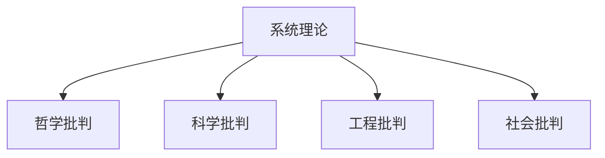

# 1.2.2 批判视角

## 1. 主要视角与背景

- **哲学批判**：系统理论的本体论、认识论基础，整体性与还原论的哲学争议。
- **科学批判**：系统理论的科学性、可证伪性、与传统科学范式的关系。
- **工程批判**：系统理论在工程实践中的适用性、局限性、与复杂工程系统的关系。
- **社会批判**：系统理论对社会系统、组织管理、经济系统的解释力与局限。

## 2. 典型批判观点

- **哲学视角**：整体性优先、系统边界的主观性、系统与环境的互动。
- **科学视角**：系统理论的可操作性、可验证性、与实验科学的差异。
- **工程视角**：理论与工程实践的脱节、模型简化与实际复杂性的矛盾。
- **社会视角**：系统理论对社会现象的解释力、社会系统的不可控性。

## 3. 结构化表达

- **批判视角矩阵**：
| 编号 | 批判视角 | 主要观点 | 典型问题 |
|------|----------|----------|----------|
| 1.2.2.1 | 哲学 | 整体性、边界主观性 | 系统本体论 |
| 1.2.2.2 | 科学 | 可证伪性、可操作性 | 理论与实验差异 |
| 1.2.2.3 | 工程 | 理论与实践脱节 | 模型简化问题 |
| 1.2.2.4 | 社会 | 解释力、不可控性 | 社会系统复杂性 |

- **观点对比表**：
| 视角 | 代表观点 | 典型批判 |
|------|----------|----------|
| 哲学 | 整体性优先 | 边界划分主观 |
| 科学 | 可操作性 | 难以实验验证 |
| 工程 | 理论简化 | 实际复杂性高 |
| 社会 | 解释力有限 | 不可控性强 |

- **批判路径图**：

## 4. 多表征

- 批判矩阵、对比表、路径图、案例分析

## 5. 规范说明

- 内容需递归细化，支持多表征。
- 保留批判性分析、图表等。
- 如有遗漏，后续补全并说明。

> 本文件为递归细化与内容补全示范，后续可继续分解为1.2.2.1、1.2.2.2等子主题，支持持续递归完善。
