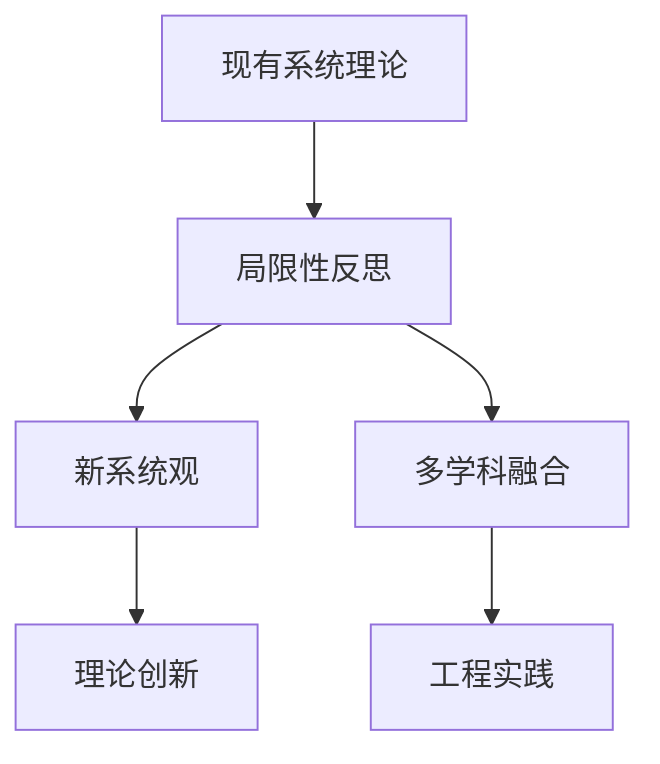

# 1.2.3 反思与重构

## 1. 反思内容
- **现有系统理论的局限性**：
  - 过度依赖整体性，忽视部分细节。
  - 理论模型与实际系统复杂性存在差距。
  - 数学形式化表达的适用范围有限。
- **形式化方法的反思**：
  - 形式化有助于严密推理，但难以覆盖所有实际情境。
  - 形式化与经验主义需结合，避免理论与实践脱节。
- **多学科融合的必要性**：
  - 复杂系统需整合物理、生物、工程、社会等多领域知识。
  - 学科间术语、范式、方法需协调统一。

## 2. 重构方向
- **新系统观的提出**：
  - 强调系统的动态性、适应性、自组织能力。
  - 引入复杂性科学、网络科学等新理论。
- **形式化与经验主义的结合**：
  - 理论推导与实验数据相结合，提升模型解释力。
  - 强调模型的可验证性、可操作性。
- **哲学与工程的协同**：
  - 哲学反思指导理论创新，工程实践检验理论有效性。
  - 推动理论与应用的双向反馈。

## 3. 结构化表达
- **反思路径图**：

- **重构方案表**：
| 编号 | 重构方向 | 关键措施 | 预期效果 |
|------|----------|----------|----------|
| 1.2.3.1 | 新系统观 | 动态性、自组织 | 理论创新 |
| 1.2.3.2 | 形式化+经验 | 推理+实验 | 解释力提升 |
| 1.2.3.3 | 哲学+工程 | 反思+实践 | 理论与应用协同 |

## 4. 多表征
- 路径图、重构表、理论演化图、案例分析

## 5. 规范说明
- 内容需递归细化，支持多表征。
- 保留批判性分析、图表等。
- 如有遗漏，后续补全并说明。

> 本文件为递归细化与内容补全示范，后续可继续分解为1.2.3.1、1.2.3.2等子主题，支持持续递归完善。
