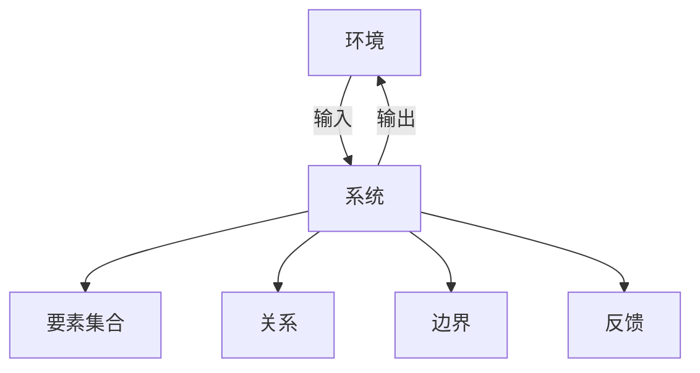

# 1.3.1 形式化定义

## 1. 集合论定义

- **系统S** 通常可形式化为 S = (E, R, B, En, In, Out, F)
  - E：要素集合（Elements）
  - R：要素间关系（Relations）
  - B：边界（Boundary）
  - En：环境（Environment）
  - In/Out：输入/输出（Input/Output）
  - F：反馈机制（Feedback）
- **集合表达式**：
  - S = (E, R), 其中 E = {e1, e2, ..., en}, R ⊆ E × E

## 2. 关系与映射的形式化

- **关系R**：R ⊆ E × E，描述要素间的连接、作用、依赖。
- **映射f**：f: E → V，V为要素属性空间。
- **结构映射**：φ: S → S'，系统间的结构同态/同构。

## 3. 系统边界、要素、环境的符号化表达

- **边界B**：B = ∂S，定义系统与环境的分界。
- **环境En**：En = U \ S，U为宇宙全集。
- **输入/输出**：In: En → S，Out: S → En

## 4. 结构化表达

- **结构图**：

- **集合表达式**：
  - S = (E, R, B, En, In, Out, F)
  - R = { (ei, ej) | ei, ej ∈ E }

## 5. 多表征

- 结构图、集合表达式、关系矩阵、符号表

## 6. 规范说明

- 内容需递归细化，支持多表征。
- 保留批判性分析、图表、符号等。
- 如有遗漏，后续补全并说明。

> 本文件为递归细化与内容补全示范，后续可继续分解为1.3.1.1、1.3.1.2等子主题，支持持续递归完善。
