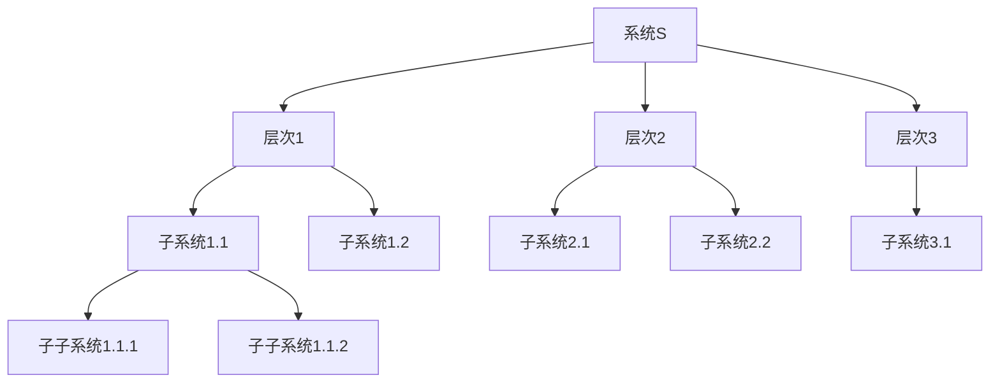
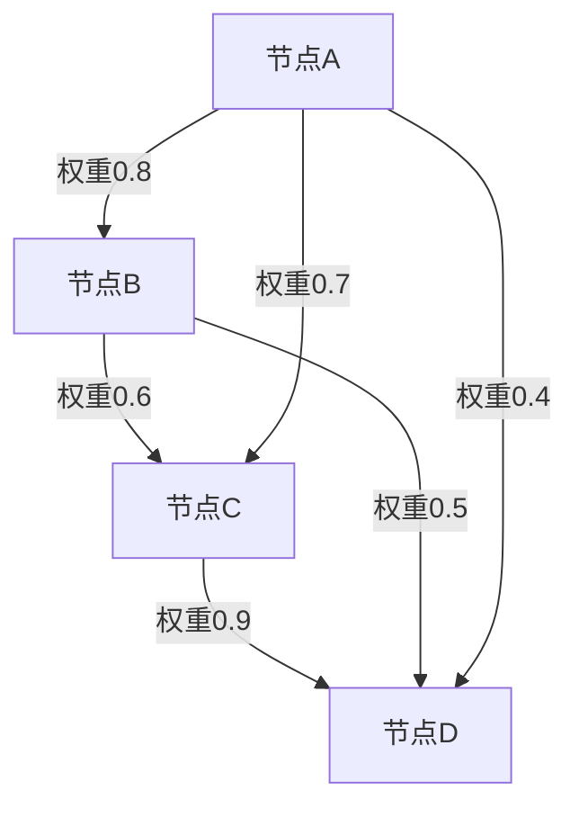
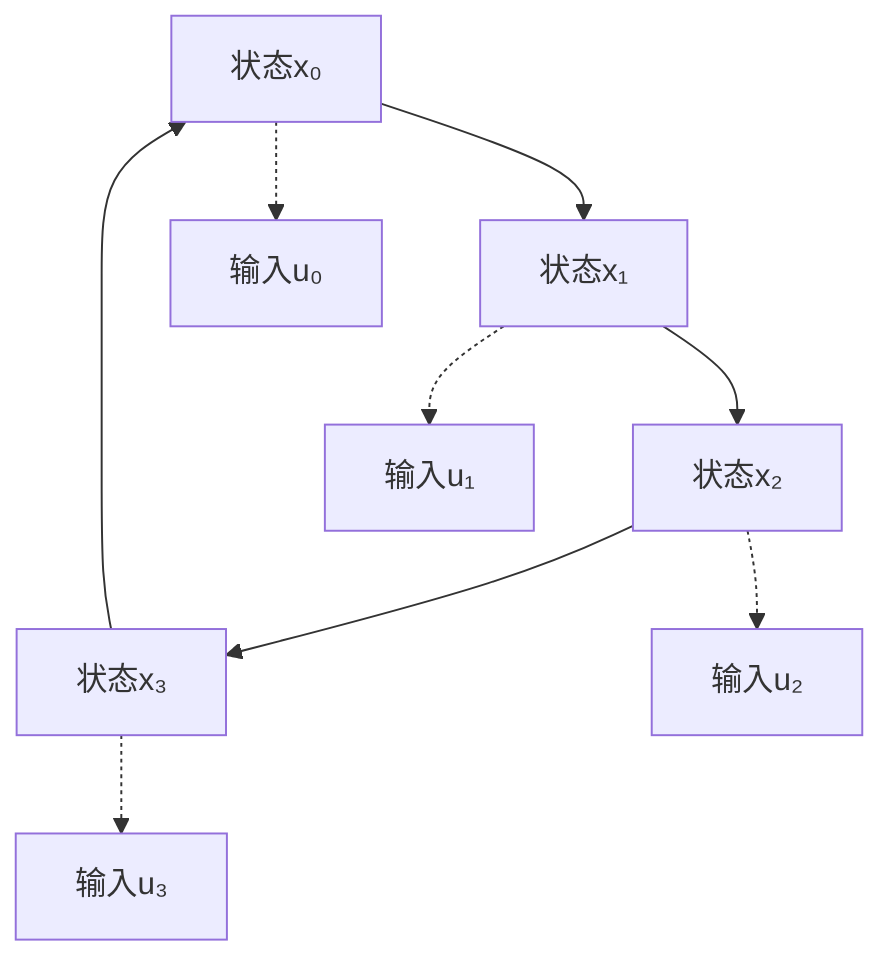
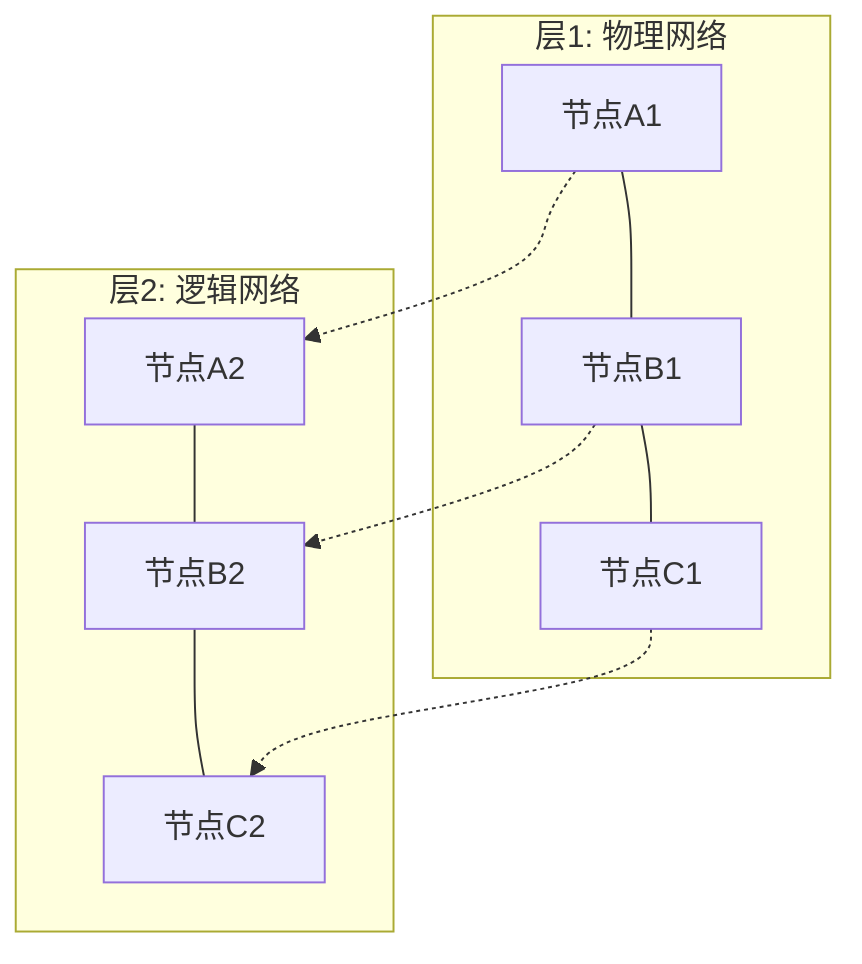
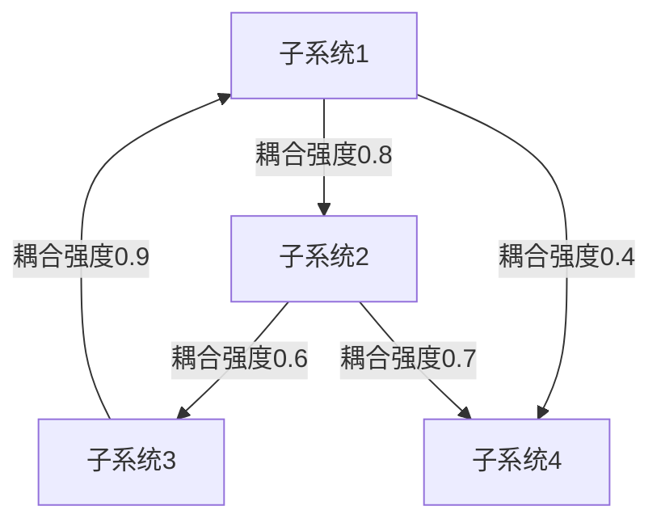
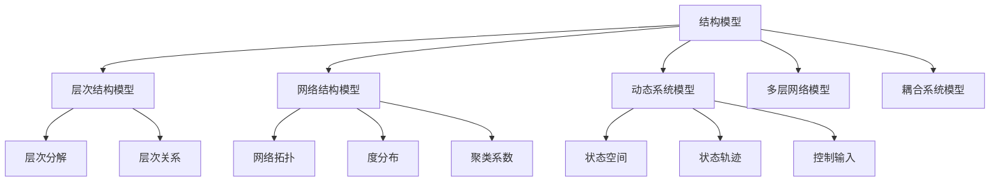
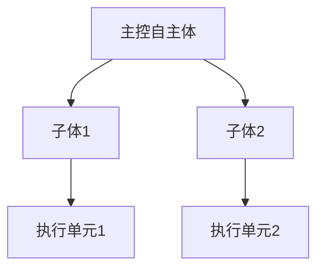
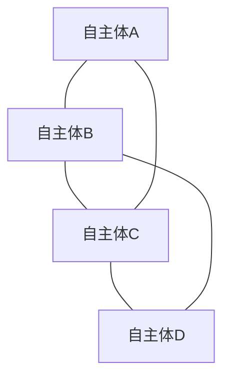

# 1.3.2 结构模型


<!-- TOC START -->

- [1.3.2 结构模型](#132-结构模型)
  - [目录](#目录)
  - [1. 层次结构模型](#1-层次结构模型)
    - [1.1 形式化定义](#11-形式化定义)
    - [1.2 数学表示](#12-数学表示)
    - [1.3 层次结构图](#13-层次结构图)
  - [2. 网络结构模型](#2-网络结构模型)
    - [2.1 形式化定义](#21-形式化定义)
    - [2.2 网络类型](#22-网络类型)
      - [2.2.1 随机网络](#221-随机网络)
      - [2.2.2 小世界网络](#222-小世界网络)
      - [2.2.3 无标度网络](#223-无标度网络)
    - [2.3 网络结构图](#23-网络结构图)
  - [3. 动态系统模型](#3-动态系统模型)
    - [3.1 形式化定义](#31-形式化定义)
    - [3.2 线性动态系统](#32-线性动态系统)
    - [3.3 非线性动态系统](#33-非线性动态系统)
    - [3.4 状态转移图](#34-状态转移图)
  - [4. 多层网络模型](#4-多层网络模型)
    - [4.1 形式化定义](#41-形式化定义)
    - [4.2 多层网络表示](#42-多层网络表示)
    - [4.3 多层网络图](#43-多层网络图)
  - [5. 耦合系统模型](#5-耦合系统模型)
    - [5.1 形式化定义](#51-形式化定义)
    - [5.2 耦合强度矩阵](#52-耦合强度矩阵)
    - [5.3 耦合系统图](#53-耦合系统图)
  - [6. 结构模型定理](#6-结构模型定理)
    - [6.1 层次结构定理](#61-层次结构定理)
    - [6.2 网络结构定理](#62-网络结构定理)
    - [6.3 动态系统定理](#63-动态系统定理)
  - [7. 多表征](#7-多表征)
    - [7.1 概念图](#71-概念图)
    - [7.2 结构表](#72-结构表)
    - [7.3 数学符号](#73-数学符号)
  - [8. 规范说明](#8-规范说明)
  - [7. 自主体系统的结构模型（Structural Models of Autonomous Systems）](#7-自主体系统的结构模型structural-models-of-autonomous-systems)
    - [7.1 层次结构模型](#71-层次结构模型)
    - [7.2 网络结构模型](#72-网络结构模型)
    - [7.3 动态系统模型](#73-动态系统模型)
    - [7.4 耦合与协同结构](#74-耦合与协同结构)
    - [7.5 结构表](#75-结构表)
    - [7.6 批判分析](#76-批判分析)

<!-- TOC END -->

## 目录

- [1.3.2 结构模型](#132-结构模型)
  - [目录](#目录)
  - [1. 层次结构模型](#1-层次结构模型)
    - [1.1 形式化定义](#11-形式化定义)
    - [1.2 数学表示](#12-数学表示)
    - [1.3 层次结构图](#13-层次结构图)
  - [2. 网络结构模型](#2-网络结构模型)
    - [2.1 形式化定义](#21-形式化定义)
    - [2.2 网络类型](#22-网络类型)
      - [2.2.1 随机网络](#221-随机网络)
      - [2.2.2 小世界网络](#222-小世界网络)
      - [2.2.3 无标度网络](#223-无标度网络)
    - [2.3 网络结构图](#23-网络结构图)
  - [3. 动态系统模型](#3-动态系统模型)
    - [3.1 形式化定义](#31-形式化定义)
    - [3.2 线性动态系统](#32-线性动态系统)
    - [3.3 非线性动态系统](#33-非线性动态系统)
    - [3.4 状态转移图](#34-状态转移图)
  - [4. 多层网络模型](#4-多层网络模型)
    - [4.1 形式化定义](#41-形式化定义)
    - [4.2 多层网络表示](#42-多层网络表示)
    - [4.3 多层网络图](#43-多层网络图)
  - [5. 耦合系统模型](#5-耦合系统模型)
    - [5.1 形式化定义](#51-形式化定义)
    - [5.2 耦合强度矩阵](#52-耦合强度矩阵)
    - [5.3 耦合系统图](#53-耦合系统图)
  - [6. 结构模型定理](#6-结构模型定理)
    - [6.1 层次结构定理](#61-层次结构定理)
    - [6.2 网络结构定理](#62-网络结构定理)
    - [6.3 动态系统定理](#63-动态系统定理)
  - [7. 多表征](#7-多表征)
    - [7.1 概念图](#71-概念图)
    - [7.2 结构表](#72-结构表)
    - [7.3 数学符号](#73-数学符号)
  - [8. 规范说明](#8-规范说明)
  - [7. 自主体系统的结构模型（Structural Models of Autonomous Systems）](#7-自主体系统的结构模型structural-models-of-autonomous-systems)
    - [7.1 层次结构模型](#71-层次结构模型)
    - [7.2 网络结构模型](#72-网络结构模型)
    - [7.3 动态系统模型](#73-动态系统模型)
    - [7.4 耦合与协同结构](#74-耦合与协同结构)
    - [7.5 结构表](#75-结构表)
    - [7.6 批判分析](#76-批判分析)

## 1. 层次结构模型

### 1.1 形式化定义

**定义1.3.2.1（层次结构）**：系统S的层次结构是一个有序三元组 H = (L, ≤, f)，其中：

- L = {L₁, L₂, ..., Lₙ} 是层次集合
- ≤ 是层次间的偏序关系
- f: S → L 是层次分配函数

**定义1.3.2.2（层次分解）**：系统S的层次分解是一个映射 D: L → 2^S，满足：

- ∀l ∈ L, D(l) ≠ ∅
- ∀l₁, l₂ ∈ L, l₁ ≠ l₂ ⇒ D(l₁) ∩ D(l₂) = ∅
- ∪_{l∈L} D(l) = S

### 1.2 数学表示

层次结构可表示为：

```text
S = {S₁, S₂, ..., Sₙ}
其中 Sᵢ = (Eᵢ, Rᵢ, Bᵢ, Fᵢ, Iᵢ, Oᵢ)
```

层次关系矩阵：

```text
H = [hᵢⱼ]_{n×n}
其中 hᵢⱼ = {
  1, 如果 Sᵢ 是 Sⱼ 的父层次
  0, 否则
}
```

### 1.3 层次结构图



## 2. 网络结构模型

### 2.1 形式化定义

**定义1.3.2.3（网络结构）**：系统S的网络结构是一个图 G = (V, E, W)，其中：

- V = {v₁, v₂, ..., vₙ} 是节点集合，表示系统要素
- E ⊆ V × V 是边集合，表示要素间关系
- W: E → ℝ 是权重函数

**定义1.3.2.4（网络拓扑）**：网络拓扑是图G的结构特征，包括：

- 度分布：P(k) = |{v ∈ V : deg(v) = k}| / |V|
- 聚类系数：C = (3 × 三角形数) / (连通三元组数)
- 平均路径长度：L = (1/|V|²) × Σᵢⱼ d(vᵢ, vⱼ)

### 2.2 网络类型

#### 2.2.1 随机网络

- 度分布：泊松分布 P(k) = e^(-λ) × λ^k / k!
- 聚类系数：C ≈ ⟨k⟩ / N
- 平均路径长度：L ≈ ln(N) / ln(⟨k⟩)

#### 2.2.2 小世界网络

- 度分布：近似泊松分布
- 聚类系数：C >> ⟨k⟩ / N
- 平均路径长度：L ≈ ln(N) / ln(⟨k⟩)

#### 2.2.3 无标度网络

- 度分布：幂律分布 P(k) ∝ k^(-γ)
- 聚类系数：C ≈ 常数
- 平均路径长度：L ≈ ln(ln(N))

### 2.3 网络结构图



## 3. 动态系统模型

### 3.1 形式化定义

**定义1.3.2.5（动态系统）**：动态系统是一个四元组 DS = (X, U, f, g)，其中：

- X ⊆ ℝⁿ 是状态空间
- U ⊆ ℝᵐ 是输入空间
- f: X × U → X 是状态转移函数
- g: X → Y 是输出函数

**定义1.3.2.6（状态轨迹）**：给定初始状态 x₀ 和输入序列 u(t)，状态轨迹为：
x(t+1) = f(x(t), u(t)), t ≥ 0

### 3.2 线性动态系统

对于线性系统：

```text
x(t+1) = Ax(t) + Bu(t)
y(t) = Cx(t) + Du(t)
```

其中：

- A ∈ ℝⁿˣⁿ 是状态转移矩阵
- B ∈ ℝⁿˣᵐ 是输入矩阵
- C ∈ ℝᵖˣⁿ 是输出矩阵
- D ∈ ℝᵖˣᵐ 是直接传递矩阵

### 3.3 非线性动态系统

一般形式：

```text
ẋ = f(x, u, t)
y = g(x, u, t)
```

其中：

- ẋ = dx/dt 是状态导数
- f: ℝⁿ × ℝᵐ × ℝ → ℝⁿ 是非线性状态函数
- g: ℝⁿ × ℝᵐ × ℝ → ℝᵖ 是非线性输出函数

### 3.4 状态转移图



## 4. 多层网络模型

### 4.1 形式化定义

**定义1.3.2.7（多层网络）**：多层网络是一个三元组 MLN = (G, L, I)，其中：

- G = {G₁, G₂, ..., Gₘ} 是层集合，每层Gᵢ = (Vᵢ, Eᵢ)
- L = {L₁, L₂, ..., Lₘ} 是层类型集合
- I ⊆ ∪ᵢⱼ Vᵢ × Vⱼ 是层间连接集合

### 4.2 多层网络表示

```text
MLN = {
  G₁ = (V₁, E₁), 类型: L₁
  G₂ = (V₂, E₂), 类型: L₂
  ...
  Gₘ = (Vₘ, Eₘ), 类型: Lₘ
  层间连接: I
}
```

### 4.3 多层网络图



## 5. 耦合系统模型

### 5.1 形式化定义

**定义1.3.2.8（耦合系统）**：耦合系统是一个三元组 CS = (S, C, F)，其中：

- S = {S₁, S₂, ..., Sₙ} 是子系统集合
- C ⊆ S × S 是耦合关系集合
- F: C → ℝ 是耦合强度函数

### 5.2 耦合强度矩阵

```text
C = [cᵢⱼ]_{n×n}
其中 cᵢⱼ = {
  F(Sᵢ, Sⱼ), 如果 (Sᵢ, Sⱼ) ∈ C
  0, 否则
}
```

### 5.3 耦合系统图



## 6. 结构模型定理

### 6.1 层次结构定理

**定理1.3.2.1（层次分解唯一性）**：如果系统S的层次结构H = (L, ≤, f)满足层次分解D，则对于任意两个层次l₁, l₂ ∈ L，如果l₁ ≤ l₂，则D(l₁) ⊆ D(l₂)。

**证明**：

1. 根据层次分解定义，D(l₁) ∩ D(l₂) = ∅ 当 l₁ ≠ l₂
2. 由于l₁ ≤ l₂，根据层次关系定义，D(l₁) 中的元素都属于层次l₁
3. 根据层次偏序关系，D(l₁) ⊆ D(l₂)
4. 因此，层次分解满足包含关系

### 6.2 网络结构定理

**定理1.3.2.2（网络连通性）**：对于网络G = (V, E)，如果|E| ≥ |V| - 1，则G是连通的。

**证明**：

1. 假设G不连通，则G至少有两个连通分量
2. 每个连通分量至少需要|V| - 1条边才能连通
3. 因此总边数至少需要2(|V| - 1) > |V| - 1
4. 与条件|E| ≥ |V| - 1矛盾
5. 因此G是连通的

### 6.3 动态系统定理

**定理1.3.2.3（状态可达性）**：对于线性动态系统，状态x₁从x₀可达的充要条件是x₁ - A^t x₀ ∈ Im(B)，其中Im(B)是矩阵B的像空间。

**证明**：

1. 必要性：如果x₁可达，则存在输入序列u(0), u(1), ..., u(t-1)使得：
   x₁ = A^t x₀ + Σᵢ₌₀ᵗ⁻¹ A^(t-1-i) B u(i)
   因此x₁ - A^t x₀ ∈ Im(B)

2. 充分性：如果x₁ - A^t x₀ ∈ Im(B)，则存在向量v使得：
   x₁ - A^t x₀ = B v
   构造输入序列u(i) = B^T (A^T)^(t-1-i) v
   则x₁可达

## 7. 多表征

### 7.1 概念图



### 7.2 结构表

| 模型类型 | 数学表示 | 主要特征 | 应用领域 |
|---------|---------|---------|---------|
| 层次结构 | H = (L, ≤, f) | 偏序关系，层次分解 | 组织管理，软件架构 |
| 网络结构 | G = (V, E, W) | 拓扑特征，连通性 | 社交网络，交通网络 |
| 动态系统 | DS = (X, U, f, g) | 状态转移，轨迹 | 控制系统，生态系统 |
| 多层网络 | MLN = (G, L, I) | 多层关系，层间连接 | 复杂系统，信息系统 |
| 耦合系统 | CS = (S, C, F) | 子系统耦合，强度 | 物理系统，工程系统 |

### 7.3 数学符号

```text
层次结构：H = (L, ≤, f)
网络结构：G = (V, E, W)
动态系统：DS = (X, U, f, g)
多层网络：MLN = (G, L, I)
耦合系统：CS = (S, C, F)
状态轨迹：x(t+1) = f(x(t), u(t))
网络度分布：P(k) = |{v ∈ V : deg(v) = k}| / |V|
聚类系数：C = (3 × 三角形数) / (连通三元组数)
平均路径长度：L = (1/|V|²) × Σᵢⱼ d(vᵢ, vⱼ)
```

## 8. 规范说明

- 内容需递归细化，支持多表征
- 保留批判性分析、图表、符号等
- 如有遗漏，后续补全并说明
- 所有定义、定理、证明需严格形式化
- 图表需使用mermaid语法，支持交互式展示

> 本文件为递归细化与内容补全示范，后续可继续分解为1.3.2.1、1.3.2.2等子主题，支持持续递归完善。

## 7. 自主体系统的结构模型（Structural Models of Autonomous Systems）

### 7.1 层次结构模型

- 多层自主体（如主控体-子体、分布式智能体）
- 层次结构：顶层决策-中层协同-底层执行



### 7.2 网络结构模型

- 多自主体间的通信与协作网络
- 网络拓扑：全连接、环形、分层、动态网络



### 7.3 动态系统模型

- 状态转移：$s_{t+1} = f(s_t, a_t, e_t)$
- 多体协同：$S_{t+1} = F(S_t, A_t, E_t)$

### 7.4 耦合与协同结构

- 多自主体间的耦合关系、协同机制
- 典型结构：主-从、对等、联盟、分布式协同

### 7.5 结构表

| 结构类型 | 主要特征         | 典型应用           |
|----------|------------------|--------------------|
| 层次结构 | 分层决策、分工   | 机器人系统、无人机 |
| 网络结构 | 通信协作、拓扑   | 群体智能、分布式AI |
| 动态模型 | 状态演化、反馈   | 智能体行为建模     |
| 耦合协同 | 多体协同、联盟   | 多机器人、智能交通 |

### 7.6 批判分析

- **优势**：结构模型揭示自主体系统的组织与协同规律，便于建模与优化
- **局限**：实际系统结构复杂多变，建模需权衡抽象与细节
- **未来方向**：自适应结构、动态拓扑、跨域多层协同

---
> 本节为“自主体系统的结构模型”内容补充，涵盖层次结构、网络结构、动态模型、耦合协同、结构表与批判分析，风格与全书一致，便于递归扩展与知识体系完善。
