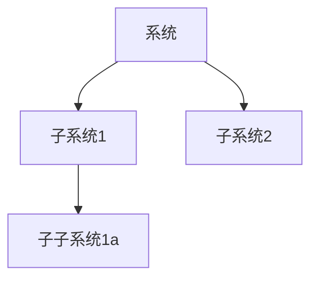
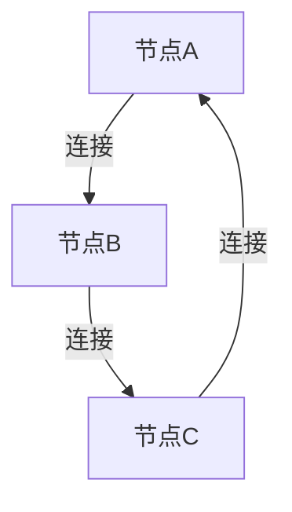
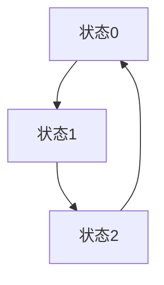

# 1.3.2 结构模型

## 1. 层次结构模型

- 系统可分为多个层次，每一层次由若干子系统组成。
- 典型表达：
  - S = {S1, S2, ..., Sn}，其中Si为子系统。
  - 层次关系用树状结构或有向无环图（DAG）表示。
- 应用：企业组织结构、操作系统分层、生态系统层级。

## 2. 网络结构模型

- 系统要素通过网络连接，形成复杂的拓扑结构。
- 典型表达：
  - G = (V, E)，V为节点集合，E为边集合。
  - 网络特性：度分布、聚类系数、路径长度等。
- 应用：互联网、神经网络、交通网络。

## 3. 动态系统模型

- 系统状态随时间变化，受输入、反馈、扰动等影响。
- 典型表达：
  - x(t+1) = f(x(t), u(t))，x为状态，u为输入。
  - 状态转移图、差分/微分方程。
- 应用：自动控制系统、经济系统、生态系统。

## 4. 其他相关结构模型

- **多层网络模型**：多种关系/属性的系统结构。
- **耦合系统模型**：多个子系统间的相互作用。

## 5. 结构化表达

- **层次结构图**：

- **网络结构图**：

- **状态转移图**：

## 6. 多表征

- 层次结构图、网络拓扑图、状态转移图、属性矩阵

## 7. 规范说明

- 内容需递归细化，支持多表征。
- 保留批判性分析、图表、符号等。
- 如有遗漏，后续补全并说明。

> 本文件为递归细化与内容补全示范，后续可继续分解为1.3.2.1、1.3.2.2等子主题，支持持续递归完善。
