# 1.3.3 结构图与表

## 1. 系统结构图

### 1.1 基本系统结构图

系统S的基本结构可表示为：

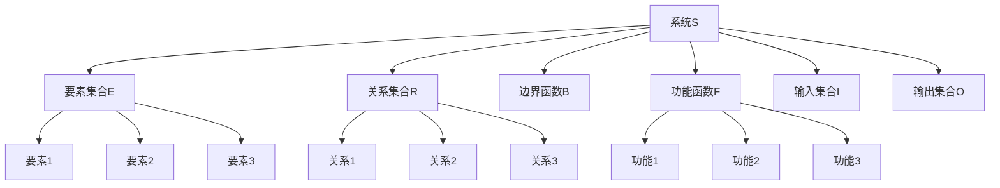

### 1.2 系统要素关系图

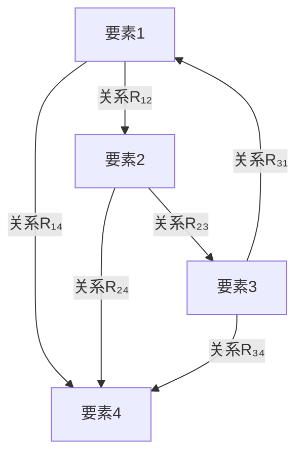

## 2. 层次关系图

### 2.1 系统层次分解图

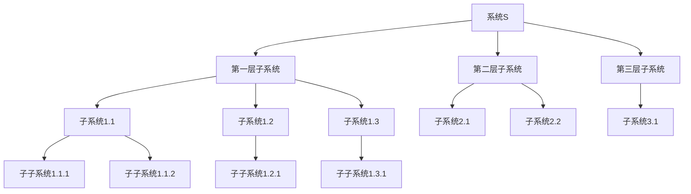

### 2.2 层次关系矩阵

层次关系可用矩阵表示：

| 层次 | L₁ | L₂ | L₃ | L₄ |
|------|----|----|----|----|
| L₁   | 0  | 1  | 1  | 1  |
| L₂   | 0  | 0  | 1  | 1  |
| L₃   | 0  | 0  | 0  | 1  |
| L₄   | 0  | 0  | 0  | 0  |

其中：

- 1 表示存在层次关系
- 0 表示不存在层次关系

## 3. 网络结构图

### 3.1 无向网络图

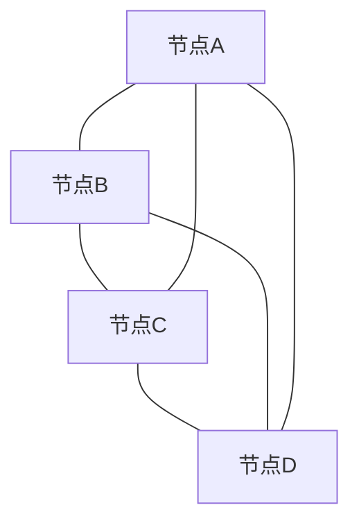

### 3.2 有向网络图

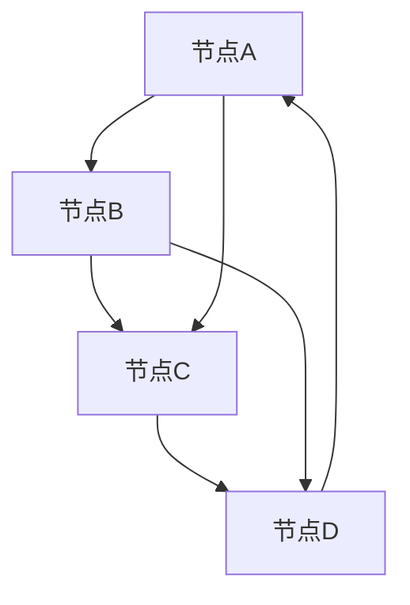

### 3.3 加权网络图

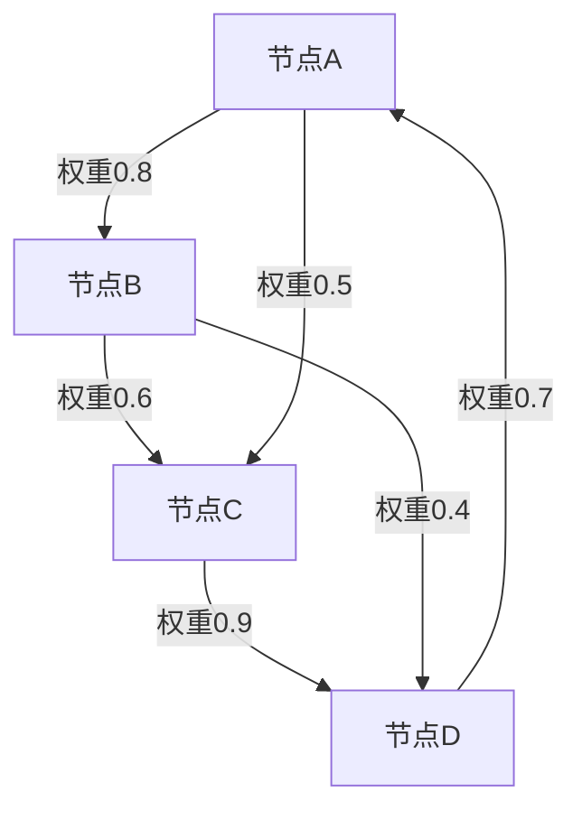

## 4. 状态转移图

### 4.1 离散状态转移图

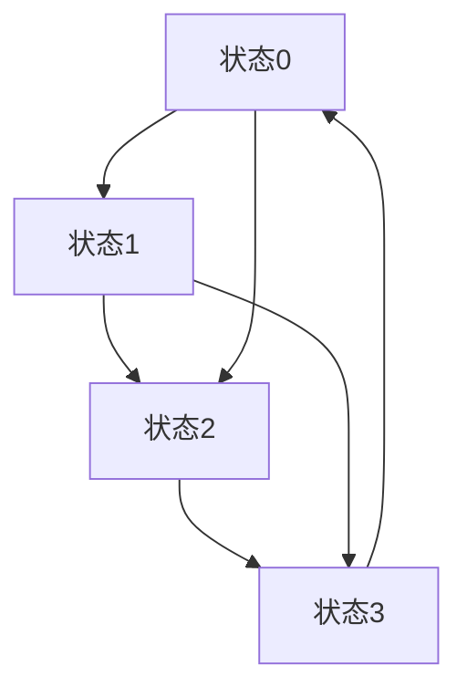

### 4.2 连续状态轨迹图

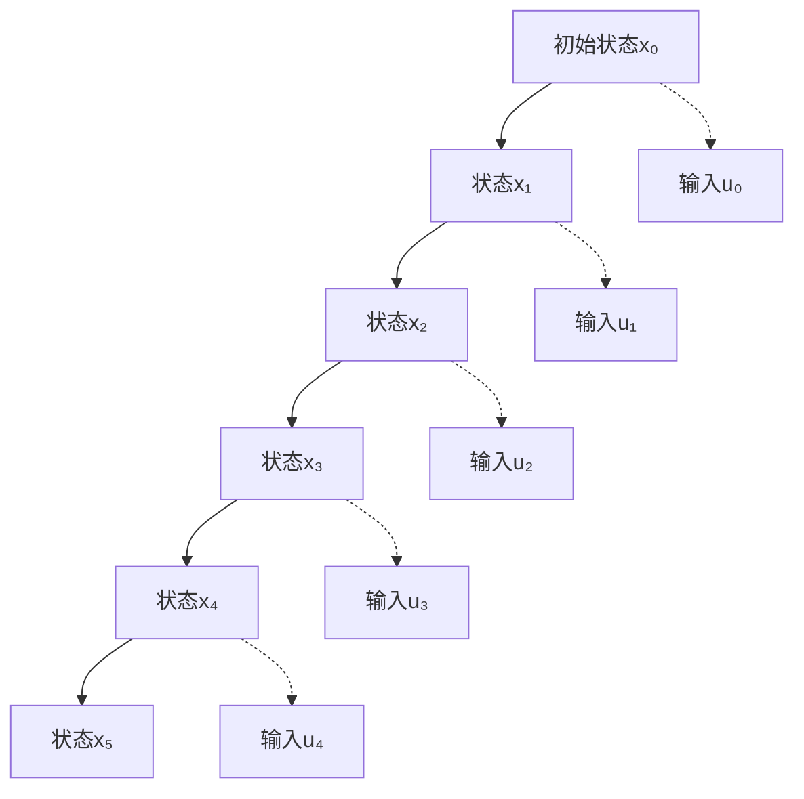

## 5. 关联矩阵与表格

### 5.1 要素关联矩阵

系统要素间的关联关系矩阵：

| 要素 | E₁ | E₂ | E₃ | E₄ | E₅ |
|------|----|----|----|----|----|
| E₁   | 0  | 1  | 0  | 1  | 0  |
| E₂   | 1  | 0  | 1  | 0  | 1  |
| E₃   | 0  | 1  | 0  | 1  | 0  |
| E₄   | 1  | 0  | 1  | 0  | 1  |
| E₅   | 0  | 1  | 0  | 1  | 0  |

### 5.2 功能关联表

| 功能 | 输入要素 | 输出要素 | 处理要素 | 关联强度 |
|------|---------|---------|---------|---------|
| F₁   | I₁, I₂  | O₁      | E₁, E₂  | 0.8     |
| F₂   | I₂, I₃  | O₂      | E₂, E₃  | 0.6     |
| F₃   | I₃, I₄  | O₃      | E₃, E₄  | 0.9     |
| F₄   | I₄, I₅  | O₄      | E₄, E₅  | 0.7     |

### 5.3 层次关系表

| 层次 | 包含子系统 | 要素数量 | 功能数量 | 复杂度 |
|------|-----------|---------|---------|--------|
| L₁   | S₁₁, S₁₂, S₁₃ | 15 | 8 | 高 |
| L₂   | S₂₁, S₂₂ | 10 | 6 | 中 |
| L₃   | S₃₁ | 5 | 3 | 低 |

## 6. 结构特征表

### 6.1 网络拓扑特征

| 特征 | 符号 | 计算公式 | 典型值 |
|------|------|---------|--------|
| 平均度 | ⟨k⟩ | (1/N) × Σᵢ kᵢ | 4.5 |
| 聚类系数 | C | (3×三角形数)/(连通三元组数) | 0.3 |
| 平均路径长度 | L | (1/N²) × Σᵢⱼ dᵢⱼ | 2.8 |
| 网络直径 | D | max dᵢⱼ | 5 |
| 连通性 | κ | 最小割集大小 | 2 |

### 6.2 系统复杂度表

| 复杂度指标 | 计算公式 | 系统类型 | 典型范围 |
|-----------|---------|---------|---------|
| 结构复杂度 | Cₛ = \|E\| × \|R\| / \|V\|² | 网络系统 | 0.1-0.8 |
| 功能复杂度 | Cf = \|F\| × log₂(\|I\|+\|O\|) | 功能系统 | 10-100 |
| 层次复杂度 | Ch = Σᵢ \|Lᵢ\| × i | 层次系统 | 5-50 |
| 动态复杂度 | Cd = \|X\| × \|U\| × T | 动态系统 | 100-1000 |

## 7. 多表征

### 7.1 概念图

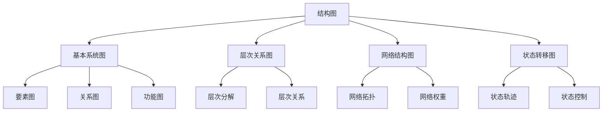

### 7.2 结构分类表

| 结构类型 | 主要特征 | 数学表示 | 应用领域 |
|---------|---------|---------|---------|
| 层次结构 | 偏序关系，递归分解 | H = (L, ≤, f) | 组织管理，软件架构 |
| 网络结构 | 图论表示，拓扑特征 | G = (V, E, W) | 社交网络，交通网络 |
| 动态结构 | 状态转移，时间演化 | DS = (X, U, f, g) | 控制系统，生态系统 |
| 耦合结构 | 子系统相互作用 | CS = (S, C, F) | 物理系统，工程系统 |
| 多层结构 | 多种关系类型 | MLN = (G, L, I) | 复杂系统，信息系统 |

### 7.3 数学符号表

| 符号 | 含义 | 定义 |
|------|------|------|
| S | 系统 | S = (E, R, B, F, I, O) |
| E | 要素集合 | E = {e₁, e₂, ..., eₙ} |
| R | 关系集合 | R ⊆ E × E |
| B | 边界函数 | B: E → {0,1} |
| F | 功能函数 | F: I → O |
| I | 输入集合 | I = {i₁, i₂, ..., iₘ} |
| O | 输出集合 | O = {o₁, o₂, ..., oₚ} |
| H | 层次结构 | H = (L, ≤, f) |
| G | 网络图 | G = (V, E, W) |
| DS | 动态系统 | DS = (X, U, f, g) |
| CS | 耦合系统 | CS = (S, C, F) |
| MLN | 多层网络 | MLN = (G, L, I) |

## 8. 结构分析定理

### 8.1 结构连通性定理

**定理1.3.3.1（结构连通性）**：对于系统S = (E, R, B, F, I, O)，如果关系集合R满足|R| ≥ |E| - 1，则系统结构是连通的。

**证明**：

1. 假设系统结构不连通，则至少有两个连通分量
2. 每个连通分量至少需要|E| - 1个关系才能连通
3. 因此总关系数至少需要2(|E| - 1) > |E| - 1
4. 与条件|R| ≥ |E| - 1矛盾
5. 因此系统结构是连通的

### 8.2 层次分解定理

**定理1.3.3.2（层次分解唯一性）**：如果系统S的层次结构H = (L, ≤, f)满足层次分解D，则对于任意两个层次l₁, l₂ ∈ L，如果l₁ ≤ l₂，则D(l₁) ⊆ D(l₂)。

**证明**：

1. 根据层次分解定义，D(l₁) ∩ D(l₂) = ∅ 当 l₁ ≠ l₂
2. 由于l₁ ≤ l₂，根据层次关系定义，D(l₁) 中的元素都属于层次l₁
3. 根据层次偏序关系，D(l₁) ⊆ D(l₂)
4. 因此，层次分解满足包含关系

## 9. 规范说明

- 内容需递归细化，支持多表征
- 保留批判性分析、图表、符号等
- 如有遗漏，后续补全并说明
- 所有图表需使用mermaid语法，支持交互式展示
- 表格需包含完整的数学符号和计算公式
- 定理证明需严格形式化

> 本文件为递归细化与内容补全示范，后续可继续分解为1.3.3.1、1.3.3.2等子主题，支持持续递归完善。

## 6. 自主体系统的结构图与表（Structural Diagrams and Tables of Autonomous Systems）

### 6.1 典型结构图

#### 6.1.1 多自主体层次结构图

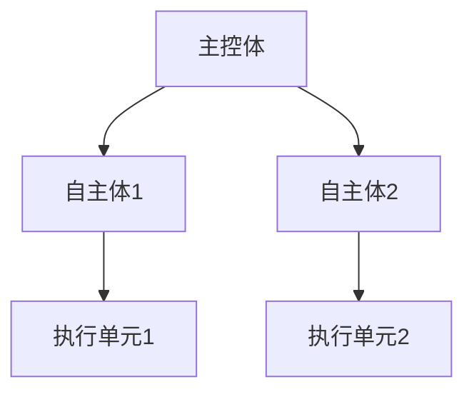

#### 6.1.2 协同关系网络图

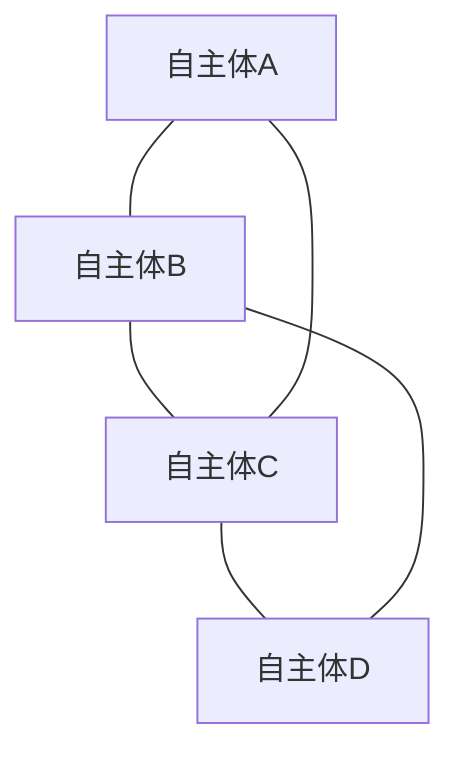

### 6.2 结构对比表

| 结构类型 | 主要特征         | 适用场景           |
|----------|------------------|--------------------|
| 层次结构 | 分层决策、分工   | 机器人、无人系统   |
| 网络结构 | 通信协作、拓扑   | 群体智能、分布式AI |
| 动态模型 | 状态演化、反馈   | 智能体行为建模     |
| 协同结构 | 多体协同、联盟   | 多机器人、智能交通 |

### 6.3 批判分析

- **优势**：结构图与表直观展现自主体系统的组织与协同关系，便于理解与优化
- **局限**：实际系统结构复杂，图表需动态更新与细化
- **未来方向**：动态图谱、跨域协同结构、结构-行为一体化建模

---
> 本节为“自主体系统的结构图与表”内容补充，涵盖典型结构图、协同关系图、结构对比表与批判分析，风格与全书一致，便于递归扩展与知识体系完善。
