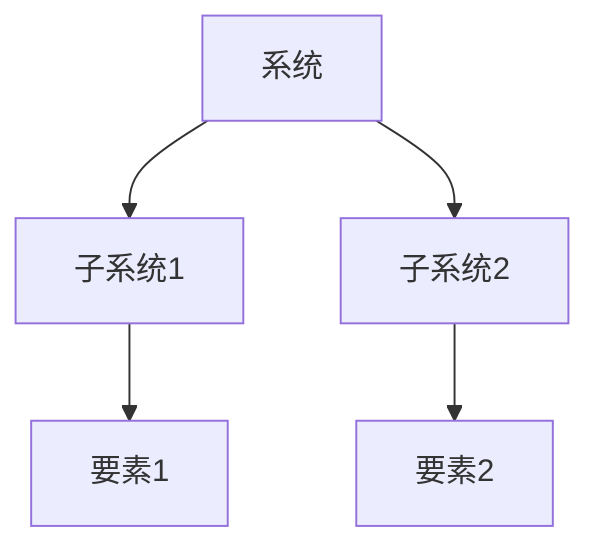
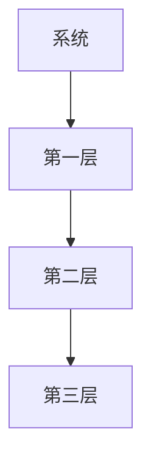

# 1.3.3 结构图与表

## 1. 系统结构图

- 展示系统各要素、子系统及其关系。
- 常用图类型：层次结构图、网络拓扑图、状态转移图。
- 示例：

## 2. 层次关系图

- 展现系统的多层级结构，反映递归分解。
- 示例：

## 3. 关联矩阵与表格

- 用矩阵或表格表达要素间的关系、属性。
- 关系矩阵示例：
|   | E1 | E2 | E3 |
|---|----|----|----|
| E1| 0  | 1  | 0  |
| E2| 1  | 0  | 1  |
| E3| 0  | 1  | 0  |

## 4. 多表征

- Mermaid/LaTeX 图、结构表、属性矩阵、符号化表达

## 5. 规范说明

- 内容需递归细化，支持多表征。
- 保留批判性分析、图表、符号等。
- 如有遗漏，后续补全并说明。

> 本文件为递归细化与内容补全示范，后续可继续分解为1.3.3.1、1.3.3.2等子主题，支持持续递归完善。
