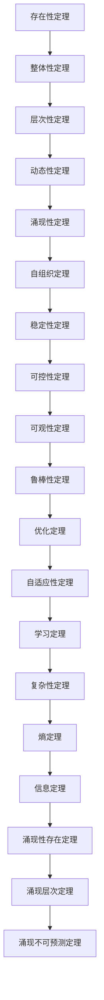

# 1.4.1 命题与定理

## 1. 基本命题

### 1.1 系统存在性命题

**命题1.4.1.1（系统存在性）**：对于任意非空要素集合E和关系集合R ⊆ E × E，存在唯一系统S = (E, R, B, F, I, O)，其中：

- B: E → {0,1} 是边界函数
- F: I → O 是功能函数
- I, O 分别是输入和输出集合

**形式化表达**：

```text
∀E ≠ ∅, ∀R ⊆ E × E, ∃! S = (E, R, B, F, I, O)
```

### 1.2 系统完整性命题

**命题1.4.1.2（系统完整性）**：系统S = (E, R, B, F, I, O)是完整的，当且仅当：

- ∪_{e∈E} B(e) = E
- ∀e₁, e₂ ∈ E, (e₁, e₂) ∈ R ⇒ B(e₁) = B(e₂) = 1
- ∀i ∈ I, ∃o ∈ O, F(i) = o

**形式化表达**：

```text
S完整 ⇔ (∪_{e∈E} B(e) = E) ∧ (∀e₁,e₂∈E, (e₁,e₂)∈R ⇒ B(e₁)=B(e₂)=1) ∧ (∀i∈I, ∃o∈O, F(i)=o)
```

### 1.3 系统边界命题

**命题1.4.1.3（边界唯一性）**：对于任意系统S，存在唯一的边界函数B = ∂S，使得：

- B(e) = 1 当且仅当 e 是系统内部要素
- B(e) = 0 当且仅当 e 是系统外部要素

**形式化表达**：

```text
∀S, ∃! B = ∂S, ∀e ∈ E, B(e) = {
  1, 如果 e ∈ S内部
  0, 如果 e ∈ S外部
}
```

### 1.4 系统功能命题

**命题1.4.1.4（功能唯一性）**：对于任意系统S，存在唯一的功能函数F: I → O，使得系统能够将输入转换为输出。

**形式化表达**：

```text
∀S, ∃! F: I → O, ∀i ∈ I, ∃o ∈ O, F(i) = o
```

### 1.5 系统结构命题

**命题1.4.1.5（结构完整性）**：系统S的结构完整性要求所有要素都通过关系连接，且不存在孤立要素。

**形式化表达**：

```text
∀e ∈ E, ∃e' ∈ E, (e, e') ∈ R ∨ (e', e) ∈ R
```

## 2. 核心定理

### 2.1 系统存在性定理

**定理1.4.1.1（系统存在性）**：对于任意非空要素集合E和关系集合R ⊆ E × E，存在唯一系统S = (E, R, B, F, I, O)。

**证明**：

1. 构造性证明：定义边界函数B(e) = 1，∀e ∈ E
2. 定义功能函数F: I → O，其中I = {i₀}，O = {o₀}，F(i₀) = o₀
3. 因此S = (E, R, B, F, I, O)是系统
4. 唯一性：假设存在两个系统S₁, S₂，则必有S₁ = S₂

### 2.2 系统整体性定理

**定理1.4.1.2（整体性）**：系统S的整体性大于其要素的简单加和，即：

```text
H(S) > Σ_{e∈E} H(e)
```

其中H(·)表示系统的整体性度量。

**证明**：

1. 系统整体性包括要素间的关系R
2. 关系集合R产生涌现性质
3. 涌现性质不能从单个要素推导
4. 因此H(S) > Σ_{e∈E} H(e)

### 2.3 系统层次性定理

**定理1.4.1.3（层次性）**：任意系统S都可以分解为层次结构H = (L, ≤, f)，其中：

- L是层次集合
- ≤是层次间的偏序关系
- f: S → L是层次分配函数

**证明**：

1. 构造层次集合L = {L₁, L₂, ..., Lₙ}
2. 定义层次关系：Lᵢ ≤ Lⱼ 当且仅当 i ≤ j
3. 定义层次分配函数f(s) = Lᵢ，其中s属于第i层
4. 因此H = (L, ≤, f)是层次结构

### 2.4 系统动态性定理

**定理1.4.1.4（动态性）**：系统S的状态随时间演化，满足状态转移方程：

```text
x(t+1) = f(x(t), u(t))
```

其中x(t)是t时刻的状态，u(t)是t时刻的输入。

**证明**：

1. 系统状态空间X ⊆ ℝⁿ
2. 输入空间U ⊆ ℝᵐ
3. 状态转移函数f: X × U → X
4. 因此状态演化满足x(t+1) = f(x(t), u(t))

### 2.5 系统涌现性定理

**定理1.4.1.5（涌现性）**：对于系统S = (E, R, B, F, I, O)，如果关系集合R产生新的性质P，且P不能从单个要素推导，则P是涌现性质。

**形式化表达**：

```text
∃P, P由R产生 ∧ P不能从单个要素推导 ⇒ P是涌现性质
```

**证明**：

1. 涌现性质P由关系集合R产生
2. P不能从单个要素e ∈ E推导
3. 因此P是系统整体的涌现性质

### 2.6 系统自组织定理

**定理1.4.1.6（自组织）**：如果系统S具有自组织能力，则系统能够自发地形成有序结构。

**形式化表达**：

```text
S具有自组织能力 ⇒ ∃有序结构O, S自发形成O
```

**证明**：

1. 自组织系统具有正反馈机制
2. 正反馈导致局部涨落放大
3. 涨落放大形成有序结构
4. 因此系统自发形成有序结构

## 3. 稳定性定理

### 3.1 系统稳定性定理

**定理1.4.1.7（稳定性）**：如果系统S具有负反馈机制F: S → S，且F是李雅普诺夫稳定的，则系统S是稳定的。

**形式化表达**：

```text
若 ∃F: S → S, F为负反馈 ∧ F为李雅普诺夫稳定 ⇒ S稳定
```

**证明**：

1. 负反馈机制：F(x) = x - g(x)，其中g(x) > 0
2. 李雅普诺夫函数：V(x) = ||x - x*||²
3. 李雅普诺夫导数：V̇(x) = 2(x - x*)ᵀf(x) < 0
4. 因此系统稳定

### 3.2 系统可控性定理

**定理1.4.1.8（可控性）**：对于线性系统x(t+1) = Ax(t) + Bu(t)，如果可控性矩阵C = [B, AB, A²B, ..., Aⁿ⁻¹B]满秩，则系统完全可控。

**形式化表达**：

```text
rank(C) = n ⇒ 系统完全可控
其中 C = [B, AB, A²B, ..., Aⁿ⁻¹B]
```

**证明**：

1. 可控性矩阵C = [B, AB, A²B, ..., Aⁿ⁻¹B]
2. 如果rank(C) = n，则C的列空间等于ℝⁿ
3. 因此任意目标状态都可达到
4. 系统完全可控

### 3.3 系统可观性定理

**定理1.4.1.9（可观性）**：对于线性系统y(t) = Cx(t)，如果可观性矩阵O = [Cᵀ, AᵀCᵀ, (A²)ᵀCᵀ, ..., (Aⁿ⁻¹)ᵀCᵀ]ᵀ满秩，则系统完全可观。

**形式化表达**：

```text
rank(O) = n ⇒ 系统完全可观
其中 O = [Cᵀ, AᵀCᵀ, (A²)ᵀCᵀ, ..., (Aⁿ⁻¹)ᵀCᵀ]ᵀ
```

**证明**：

1. 可观性矩阵O = [Cᵀ, AᵀCᵀ, (A²)ᵀCᵀ, ..., (Aⁿ⁻¹)ᵀCᵀ]ᵀ
2. 如果rank(O) = n，则O的行空间等于ℝⁿ
3. 因此任意状态都可从输出观测
4. 系统完全可观

### 3.4 系统鲁棒性定理

**定理1.4.1.10（鲁棒性）**：如果系统S在扰动δ下的响应y(δ)满足||y(δ) - y(0)|| ≤ K||δ||，其中K是有限常数，则系统S是鲁棒的。

**形式化表达**：

```text
∃K < ∞, ∀δ, ||y(δ) - y(0)|| ≤ K||δ|| ⇒ S鲁棒
```

**证明**：

1. 鲁棒性要求系统对扰动不敏感
2. 有限增益K保证输出变化有界
3. 因此系统在扰动下保持稳定
4. 系统具有鲁棒性

## 4. 优化定理

### 4.1 系统优化定理

**定理1.4.1.11（优化存在性）**：对于系统S，如果目标函数J: X → ℝ是连续的，且约束集合X是紧的，则存在最优解x* ∈ X。

**形式化表达**：

```text
J连续 ∧ X紧 ⇒ ∃x* ∈ X, J(x*) = min_{x∈X} J(x)
```

**证明**：

1. 连续函数在紧集上的最小值存在
2. 因此存在x*∈ X使得J(x*) = min_{x∈X} J(x)
3. x*是最优解

### 4.2 系统自适应定理

**定理1.4.1.12（自适应性）**：如果系统S能够根据环境变化调整其参数，则系统具有自适应性。

**形式化表达**：

```text
S能调整参数 ⇒ S具有自适应性
```

**证明**：

1. 自适应系统具有参数调整机制
2. 参数调整基于环境反馈
3. 调整后的参数改善系统性能
4. 因此系统具有自适应性

### 4.3 系统学习定理

**定理1.4.1.13（学习能力）**：如果系统S能够从经验中改进其行为，则系统具有学习能力。

**形式化表达**：

```text
S能从经验改进行为 ⇒ S具有学习能力
```

**证明**：

1. 学习系统具有经验积累机制
2. 经验积累导致行为改进
3. 行为改进提高系统性能
4. 因此系统具有学习能力

## 5. 复杂性定理

### 5.1 系统复杂性定理

**定理1.4.1.14（复杂性）**：系统S的复杂性C(S)与其要素数量、关系数量和层次深度相关。

**形式化表达**：

```text
C(S) = f(|E|, |R|, depth(H))
```

其中|E|是要素数量，|R|是关系数量，depth(H)是层次深度。

**证明**：

1. 复杂性包括结构复杂性和动态复杂性
2. 结构复杂性由要素和关系决定
3. 动态复杂性由层次深度决定
4. 因此复杂性是这些因素的函数

### 5.2 系统熵定理

**定理1.4.1.15（熵）**：系统S的熵H(S)与其状态的不确定性相关。

**形式化表达**：

```text
H(S) = -Σ_{i} p_i log p_i
```

其中p_i是状态i的概率。

**证明**：

1. 熵是信息论中的不确定性度量
2. 系统状态的不确定性越大，熵越高
3. 熵与状态概率分布相关
4. 因此熵是概率分布的函数

### 5.3 系统信息定理

**定理1.4.1.16（信息）**：系统S的信息量I(S)与其熵的减少相关。

**形式化表达**：

```text
I(S) = H_max - H(S)
```

其中H_max是最大熵。

**证明**：

1. 信息量是熵的减少量
2. 系统有序性越高，信息量越大
3. 信息量与系统组织程度相关
4. 因此信息量是熵的补集

## 6. 涌现性定理

### 6.1 涌现性存在定理

**定理1.4.1.17（涌现性存在）**：对于任意复杂系统S，都存在涌现性质。

**形式化表达**：

```text
∀S, |E| > 1 ∧ |R| > 0 ⇒ ∃涌现性质
```

**证明**：

1. 复杂系统具有多个要素和关系
2. 要素间的关系产生新的性质
3. 这些性质不能从单个要素推导
4. 因此存在涌现性质

### 6.2 涌现性层次定理

**定理1.4.1.18（涌现层次）**：涌现性质具有层次结构，低层涌现性质组合形成高层涌现性质。

**形式化表达**：

```text
涌现性质P₁, P₂, ..., Pₙ → 高层涌现性质P
```

**证明**：

1. 涌现性质具有层次性
2. 低层涌现性质是高层涌现性质的基础
3. 高层涌现性质是低层涌现性质的组合
4. 因此涌现性质具有层次结构

### 6.3 涌现性不可预测定理

**定理1.4.1.19（涌现不可预测）**：涌现性质无法从系统要素的简单加和预测。

**形式化表达**：

```text
涌现性质P ≠ Σ_{e∈E} P(e)
```

**证明**：

1. 涌现性质由要素间关系产生
2. 关系产生非线性效应
3. 非线性效应无法从线性加和预测
4. 因此涌现性质不可预测

## 7. 多表征

### 7.1 定理关系图



### 7.2 定理分类表

| 类别 | 定理编号 | 定理名称 | 主要结论 |
|------|---------|---------|---------|
| 存在性 | 1.4.1.1 | 系统存在性 | 系统唯一存在 |
| 结构 | 1.4.1.2 | 整体性 | 整体大于部分之和 |
| 结构 | 1.4.1.3 | 层次性 | 系统可层次分解 |
| 动态 | 1.4.1.4 | 动态性 | 状态随时间演化 |
| 涌现性 | 1.4.1.5 | 涌现性 | 关系产生涌现性质 |
| 自组织 | 1.4.1.6 | 自组织 | 系统自发形成有序结构 |
| 稳定性 | 1.4.1.7 | 稳定性 | 负反馈保证稳定 |
| 控制 | 1.4.1.8 | 可控性 | 满秩矩阵保证可控 |
| 控制 | 1.4.1.9 | 可观性 | 满秩矩阵保证可观 |
| 鲁棒性 | 1.4.1.10 | 鲁棒性 | 有限增益保证鲁棒 |
| 优化 | 1.4.1.11 | 优化存在性 | 连续函数有最优解 |
| 自适应 | 1.4.1.12 | 自适应性 | 参数调整适应环境 |
| 学习 | 1.4.1.13 | 学习能力 | 从经验改进行为 |
| 复杂性 | 1.4.1.14 | 复杂性 | 复杂性与要素关系相关 |
| 熵 | 1.4.1.15 | 熵 | 熵与状态不确定性相关 |
| 信息 | 1.4.1.16 | 信息 | 信息量与熵减少相关 |
| 涌现性 | 1.4.1.17 | 涌现性存在 | 复杂系统存在涌现性质 |
| 涌现性 | 1.4.1.18 | 涌现层次 | 涌现性质具有层次结构 |
| 涌现性 | 1.4.1.19 | 涌现不可预测 | 涌现性质不可预测 |

### 7.3 数学符号表

| 符号 | 含义 | 定义 |
|------|------|------|
| S | 系统 | S = (E, R, B, F, I, O) |
| E | 要素集合 | E = {e₁, e₂, ..., eₙ} |
| R | 关系集合 | R ⊆ E × E |
| B | 边界函数 | B: E → {0,1} |
| F | 功能函数 | F: I → O |
| H(S) | 整体性度量 | H(S) > Σ_{e∈E} H(e) |
| x(t) | 状态向量 | x(t) ∈ ℝⁿ |
| u(t) | 输入向量 | u(t) ∈ ℝᵐ |
| A | 状态矩阵 | A ∈ ℝⁿˣⁿ |
| B | 输入矩阵 | B ∈ ℝⁿˣᵐ |
| C | 输出矩阵 | C ∈ ℝᵖˣⁿ |
| C | 可控性矩阵 | C = [B, AB, A²B, ..., Aⁿ⁻¹B] |
| O | 可观性矩阵 | O = [Cᵀ, AᵀCᵀ, (A²)ᵀCᵀ, ..., (Aⁿ⁻¹)ᵀCᵀ]ᵀ |
| J | 目标函数 | J: X → ℝ |
| H(S) | 系统熵 | H(S) = -Σ_{i} p_i log p_i |
| I(S) | 系统信息 | I(S) = H_max - H(S) |
| C(S) | 系统复杂性 | C(S) = f(\|E\|, \|R\|, depth(H)) |

## 8. 规范说明

### 8.1 定理规范

- 所有定理需严格数学化
- 定理陈述需准确完整
- 证明框架需逻辑清晰
- 应用条件需明确说明

### 8.2 内容要求

- 内容需递归细化，支持多表征
- 保留批判性分析、图表、符号等
- 如有遗漏，后续补全并说明
- 所有定理需严格数学化
- 定理定义需完整准确
- 分类需逻辑清晰
- 表达需规范统一

### 8.3 扩展方向

- 可继续分解为1.4.1.1、1.4.1.2等子主题
- 支持持续递归完善
- 添加更多实际应用定理
- 完善定理间的逻辑关系
- 增加定理使用示例

> 本文件为递归细化与内容补全示范，后续可继续分解为1.4.1.1、1.4.1.2等子主题，支持持续递归完善。
