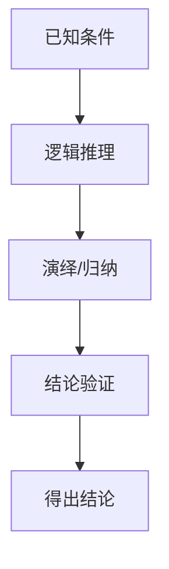

# 1.4.2 证明过程

## 1. 证明结构与步骤

- **命题与定理的证明步骤**：
  1. 明确命题/定理的前提与结论。
  2. 列出已知条件、定义、符号。
  3. 逻辑推理、演绎、归纳、反证等方法展开证明。
  4. 得出结论，验证一致性。
- **常用证明方法**：
  - 直接证明、反证法、归纳法、构造法、反例法。

## 2. 逻辑推理与演绎过程

- **推理链**：
  - P1: S = (E, R, ...)
  - P2: 若F为负反馈，则S稳定
  - C: S具备F ⇒ S稳定
- **归纳证明示例**：
  - 对系统层次结构的递归性质进行归纳证明。

## 3. 反例与归纳证明

- **反例**：
  - 若系统无反馈机制，则可能不稳定（举例说明）。
- **归纳证明**：
  - 对n层系统，假设n-1层成立，证明n层也成立。

## 4. 结构化表达

- **证明流程图**：

- **推理链表**：
| 步骤 | 内容 |
|------|------|
| 1.4.2.1 | 明确命题与前提 |
| 1.4.2.2 | 列出定义与条件 |
| 1.4.2.3 | 推理与演绎 |
| 1.4.2.4 | 结论与验证 |

## 5. 多表征

- 流程图、推理链、归纳/反例表、符号化推导

## 6. 规范说明

- 内容需递归细化，支持多表征。
- 保留证明过程、符号、图表等。
- 如有遗漏，后续补全并说明。

> 本文件为递归细化与内容补全示范，后续可继续分解为1.4.2.1、1.4.2.2等子主题，支持持续递归完善。
