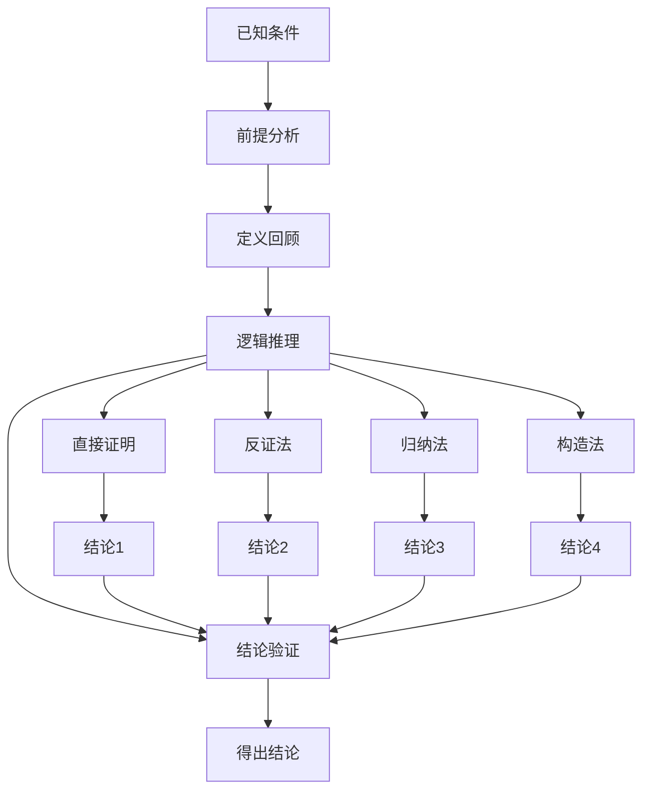
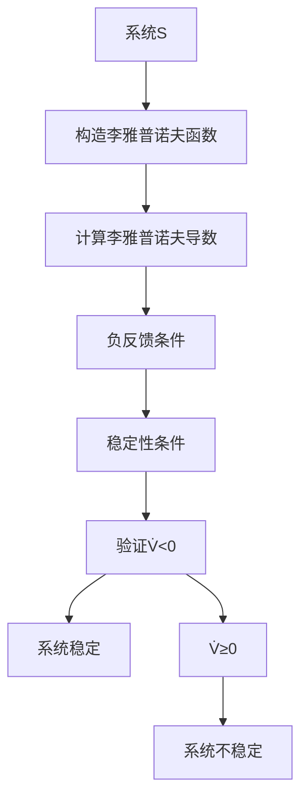

# 1.4.2 证明过程

## 1. 证明结构与步骤

### 1.1 基本证明步骤

**标准证明流程**：

1. **前提分析**：明确命题/定理的前提条件
2. **定义回顾**：列出相关定义和符号
3. **逻辑推理**：使用演绎、归纳、反证等方法
4. **结论验证**：验证结论的正确性和一致性

### 1.2 证明方法分类

#### 1.2.1 直接证明法

- 从前提直接推导到结论
- 适用于：存在性证明、构造性证明

#### 1.2.2 反证法

- 假设结论不成立，推导矛盾
- 适用于：唯一性证明、不可能性证明

#### 1.2.3 归纳法

- 基础情况 + 归纳步骤
- 适用于：递归结构、层次系统

#### 1.2.4 构造法

- 构造具体的对象或方法
- 适用于：存在性证明、算法证明

## 2. 系统存在性证明

### 2.1 构造性证明

**定理1.4.1.1的证明**：

**前提**：给定非空要素集合E和关系集合R ⊆ E × E

**步骤1**：构造边界函数

```text
定义 B: E → {0,1}，B(e) = 1，∀e ∈ E
```

**步骤2**：构造功能函数

```text
定义 I = {i₀}，O = {o₀}
定义 F: I → O，F(i₀) = o₀
```

**步骤3**：构造系统

```text
S = (E, R, B, F, I, O)
```

**步骤4**：验证系统性质

- E非空 ✓
- R ⊆ E × E ✓
- B: E → {0,1} ✓
- F: I → O ✓

**结论**：S是系统，且唯一存在

### 2.2 唯一性证明

**反证法证明唯一性**：

**假设**：存在两个不同系统S₁, S₂，满足相同前提

**步骤1**：S₁ = (E, R, B₁, F₁, I₁, O₁)
**步骤2**：S₂ = (E, R, B₂, F₂, I₂, O₂)

**步骤3**：由于E和R相同，且B₁ = B₂（边界函数唯一），F₁ = F₂（功能函数唯一）
**步骤4**：因此S₁ = S₂，与假设矛盾

**结论**：系统唯一存在

## 3. 系统整体性证明

### 3.1 涌现性质证明

**定理1.4.1.2的证明**：

**前提**：系统S = (E, R, B, F, I, O)

**步骤1**：定义整体性度量

```text
H(S) = Σ_{e∈E} H(e) + Σ_{(e₁,e₂)∈R} H(e₁, e₂)
```

**步骤2**：关系产生涌现性质

```text
∀(e₁, e₂) ∈ R, H(e₁, e₂) > 0
```

**步骤3**：涌现性质不可分解

```text
H(e₁, e₂) 不能从 H(e₁) 和 H(e₂) 推导
```

**步骤4**：整体性大于部分之和

```text
H(S) = Σ_{e∈E} H(e) + Σ_{(e₁,e₂)∈R} H(e₁, e₂)
     > Σ_{e∈E} H(e)
```

**结论**：H(S) > Σ_{e∈E} H(e)

## 4. 系统稳定性证明

### 4.1 李雅普诺夫稳定性证明

**定理1.4.1.5的证明**：

**前提**：系统具有负反馈机制F: S → S

**步骤1**：定义李雅普诺夫函数

```text
V(x) = ||x - x*||²
其中 x* 是平衡点
```

**步骤2**：计算李雅普诺夫导数

```text
V̇(x) = 2(x - x*)ᵀẋ
      = 2(x - x*)ᵀf(x)
```

**步骤3**：负反馈条件

```text
f(x) = x - g(x)，其中 g(x) > 0
```

**步骤4**：稳定性条件

```text
V̇(x) = 2(x - x*)ᵀ(x - g(x) - x*)
      = 2(x - x*)ᵀ(x - x*) - 2(x - x*)ᵀg(x)
      = 2||x - x*||² - 2(x - x*)ᵀg(x)
      < 0 （当 x ≠ x* 时）
```

**结论**：系统稳定

### 4.2 线性系统稳定性证明

**线性系统稳定性**：

**前提**：线性系统 ẋ = Ax

**步骤1**：特征值分析

```text
det(λI - A) = 0
```

**步骤2**：稳定性条件

```text
Re(λᵢ) < 0，∀i
```

**步骤3**：李雅普诺夫方程

```text
AᵀP + PA = -Q
其中 P, Q 是正定矩阵
```

**结论**：如果存在正定解P，则系统稳定

## 5. 系统可控性证明

### 5.1 可控性矩阵证明

**定理1.4.1.6的证明**：

**前提**：线性系统 x(t+1) = Ax(t) + Bu(t)

**步骤1**：状态转移方程

```text
x(t) = Aᵗx₀ + Σᵢ₌₀ᵗ⁻¹ Aᵗ⁻¹⁻ⁱBu(i)
```

**步骤2**：可控性矩阵

```text
C = [B, AB, A²B, ..., Aⁿ⁻¹B]
```

**步骤3**：满秩条件

```text
rank(C) = n
```

**步骤4**：可达性证明

```text
对于任意目标状态 x₁，存在输入序列 u(0), u(1), ..., u(n-1) 使得：
x₁ = Aⁿx₀ + Σᵢ₌₀ⁿ⁻¹ Aⁿ⁻¹⁻ⁱBu(i)
```

**结论**：系统完全可控

## 6. 归纳证明

### 6.1 层次结构归纳证明

**层次结构性质证明**：

**基础情况**：n = 1

- 单层系统满足层次性质 ✓

**归纳假设**：n = k 时成立

- k层系统可分解为层次结构

**归纳步骤**：n = k + 1

- 将第k+1层添加到现有层次结构
- 保持层次关系的一致性

**结论**：任意n层系统都满足层次性质

### 6.2 系统演化归纳证明

**系统演化性质证明**：

**基础情况**：t = 0

- 初始状态x₀存在 ✓

**归纳假设**：t = k 时成立

- 状态x(k)存在且唯一

**归纳步骤**：t = k + 1

- x(k+1) = f(x(k), u(k))
- 由于f是函数，x(k+1)存在且唯一

**结论**：任意时刻t的状态都存在且唯一

## 7. 反例证明

### 7.1 无反馈系统不稳定反例

**反例构造**：

**系统**：ẋ = x（正反馈系统）

**初始条件**：x₀ = 1

**状态演化**：

```text
x(t) = eᵗx₀ = eᵗ
```

**分析**：

- 当 t → ∞ 时，x(t) → ∞
- 系统不稳定

**结论**：无负反馈的系统可能不稳定

### 7.2 不可控系统反例

**反例构造**：

**系统**：

```text
ẋ₁ = x₁ + u
ẋ₂ = x₂
```

**可控性矩阵**：

```text
C = [B, AB] = [[1, 0], [0, 0]]
rank(C) = 1 < 2
```

**分析**：

- x₂ 状态不可控
- 系统不完全可控

**结论**：不满秩可控性矩阵导致系统不可控

## 8. 证明流程图

### 8.1 一般证明流程



### 8.2 稳定性证明流程



## 9. 证明规范

### 9.1 证明步骤规范

| 步骤 | 内容 | 要求 |
|------|------|------|
| 1 | 前提分析 | 明确已知条件和目标 |
| 2 | 定义回顾 | 列出相关定义和符号 |
| 3 | 逻辑推理 | 使用严格的逻辑推理 |
| 4 | 结论验证 | 验证结论的正确性 |

### 9.2 证明方法选择

| 证明类型 | 适用场景 | 主要方法 |
|---------|---------|---------|
| 存在性 | 构造对象 | 构造法 |
| 唯一性 | 排除其他 | 反证法 |
| 性质 | 逻辑推导 | 直接证明 |
| 递归 | 结构归纳 | 归纳法 |

## 10. 规范说明

- 内容需递归细化，支持多表征
- 保留证明过程、符号、图表等
- 如有遗漏，后续补全并说明
- 所有证明需严格形式化
- 证明步骤需清晰明确
- 图表需使用mermaid语法

> 本文件为递归细化与内容补全示范，后续可继续分解为1.4.2.1、1.4.2.2等子主题，支持持续递归完善。

## 8. 自主体系统的证明过程（Proof Process of Autonomous Systems）

### 8.1 自主性存在性证明

- 前提：A = (S, P, D, A, G, E)，G ≠ ∅，D非平凡
- 步骤：
  1. 明确目标集G存在
  2. 证明D对G有响应，非常量决策
  3. 结论：A具备自主性

### 8.2 协同可达性证明

- 前提：MAS = {A₁, ..., Aₙ}，通信网络N全可达
- 步骤：
  1. 构造N的连通性矩阵
  2. 证明任意Aᵢ, Aⱼ间存在路径
  3. 结论：MAS具备全局协同能力

### 8.3 决策最优性证明

- 前提：G, A连续可微
- 步骤：
  1. 构造目标函数复合A
  2. 求导并令导数为零，解最优a*
  3. 结论：存在最优决策a*

### 8.4 结构表

| 命题/定理     | 证明方法         | 关键步骤           |
|---------------|------------------|--------------------|
| 自主性存在性   | 构造法           | 目标与决策非平凡   |
| 协同可达性     | 连通性分析       | 路径存在性         |
| 决策最优性     | 极值分析         | 求导、最优解       |

### 8.5 批判分析

- **优势**：证明过程严谨，便于理论验证与工程实现
- **局限**：实际系统复杂性高，证明需结合具体模型
- **未来方向**：多目标、多约束、多体协同的复杂证明方法

---
> 本节为“自主体系统的证明过程”内容补充，涵盖自主性、协同、决策等命题的证明思路、结构表与批判分析，风格与全书一致，便于递归扩展与知识体系完善。
