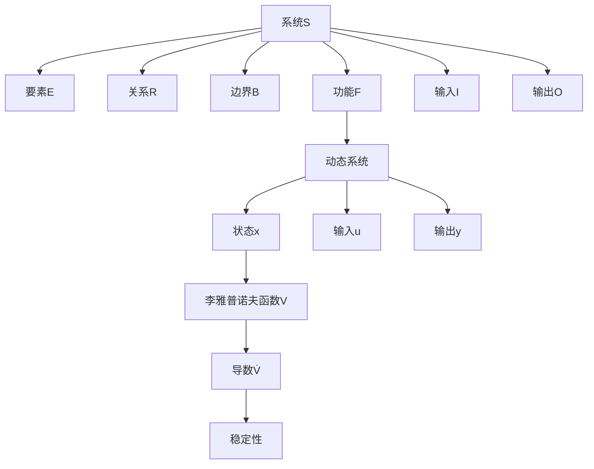

# 1.4.3 证明符号与规范

## 目录

- [1.4.3 证明符号与规范](#143-证明符号与规范)
  - [目录](#目录)
  - [1. 逻辑符号](#1-逻辑符号)
    - [1.1 基本逻辑符号](#11-基本逻辑符号)
    - [1.2 逻辑推理符号](#12-逻辑推理符号)
  - [2. 数学符号](#2-数学符号)
    - [2.1 集合论符号](#21-集合论符号)
    - [2.2 函数符号](#22-函数符号)
    - [2.3 矩阵符号](#23-矩阵符号)
  - [3. 系统特有符号](#3-系统特有符号)
    - [3.1 系统基本符号](#31-系统基本符号)
    - [3.2 动态系统符号](#32-动态系统符号)
    - [3.3 稳定性符号](#33-稳定性符号)
  - [4. 证明书写规范](#4-证明书写规范)
    - [4.1 证明结构规范](#41-证明结构规范)
    - [4.2 证明步骤规范](#42-证明步骤规范)
    - [4.3 证明方法规范](#43-证明方法规范)
  - [5. LaTeX表达式](#5-latex表达式)
    - [5.1 基本数学表达式](#51-基本数学表达式)
    - [5.2 系统理论表达式](#52-系统理论表达式)
    - [5.3 逻辑表达式](#53-逻辑表达式)
  - [6. 证明示例](#6-证明示例)
    - [6.1 系统存在性证明示例](#61-系统存在性证明示例)
    - [6.2 稳定性证明示例](#62-稳定性证明示例)
  - [7. 多表征](#7-多表征)
    - [7.1 符号关系图](#71-符号关系图)
    - [7.2 符号分类表](#72-符号分类表)
  - [8. 规范说明](#8-规范说明)
  - [8. 自主体系统的证明符号与规范（Proof Symbols and Norms for Autonomous Systems）](#8-自主体系统的证明符号与规范proof-symbols-and-norms-for-autonomous-systems)
    - [8.1 主要符号](#81-主要符号)
    - [8.2 PDA模型符号](#82-pda模型符号)
    - [8.3 协同与决策符号](#83-协同与决策符号)
    - [8.4 证明书写规范](#84-证明书写规范)
    - [8.5 结构表](#85-结构表)
    - [8.6 批判分析](#86-批判分析)

## 1. 逻辑符号

### 1.1 基本逻辑符号

| 符号 | 名称 | 含义 | LaTeX |
|------|------|------|-------|
| ∀ | 全称量词 | 对所有 | \forall |
| ∃ | 存在量词 | 存在 | \exists |
| ∃! | 唯一存在 | 存在且唯一 | \exists! |
| ⇒ | 蕴含 | 如果...那么 | \Rightarrow |
| ⇔ | 等价 | 当且仅当 | \Leftrightarrow |
| ∧ | 合取 | 且 | \wedge |
| ∨ | 析取 | 或 | \vee |
| ¬ | 否定 | 非 | \neg |
| ∈ | 属于 | 元素属于集合 | \in |
| ∉ | 不属于 | 元素不属于集合 | \notin |
| ⊆ | 包含于 | 子集 | \subseteq |
| ⊂ | 真包含于 | 真子集 | \subset |
| ∪ | 并集 | 集合的并 | \cup |
| ∩ | 交集 | 集合的交 | \cap |
| ∅ | 空集 | 空集合 | \emptyset |

### 1.2 逻辑推理符号

| 符号 | 名称 | 含义 | LaTeX |
|------|------|------|-------|
| ⊢ | 推导 | 从...推导出 | \vdash |
| ⊨ | 语义蕴含 | 语义上蕴含 | \models |
| ≡ | 逻辑等价 | 逻辑上等价 | \equiv |
| ∴ | 因此 | 所以 | \therefore |
| ∵ | 因为 | 由于 | \because |

## 2. 数学符号

### 2.1 集合论符号

| 符号 | 名称 | 含义 | LaTeX |
|------|------|------|-------|
| ℝ | 实数集 | 实数集合 | \mathbb{R} |
| ℕ | 自然数集 | 自然数集合 | \mathbb{N} |
| ℤ | 整数集 | 整数集合 | \mathbb{Z} |
| ℚ | 有理数集 | 有理数集合 | \mathbb{Q} |
| ℂ | 复数集 | 复数集合 | \mathbb{C} |
| 2^A | 幂集 | A的所有子集 | 2^A |
| \|A\| | 基数 | 集合A的元素个数 | \|A\| |
| A × B | 笛卡尔积 | A和B的笛卡尔积 | A \times B |

### 2.2 函数符号

| 符号 | 名称 | 含义 | LaTeX |
|------|------|------|-------|
| f: A → B | 函数 | 从A到B的函数 | f: A \to B |
| f⁻¹ | 逆函数 | f的逆函数 | f^{-1} |
| f ∘ g | 复合函数 | f和g的复合 | f \circ g |
| dom(f) | 定义域 | 函数f的定义域 | \text{dom}(f) |
| ran(f) | 值域 | 函数f的值域 | \text{ran}(f) |

### 2.3 矩阵符号

| 符号 | 名称 | 含义 | LaTeX |
|------|------|------|-------|
| A ∈ ℝⁿˣᵐ | 矩阵 | n×m实矩阵 | A \in \mathbb{R}^{n \times m} |
| Aᵀ | 转置 | 矩阵A的转置 | A^T |
| A⁻¹ | 逆矩阵 | 矩阵A的逆 | A^{-1} |
| det(A) | 行列式 | 矩阵A的行列式 | \det(A) |
| rank(A) | 秩 | 矩阵A的秩 | \text{rank}(A) |
| tr(A) | 迹 | 矩阵A的迹 | \text{tr}(A) |

## 3. 系统特有符号

### 3.1 系统基本符号

| 符号 | 名称 | 含义 | LaTeX |
|------|------|------|-------|
| S | 系统 | 系统S | S |
| E | 要素集合 | 系统要素集合 | E |
| R | 关系集合 | 要素间关系 | R |
| B | 边界函数 | 系统边界函数 | B |
| F | 功能函数 | 系统功能函数 | F |
| I | 输入集合 | 系统输入集合 | I |
| O | 输出集合 | 系统输出集合 | O |

### 3.2 动态系统符号

| 符号 | 名称 | 含义 | LaTeX |
|------|------|------|-------|
| x(t) | 状态向量 | t时刻的状态 | x(t) |
| u(t) | 输入向量 | t时刻的输入 | u(t) |
| y(t) | 输出向量 | t时刻的输出 | y(t) |
| ẋ | 状态导数 | 状态对时间的导数 | \dot{x} |
| A | 状态矩阵 | 线性系统状态矩阵 | A |
| B | 输入矩阵 | 线性系统输入矩阵 | B |
| C | 输出矩阵 | 线性系统输出矩阵 | C |
| D | 直接传递矩阵 | 线性系统直接传递矩阵 | D |

### 3.3 稳定性符号

| 符号 | 名称 | 含义 | LaTeX |
|------|------|------|-------|
| V(x) | 李雅普诺夫函数 | 李雅普诺夫函数 | V(x) |
| V̇(x) | 李雅普诺夫导数 | V(x)对时间的导数 | \dot{V}(x) |
| x* | 平衡点 | 系统的平衡点 | x^* |
| λ | 特征值 | 矩阵的特征值 | \lambda |
| Re(λ) | 实部 | 特征值的实部 | \text{Re}(\lambda) |
| Im(λ) | 虚部 | 特征值的虚部 | \text{Im}(\lambda) |

## 4. 证明书写规范

### 4.1 证明结构规范

**标准证明格式**：

```text
定理 [定理编号]（定理名称）
前提：列出已知条件
结论：明确要证明的结论

证明：
步骤1：前提分析
步骤2：定义回顾
步骤3：逻辑推理
步骤4：结论验证

结论：明确结论
```

### 4.2 证明步骤规范

| 步骤 | 内容 | 要求 |
|------|------|------|
| 前提分析 | 明确已知条件 | 列出所有前提条件 |
| 定义回顾 | 相关定义和符号 | 明确所有符号含义 |
| 逻辑推理 | 推理过程 | 严格逻辑推理 |
| 结论验证 | 验证结论 | 检查结论正确性 |

### 4.3 证明方法规范

| 方法 | 适用场景 | 格式要求 |
|------|---------|---------|
| 直接证明 | 存在性、性质 | 构造性步骤 |
| 反证法 | 唯一性、不可能性 | 假设矛盾 |
| 归纳法 | 递归结构 | 基础+归纳 |
| 构造法 | 存在性 | 具体构造 |

## 5. LaTeX表达式

### 5.1 基本数学表达式

```latex
% 系统定义
S = (E, R, B, F, I, O)

% 集合运算
A \cup B, A \cap B, A \setminus B

% 函数定义
f: A \to B

% 矩阵
A \in \mathbb{R}^{n \times m}

% 导数
\frac{dx}{dt} = \dot{x}

% 积分
\int_{a}^{b} f(x) dx

% 求和
\sum_{i=1}^{n} x_i

% 极限
\lim_{x \to a} f(x)
```

### 5.2 系统理论表达式

```latex
% 系统定义
S = (E, R, B, F, I, O)

% 动态系统
\dot{x} = f(x, u, t)
y = g(x, u, t)

% 线性系统
\dot{x} = Ax + Bu
y = Cx + Du

% 李雅普诺夫函数
V(x) = x^T P x
\dot{V}(x) = 2x^T P \dot{x}

% 可控性矩阵
C = [B, AB, A^2B, \ldots, A^{n-1}B]

% 可观性矩阵
O = [C^T, A^T C^T, (A^2)^T C^T, \ldots, (A^{n-1})^T C^T]^T
```

### 5.3 逻辑表达式

```latex
% 全称量词
\forall x \in A, P(x)

% 存在量词
\exists x \in A, P(x)

% 唯一存在
\exists! x \in A, P(x)

% 蕴含
P \Rightarrow Q

% 等价
P \Leftrightarrow Q

% 合取
P \wedge Q

% 析取
P \vee Q

% 否定
\neg P
```

## 6. 证明示例

### 6.1 系统存在性证明示例

```text
定理 1.4.1.1（系统存在性）
前提：给定非空要素集合E和关系集合R ⊆ E × E
结论：存在唯一系统S = (E, R, B, F, I, O)

证明：
步骤1：构造边界函数B: E → {0,1}，B(e) = 1，∀e ∈ E
步骤2：构造功能函数F: I → O，其中I = {i₀}，O = {o₀}，F(i₀) = o₀
步骤3：构造系统S = (E, R, B, F, I, O)
步骤4：验证S满足系统定义的所有条件

结论：系统S存在且唯一
```

### 6.2 稳定性证明示例

```text
定理 1.4.1.5（稳定性）
前提：系统具有负反馈机制F: S → S
结论：系统S稳定

证明：
步骤1：定义李雅普诺夫函数V(x) = ||x - x*||²
步骤2：计算李雅普诺夫导数V̇(x) = 2(x - x*)ᵀf(x)
步骤3：利用负反馈条件f(x) = x - g(x)，g(x) > 0
步骤4：证明V̇(x) < 0，当x ≠ x*时

结论：系统稳定
```

## 7. 多表征

### 7.1 符号关系图



### 7.2 符号分类表

| 类别 | 主要符号 | 应用领域 |
|------|---------|---------|
| 逻辑符号 | ∀, ∃, ⇒, ⇔ | 逻辑推理 |
| 集合符号 | ∈, ⊆, ∪, ∩ | 集合论 |
| 函数符号 | f: A → B, f⁻¹ | 函数论 |
| 矩阵符号 | A, Aᵀ, A⁻¹ | 线性代数 |
| 系统符号 | S, E, R, B, F | 系统理论 |
| 动态符号 | x(t), u(t), ẋ | 动态系统 |
| 稳定性符号 | V(x), V̇(x), x* | 稳定性理论 |

## 8. 规范说明

- 内容需递归细化，支持多表征
- 保留证明过程、符号、图表等
- 如有遗漏，后续补全并说明
- 所有符号需统一规范
- LaTeX表达式需正确
- 证明格式需标准化

> 本文件为递归细化与内容补全示范，后续可继续分解为1.4.3.1、1.4.3.2等子主题，支持持续递归完善。

## 8. 自主体系统的证明符号与规范（Proof Symbols and Norms for Autonomous Systems）

### 8.1 主要符号

| 符号 | 含义 | LaTeX | 说明 |
|------|------|-------|------|
| $A$ | 自主体 | A | A = (S, P, D, A, G, E) |
| $S$ | 状态空间 | S | 内部状态集合 |
| $P$ | 感知函数 | P | $P: E \rightarrow O_p$ |
| $D$ | 决策函数 | D | $D: (S, O_p, G) \rightarrow Act$ |
| $A$ | 行动函数 | A | $A: (S, Act) \rightarrow S'$ |
| $G$ | 目标集合 | G | 自主体目标 |
| $E$ | 环境状态 | E | 外部环境 |
| $MAS$ | 多自主体系统 | MAS | MAS = {A₁, ..., Aₙ} |
| $N$ | 通信网络 | N | 网络拓扑 |
| $a^*$ | 最优决策 | a^* | $a^* = \arg\max_{a} G(A(s, a))$ |

### 8.2 PDA模型符号

- $o_t = P(e_t)$：t时刻感知
- $a_t = D(s_t, o_t, G)$：t时刻决策
- $s_{t+1} = A(s_t, a_t)$：t+1时刻状态

### 8.3 协同与决策符号

- $\text{path}_N(A_i, A_j)$：网络N中Aᵢ到Aⱼ的路径
- $Act$：行动空间
- $O_p$：感知输出空间

### 8.4 证明书写规范

- 明确前提、定义、符号含义
- 证明步骤分明，逻辑推理严密
- 公式、符号、结构表需与全书统一
- 递归细化时编号、主题、风格一致

### 8.5 结构表

| 符号 | 说明 | 适用场景 |
|------|------|----------|
| $A$ | 自主体 | 单体/多体系统 |
| $MAS$ | 多自主体系统 | 协同、博弈 |
| $P, D, A$ | PDA模型 | 感知-决策-行动 |
| $N$ | 通信网络 | 协同、可达性 |
| $a^*$ | 最优决策 | 决策优化 |

### 8.6 批判分析

- **优势**：符号与规范统一，便于理论递归、证明自动化
- **局限**：实际系统符号多样，需结合具体应用灵活扩展
- **未来方向**：多智能体符号标准化、证明自动生成、跨领域符号融合

---
> 本节为“自主体系统的证明符号与规范”内容补充，涵盖主要符号、PDA模型、协同与决策符号、书写规范、结构表与批判分析，风格与全书一致，便于递归扩展与知识体系完善。
