# 1.5.1 概念图

## 概述

系统理论概念图通过图形化方式展示系统理论的核心概念、关系和层次结构，帮助理解系统理论的整体框架和内在逻辑。

## 1. 系统理论总体概念图 (Overall System Theory Concept Map)

### 1.1 核心概念层次图

```mermaid
graph TB
    A[系统理论] --> B[基本概念]
    A --> C[系统分类]
    A --> D[系统行为]
    A --> E[系统结构]
    A --> F[系统功能]
    A --> G[系统控制]
    
    B --> B1[系统定义]
    B --> B2[系统元素]
    B --> B3[系统关系]
    B --> B4[系统状态]
    
    C --> C1[简单系统]
    C --> C2[复杂系统]
    C --> C3[超复杂系统]
    C --> C4[开放系统]
    C --> C5[封闭系统]
    
    D --> D1[线性行为]
    D --> D2[非线性行为]
    D --> D3[混沌行为]
    D --> D4[涌现行为]
    
    E --> E1[层次结构]
    E --> E2[网络结构]
    E --> E3[模块结构]
    E --> E4[分布式结构]
    
    F --> F1[输入输出]
    F --> F2[功能分解]
    F --> F3[性能指标]
    F --> F4[优化目标]
    
    G --> G1[反馈控制]
    G --> G2[自适应控制]
    G --> G3[智能控制]
    G --> G4[分布式控制]
```

### 1.2 系统理论发展历程图

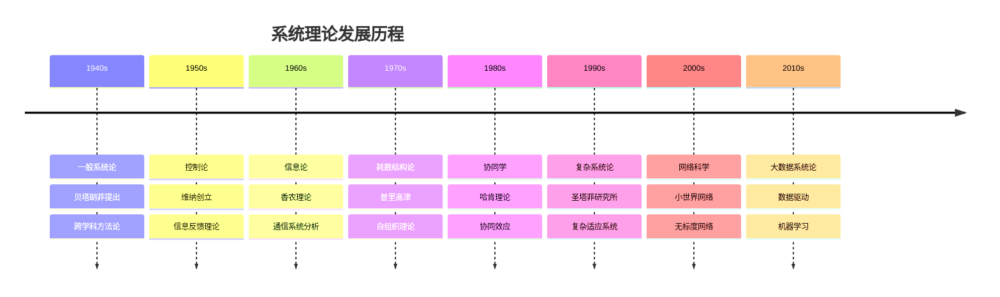

## 2. 系统分类概念图 (System Classification Concept Maps)

### 2.1 系统复杂度分类图

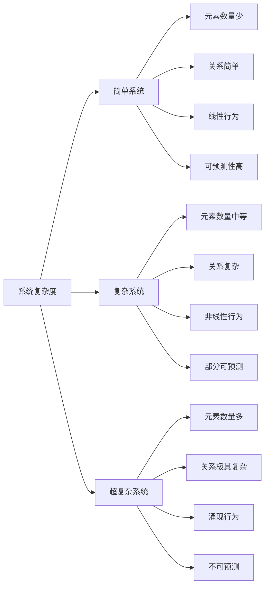

### 2.2 系统开放性分类图

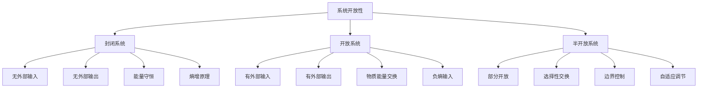

## 3. 系统行为概念图 (System Behavior Concept Maps)

### 3.1 行为模式分类图

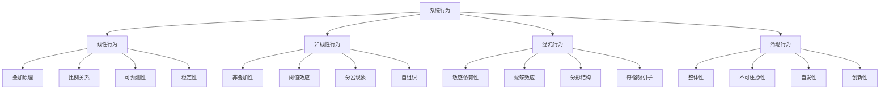

### 3.2 稳定性分析图

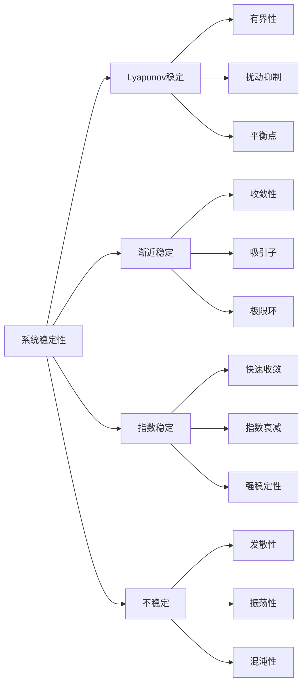

## 4. 系统结构概念图 (System Structure Concept Maps)

### 4.1 结构类型分类图

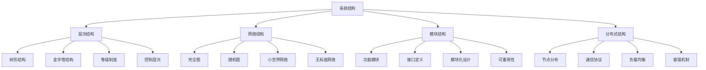

### 4.2 结构关系分析图

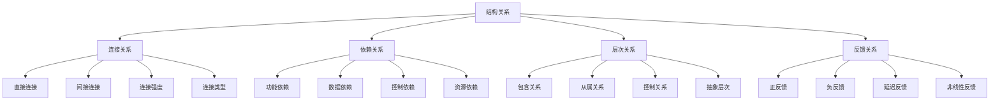

## 5. 系统功能概念图 (System Function Concept Maps)

### 5.1 功能层次图

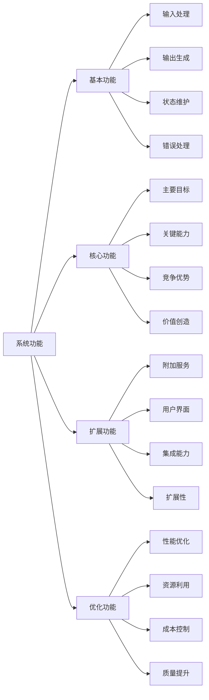

### 5.2 功能分解图

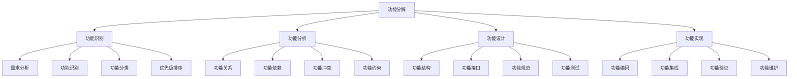

## 6. 系统控制概念图 (System Control Concept Maps)

### 6.1 控制类型分类图

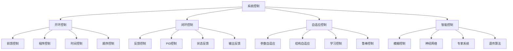

### 6.2 控制性能分析图

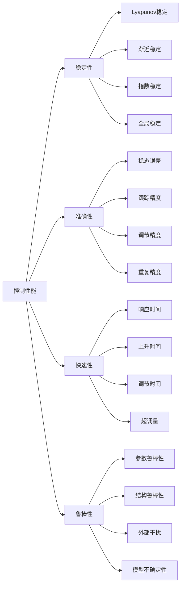

## 7. 系统优化概念图 (System Optimization Concept Maps)

### 7.1 优化方法分类图

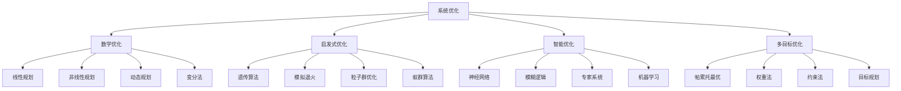

### 7.2 优化目标分析图

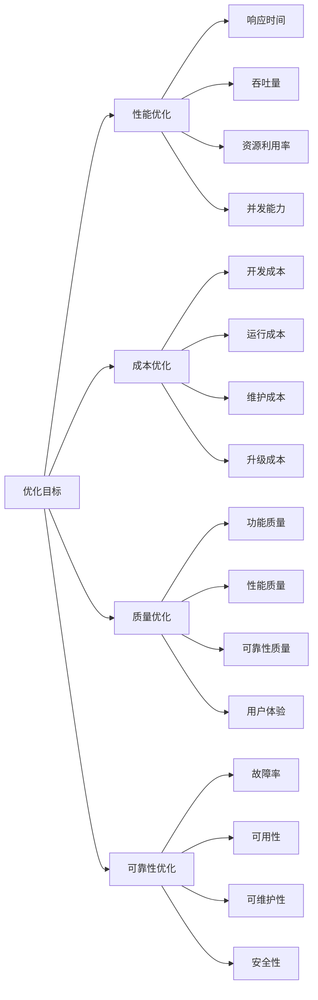

## 8. 系统涌现概念图 (System Emergence Concept Maps)

### 8.1 涌现现象分类图

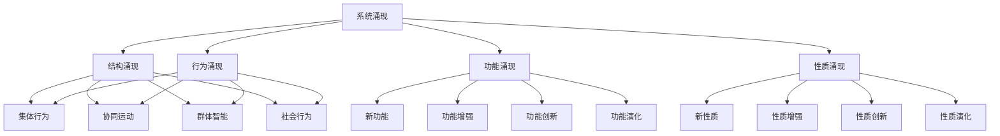

### 8.2 涌现机制分析图

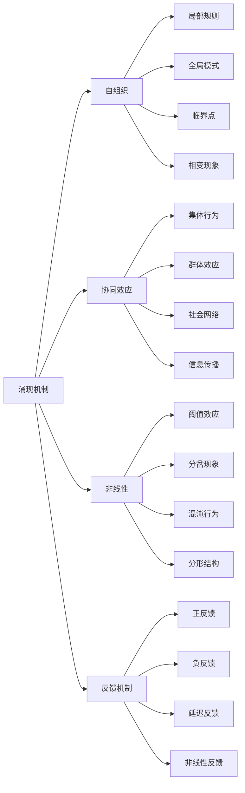

## 9. 系统演化概念图 (System Evolution Concept Maps)

### 9.1 演化模式分类图

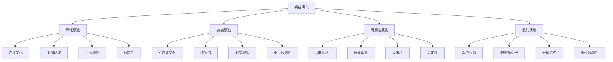

### 9.2 演化动力分析图

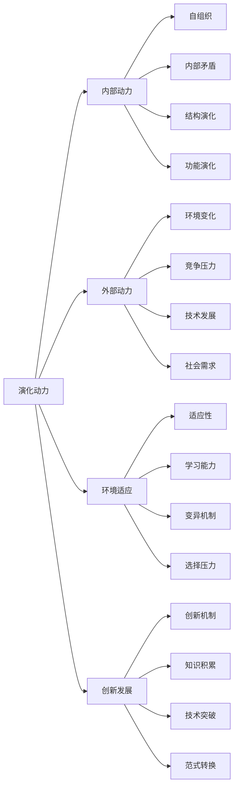

## 10. 系统理论应用概念图 (System Theory Application Concept Maps)

### 10.1 应用领域分类图

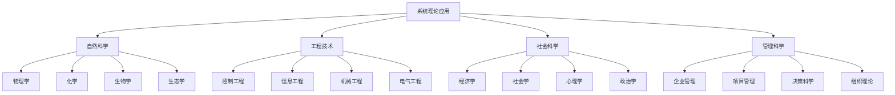

### 10.2 应用方法分析图

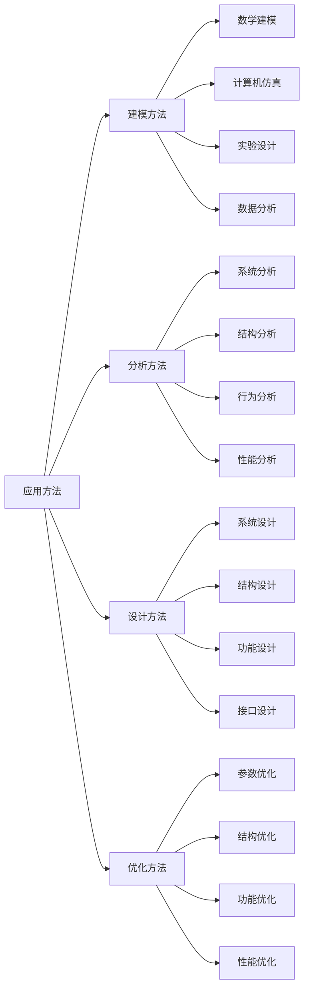

## 9. 自主体系统的概念图（Concept Maps of Autonomous Systems）

### 9.1 自主体结构概念图

```mermaid
graph TD
  A[自主体] --> S[状态]
  A --> P[感知]
  A --> D[决策]
  A --> Act[行动]
  A --> G[目标]
  A --> E[环境]
```

### 9.2 PDA模型概念图

```mermaid
graph LR
  E[环境] --> P[感知]
  P --> D[决策]
  D --> Act[行动]
  Act --> S[状态更新]
  S --> P
```

### 9.3 多自主体协同网络图

```mermaid
graph TD
  A1[自主体A] --- A2[自主体B]
  A2 --- A3[自主体C]
  A3 --- A4[自主体D]
  A1 --- A3
  A2 --- A4
```

### 9.4 典型应用概念图

```mermaid
graph TD
  MAS[多自主体系统] --> Robot[智能机器人]
  MAS --> UAV[无人机编队]
  MAS --> Agent[智能代理]
  MAS --> Swarm[群体智能]
```

### 9.5 结构表

| 概念图类型 | 主要内容         | 适用场景           |
|------------|------------------|--------------------|
| 结构图     | 状态、感知、决策、行动、目标、环境 | 单体/多体系统 |
| PDA模型图  | 感知-决策-行动循环 | 智能体行为建模     |
| 协同网络图 | 多体通信与协同    | 群体智能、分布式AI |
| 应用图     | 典型应用场景      | 机器人、无人系统   |

### 9.6 批判分析

- **优势**：概念图直观展现自主体系统结构与协同关系，便于理解与教学
- **局限**：实际系统结构复杂，图示需动态细化
- **未来方向**：动态图谱、跨域协同、结构-行为一体化可视化

---
> 本节为“自主体系统的概念图”内容补充，涵盖结构、PDA模型、协同网络、应用等概念图，结构表与批判分析，风格与全书一致，便于递归扩展与知识体系完善。
