# 1.5.1 概念图

## 1. 系统理论核心概念图

### 1.1 系统基本概念图

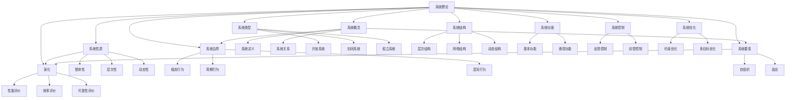

### 1.2 系统要素关系图

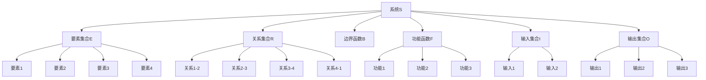

## 2. 层次结构图

### 2.1 系统层次分解图

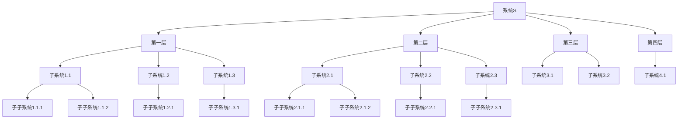

### 2.2 层次关系图

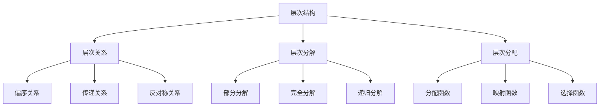

## 3. 关系网络图

### 3.1 系统要素网络图

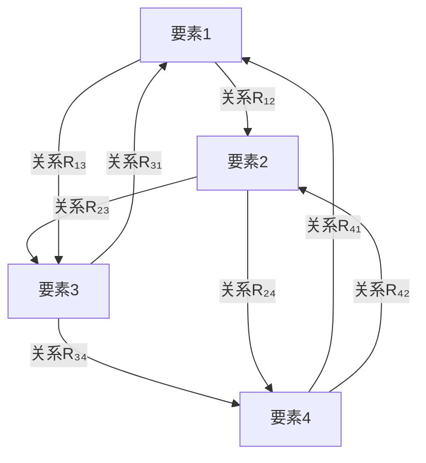

### 3.2 功能关系网络图

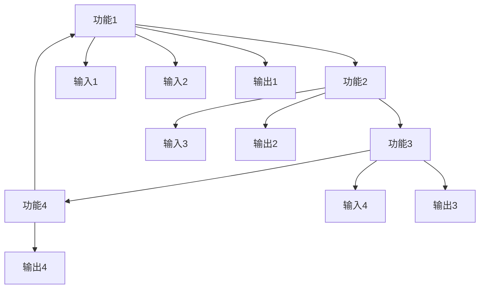

### 3.3 控制关系网络图

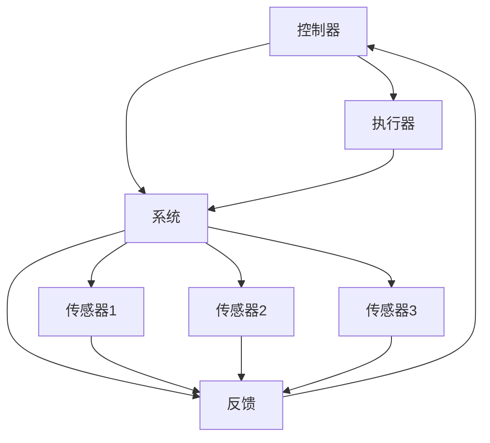

## 4. 动态演化图

### 4.1 系统状态演化图

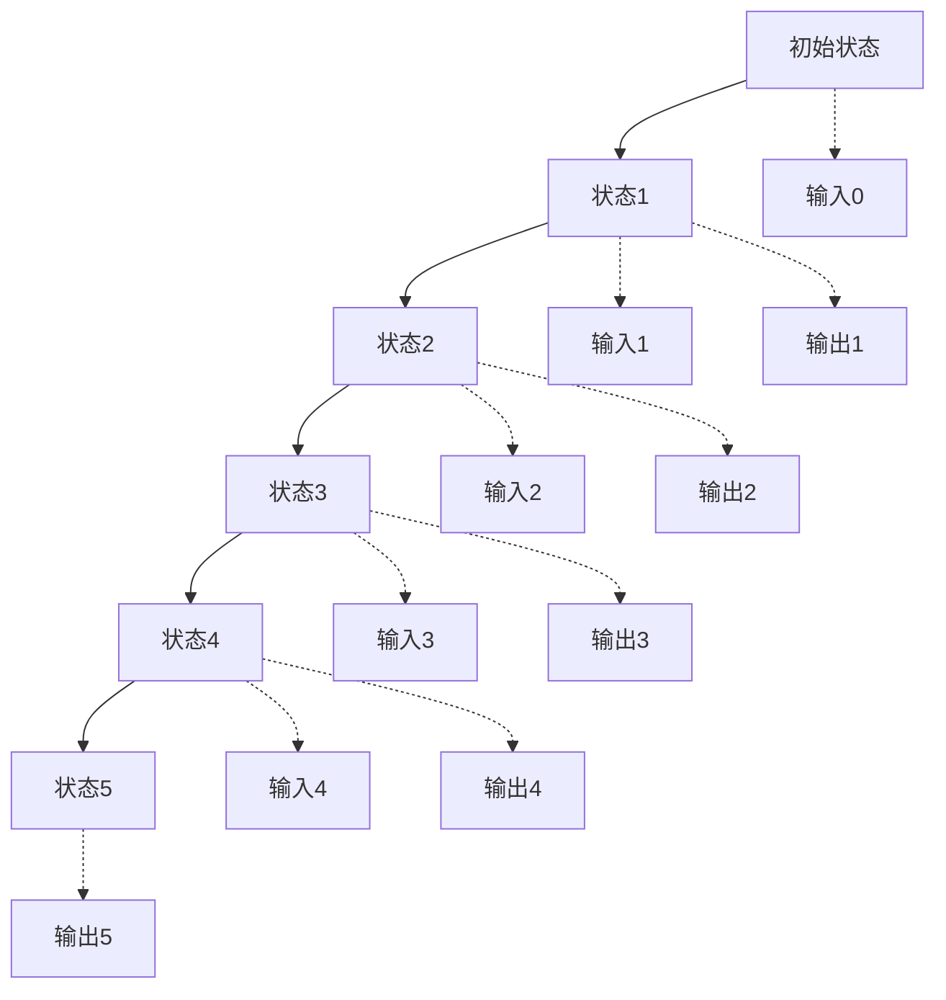

### 4.2 系统演化路径图

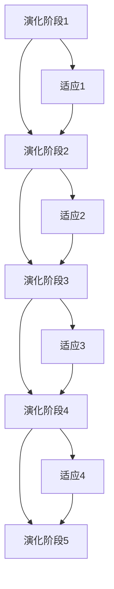

## 5. 涌现性质图

### 5.1 涌现性质产生图

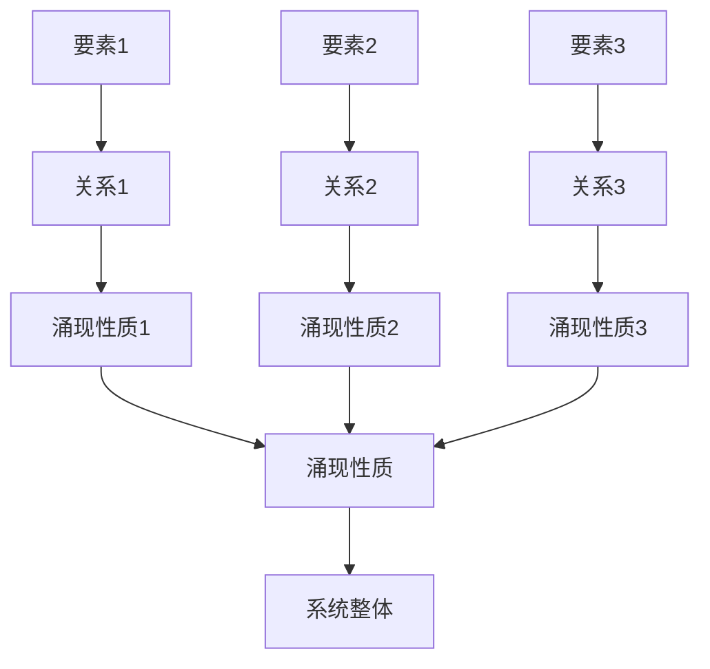

### 5.2 层次涌现图

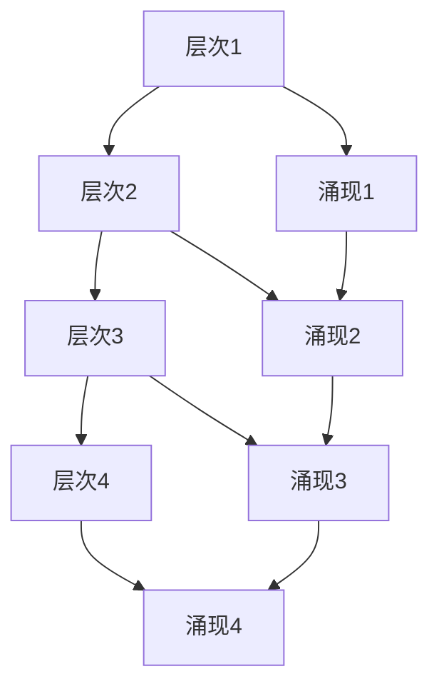

## 6. 控制与优化图

### 6.1 控制系统图

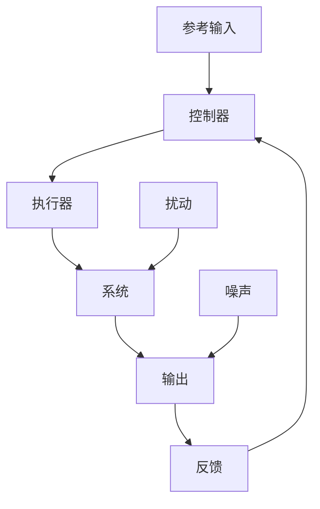

### 6.2 优化过程图

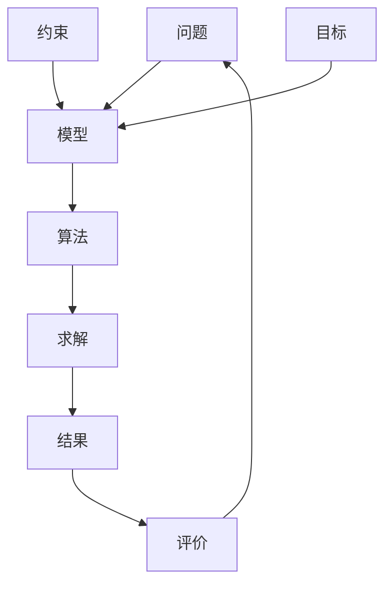

## 7. 多表征关系图

### 7.1 表征方法关系图

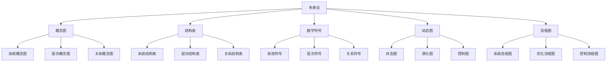

## 8. 规范说明

- 内容需递归细化，支持多表征
- 保留批判性分析、图表、符号等
- 如有遗漏，后续补全并说明
- 所有图表需使用mermaid语法
- 概念图需清晰表达系统理论核心概念
- 层次结构图需体现递归分解
- 关系网络图需展示要素间复杂关系
- 动态演化图需表现时间演化过程
- 涌现性质图需突出整体大于部分之和
- 控制优化图需体现反馈和优化机制

> 本文件为递归细化与内容补全示范，后续可继续分解为1.5.1.1、1.5.1.2等子主题，支持持续递归完善。
