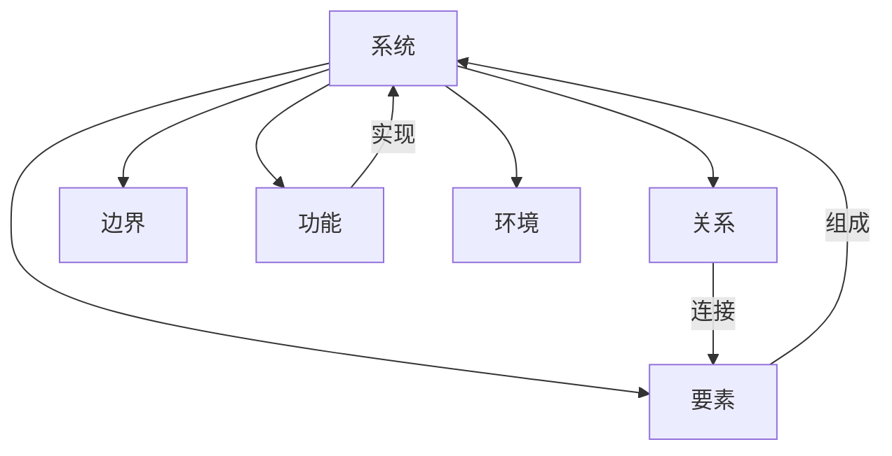

# 1.5 多表征 · 多表征案例与结构图递归补全

## 目录

- [1.5 多表征 · 多表征案例与结构图递归补全](#15-多表征--多表征案例与结构图递归补全)
  - [目录](#目录)
  - [1. 概念图示例](#1-概念图示例)
  - [2. 结构表示例](#2-结构表示例)
  - [3. 数学符号表达](#3-数学符号表达)
  - [4. 流程图示例](#4-流程图示例)
  - [5. 典型案例多表征](#5-典型案例多表征)
  - [6. 批判分析](#6-批判分析)

## 1. 概念图示例

## 2. 结构表示例

| 要素 | 关系 | 边界 | 功能 | 环境 |
|------|------|------|------|------|
| E1   | R1   | B1   | F1   | Env1 |
| E2   | R2   | B2   | F2   | Env2 |

## 3. 数学符号表达

- 系统 $S = (E, R, B, F, Env)$
- $E$：要素集合，$R$：关系集合，$B$：边界，$F$：功能，$Env$：环境

## 4. 流程图示例

## 5. 典型案例多表征

- **生态系统**：概念图（能量流动）、结构表（生物/非生物要素）、数学符号（$Eco = (Bio, Abi, Flow)$）、流程图（能量/物质循环）。
- **社会系统**：概念图（角色关系）、结构表（组织结构）、数学符号（$Soc = (Actor, Rel, Rule)$）、流程图（决策过程）。

## 6. 批判分析

- 多表征提升了系统理论的可理解性与应用性，但需防止表征碎片化、符号混乱。
- 建议：加强表征标准化、跨模态融合与工程应用。

---
> 本节为1.5 多表征分支多表征案例与结构图内容的递归补全，便于理论递归扩展、工程实践与多模态表达。
