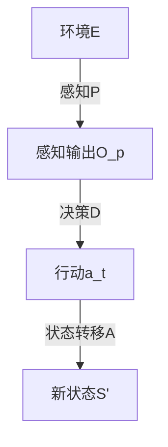
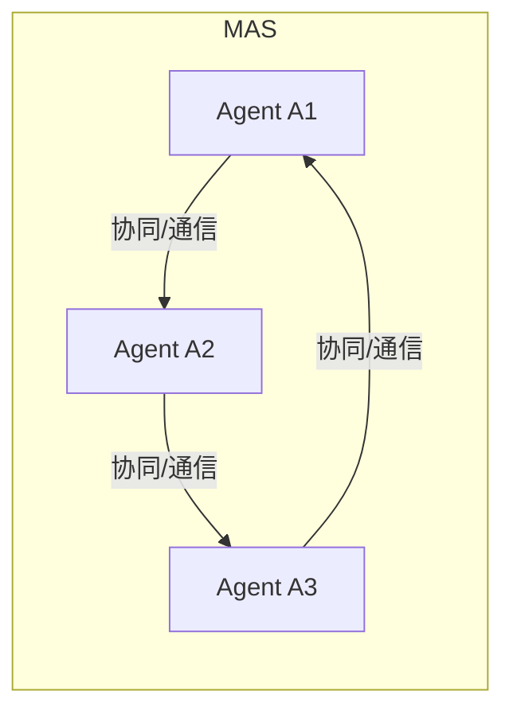

# 1.6.2 语义模型

## 概述

系统理论的语义模型建立了系统结构、行为和演化过程的形式化描述框架，为系统分析和设计提供理论基础。

## 系统结构语义模型

### 基本系统模型

系统 $S$ 的基本语义模型：

$$S = (E, R, F, C)$$

其中：

- $E = \{e_1, e_2, ..., e_n\}$ 为系统元素集合
- $R = \{r_1, r_2, ..., r_m\}$ 为关系集合
- $F = \{f_1, f_2, ..., f_k\}$ 为功能集合
- $C = \{c_1, c_2, ..., c_l\}$ 为约束集合

### 层次结构模型

系统的层次结构语义模型：

$$Hierarchy(S) = (L, \prec, \phi)$$

其中：

- $L = \{L_1, L_2, ..., L_h\}$ 为层次集合
- $\prec$ 为层次间的偏序关系
- $\phi: L \times L \rightarrow \mathbb{R}$ 为层次间映射函数

### 网络结构模型

系统的网络结构语义模型：

$$Network(S) = (V, E, W, P)$$

其中：

- $V$ 为节点集合（系统元素）
- $E$ 为边集合（关系）
- $W: E \rightarrow \mathbb{R}$ 为权重函数
- $P: V \times V \rightarrow [0,1]$ 为连接概率函数

## 系统行为语义模型

### 状态转换模型

系统状态转换语义模型：

$$StateMachine(S) = (Q, \Sigma, \delta, q_0, F)$$

其中：

- $Q$ 为状态集合
- $\Sigma$ 为输入字母表
- $\delta: Q \times \Sigma \rightarrow Q$ 为状态转换函数
- $q_0$ 为初始状态
- $F$ 为接受状态集合

### 动态行为模型

系统动态行为语义模型：

$$DynamicBehavior(S) = (X, U, f, g, h)$$

其中：

- $X$ 为状态空间
- $U$ 为输入空间
- $f: X \times U \rightarrow X$ 为状态转移函数
- $g: X \rightarrow Y$ 为输出函数
- $h: X \times U \rightarrow Y$ 为输出转移函数

### 反馈控制模型

系统反馈控制语义模型：

$$FeedbackControl(S) = (Plant, Controller, Sensor, Actuator)$$

其中：

- $Plant$ 为被控对象
- $Controller$ 为控制器
- $Sensor$ 为传感器
- $Actuator$ 为执行器

## 系统演化语义模型

### 演化轨迹模型

系统演化轨迹语义模型：

$$EvolutionTrajectory(S) = \{s(t) | t \in T\}$$

其中：

- $s(t)$ 为时刻 $t$ 的系统状态
- $T$ 为时间域

### 稳定性模型

系统稳定性语义模型：

$$Stability(S) = \begin{cases}
stable & \text{if } \lim_{t \rightarrow \infty} s(t) = s^* \\
unstable & \text{otherwise}
\end{cases}$$

其中 $s^*$ 为平衡状态。

### 适应性模型
系统适应性语义模型：

$$Adaptability(S) = \frac{\text{adaptation\_rate}(S)}{\text{environment\_change\_rate}}$$

## 系统功能语义模型

### 功能映射模型
系统功能映射语义模型：

$$FunctionMapping(S) = (I, O, F, \phi)$$

其中：
- $I$ 为输入空间
- $O$ 为输出空间
- $F$ 为功能集合
- $\phi: I \rightarrow O$ 为功能映射函数

### 性能模型
系统性能语义模型：

$$Performance(S) = (efficiency, effectiveness, reliability, robustness)$$

其中：
- $efficiency = \frac{output}{input}$
- $effectiveness = \frac{actual\_output}{expected\_output}$
- $reliability = P(\text{system works correctly})$
- $robustness = \text{tolerance to disturbances}$

### 优化模型
系统优化语义模型：

$$Optimization(S) = \arg\max_{x \in X} f(x) \text{ s.t. } g(x) \leq 0$$

其中：
- $f(x)$ 为目标函数
- $g(x)$ 为约束函数
- $X$ 为可行解空间

## 系统约束语义模型

### 物理约束模型
系统物理约束语义模型：

$$PhysicalConstraints(S) = \{c_i | c_i \text{ is physical constraint}\}$$

### 逻辑约束模型
系统逻辑约束语义模型：

$$LogicalConstraints(S) = \{\phi_i | \phi_i \text{ is logical formula}\}$$

### 时间约束模型
系统时间约束语义模型：

$$TemporalConstraints(S) = \{\tau_i | \tau_i \text{ is temporal constraint}\}$$

## 系统交互语义模型

### 输入输出模型
系统输入输出语义模型：

$$InputOutput(S) = (I, O, T, \rho)$$

其中：
- $I$ 为输入集合
- $O$ 为输出集合
- $T$ 为时间域
- $\rho: I \times T \rightarrow O$ 为输入输出关系

### 接口模型
系统接口语义模型：

$$Interface(S) = (Ports, Protocols, DataTypes)$$

其中：
- $Ports$ 为端口集合
- $Protocols$ 为协议集合
- $DataTypes$ 为数据类型集合

### 通信模型
系统通信语义模型：

$$Communication(S) = (Channels, Messages, Synchronization)$$

其中：
- $Channels$ 为通信通道
- $Messages$ 为消息集合
- $Synchronization$ 为同步机制

## 系统复杂度语义模型

### 结构复杂度模型
系统结构复杂度语义模型：

$$StructuralComplexity(S) = f(|E|, |R|, \text{connectivity}, \text{hierarchy})$$

### 行为复杂度模型
系统行为复杂度语义模型：

$$BehavioralComplexity(S) = f(\text{states}, \text{transitions}, \text{nonlinearity}, \text{uncertainty})$$

### 功能复杂度模型
系统功能复杂度语义模型：

$$FunctionalComplexity(S) = f(\text{functions}, \text{interactions}, \text{dependencies}, \text{constraints})$$

## 系统可靠性语义模型

### 故障模型
系统故障语义模型：

$$FaultModel(S) = (Faults, FailureRates, RepairRates)$$

其中：
- $Faults$ 为故障集合
- $FailureRates$ 为故障率函数
- $RepairRates$ 为修复率函数

### 可靠性函数
系统可靠性语义模型：

$$Reliability(S, t) = P(\text{system works correctly at time } t)$$

### 可用性模型
系统可用性语义模型：

$$Availability(S) = \frac{MTTF}{MTTF + MTTR}$$

其中：
- $MTTF$ 为平均无故障时间
- $MTTR$ 为平均修复时间

## 系统安全性语义模型

### 安全状态模型
系统安全状态语义模型：

$$SecurityState(S) = (Secure, Vulnerable, Compromised)$$

### 威胁模型
系统威胁语义模型：

$$ThreatModel(S) = (Threats, Vulnerabilities, Countermeasures)$$

其中：
- $Threats$ 为威胁集合
- $Vulnerabilities$ 为漏洞集合
- $Countermeasures$ 为对策集合

### 风险评估模型
系统风险评估语义模型：

$$RiskAssessment(S) = \sum_{threat} P(threat) \times Impact(threat)$$

## 系统可扩展性语义模型

### 扩展性度量
系统扩展性语义模型：

$$Scalability(S) = \frac{\text{performance\_with\_scale}}{\text{performance\_baseline}}$$

### 模块化模型
系统模块化语义模型：

$$Modularity(S) = \frac{\text{cohesion}}{\text{coupling}}$$

其中：
- $cohesion$ 为内聚度
- $coupling$ 为耦合度

### 可维护性模型
系统可维护性语义模型：

$$Maintainability(S) = f(\text{complexity}, \text{modularity}, \text{documentation}, \text{standards})$$

## 系统演化语义模型

### 生命周期模型
系统生命周期语义模型：

$$Lifecycle(S) = (Development, Deployment, Operation, Maintenance, Retirement)$$

### 版本演化模型
系统版本演化语义模型：

$$VersionEvolution(S) = \{v_i | v_i \text{ is version } i\}$$

### 适应性演化模型
系统适应性演化语义模型：

$$AdaptiveEvolution(S) = \text{learn}(experience) \rightarrow \text{adapt}(behavior)$$

## 8. 自主体系统的语义模型（Semantic Models of Autonomous Systems）

### 8.1 PDA模型语义图

### 8.2 多自主体系统（MAS）协同模型

### 8.3 时序逻辑模型
- **CTL/LTL表达**：
  - $AG(s \neq error)$：始终安全
  - $EF(goal)$：最终可达目标

### 8.4 递归语义模型
- 系统语义由子系统递归组合，支持层次化建模与分析

---
> 本节为“自主体系统的语义模型”内容补充，包含PDA、MAS、时序逻辑与递归模型，配合Mermaid图示，便于多表征理解。

## 总结

系统理论的语义模型提供了：

1. **结构模型**: 基本系统、层次结构、网络结构的语义模型
2. **行为模型**: 状态转换、动态行为、反馈控制的语义模型
3. **演化模型**: 演化轨迹、稳定性、适应性的语义模型
4. **功能模型**: 功能映射、性能、优化的语义模型
5. **约束模型**: 物理、逻辑、时间约束的语义模型
6. **交互模型**: 输入输出、接口、通信的语义模型
7. **复杂度模型**: 结构、行为、功能复杂度的语义模型
8. **可靠性模型**: 故障、可靠性、可用性的语义模型
9. **安全性模型**: 安全状态、威胁、风险评估的语义模型
10. **可扩展性模型**: 扩展性、模块化、可维护性的语义模型
11. **演化模型**: 生命周期、版本演化、适应性演化的语义模型

这些模型为系统理论的研究和应用提供了完整的语义框架。
