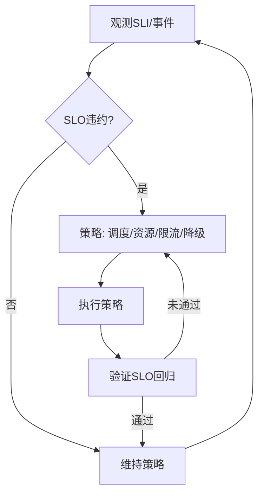

# 系统运行时语义

## 概述

系统运行时语义是系统理论中研究系统在运行过程中行为特征、状态转换、资源调度和动态特性的重要分支。它关注系统在时间维度上的演化规律，以及系统组件之间的动态交互机制。

## 目录结构

- **1.8.1 运行时行为与调度模型** - 系统运行时的行为模式和调度机制
- **1.8.2 典型运行时机制分析** - 常见运行时机制的原理和特点
- **1.8.3 运行时语义建模与形式化验证** - 运行时语义的形式化描述和验证方法
- **1.8.4 多层次协同与动态调度** - 多层级系统的协同运行和动态调度策略
- **1.8.5 自适应与弹性运行机制** - 系统的自适应能力和弹性运行特性
- **1.8.6 工程案例与实践** - 实际工程中的运行时语义应用案例
- **1.8.7 未来发展与挑战** - 运行时语义领域的发展趋势和面临的挑战

## 核心概念

### 运行时行为

- **状态转换**：系统在不同状态间的转换规律
- **事件驱动**：基于事件的系统行为触发机制
- **时序约束**：系统运行的时间相关约束条件
- **并发控制**：多任务并发执行的控制机制

### 调度模型

- **优先级调度**：基于优先级的任务调度策略
- **时间片轮转**：公平分配CPU时间的调度方法
- **多级反馈队列**：动态调整优先级的调度算法
- **实时调度**：满足实时性要求的调度机制

### 语义建模

- **操作语义**：系统操作的语义定义
- **指称语义**：系统行为的数学抽象
- **公理语义**：基于公理的语义推理
- **代数语义**：代数结构的语义描述

## SLO/SLI 驱动的运行时闭环（系统论视角）

- SLI：可用性、P99 延迟、吞吐/能效、错误预算消耗率、队列长度、资源利用率。
- SLO：领域特定目标集合（如时延<阈值/成功率>99.9%/成本<预算/能耗<预算）。
- 闭环：观测 → 诊断（根因/瓶颈）→ 策略合成（调度/资源/降级）→ 执行 → 验证 → 回滚/巩固。

## Mermaid 运行时治理闭环（通用）



## 伪代码示例（抽象）

```pseudo
if SLO_违约:
    策略 = 综合(系统模型, 资源状态, 业务优先级)
    执行(策略)
    if SLO_未恢复:
        回滚或切换备选策略
```

## 策略选择矩阵（示例）

| 场景 | 首选策略 | 备选 | 权衡 |
|---|---|---|---|
| 负载突增 | 水平扩容/配额提升 | 限流/降级 | 成本与体验 |
| 资源瓶颈 | 放置优化/拓扑亲和 | 缓存/批处理 | 迁移成本 |
| 故障冲击 | 隔离/熔断/重路由 | 备份切换 | 可用性与一致性 |
| 预算受限 | 成本感知调度 | 关停非关键 | SLA 风险 |

## 学习目标

1. **理解运行时语义的基本概念和重要性**
2. **掌握系统运行时行为建模方法**
3. **学会分析和设计调度算法**
4. **了解形式化验证技术在运行时语义中的应用**
5. **掌握多层级系统的协同运行机制**
6. **理解自适应和弹性运行的设计原则**

## 应用领域

- **操作系统内核设计**
- **实时系统开发**
- **分布式系统协调**
- **嵌入式系统优化**
- **云计算资源调度**
- **物联网设备管理**

## 相关资源

- **经典文献**：《Operating System Concepts》、《Real-Time Systems》
- **学术期刊**：ACM Transactions on Computer Systems、IEEE Transactions on Software Engineering
- **会议论文**：SOSP、OSDI、RTSS等顶级会议
- **在线资源**：Linux内核文档、实时系统标准

## 实践项目

1. **简单调度器实现**：实现基本的进程调度算法
2. **实时任务调度**：设计满足截止时间的调度策略
3. **多核调度优化**：优化多核环境下的任务分配
4. **动态负载均衡**：实现自适应的负载均衡机制
