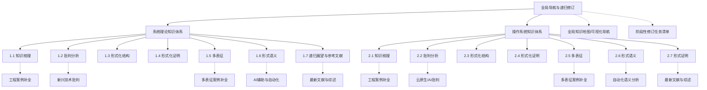

# 全局知识地图与递归修订导航

---

## 阶段性修订任务清单

1. 全局知识地图与导航优化
2. 1.6/2.6 形式语义分支AI辅助与自动化内容补全
3. 1.2/2.2 批判分析分支新兴技术批判性内容补充
4. 1.5/2.5 多表征分支结构图与案例补全
5. 1.7/2.7 递归展望与参考文献分支最新综述补充
6. 各分支工程案例与实证分析递归补全
7. 各分支README递归导航与结构优化

> 本文件为全局递归修订导航与任务清单，便于持续推进、阶段性中断与协作。
