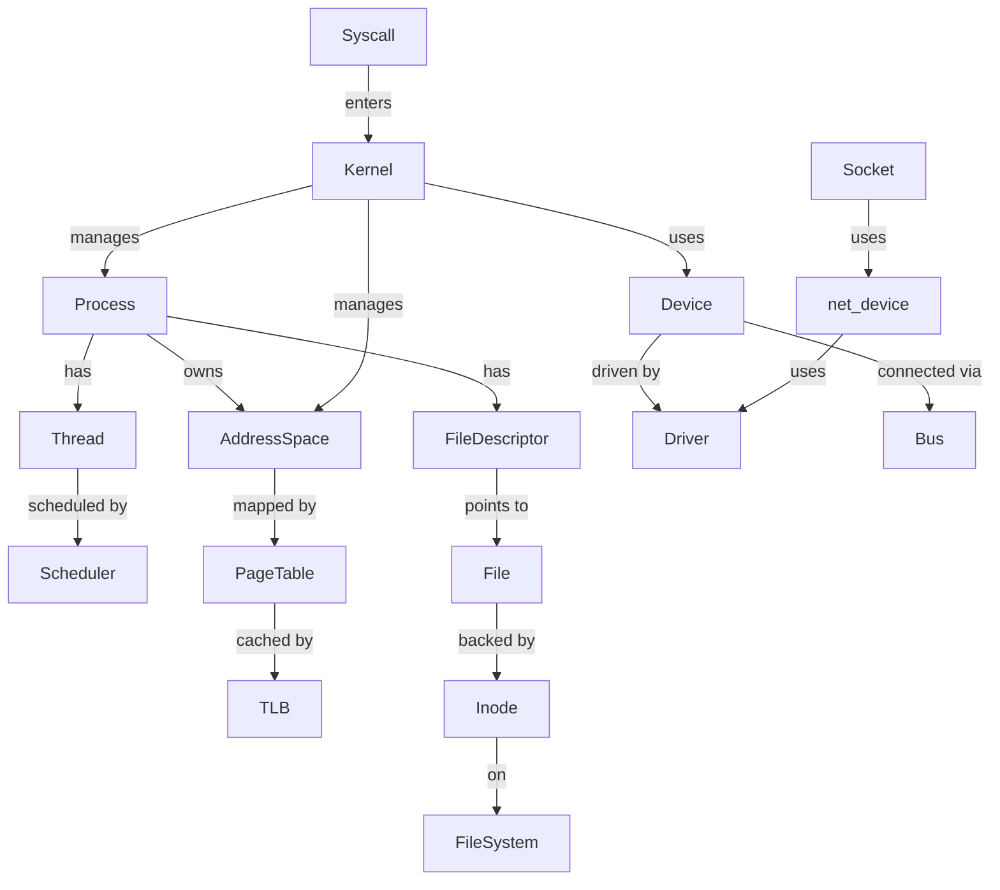

# 操作系统属性-关系映射（OS Attribute-Relationship Mapping）

> **权威来源**：OSTEP, Berkeley CS162 (Anderson & Dahlin), ACM/IEEE CS Curricula 2023 OS KA, MIT xv6。
>
> **目标**：为操作系统核心概念建立可检索的属性集、关系集与约束，支撑形式化定义与跨层映射。

---

## 1. 进程与线程（Process & Thread）

| 概念 | 属性/关系 | 类型/取值 | 说明与约束 |
|------|-----------|-----------|------------|
| Process | pid | ℕ | 系统唯一标识；Linux 中 `pid_t` |
| Process | tgid | ℕ | 线程组 ID；单线程进程 `tgid == pid` |
| Process | state | {new, ready, running, waiting, terminated, zombie} | 生命周期状态机 |
| Process | address_space | AddressSpace | 独立虚拟地址空间 |
| Process | parent_of | Process → Process | 父子关系；Linux 中构成进程森林 |
| Process | threads | Set<Thread> | 进程拥有的线程集合 |
| Process | file_descriptors | Map<fd, File> | 打开文件描述符表 |
| Process | credentials | struct cred / UID/GID | 身份与权限 |
| Thread | tid | ℕ | 线程标识 |
| Thread | state | {running, ready, blocked, terminated} | 调度状态 |
| Thread | stack | MemoryRegion | 独立内核栈与用户栈 |
| Thread | registers | RegisterFile | 通用寄存器 + PC/SP |
| Thread | belongs_to | Process | 每个线程属于且仅属于一个进程 |
| Thread | scheduling_entity | SchedEntity | Linux 中 `task_struct` 统一表示 |

---

## 2. 调度（Scheduling）

| 概念 | 属性/关系 | 类型/取值 | 说明与约束 |
|------|-----------|-----------|------------|
| Scheduler | ready_queue | PriorityQueue / Tree / Bitmap | 可运行任务集合 |
| Scheduler | policy | {FIFO, SJF, RR, MLFQ, CFS, RT} | 选择下一个运行任务的策略 |
| Scheduler | time_slice | Time | RR/时间片轮转中的量子 |
| Scheduler | context_switch_cost | Time | 切换开销，通常微秒级 |
| Task | priority | ℤ / ℕ | 数值越小优先级越高（POSIX 实时）或越低（nice） |
| Task | arrival_time | Time | 到达时间 |
| Task | burst_time | Time | CPU 突发时间 |
| Task | deadline | Time ∪ {∞} | 截止时间（实时任务） |
| Task | vruntime | ℕ | Linux CFS 虚拟运行时间 |
| SchedulingClass | hierarchy | [RT, DL, CFS, IDLE] | Linux 调度类优先级顺序 |

---

## 3. 内存管理（Memory Management）

| 概念 | 属性/关系 | 类型/取值 | 说明与约束 |
|------|-----------|-----------|------------|
| AddressSpace | virtual_range | [0, 2^N-1] | N 为地址宽度 |
| AddressSpace | segments | {text, data, bss, heap, stack, mmap} | 逻辑段 |
| Page | size | {4 KiB, 2 MiB, 1 GiB, ...} | 页大小 |
| Page | frame | Frame ∪ {⊥} | 映射的物理页框；未映射为 ⊥ |
| PageTable | levels | ℕ | x86-64 通常 4~5 级 |
| PageTable | root | PhysicalAddress | CR3 / TTBR0 / SATP |
| PTE | present | Boolean | 是否在物理内存 |
| PTE | rw | Boolean | 读写权限 |
| PTE | user | Boolean | 用户态可访问 |
| PTE | accessed | Boolean | 是否被访问过 |
| PTE | dirty | Boolean | 是否被写过 |
| TLB | entries | Set<(VPN, PFN, flags)> | 硬件缓存的页表项 |
| TLB | flush_on_context_switch | Boolean | 是否需要刷新 |
| WorkingSet | W(t, Δ) | Set<Pages> | 时间窗口 Δ 内访问的页 |

---

## 4. 文件系统（File System）

| 概念 | 属性/关系 | 类型/取值 | 说明与约束 |
|------|-----------|-----------|------------|
| File | fd | ℕ | 进程内文件描述符 |
| File | offset | ℕ | 当前读写位置 |
| File | mode | {r, w, a, r+, ...} | 打开模式 |
| Inode | inode_number | ℕ | 文件系统内唯一 |
| Inode | metadata | {mode, uid, gid, size, atime, mtime, ctime} | 文件元数据 |
| Inode | data_blocks | Set<BlockAddress> | 数据块索引 |
| Dentry | name | String | 路径分量名 |
| Dentry | parent | Dentry | 父目录项 |
| Dentry | inode | Inode | 对应 inode |
| Superblock | filesystem_type | String | 如 ext4/xfs/tmpfs |
| Superblock | block_size | ℕ | 块大小 |
| VFS | operations | {file_operations, inode_operations, super_operations} | 统一抽象接口 |

---

## 5. 设备与 I/O（Device & I/O）

| 概念 | 属性/关系 | 类型/取值 | 说明与约束 |
|------|-----------|-----------|------------|
| Device | major | ℕ | 主设备号 |
| Device | minor | ℕ | 次设备号 |
| Device | type | {character, block, network} | 设备类型 |
| Device | bus | Bus ∪ {platform} | 所属总线 |
| Device | driver | DeviceDriver | 绑定驱动 |
| DeviceDriver | probe | Function | 探测并初始化设备 |
| DeviceDriver | remove | Function | 卸载设备 |
| Interrupt | vector | ℕ | 中断向量号 |
| Interrupt | handler | ISR | 中断服务例程 |
| Interrupt | affinity | CPUSet | CPU 亲和性 |
| DMA | channel | ℕ ∪ {⊥} | DMA 通道 |
| DMA | coherent | Boolean | 是否一致性内存 |

---

## 6. 网络（Networking）

| 概念 | 属性/关系 | 类型/取值 | 说明与约束 |
|------|-----------|-----------|------------|
| Socket | domain | {AF_INET, AF_INET6, AF_UNIX, AF_PACKET} | 协议族 |
| Socket | type | {SOCK_STREAM, SOCK_DGRAM, SOCK_RAW} | 套接字类型 |
| Socket | state | {CLOSED, LISTEN, SYN_SENT, ESTABLISHED, ...} | TCP 状态 |
| Socket | backlog | ℕ | 连接队列长度 |
| sk_buff | data_len | ℕ | 数据长度 |
| sk_buff | protocol | Protocol | 网络层协议 |
| sk_buff | dev | net_device | 出/入网络设备 |
| net_device | name | String | 如 eth0/ens33/veth0 |
| net_device | mtu | ℕ | 最大传输单元 |
| net_device | flags | {UP, RUNNING, PROMISC, ...} | 接口标志 |
| net_device | ops | net_device_ops | 设备操作集合 |

---

## 7. 安全与隔离（Security & Isolation）

| 概念 | 属性/关系 | 类型/取值 | 说明与约束 |
|------|-----------|-----------|------------|
| Capability | cap | {CAP_CHOWN, CAP_NET_ADMIN, ...} | Linux 权能 |
| Namespace | type | {pid, net, mnt, ipc, uts, user, cgroup, time} | 命名空间类型 |
| Cgroup | controller | {cpu, memory, io, pids, cpuset} | 资源控制器 |
| LSM | hook | security_hook_list | 安全策略挂载点 |
| seccomp | mode | {SECCOMP_MODE_STRICT, FILTER} | 系统调用过滤模式 |
| DAC | owner | UID/GID | 文件所有者权限 |
| MAC | label | SecurityLabel | SELinux/AppArmor 标签 |

---

## 8. 接口与抽象层（Interface & Abstraction）

| 概念 | 属性/关系 | 类型/取值 | 说明与约束 |
|------|-----------|-----------|------------|
| SystemCall | number | ℕ | 系统调用号（架构相关） |
| SystemCall | args | Tuple | 参数寄存器/栈传递 |
| SystemCall | return | ℤ | 返回值；负数为错误码 |
| ABI | calling_convention | {System V AMD64, AAPCS, ...} | 调用约定 |
| ELF | type | {ET_REL, ET_EXEC, ET_DYN} | 可重定位/可执行/动态库 |
| vDSO | symbols | {__vdso_clock_gettime, ...} | 用户态快速系统调用 |
| DeviceTree | compatible | String | 驱动匹配字符串 |
| DeviceTree | reg | (Address, Size) | 寄存器区域 |
| HAL | abstraction | FunctionSet | 硬件抽象函数集 |
| BSP | components | {bootloader, kernel, dtb, drivers, rootfs} | 板级支持包 |

---

## 9. 关系总图

---

## 10. 国际来源映射

| 概念 | 来源类型 | 来源 | 位置 | 状态 |
|------|----------|------|------|------|
| 进程/线程属性 | Textbook | OSTEP | Ch. 4, 25, 26 | 已覆盖 |
| 调度属性 | Textbook | OSTEP | Ch. 7~9 | 已覆盖 |
| 内存属性 | Textbook | OSTEP | Ch. 13~22 | 已覆盖 |
| 文件属性 | Textbook | Berkeley CS162 | Ch. File Systems | 已覆盖 |
| 网络属性 | Textbook | TCP/IP Illustrated Vol. 1 | Ch. 1~12 | 已覆盖 |
| 安全属性 | SourceCode | Linux Kernel | include/linux/cred.h, security/ | 已覆盖 |
| ABI/ELF | Standard | System V ABI + ELF Spec | §Sections | 已覆盖 |

---

## 11. 相关文件

- [概念树](./concept-tree-os.md)
- [机制组合树](./mechanism-composition-tree-os.md)
- [依赖树](./dependency-tree-os.md)
- [场景分析树 / 决策树](./scenario-analysis-tree-os.md)
- [Linux 内核源码映射](../05-linux-kernel/linux-source-map.md)
