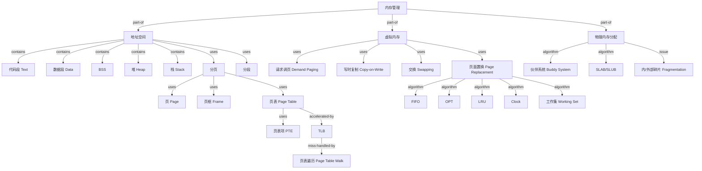
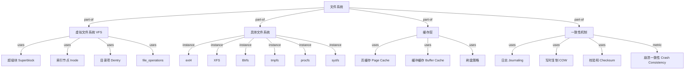
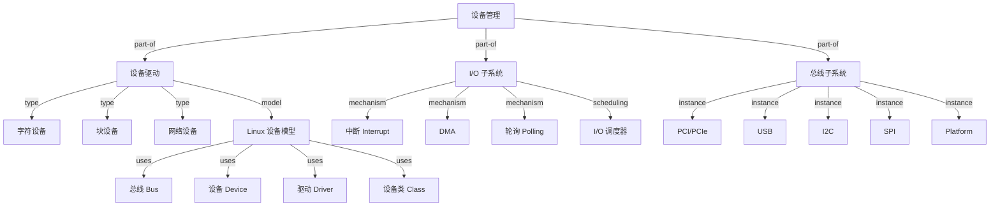
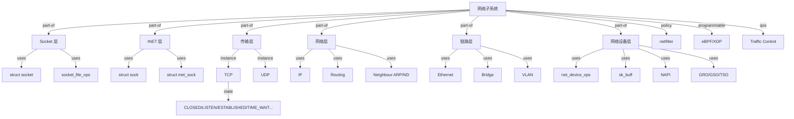
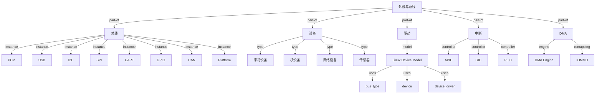
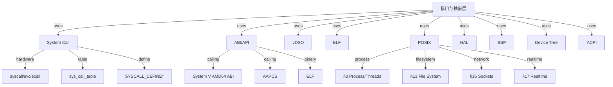
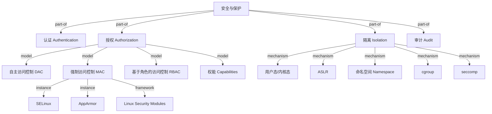

# 操作系统概念树（Operating Systems Concept Tree）

<!-- TOC START -->

- [操作系统概念树（Operating Systems Concept Tree）](#操作系统概念树operating-systems-concept-tree)
  - [1. 全局概念树（Mermaid）](#1-全局概念树mermaid)
  - [2. 核心子域概念展开](#2-核心子域概念展开)
    - [2.1 进程管理（Process Management）](#21-进程管理process-management)
      - [属性-关系映射（精选）](#属性-关系映射精选)
    - [2.2 内存管理（Memory Management）](#22-内存管理memory-management)
      - [属性-关系映射（精选）](#属性-关系映射精选-1)
    - [2.3 文件系统与持久化（File System \& Persistence）](#23-文件系统与持久化file-system--persistence)
      - [属性-关系映射（精选）](#属性-关系映射精选-2)
    - [2.4 设备管理（Device Management）](#24-设备管理device-management)
    - [2.5 网络子系统（Networking Subsystem）](#25-网络子系统networking-subsystem)
    - [2.6 外设与总线（Peripheral \& Bus）](#26-外设与总线peripheral--bus)
    - [2.7 接口与抽象层（Interface \& Abstraction）](#27-接口与抽象层interface--abstraction)
    - [2.8 安全与保护（Security \& Protection）](#28-安全与保护security--protection)
  - [3. 主题间关系：虚拟化 · 并发 · 持久化](#3-主题间关系虚拟化--并发--持久化)
  - [4. 术语表](#4-术语表)
  - [5. 国际来源映射](#5-国际来源映射)
  - [6. 相关文件](#6-相关文件)

<!-- TOC END -->

> **权威来源**：OSTEP (Arpaci-Dusseau, *Operating Systems: Three Easy Pieces*), ACM/IEEE CS Curricula 2023 OS Knowledge Areas, MIT xv6, IITBombay OS Lectures.
>
> **说明**：本文件以“根概念 → 核心子域 → 关键概念 → 机制/策略 → 实例”五级结构，建立操作系统领域的全局概念树。边标注关系类型：`is-a`（泛化）、`part-of`（组成）、`depends-on`（依赖）、`instance-of`（实例）。

---

## 1. 全局概念树（Mermaid）

```mermaid
graph TD
    OS[操作系统 Operating System] -->|is-a| SS[系统软件 System Software]
    OS -->|part-of| K[内核 Kernel]
    OS -->|provides| ABI[应用二进制接口 ABI / 系统调用接口]
    OS -->|manages| HW[硬件资源 Hardware Resources]

    K -->|part-of| PM[进程管理 Process Management]
    K -->|part-of| MM[内存管理 Memory Management]
    K -->|part-of| FS[文件系统 File System]
    K -->|part-of| DM[设备管理 Device Management]
    K -->|part-of| NS[网络子系统 Networking Subsystem]
    K -->|part-of| PER[外设与总线 Peripheral & Bus]
    K -->|part-of| IF[接口与抽象层 Interface & Abstraction]
    K -->|part-of| SEC[安全与保护 Security & Protection]

    NS -->|uses| SOCKET[Socket]
    NS -->|uses| PROTO[TCP/IP/UDP/ICMP]
    NS -->|uses| ROUTE[Routing]
    NS -->|uses| NETDEV[net_device]
    NS -->|uses| SKB[sk_buff]
    NS -->|uses| EPOLL[epoll]
    NS -->|uses| IOURING[io_uring]
    NS -->|uses| NETFILTER[netfilter]
    NS -->|uses| EBPF[eBPF/XDP]

    PER -->|uses| BUS[总线 Bus]
    PER -->|uses| DRIVER[设备驱动 Driver]
    PER -->|uses| IRQ[中断 Interrupt]
    PER -->|uses| DMA[DMA]
    PER -->|uses| DT[设备树 Device Tree]
    BUS -->|instance| PCIE[PCIe]
    BUS -->|instance| USB[USB]
    BUS -->|instance| I2C[I2C]
    BUS -->|instance| SPI[SPI]
    BUS -->|instance| UART[UART]
    BUS -->|instance| GPIO[GPIO]
    BUS -->|instance| CAN[CAN]

    IF -->|uses| SYSCALL[System Call]
    IF -->|uses| ABI[ABI/API]
    IF -->|uses| VDSO[vDSO]
    IF -->|uses| ELF[ELF]
    IF -->|uses| POSIX[POSIX]
    IF -->|uses| HAL[HAL]
    IF -->|uses| BSP[BSP]

    PM -->|abstracts| PROC[进程 Process]
    PROC -->|is-a| THREAD[线程 Thread]
    PROC -->|is-a| FIBER[纤程/协程 Fiber/Coroutine]
    PM -->|uses| SCHED[调度器 Scheduler]
    PM -->|uses| SYNC[同步原语 Synchronization Primitives]
    PM -->|handles| DEAD[死锁 Deadlock]

    MM -->|abstracts| AS[地址空间 Address Space]
    AS -->|uses| PAGING[分页 Paging]
    AS -->|uses| SEG[分段 Segmentation]
    MM -->|uses| VM[虚拟内存 Virtual Memory]
    VM -->|uses| PT[页表 Page Table]
    VM -->|uses| TLB[转译后备缓冲器 TLB]
    VM -->|uses| SW[交换/页面置换 Swapping/Page Replacement]

    FS -->|abstracts| FILE[文件 File]
    FS -->|uses| VFS[虚拟文件系统 VFS]
    FS -->|uses| CACHE[页缓存/缓冲缓存 Page/Buffer Cache]
    FS -->|uses| JOURNAL[日志/写时复制 Journaling/COW]
    FS -->|instance-of| EXT4[ext4]
    FS -->|instance-of| BTRFS[Btrfs]
    FS -->|instance-of| XFS[XFS]

    DM -->|uses| INT[中断 Interrupt]
    DM -->|uses| DMA[直接内存访问 DMA]
    DM -->|uses| DRIVER[设备驱动 Device Driver]
    DM -->|uses| BLOCK[块 I/O 层 Block I/O Layer]

    SEC -->|uses| ACL[访问控制列表 ACL]
    SEC -->|uses| CAP[权能 Capabilities]
    SEC -->|uses| LSM[Linux Security Modules]
    SEC -->|uses| CRYPTO[加密与完整性 Crypto & Integrity]
```

---

## 2. 核心子域概念展开

### 2.1 进程管理（Process Management）

```mermaid
graph TD
    PM[进程管理] -->|part-of| PCB[进程控制块 PCB]
    PM -->|part-of| STATE[进程状态机 Process State Machine]
    PM -->|part-of| API[进程 API]
    PM -->|part-of| SCHED[调度器]
    PM -->|part-of| SYNC[同步]
    PM -->|part-of| IPC[进程间通信 IPC]

    PCB -->|contains| PID[PID]
    PCB -->|contains| REGS[寄存器现场]
    PCB -->|contains| MMU_CTX[MMU 上下文]
    PCB -->|contains| FD[文件描述符表]

    STATE -->|is-a| NEW[New]
    STATE -->|is-a| READY[Ready]
    STATE -->|is-a| RUNNING[Running]
    STATE -->|is-a| WAITING[Waiting/Blocked]
    STATE -->|is-a| TERMINATED[Terminated]
    STATE -->|is-a| ZOMBIE[Zombie]

    SCHED -->|uses| CS[上下文切换 Context Switch]
    SCHED -->|policy| FIFO[FCFS/FIFO]
    SCHED -->|policy| SJF[SJF/STCF]
    SCHED -->|policy| RR[Round Robin]
    SCHED -->|policy| MLFQ[MLFQ]
    SCHED -->|policy| PS[优先级调度 Priority Scheduling]
    SCHED -->|policy| CFS[Linux CFS]

    SYNC -->|is-a| LOCK[互斥锁 Mutex]
    SYNC -->|is-a| SEM[信号量 Semaphore]
    SYNC -->|is-a| COND[条件变量 Condition Variable]
    SYNC -->|is-a| RW[读写锁 RWLock]
    SYNC -->|is-a| SPIN[自旋锁 Spinlock]
    SYNC -->|problem| RACE[竞态条件 Race Condition]
    SYNC -->|problem| PI[优先级倒置 Priority Inversion]

    IPC -->|is-a| PIPE[管道 Pipe]
    IPC -->|is-a| MSG[消息队列 Message Queue]
    IPC -->|is-a| SHM[共享内存 Shared Memory]
    IPC -->|is-a| SIGNAL[信号 Signal]
    IPC -->|is-a| SOCKET[Socket]

    DEAD[死锁] -->|condition| MUT[互斥 Mutual Exclusion]
    DEAD -->|condition| HOLD[占有并等待 Hold and Wait]
    DEAD -->|condition| NO_PREEMPT[非抢占 No Preemption]
    DEAD -->|condition| CIRC[循环等待 Circular Wait]
    DEAD -->|prevention| PREV[预防]
    DEAD -->|avoidance| AVOID[避免：银行家算法]
    DEAD -->|detection| DET[检测与恢复]
```

#### 属性-关系映射（精选）

| 概念 | 属性/关系 | 类型/取值 | 说明 |
|------|-----------|-----------|------|
| Process | pid | ℕ | 系统唯一进程标识 |
| Process | state | {new, ready, running, waiting, terminated, zombie} | 生命周期状态 |
| Process | address_space | AddressSpace | 虚拟地址空间；由 MM 子系统管理 |
| Process | parent_of | Process → Process | 父子关系；Linux 中构成森林 |
| Thread | tid | ℕ | 线程标识；与进程共享地址空间 |
| Thread | stack | MemoryRegion | 独立栈空间 |
| Scheduler | ready_queue | Set<Process> | 就绪进程集合 |
| Scheduler | policy | Policy | 决定下一个运行进程 |
| Mutex | owner | Thread ∪ {⊥} | 当前持有线程；支持优先级继承 |
| Deadlock | resource_allocation_graph | Graph | 检测循环等待的图结构 |

---

### 2.2 内存管理（Memory Management）

#### 属性-关系映射（精选）

| 概念 | 属性/关系 | 类型/取值 | 说明 |
|------|-----------|-----------|------|
| Address Space | virtual_range | [0, 2^N - 1] | N 为架构地址宽度 |
| Page | size | 4 KiB / 2 MiB / 1 GiB | 架构与配置相关 |
| Page Table | levels | ℕ | x86-64 通常 4~5 级 |
| PTE | flags | {present, rw, user, accessed, dirty, nx} | 页权限与状态 |
| TLB | entry_count | ℕ | 硬件相关；上下文切换时可能刷新 |
| Page Fault | reason | {major, minor, protection, invalid} | 触发调页或段错误 |
| Working Set | W(t, Δ) | Set<Pages> | 时间窗口 Δ 内访问的页集合 |

---

### 2.3 文件系统与持久化（File System & Persistence）

#### 属性-关系映射（精选）

| 概念 | 属性/关系 | 类型/取值 | 说明 |
|------|-----------|-----------|------|
| File | fd | ℕ | 进程内文件描述符 |
| File | offset | ℕ | 当前读写位置 |
| Inode | inode_number | ℕ | 文件系统内唯一标识 |
| Inode | metadata | {mode, uid, gid, size, timestamps} | 文件元数据 |
| Dentry | name → inode | Map | 路径名到 inode 的缓存 |
| Superblock | filesystem_type | String | 文件系统类型标识 |
| Page Cache | cached_pages | Set<Page> | 缓存的文件页 |
| Crash Consistency | atomicity | Boolean | 系统崩溃后元数据一致性 |

---

### 2.4 设备管理（Device Management）

---

### 2.5 网络子系统（Networking Subsystem）

### 2.6 外设与总线（Peripheral & Bus）

### 2.7 接口与抽象层（Interface & Abstraction）

### 2.8 安全与保护（Security & Protection）

---

## 3. 主题间关系：虚拟化 · 并发 · 持久化

依据 OSTEP 的三大主题，将上述概念聚类：

| OSTEP 主题 | 核心概念 | 典型机制 | 典型策略 |
|------------|----------|----------|----------|
| Virtualization（CPU） | 进程、线程、地址空间 | 上下文切换、系统调用、陷阱 | CFS、MLFQ、优先级调度 |
| Virtualization（Memory） | 虚拟地址空间、页、页框 | 分页、TLB、请求调页 | LRU、工作集、伙伴分配 |
| Concurrency | 线程、锁、信号量、条件变量 | 原子操作、内存屏障、futex | 银行家算法、优先级继承 |
| Persistence | 文件、inode、超级块 | VFS、日志、COW | 写回/直写、I/O 调度 |

---

## 4. 术语表

| 中文 | 英文 | 一句话定义 |
|------|------|------------|
| 进程 | Process | 运行中的程序实例，拥有独立地址空间和资源集合 |
| 线程 | Thread | 进程内的执行单元，共享进程地址空间 |
| 进程控制块 | PCB / Process Control Block | 操作系统描述和管理进程的数据结构 |
| 上下文切换 | Context Switch | 保存当前进程状态并恢复另一个进程状态的过程 |
| 虚拟内存 | Virtual Memory | 通过页表将虚拟地址映射到物理地址，实现隔离与超量使用 |
| 页表 | Page Table | 存储虚拟页到物理页框映射的数据结构 |
| 虚拟文件系统 | VFS | 为不同具体文件系统提供统一抽象接口的子系统 |
| 设备驱动 | Device Driver | 操作系统中控制特定硬件设备的软件模块 |
| 死锁 | Deadlock | 多个进程因循环等待资源而无法继续执行的状态 |

---

## 5. 国际来源映射

| 概念 | 来源类型 | 来源 | 位置 | 状态 |
|------|----------|------|------|------|
| 进程抽象 | Textbook | OSTEP | Ch. 4 The Abstraction: The Process | 已覆盖 |
| CPU 调度 | Textbook | OSTEP | Ch. 7~9 Scheduling | 已覆盖 |
| 地址空间 | Textbook | OSTEP | Ch. 13~22 Memory Virtualization | 已覆盖 |
| 并发与锁 | Textbook | OSTEP | Ch. 26~32 Concurrency | 已覆盖 |
| 文件系统 | Textbook | OSTEP | Ch. 37~43 Persistence | 已覆盖 |
| OS 知识体系 | Standard | ACM/IEEE CS Curricula 2023 | OS Knowledge Areas | 已覆盖 |
| xv6 实现 | Course | MIT 6.S081 / IITBombay OS | xv6 book & lectures | 已覆盖 |

---

## 6. 相关文件

- [属性-关系映射 OS](./attribute-relationship-map-os.md)
- [机制组合树 OS](./mechanism-composition-tree-os.md)
- [依赖树 OS](./dependency-tree-os.md)
- [场景分析树 OS](./scenario-analysis-tree-os.md)
- [Linux 内核源码映射](../05-linux-kernel/linux-source-map.md)
