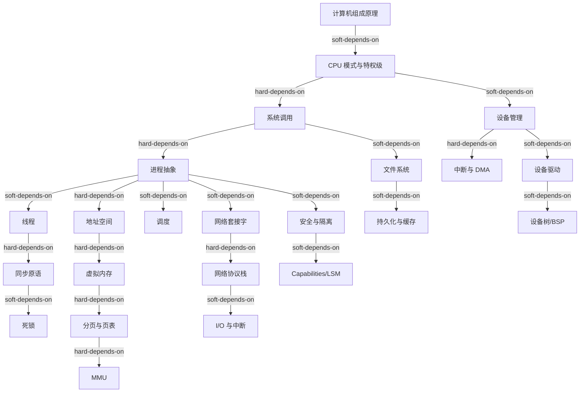
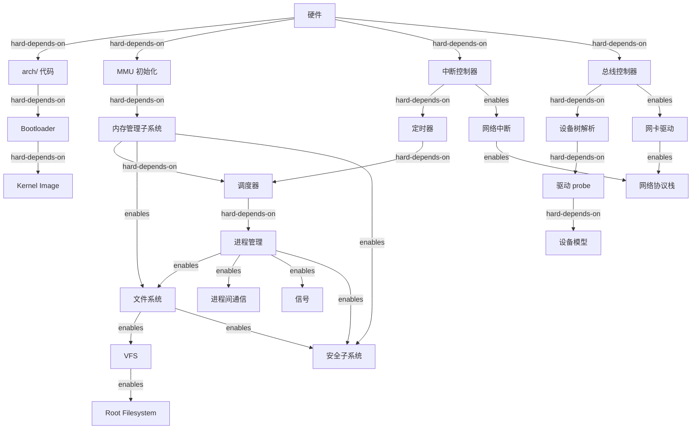
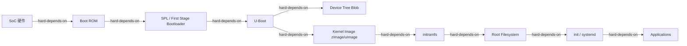
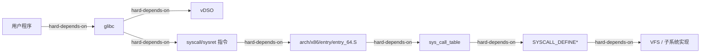
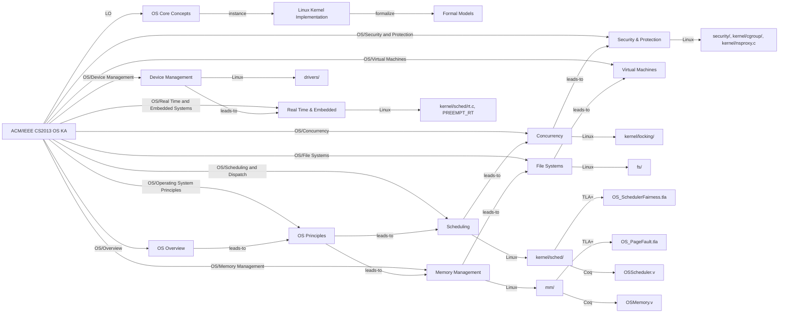

# 操作系统依赖树（OS Dependency Tree）


<!-- TOC START -->

- [操作系统依赖树（OS Dependency Tree）](#操作系统依赖树os-dependency-tree)
  - [1. 学习依赖树](#1-学习依赖树)
  - [2. 实现依赖树](#2-实现依赖树)
  - [3. 部署依赖树（嵌入式 Linux）](#3-部署依赖树嵌入式-linux)
  - [4. 系统调用实现依赖](#4-系统调用实现依赖)
  - [5. 网络数据路径依赖](#5-网络数据路径依赖)
  - [6. 关键依赖说明](#6-关键依赖说明)
  - [7. 学习路径建议](#7-学习路径建议)
    - [7.1 本科生路径](#71-本科生路径)
    - [7.2 工程师路径](#72-工程师路径)
  - [8. CS2013 学习路径 → 概念 → Linux 实现 → 形式化模型](#8-cs2013-学习路径--概念--linux-实现--形式化模型)
  - [9. 国际来源映射](#9-国际来源映射)
  - [9. 相关文件](#9-相关文件)

<!-- TOC END -->

> **权威来源**：OSTEP, ACM/IEEE CS2013 Operating Systems KA, MIT 6.S081 xv6, Stanford CS140 Pintos, CMU 15-410。
>
> **目标**：明确操作系统概念、实现与部署之间的前置-后置关系，支持学习路径与工程落地。
>
> **边类型**：
>
> - `hard-depends-on`（硬依赖）：没有前者无法实现后者
> - `soft-depends-on`（软依赖）：建议先理解前者
> - `enables`（使能）：前者使后者成为可能

---

## 1. 学习依赖树



---

## 2. 实现依赖树



---

## 3. 部署依赖树（嵌入式 Linux）



---

## 4. 系统调用实现依赖



---

## 5. 网络数据路径依赖

```mermaid
graph LR
    APP[应用 socket()] -->|hard-depends-on| SOCK[struct socket]
    SOCK -->|hard-depends-on| SK[struct sock]
    SK -->|hard-depends-on| TCP[TCP / UDP]
    TCP -->|hard-depends-on| IP[IP 层]
    IP -->|hard-depends-on| ROUTE[路由子系统]
    ROUTE -->|hard-depends-on| NEIGH[邻居子系统 ARP/ND]
    NEIGH -->|hard-depends-on| DEV[net_device]
    DEV -->|hard-depends-on| DRIVER[NIC Driver]
    DRIVER -->|hard-depends-on| DMA4[DMA Ring]
    DMA4 -->|hard-depends-on| PHY[PHY / MAC]
```

---

## 6. 关键依赖说明

| 依赖关系 | 类型 | 说明 |
|----------|------|------|
| MMU → 虚拟内存 | hard | 无 MMU 无法实现硬件地址翻译 |
| 系统调用 → 进程 | hard | 进程是系统调用调度的主体 |
| 中断 → 调度器 | hard | 调度器依赖时钟中断进行时间片管理 |
| 进程 → 线程 | soft | 线程可视为轻量级进程，建议先理解进程 |
| 文件系统 → 块设备 | hard | 持久化文件系统必须依赖块存储 |
| 网络栈 → 中断/DMA | hard | 网络数据包收发依赖 NIC 中断与 DMA |
| 设备树 → 驱动 probe | hard | 嵌入式设备发现通常依赖设备树 |
| 虚拟内存 → 安全隔离 | hard | 地址空间隔离是安全基础 |

---

## 7. 学习路径建议

### 7.1 本科生路径

1. 计算机组成原理 → CPU 模式 → 系统调用
2. 进程/线程 → 调度 → 同步 → 死锁
3. 地址空间 → 分页 → 虚拟内存
4. 文件系统 → I/O → 设备管理
5. 网络套接字 → 协议栈概览
6. 安全与隔离概念

### 7.2 工程师路径

1. 在本科路径基础上，深入 Linux 源码：
   - `kernel/sched/`、`kernel/fork.c`
   - `mm/page_alloc.c`、`mm/memory.c`
   - `fs/`、`block/`
   - `net/`、`drivers/net/`
   - `drivers/base/`、`kernel/irq/`
2. 通过 `strace`/`perf`/`bpftool` 跟踪真实系统调用与事件。
3. 阅读 `Documentation/` 与 LWN 文章。

---

## 8. CS2013 学习路径 → 概念 → Linux 实现 → 形式化模型



**说明**：

- 该依赖树将 CS2013 的学习成果（LO）映射到项目中的概念、Linux 源码实现和形式化工件。
- 每个 CS2013 知识单元对应一个或多个项目文件，最终关联到阶段四将创建的形式化模型。

---

## 9. 国际来源映射

| 依赖主题 | 来源类型 | 来源 | 位置 |
|----------|----------|------|------|
| 学习路径 | Standard | ACM/IEEE CS2013 | OS Knowledge Area |
| CS2013 → Linux → 形式化 | Course/Standard | CS2013 + MIT 6.S081 + CMU 15-410 | Learning Outcomes + xv6/Pintos projects |
| 系统启动 | Textbook | OSTEP | Ch. 1 Dialogue |
| xv6 启动 | Course | MIT 6.S081 | xv6 book Ch. 1 |
| Linux 启动 | SourceCode | Linux Kernel | init/main.c, arch/x86/ |
| 嵌入式启动 | Textbook | Embedded Linux Primer / LDD | Bootloader chapters |

---

## 9. 相关文件

- [概念树](./concept-tree-os.md)
- [属性-关系映射](./attribute-relationship-map-os.md)
- [机制组合树](./mechanism-composition-tree-os.md)
- [场景分析树 / 决策树](./scenario-analysis-tree-os.md)
