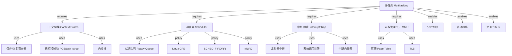
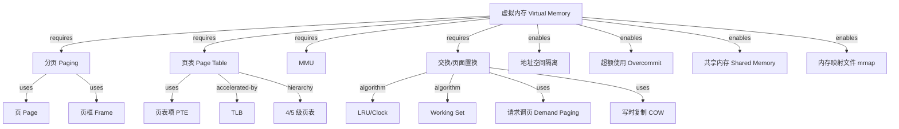
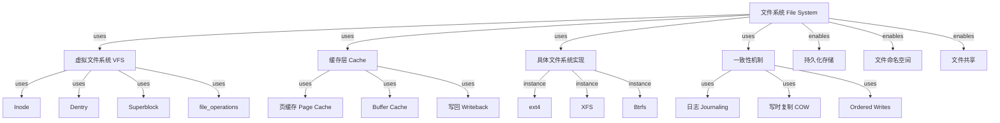
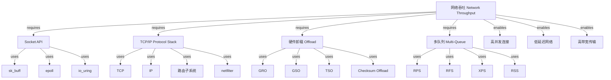
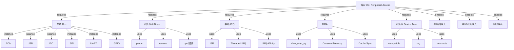
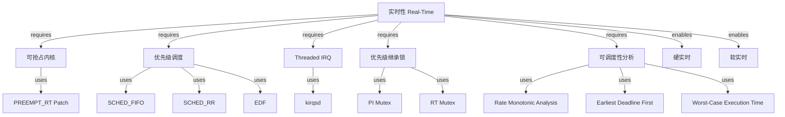
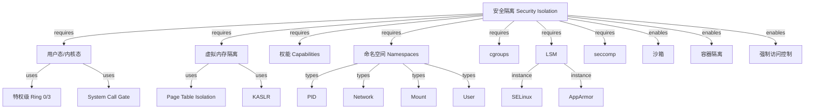

# 操作系统机制组合树（OS Mechanism Composition Tree）

<!-- TOC START -->

- [操作系统机制组合树（OS Mechanism Composition Tree）](#操作系统机制组合树os-mechanism-composition-tree)
  - [1. 多任务（Multitasking）](#1-多任务multitasking)
  - [2. 虚拟内存（Virtual Memory）](#2-虚拟内存virtual-memory)
  - [3. 文件系统持久化（File System Persistence）](#3-文件系统持久化file-system-persistence)
  - [4. 网络栈吞吐（Network Stack Throughput）](#4-网络栈吞吐network-stack-throughput)
  - [5. 外设访问（Peripheral Access）](#5-外设访问peripheral-access)
  - [6. 实时性（Real-Time）](#6-实时性real-time)
  - [7. 安全隔离（Security Isolation）](#7-安全隔离security-isolation)
  - [8. 国际来源映射](#8-国际来源映射)

<!-- TOC END -->

> **权威来源**：OSTEP, Berkeley CS162, MIT xv6, Linux Kernel Development。
>
> **目标**：解释“底层机制如何组合成系统能力/性质”，建立机制 → 子机制 → 性质 → 场景的完整链条。

---

## 1. 多任务（Multitasking）

**组合语义**：

- 上下文切换 + 调度器 + 定时器中断 → 抢占式多任务
- MMU + 页表 → 进程地址空间隔离 → 多任务安全
- 中断/陷阱 → 用户态 ↔ 内核态切换入口

---

## 2. 虚拟内存（Virtual Memory）

**组合语义**：

- 分页 + 页表 + MMU → 虚拟地址 → 物理地址翻译
- TLB → 加速地址翻译
- 请求调页 + 页面置换 → 物理内存按需使用，支持虚拟内存大于物理内存
- 写时复制 → 高效进程创建与内存共享

---

## 3. 文件系统持久化（File System Persistence）

**组合语义**：

- VFS + 具体文件系统 → 统一接口 + 多种存储格式
- 页缓存 + 写回 → 性能优化
- 日志/COW → 崩溃一致性

---

## 4. 网络栈吞吐（Network Stack Throughput）

**组合语义**：

- Socket API + sk_buff → 统一数据包抽象
- TCP/IP + 路由 + netfilter → 协议处理与策略控制
- GRO/GSO/TSO + Checksum Offload → 减少 CPU 拷贝与计算
- RPS/RFS/XPS/RSS → 多核并行处理

---

## 5. 外设访问（Peripheral Access）

**组合语义**：

- 总线 + 设备树 → 设备发现与驱动匹配
- 驱动 + 中断/DMA → 高效数据传输
- sysfs/udev → 用户态访问接口

---

## 6. 实时性（Real-Time）

---

## 7. 安全隔离（Security Isolation）

---

## 8. 国际来源映射

| 系统能力 | 关键机制 | 来源类型 | 来源 | 位置 |
|----------|----------|----------|------|------|
| 多任务 | 上下文切换、调度、中断 | Textbook | OSTEP | Ch. 4~9 |
| 虚拟内存 | 分页、页表、TLB | Textbook | OSTEP | Ch. 13~22 |
| 文件系统 | VFS、缓存、日志 | Textbook | OSTEP | Ch. 37~43 |
| 网络吞吐 | NAPI、GRO/GSO、RPS/RFS | SourceCode | Linux Kernel | net/core/, net/sched/ |
| 外设访问 | 设备树、中断、DMA | SourceCode | Linux Kernel | drivers/base/, kernel/irq/ |
| 实时性 | PREEMPT_RT、RMA/EDF | Paper/Textbook | Liu & Layland 1973; Buttazzo | - |
| 安全隔离 | namespaces/cgroups/LSM | SourceCode | Linux Kernel | kernel/nsproxy.c, kernel/cgroup/, security/ |
