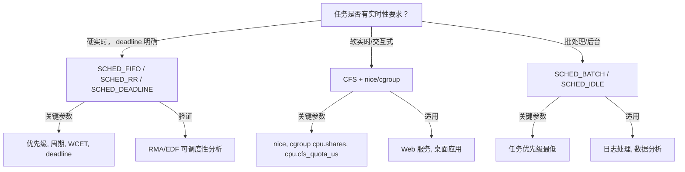
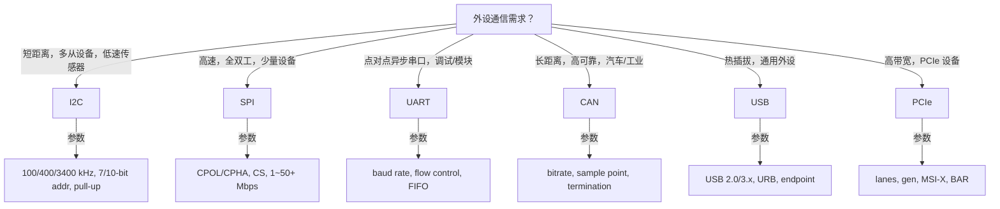
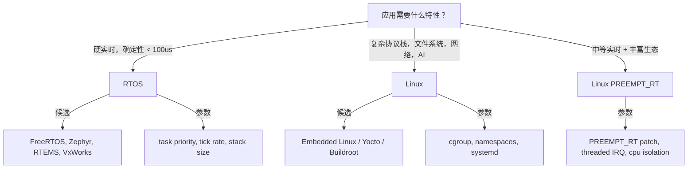
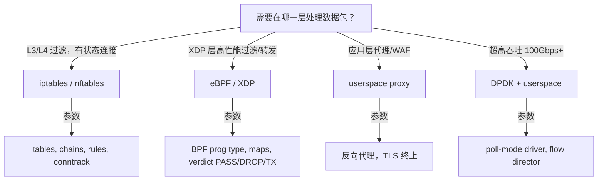
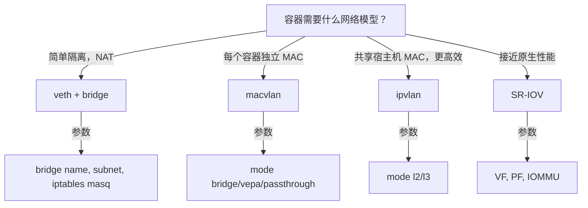
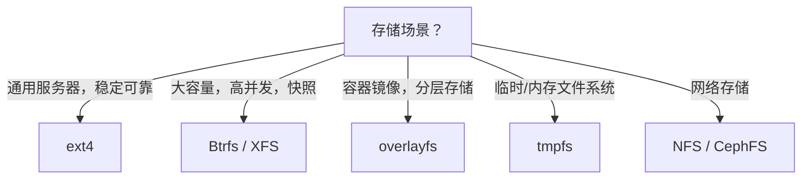

# 操作系统场景分析树 / 决策树（OS Scenario & Decision Tree）

> **权威来源**：OSTEP, Berkeley CS162, Linux Kernel Development, Brendan Gregg *BPF Performance Tools*, TCP/IP Illustrated。
>
> **目标**：把 OS 概念与机制落地到具体工程场景，提供“场景 → 约束/负载 → 候选方案 → 关键参数 → 验证指标 → 典型系统”的决策支持。

---

## 1. 高并发 I/O 多路复用决策树

```mermaid
graph TD
    Q[需要同时处理大量 I/O 事件？] -->|fd 数量 < 1024 且需跨平台| A[select / poll]
    Q -->|Linux，fd 数量大， primarily network| B[epoll]
    Q -->|高吞吐磁盘/网络，Linux 5.1+| C[io_uring]
    Q -->|内核旁路，10Gbps+| D[DPDK / RDMA]

    A -->|关键参数| A1[FD_SETSIZE, timeout]
    A -->|缺点| A2[O(n) 扫描，最大 fd 限制]

    B -->|关键参数| B1[maxevents, EPOLLET, EPOLLONESHOT]
    B -->|适用| B2[Nginx, Redis, Go netpoll]

    C -->|关键参数| C1[SQ/CQ depth, polling, registered buffers, SQPOLL]
    C -->|适用| C2[高 IOPS 存储, 高并发网络]

    D -->|关键参数| D1[hugepages, poll-mode driver, RDMA verbs]
    D -->|适用| D2[电信核心网, HPC]
```

| 场景 | 约束/负载 | 候选方案 | 关键参数 | 验证指标 | 典型系统 |
|------|-----------|----------|----------|----------|----------|
| 高并发 Web 服务器 | 10K+ 长连接，低延迟 | epoll / io_uring | `somaxconn`, `busy_poll`, `iodepth` | P99 延迟 < 10ms, 连接数 | Nginx, Envoy |
| 传统跨平台应用 | fd 少，简单可移植 | select / poll | `FD_SETSIZE`, timeout | 可移植性 | 小型工具 |
| 高 IOPS 存储服务 | 大量随机读写 | io_uring | `sq_thread_idle`, `flags=IORING_SETUP_IOPOLL` | IOPS, 99th 延迟 | ScyllaDB |
| 100Gbps 网络 | 超高吞吐，低 CPU | DPDK / RDMA | hugepages, RSS, offload | 吞吐 Gbps, CPU% | Cloudflare, HPC |

---

## 2. 调度策略决策树



| 场景 | 约束 | 方案 | 关键参数 | 验证指标 | 典型系统 |
|------|------|------|----------|----------|----------|
| 工业控制 | 硬实时，周期性 | SCHED_FIFO + PREEMPT_RT | 周期、WCET、优先级 | 100% 截止时间满足 | 机器人控制器 |
| 视频流处理 | 低延迟，可偶发丢帧 | CFS + 高 nice | `sched_latency_ns` | 帧率稳定 | FFmpeg 服务器 |
| 大数据批处理 | 吞吐优先，延迟不敏感 | SCHED_BATCH | cpu affinity | 任务完成时间 | Spark 批处理 |

---

## 3. 总线/外设选择决策树



| 场景 | 约束 | 总线 | 关键参数 | 验证指标 | 典型设备 |
|------|------|------|----------|----------|----------|
| 环境传感器阵列 | 多设备，低速，2 线 | I2C | 地址不冲突，上拉电阻 | 采样率，总线占用 | BME280, MPU6050 |
| 高速 Flash/显示屏 | 高吞吐，短距离 | SPI | CPOL/CPHA, CS, 时钟 | 读写吞吐 | W25Q128, TFT |
| GPS/蓝牙模块 | 异步串口，长距离 | UART | 波特率 9600/115200 | 数据完整性 | u-blox, HC-05 |
| 汽车 ECU 通信 | 高可靠，抗干扰 | CAN | 500 kbps, 采样点 75% | 误码率，延迟 | 汽车传感器 |
| 通用外设键盘/U盘 | 热插拔，供电 | USB | HID/MSC class, endpoint | 枚举成功率 | USB 设备 |
| 高带宽网卡/SSD | 高吞吐，DMA | PCIe | lanes x gen, MSI-X | 带宽 GB/s | NVMe SSD, NIC |

---

## 4. Linux vs RTOS 平台选择决策树



| 场景 | 约束 | 平台 | 关键参数 | 验证指标 | 典型系统 |
|------|------|------|----------|----------|----------|
| 电机控制 | < 50us 响应，确定性 | FreeRTOS/Zephyr | 任务优先级，tickless | 最坏中断延迟 | 无人机飞控 |
| 工业网关 | 多协议，边缘计算 | Linux PREEMPT_RT | `CONFIG_PREEMPT_RT`, IRQ affinity | 延迟 P99 | 工厂网关 |
| 智能摄像头 | 视频流 + AI 推理 | Embedded Linux | cgroup, GPU/NPU | 帧率，CPU% | 安防摄像头 |
| 传感器节点 | 超低功耗，简单任务 | Zephyr/FreeRTOS | tickless, PM | 功耗 uA | 环境监测节点 |

---

## 5. 网络安全路径决策树



| 场景 | 约束 | 方案 | 关键参数 | 验证指标 | 典型系统 |
|------|------|------|----------|----------|----------|
| 服务器防火墙 | 有状态过滤 | nftables | ruleset, conntrack | 吞吐, 规则数 | 服务器安全组 |
| DDoS 清洗 | 高吞吐包过滤 | XDP | BPF map 容量, batch | Mpps, CPU% | Cloudflare |
| 微服务安全 | L7 策略 | eBPF + Envoy | L7 policy | 延迟, 策略覆盖 | Istio/Cilium |
| 电信 NFV | 100Gbps+ | DPDK | hugepages, RSS | Gbps, pps | vRouter |

---

## 6. 容器网络选择决策树



| 场景 | 方案 | 关键参数 | 验证指标 | 典型系统 |
|------|------|----------|----------|----------|
| 开发测试 | veth+bridge | 子网, DNS | 连通性 | Docker 默认 |
| 需要独立 IP/MAC | macvlan | 父接口, 模式 | 广播域隔离 | 传统应用容器化 |
| 高密容器 | ipvlan | L3 模式 | 性能, ARP 表 | Kubernetes 高密度 |
| 高性能 NFV | SR-IOV | VF 数量, NUMA | 吞吐接近裸机 | Kubernetes SR-IOV CNI |

---

## 7. 文件系统选择决策树



| 场景 | 文件系统 | 关键参数 | 验证指标 | 典型系统 |
|------|----------|----------|----------|----------|
| 通用 Linux 根分区 | ext4 | journal mode, stride | 稳定, fsck 时间 | 大多数服务器 |
| 大规模数据库 | XFS | inode64, allocsize | 大文件性能 | MySQL, PostgreSQL |
| 容器运行时 | overlayfs | lowerdir/upperdir/workdir | 镜像层数, 启动时间 | Docker, containerd |
| 临时缓存 | tmpfs | size, nr_inodes | 访问延迟 | /tmp, /run |

---

## 8. 国际来源映射

| 决策主题 | 来源类型 | 来源 | 位置 |
|----------|----------|------|------|
| I/O 多路复用 | Textbook | OSTEP | Ch. 33 Event-based Concurrency |
| epoll/io_uring | SourceCode | Linux Kernel | fs/eventpoll.c, fs/io_uring.c |
| 调度策略 | Textbook | OSTEP | Ch. 7~9 |
| 实时调度 | Paper | Liu & Layland 1973 | JACM |
| 总线选择 | Datasheet | NXP I2C Spec, SPI Block Guide, USB-IF | - |
| Linux vs RTOS | Textbook | Buttazzo, Hard Real-Time Computing Systems | - |
| 网络安全 | Book | Brendan Gregg, BPF Performance Tools | Ch. Network |
| 容器网络 | SourceCode | Linux Kernel | drivers/net/veth.c, drivers/net/macvlan.c |

---

## 9. 相关文件

- [概念树](./concept-tree-os.md)
- [属性-关系映射](./attribute-relationship-map-os.md)
- [机制组合树](./mechanism-composition-tree-os.md)
- [依赖树](./dependency-tree-os.md)
- [Linux 网络栈](../06-networking/linux-network-stack.md)
- [外设总线决策树](../07-peripherals/decision-tree-peripheral-bus.md)
