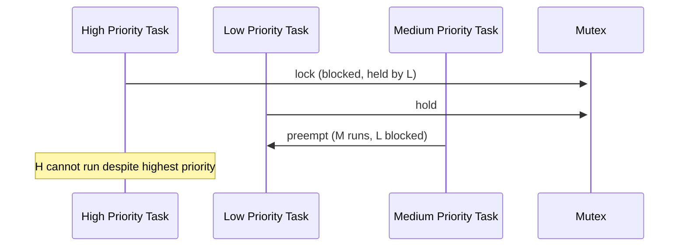

# 实时调度（Real-Time Scheduling）

<!-- TOC START -->

- [实时调度（Real-Time Scheduling）](#实时调度real-time-scheduling)
  - [1. 实时任务模型](#1-实时任务模型)
  - [2. Linux 实时调度策略](#2-linux-实时调度策略)
  - [3. 固定优先级调度与 RMS](#3-固定优先级调度与-rms)
    - [3.1 Rate Monotonic Scheduling (RMS)](#31-rate-monotonic-scheduling-rms)
    - [3.2 响应时间分析（Response Time Analysis, RTA）](#32-响应时间分析response-time-analysis-rta)
  - [4. 最早截止期限优先（EDF）](#4-最早截止期限优先edf)
    - [4.1 EDF 规则](#41-edf-规则)
    - [4.2 Linux SCHED\_DEADLINE](#42-linux-sched_deadline)
  - [5. 优先级倒置与继承](#5-优先级倒置与继承)
    - [5.1 优先级倒置（Priority Inversion）](#51-优先级倒置priority-inversion)
    - [5.2 优先级继承协议（Priority Inheritance Protocol, PIP）](#52-优先级继承协议priority-inheritance-protocol-pip)
    - [5.3 优先级天花板协议（Priority Ceiling Protocol, PCP）](#53-优先级天花板协议priority-ceiling-protocol-pcp)
  - [6. Linux PREEMPT\_RT](#6-linux-preempt_rt)
  - [7. 可调度性分析示例](#7-可调度性分析示例)
    - [7.1 RMS 示例](#71-rms-示例)
    - [7.2 EDF 示例](#72-edf-示例)
  - [8. 国际来源映射](#8-国际来源映射)
  - [9. 相关文件](#9-相关文件)

<!-- TOC END -->

> **权威来源**：POSIX.1-2024 §17, Buttazzo *Hard Real-Time Computing Systems*, Liu & Layland 1973, Linux Kernel Documentation (PREEMPT_RT)。
>
> **目标**：系统梳理实时调度概念、Linux 实现、可调度性分析与优先级倒置机制。

---

## 1. 实时任务模型

| 属性 | 符号 | 说明 |
|------|------|------|
| 周期 | T_i | 任务两次释放之间的时间间隔 |
| 截止时间 | D_i | 任务必须完成的时间（相对或绝对） |
| 最坏执行时间 | C_i / WCET_i | 任务单次执行所需最大 CPU 时间 |
| 利用率 | U_i = C_i / T_i | 任务占用 CPU 的比例 |
| 释放时间 | r_i | 任务实例被激活的时间 |
| 响应时间 | R_i | 从释放到完成的时间 |

实时任务分类：

- **硬实时（Hard Real-Time）**：错过截止时间是系统失败
- **软实时（Soft Real-Time）**：偶尔错过 deadline 可接受，但性能下降
- **固实时（Firm Real-Time）**：错过 deadline 的结果无价值，但不造成系统失败

---

## 2. Linux 实时调度策略

| 策略 | 名称 | 特点 | Linux 源码 |
|------|------|------|------------|
| `SCHED_FIFO` | First-In-First-Out | 非抢占式同优先级运行，直到阻塞或主动让出 | `kernel/sched/rt.c` |
| `SCHED_RR` | Round Robin | 同优先级时间片轮转 | `kernel/sched/rt.c` |
| `SCHED_DEADLINE` | Earliest Deadline First | 基于 CBS 的 EDF，支持调度预算/周期/截止期限 | `kernel/sched/deadline.c` |

调度类优先级：


---

## 3. 固定优先级调度与 RMS

### 3.1 Rate Monotonic Scheduling (RMS)

- **规则**：周期越短，优先级越高
- **最优性**：在固定优先级抢占调度中，RMS 是最优的静态优先级分配
- **可调度性条件**：

$$
\sum_{i=1}^{n} \frac{C_i}{T_i} \le n(2^{1/n} - 1)
$$

当 n → ∞ 时，边界趋近于 ln 2 ≈ 0.693。

### 3.2 响应时间分析（Response Time Analysis, RTA）

对于固定优先级任务集，任务 τ_i 的最坏响应时间：

$$
R_i = C_i + \sum_{j \in hp(i)} \left\lceil \frac{R_i}{T_j} \right\rceil C_j
$$

通过迭代求解，若 R_i ≤ D_i，则任务可调度。

---

## 4. 最早截止期限优先（EDF）

### 4.1 EDF 规则

- **规则**：绝对截止时间最早的任务优先级最高
- **最优性**：在单处理器上，EDF 是最优动态优先级算法
- **可调度性条件**（当 D_i = T_i 时）：

$$
\sum_{i=1}^{n} \frac{C_i}{T_i} \le 1
$$

### 4.2 Linux SCHED_DEADLINE

`SCHED_DEADLINE` 使用 Constant Bandwidth Server (CBS) 实现 EDF：

| 参数 | 说明 |
|------|------|
| `runtime` | 每个周期内可运行的 CPU 时间 |
| `deadline` | 相对截止期限 |
| `period` | 任务周期 |

```c
struct sched_attr {
    __u32 size;
    __u32 sched_policy;
    __u64 sched_flags;
    __s32 sched_nice;
    __u32 sched_priority;
    __u64 sched_runtime;
    __u64 sched_deadline;
    __u64 sched_period;
};
```

---

## 5. 优先级倒置与继承

### 5.1 优先级倒置（Priority Inversion）

低优先级任务持有高优先级任务所需的资源，导致高优先级任务被阻塞。



### 5.2 优先级继承协议（Priority Inheritance Protocol, PIP）

- 当低优先级任务阻塞高优先级任务时，低优先级任务临时继承高优先级任务的优先级
- Linux `rt_mutex` 和 `PTHREAD_PRIO_INHERIT` mutex 支持 PIP

### 5.3 优先级天花板协议（Priority Ceiling Protocol, PCP）

- 每个资源有一个优先级天花板（所有可能访问该资源的任务中最高优先级）
- 任务获取资源时，优先级提升到天花板
- 可完全避免死锁和链式阻塞

---

## 6. Linux PREEMPT_RT

PREEMPT_RT 补丁将 Linux 改造为更接近 RTOS 的实时系统：

| 改动 | 说明 |
|------|------|
| 线程化中断 | 大多数 ISR 作为内核线程运行，可被抢占 |
| rt_mutex 替代 spinlock | 优先级继承、可睡眠 |
| 高精度定时器 | 微秒级定时精度 |
| CPU isolation | `isolcpus` 隔离实时任务 CPU |
| IRQ affinity | 将中断绑定到特定 CPU |

```bash
# 典型 PREEMPT_RT 配置
CONFIG_PREEMPT_RT=y
CONFIG_HIGH_RES_TIMERS=y
CONFIG_NO_HZ_FULL=y
CONFIG_IRQ_FORCED_THREADING=y
```

---

## 7. 可调度性分析示例

### 7.1 RMS 示例

任务集：

| 任务 | 周期 T | 执行时间 C | 利用率 U |
|------|--------|------------|----------|
| τ1 | 10 | 3 | 0.30 |
| τ2 | 15 | 4 | 0.267 |
| τ3 | 30 | 5 | 0.167 |

总利用率：0.30 + 0.267 + 0.167 = 0.734

RMS 边界（n=3）：3(2^(1/3) - 1) ≈ 0.780

0.734 ≤ 0.780，因此该任务集在 RMS 下可调度。

### 7.2 EDF 示例

同一任务集：

总利用率：0.734 ≤ 1

因此在 EDF 下也可调度。

---

## 8. 国际来源映射

| 概念 | 来源类型 | 来源 | 位置 |
|------|----------|------|------|
| POSIX 实时调度 | Standard | POSIX.1-2024 | §17 |
| RMS / EDF | Paper | Liu & Layland, 1973 | JACM |
| 实时系统 | Textbook | Buttazzo | *Hard Real-Time Computing Systems* |
| Linux RT | SourceCode | Linux Kernel | `kernel/sched/rt.c`, `kernel/sched/deadline.c` |
| PREEMPT_RT | Project | Linux Foundation | <https://wiki.linuxfoundation.org/realtime/> |

---

## 9. 相关文件

- [进程调度](02-process-scheduling.md)
- [Linux 进程调度](../05-linux-kernel/process-scheduling-linux.md)
- [POSIX 与 Linux 实现映射](../08-interfaces/posix-mapping.md)
- [实时运行时语义](../../2.8%20系统运行时语义/2.8.8%20实时运行时语义.md)
