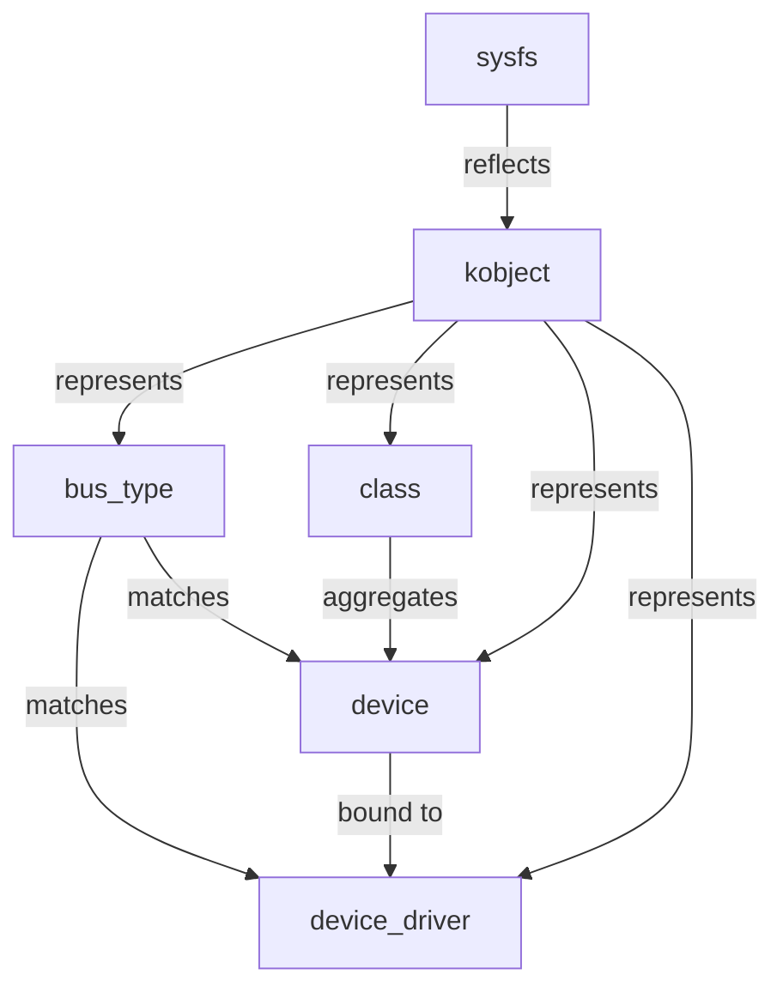

# Linux 设备与驱动


<!-- TOC START -->

- [Linux 设备与驱动](#linux-设备与驱动)
  - [1. Linux 设备模型](#1-linux-设备模型)
    - [1.1 核心数据结构](#11-核心数据结构)
    - [1.2 注册流程](#12-注册流程)
  - [2. 字符设备](#2-字符设备)
  - [3. 块设备](#3-块设备)
  - [4. 平台设备与设备树](#4-平台设备与设备树)
    - [4.1 平台驱动](#41-平台驱动)
    - [4.2 设备树匹配](#42-设备树匹配)
    - [4.3 解析设备树](#43-解析设备树)
  - [5. 中断与 DMA](#5-中断与-dma)
  - [6. sysfs 与 udev](#6-sysfs-与-udev)
  - [7. 场景分析](#7-场景分析)
  - [8. 术语表](#8-术语表)
  - [9. 相关文件](#9-相关文件)
  - [国际权威来源链接 / Authoritative Sources](#国际权威来源链接--authoritative-sources)

<!-- TOC END -->

> **权威来源**：Linux Device Drivers (Corbet, Rubini, Kroah-Hartman), Linux Kernel Development, ARM Devicetree Specification。
>
> **目标**：深入 Linux 设备模型、设备树、总线驱动、字符/块/网络设备、DMA、中断。

---

## 1. Linux 设备模型



### 1.1 核心数据结构

| 数据结构 | 源码 | 说明 |
|----------|------|------|
| `struct bus_type` | `include/linux/device/bus.h` | 总线类型 |
| `struct device` | `include/linux/device.h` | 设备 |
| `struct device_driver` | `include/linux/device/driver.h` | 驱动 |
| `struct class` | `include/linux/device/class.h` | 设备类 |
| `struct kobject` | `include/linux/kobject.h` | sysfs 基础对象 |

### 1.2 注册流程

```text
driver_register()
  ↓ bus_add_driver()
    ↓ 遍历总线上未绑定设备
      ↓ bus->match(dev, drv)
        ↓ 匹配成功 → driver->probe(dev)
```

---

## 2. 字符设备

| 概念 | 说明 |
|------|------|
| `alloc_chrdev_region()` | 动态分配设备号 |
| `cdev_init()` / `cdev_add()` | 注册字符设备 |
| `file_operations` | open/read/write/ioctl/mmap |
| `register_chrdev()` | 旧接口 |

---

## 3. 块设备

| 概念 | 说明 |
|------|------|
| `struct block_device` | 块设备描述 |
| `struct gendisk` | 通用磁盘 |
| `struct request_queue` | I/O 请求队列 |
| `submit_bio()` | 提交 bio |
| `blk_mq` | Multi-Queue Block Layer |

---

## 4. 平台设备与设备树

### 4.1 平台驱动

```c
static struct platform_driver my_driver = {
    .probe = my_probe,
    .remove = my_remove,
    .driver = {
        .name = "my_device",
        .of_match_table = my_of_match,
    },
};
```

### 4.2 设备树匹配

```c
static const struct of_device_id my_of_match[] = {
    { .compatible = "vendor,my-device" },
    { },
};
```

### 4.3 解析设备树

| API | 说明 |
|-----|------|
| `of_find_node_by_path()` | 按路径找节点 |
| `of_property_read_u32()` | 读取 u32 属性 |
| `of_property_read_string()` | 读取字符串属性 |
| `platform_get_irq()` | 获取中断号 |
| `devm_platform_ioremap_resource()` | 映射 IO 资源 |

---

## 5. 中断与 DMA

| API | 说明 |
|-----|------|
| `request_irq()` | 注册中断 |
| `request_threaded_irq()` | 注册 threaded IRQ |
| `devm_request_irq()` | 托管式中断注册 |
| `dma_alloc_coherent()` | 分配一致性 DMA 内存 |
| `dma_map_sg()` | 映射 scatterlist |
| `dmaengine_prep_slave_sg()` | 准备 DMA 传输 |

---

## 6. sysfs 与 udev

| 路径 | 说明 |
|------|------|
| `/sys/bus/` | 总线列表 |
| `/sys/devices/` | 设备树 |
| `/sys/class/` | 按类组织 |
| `/sys/dev/block/` / `/sys/dev/char/` | 主次设备号映射 |
| `udev` | 根据 sysfs 事件创建 `/dev` 节点 |

---

## 7. 场景分析

| 场景 | 关键机制 | 关键参数 | 验证指标 |
|------|----------|----------|----------|
| 新传感器接入 | platform/i2c/spi driver + device tree | compatible, reg, interrupts | probe 成功，数据正确 |
| 高性能存储 | blk-mq + NVMe driver | queue depth, NUMA | IOPS, 延迟 |
| 串口设备 | tty/serial driver | baud rate, FIFO | 数据完整性 |
| USB 热插拔 | usbcore + udev | VID/PID, class driver | 枚举成功率 |

---

## 8. 术语表

| 中文 | 英文 | 一句话定义 |
|------|------|------------|
| 设备模型 | Linux Device Model | 总线-设备-驱动-类的统一抽象 |
| 字符设备 | Character Device | 字节流访问设备 |
| 块设备 | Block Device | 按块随机访问设备 |
| 平台设备 | Platform Device | 非总线型嵌入式设备 |
| 设备树 | Device Tree | 描述硬件配置的数据结构 |
| udev | udev | 用户态设备管理器，创建 /dev 节点 |
| sysfs | sysfs | 内核对象到 /sys 的映射 |

---

## 9. 相关文件

- [Linux 内核源码映射](./linux-source-map.md)
- [外设概念树](../07-peripherals/peripheral-concept-tree.md)
- [中断与 DMA](../07-peripherals/interrupts-and-dma.md)
- [HAL/BSP/设备树](../08-interfaces/hal-bsp-device-tree.md)

## 国际权威来源链接 / Authoritative Sources

- [Linux Kernel - Driver API documentation](https://docs.kernel.org/driver-api/)
- [Linux Device Drivers (LDD3)](https://static.lwn.net/images/pdf/LDD3/ch00.pdf)
- [Linux Kernel - Device Tree Bindings](https://docs.kernel.org/devicetree/bindings/)
- [Linux Kernel - DMAEngine](https://docs.kernel.org/driver-api/dmaengine/)
