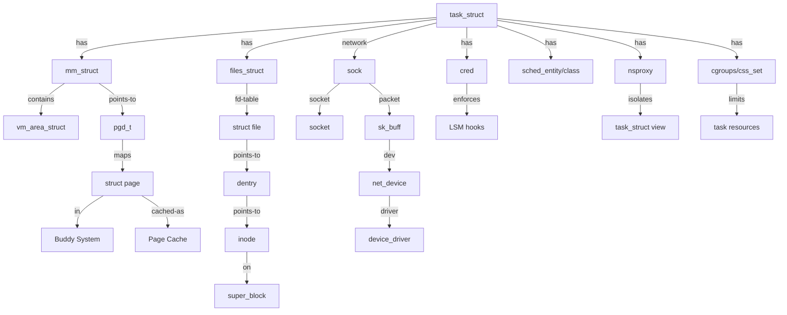

<!-- 创建理由：Linux 内核实现层需要独立的属性-关系映射，描述 task_struct、mm_struct、VFS、sk_buff、device 等核心数据结构的属性与关系。 -->

# Linux 内核属性-关系映射（Linux Kernel Attribute-Relationship Mapping）

<!-- TOC START -->

- [Linux 内核属性-关系映射（Linux Kernel Attribute-Relationship Mapping）](#linux-内核属性-关系映射linux-kernel-attribute-relationship-mapping)
  - [1. 进程管理：task\_struct](#1-进程管理task_struct)
  - [2. 调度：sched\_entity / sched\_class](#2-调度sched_entity--sched_class)
  - [3. 内存管理：mm\_struct / VMA / Page](#3-内存管理mm_struct--vma--page)
  - [4. 文件系统：VFS 核心结构](#4-文件系统vfs-核心结构)
  - [5. 网络：socket / sock / sk\_buff / net\_device](#5-网络socket--sock--sk_buff--net_device)
  - [6. 设备与驱动：device / device\_driver / bus](#6-设备与驱动device--device_driver--bus)
  - [7. 安全与隔离：cred / LSM / namespace / cgroup](#7-安全与隔离cred--lsm--namespace--cgroup)
  - [8. 关系总图](#8-关系总图)
  - [9. 国际来源映射](#9-国际来源映射)
  - [10. 相关文件](#10-相关文件)

<!-- TOC END -->

> **权威来源**：Linux Kernel Documentation, The Linux man-pages Project, Robert Love *Linux Kernel Development*, Michael Kerrisk *The Linux Programming Interface*。
>
> **目标**：为 Linux 内核核心数据结构建立可检索的属性集与关系集，支撑源码阅读和跨层映射。

---

## 1. 进程管理：task_struct

| 概念 | 属性/关系 | 类型/取值 | 说明与约束 |
|------|-----------|-----------|------------|
| task_struct | pid | pid_t (ℕ) | 进程唯一标识 |
| task_struct | tgid | pid_t (ℕ) | 线程组 ID |
| task_struct | state | {TASK_RUNNING, TASK_INTERRUPTIBLE, TASK_UNINTERRUPTIBLE, __TASK_STOPPED, EXIT_ZOMBIE, EXIT_DEAD} | 任务状态 |
| task_struct | mm | mm_struct* | 用户态内存描述符；内核线程为 NULL |
| task_struct | active_mm | mm_struct* | 内核线程借用的 mm |
| task_struct | sched_class | sched_class* | 调度类：fair/rt/dl/stop/idle |
| task_struct | se | sched_entity | CFS 调度实体 |
| task_struct | rt | sched_rt_entity | RT 调度实体 |
| task_struct | dl | sched_dl_entity | DL 调度实体 |
| task_struct | nsproxy | nsproxy* | 命名空间代理 |
| task_struct | cgroups | css_set* | cgroup 子系统状态集合 |
| task_struct | real_cred | cred* | 真实凭证 |
| task_struct | cred | cred* | 有效凭证 |
| task_struct | files | files_struct* | 打开文件表 |
| task_struct | signal | signal_struct* | 信号处理结构 |

---

## 2. 调度：sched_entity / sched_class

| 概念 | 属性/关系 | 类型/取值 | 说明与约束 |
|------|-----------|-----------|------------|
| sched_entity | vruntime | u64 | CFS 虚拟运行时间 |
| sched_entity | load | struct load_weight | 权重，与 nice 对应 |
| sched_entity | on_rq | int | 是否在运行队列上 |
| sched_rt_entity | run_list | struct list_head | RT 运行队列链表节点 |
| sched_rt_entity | timeout | unsigned int | RT 时间片超时计数 |
| sched_rt_entity | nr_cpus_allowed | int | 允许运行的 CPU 数 |
| sched_dl_entity | dl_deadline | u64 | 绝对截止时间 |
| sched_dl_entity | dl_runtime | u64 | 每个周期运行预算 |
| sched_dl_entity | dl_period | u64 | 周期 |
| sched_class | enqueue_task | function | 入队函数指针 |
| sched_class | dequeue_task | function | 出队函数指针 |
| sched_class | pick_next_task | function | 选择下一个任务 |
| sched_class | task_tick | function | 时钟滴答处理 |

---

## 3. 内存管理：mm_struct / VMA / Page

| 概念 | 属性/关系 | 类型/取值 | 说明与约束 |
|------|-----------|-----------|------------|
| mm_struct | pgd | pgd_t* | 页全局目录（物理地址） |
| mm_struct | mmap | vm_area_struct* | VMA 链表头 |
| mm_struct | mm_rb | rb_root | VMA 红黑树根 |
| mm_struct | total_vm | unsigned long | 总虚拟内存页数 |
| mm_struct | locked_vm | unsigned long | 锁定页数 |
| mm_struct | arg_start / arg_end | unsigned long | 命令行参数区域 |
| vm_area_struct | vm_start / vm_end | unsigned long | 虚拟地址范围 |
| vm_area_struct | vm_mm | mm_struct* | 所属 mm |
| vm_area_struct | vm_page_prot | pgprot_t | 页保护属性 |
| vm_area_struct | vm_flags | unsigned long | VMA 标志（VM_READ/WRITE/EXEC） |
| vm_area_struct | vm_ops | vm_operations_struct* | VMA 操作表 |
| struct page | flags | unsigned long | 页框标志 |
| struct page | _refcount | atomic_t | 引用计数 |
| struct page | _mapcount | atomic_t | 映射计数 |
| struct page | lru | struct list_head | LRU 链表节点 |

---

## 4. 文件系统：VFS 核心结构

| 概念 | 属性/关系 | 类型/取值 | 说明与约束 |
|------|-----------|-----------|------------|
| inode | i_ino | unsigned long | inode 号 |
| inode | i_mode | umode_t | 文件类型与权限 |
| inode | i_uid / i_gid | kuid_t / kgid_t | 所有者 |
| inode | i_size | loff_t | 文件大小 |
| inode | i_blocks | blkcnt_t | 占用块数 |
| inode | i_op | inode_operations* | inode 操作 |
| inode | i_fop | file_operations* | 文件操作 |
| inode | i_sb | super_block* | 所属超级块 |
| dentry | d_name | qstr | 文件名 |
| dentry | d_parent | dentry* | 父目录项 |
| dentry | d_inode | inode* | 对应 inode |
| dentry | d_subdirs | list_head | 子目录链表 |
| super_block | s_type | file_system_type* | 文件系统类型 |
| super_block | s_root | dentry* | 根目录项 |
| super_block | s_op | super_operations* | 超级块操作 |
| file | f_pos | loff_t | 当前读写位置 |
| file | f_op | file_operations* | 文件操作 |
| file | private_data | void* | 私有数据 |

---

## 5. 网络：socket / sock / sk_buff / net_device

| 概念 | 属性/关系 | 类型/取值 | 说明与约束 |
|------|-----------|-----------|------------|
| socket | type | enum sock_type | SOCK_STREAM/DGRAM/RAW |
| socket | state | enum ss_state | SS_FREE/LISTEN/CONNECTED |
| socket | ops | proto_ops* | 协议操作表 |
| socket | sk | sock* | 关联 sock |
| sock | sk_family | u16 | AF_INET/AF_INET6/AF_UNIX |
| sock | sk_protocol | u16 | IPPROTO_TCP/UDP |
| sock | sk_state | u8 | TCP 状态等 |
| sock | sk_rcvbuf / sk_sndbuf | int | 接收/发送缓冲区大小 |
| sk_buff | data | unsigned char* | 数据指针 |
| sk_buff | len | unsigned int | 数据长度 |
| sk_buff | protocol | __be16 | 协议类型 |
| sk_buff | dev | net_device* | 出入设备 |
| net_device | name | char[IFNAMSIZ] | 接口名 |
| net_device | mtu | unsigned int | 最大传输单元 |
| net_device | flags | unsigned int | IFF_UP/IFF_RUNNING 等 |
| net_device | netdev_ops | net_device_ops* | 设备操作 |
| net_device | priv_flags | u32 | 私有标志 |

---

## 6. 设备与驱动：device / device_driver / bus

| 概念 | 属性/关系 | 类型/取值 | 说明与约束 |
|------|-----------|-----------|------------|
| device | parent | device* | 父设备 |
| device | bus | bus_type* | 所属总线 |
| device | driver | device_driver* | 绑定驱动 |
| device | of_node | device_node* | Device Tree 节点 |
| device | dma_mask | u64* | DMA 地址掩码 |
| device_driver | name | char* | 驱动名 |
| device_driver | bus | bus_type* | 所属总线 |
| device_driver | probe | int (*)(device*) | 探测函数 |
| device_driver | remove | int (*)(device*) | 移除函数 |
| bus_type | name | char* | 总线名 |
| bus_type | match | int (*)(device*, device_driver*) | 匹配函数 |
| bus_type | probe | int (*)(device*) | 总线探测 |

---

## 7. 安全与隔离：cred / LSM / namespace / cgroup

| 概念 | 属性/关系 | 类型/取值 | 说明与约束 |
|------|-----------|-----------|------------|
| cred | uid / gid | kuid_t / kgid_t | 真实用户/组 ID |
| cred | euid / egid | kuid_t / kgid_t | 有效用户/组 ID |
| cred | fsuid / fsgid | kuid_t / kgid_t | 文件系统 UID/GID |
| cred | cap_inheritable / cap_permitted / cap_effective | kernel_cap_t | 权能集合 |
| nsproxy | mnt_ns / uts_ns / ipc_ns / net_ns / pid_ns_for_children / user_ns / cgroup_ns / time_ns | namespace* | 命名空间指针 |
| css_set | subsys | cgroup_subsys_state*[] | 各 cgroup 子系统状态 |
| cgroup | root | cgroup_root* | cgroup 层级根 |
| cgroup | kn | cgroup_kn* | kernfs 节点 |
| security_hook_list | hook | union security_list_options | LSM hook 函数 |
| security_hook_list | lsm | char* | LSM 名称 |
| seccomp_filter | len | unsigned short | 过滤规则长度 |
| seccomp_filter | insns | struct sock_filter* | BPF 指令数组 |

---

## 8. 关系总图

---

## 9. 国际来源映射

| 概念 | 来源类型 | 来源 | 位置 | 状态 |
|------|----------|------|------|------|
| task_struct | SourceCode | Linux Kernel | include/linux/sched.h | 已覆盖 |
| mm_struct / VMA | SourceCode | Linux Kernel | include/linux/mm_types.h | 已覆盖 |
| VFS 结构 | SourceCode | Linux Kernel | include/linux/fs.h | 已覆盖 |
| socket / sock / sk_buff | SourceCode | Linux Kernel | include/linux/net.h, include/linux/skbuff.h | 已覆盖 |
| device / driver / bus | SourceCode | Linux Kernel | include/linux/device.h | 已覆盖 |
| cred / LSM | SourceCode | Linux Kernel | include/linux/cred.h, include/linux/security.h | 已覆盖 |
| 系统调用语义 | Reference | Linux man-pages | Section 2/3 | 已覆盖 |

---

## 10. 相关文件

- [Linux 概念树](./linux-concept-tree.md)
- [Linux 机制组合树](./linux-mechanism-composition-tree.md)
- [Linux 依赖树](./linux-dependency-tree.md)
- [Linux 场景分析树](./linux-scenario-analysis-tree.md)
- [Linux 源码地图](./linux-source-map.md)
