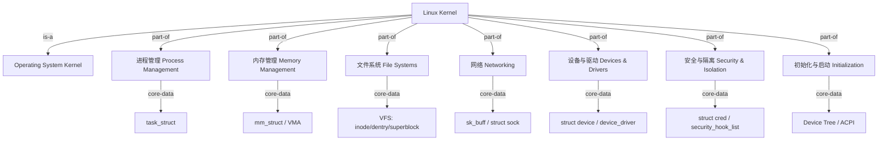
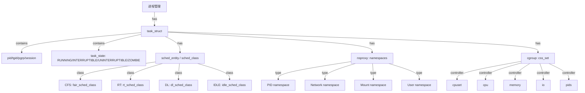
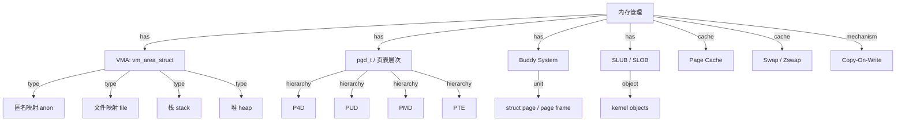
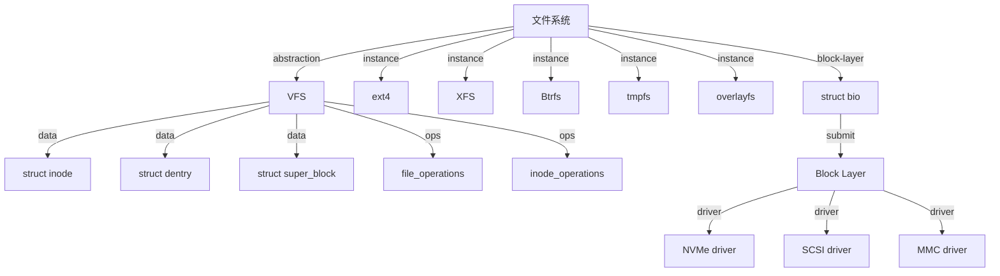
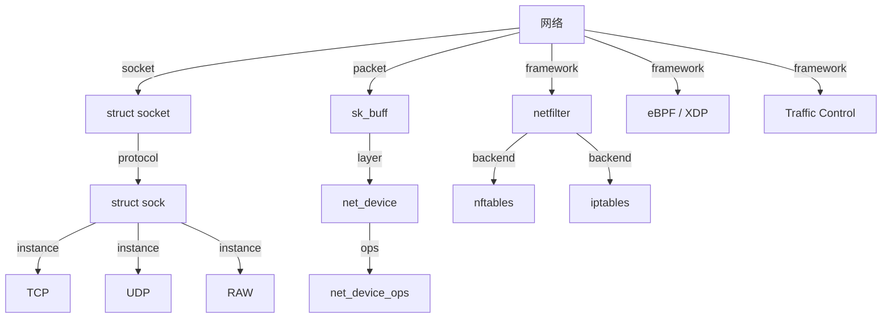
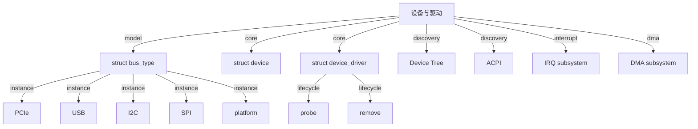
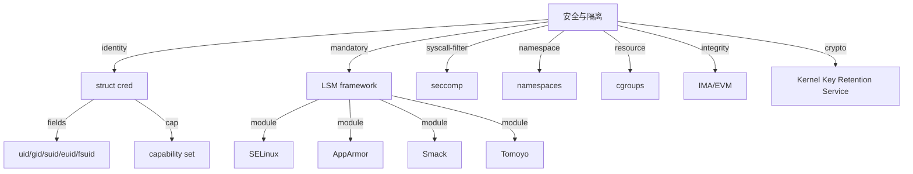

<!-- 创建理由：Linux 内核实现层需要独立的概念树，将通用 OS 概念映射到 Linux 专有数据结构、子系统和源码目录。 -->

# Linux 内核概念树（Linux Kernel Concept Tree）

<!-- TOC START -->

- [Linux 内核概念树（Linux Kernel Concept Tree）](#linux-内核概念树linux-kernel-concept-tree)
  - [1. 顶层概念树](#1-顶层概念树)
  - [2. 进程管理子树](#2-进程管理子树)
  - [3. 内存管理子树](#3-内存管理子树)
  - [4. 文件系统子树](#4-文件系统子树)
  - [5. 网络子树](#5-网络子树)
  - [6. 设备与驱动子树](#6-设备与驱动子树)
  - [7. 安全与隔离子树](#7-安全与隔离子树)
  - [8. 国际来源映射](#8-国际来源映射)
  - [9. 相关文件](#9-相关文件)

<!-- TOC END -->

> **权威来源**：Linux Kernel Documentation, The Linux man-pages Project, Michael Kerrisk *The Linux Programming Interface*, Robert Love *Linux Kernel Development*。
>
> **目标**：建立 Linux 内核实现层的概念体系，将通用 OS 概念落地为 Linux 专有数据结构、子系统和源码目录。

---

## 1. 顶层概念树

---

## 2. 进程管理子树

---

## 3. 内存管理子树

---

## 4. 文件系统子树

---

## 5. 网络子树

---

## 6. 设备与驱动子树

---

## 7. 安全与隔离子树

---

## 8. 国际来源映射

| 概念域 | 来源类型 | 来源 | 位置 | 状态 |
|--------|----------|------|------|------|
| task_struct / 调度类 | SourceCode | Linux Kernel | include/linux/sched.h, kernel/sched/ | 已覆盖 |
| 内存管理 / VMA / 页表 | SourceCode | Linux Kernel | include/linux/mm_types.h, mm/ | 已覆盖 |
| VFS | SourceCode | Linux Kernel | fs/ | 已覆盖 |
| 网络子系统 | SourceCode | Linux Kernel | net/ | 已覆盖 |
| 设备模型 | SourceCode | Linux Kernel | drivers/base/ | 已覆盖 |
| LSM / capabilities | SourceCode | Linux Kernel | security/, include/linux/cred.h | 已覆盖 |
| 系统调用语义 | Reference | Linux man-pages | Section 2/3 | 已覆盖 |
| 内核开发 | Textbook | Robert Love, *Linux Kernel Development* | 3rd Ed. | 已覆盖 |

---

## 9. 相关文件

- [Linux 属性-关系映射](./linux-attribute-relationship-map.md)
- [Linux 机制组合树](./linux-mechanism-composition-tree.md)
- [Linux 依赖树](./linux-dependency-tree.md)
- [Linux 场景分析树](./linux-scenario-analysis-tree.md)
- [Linux 源码地图](./linux-source-map.md)
- [通用 OS 概念树](../00-concept-atlas/concept-tree-os.md)
