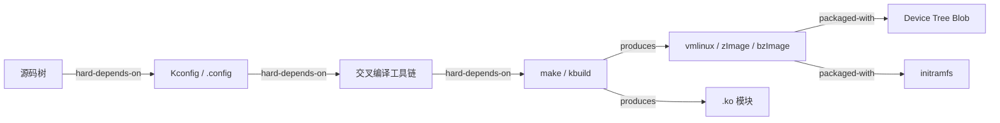
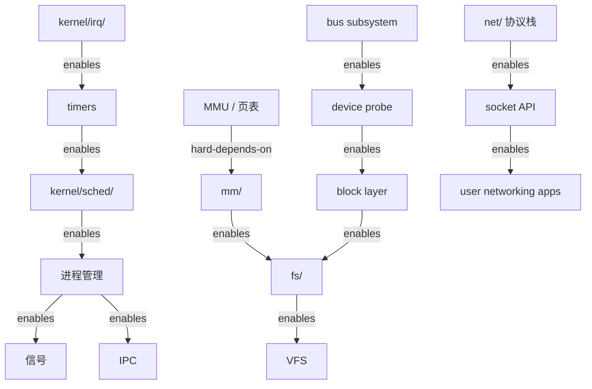
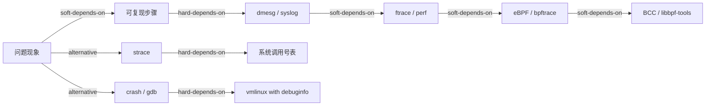

<!-- 创建理由：Linux 内核实现层需要独立的依赖树，描述源码、配置、构建、启动和调试的前置-后置关系。 -->

# Linux 内核依赖树（Linux Kernel Dependency Tree）

<!-- TOC START -->

- [Linux 内核依赖树（Linux Kernel Dependency Tree）](#linux-内核依赖树linux-kernel-dependency-tree)
  - [1. 源码学习依赖树](#1-源码学习依赖树)
  - [2. 配置与构建依赖树](#2-配置与构建依赖树)
  - [3. 启动时初始化依赖树](#3-启动时初始化依赖树)
  - [4. 子系统实现依赖树](#4-子系统实现依赖树)
  - [5. 调试与性能分析依赖树](#5-调试与性能分析依赖树)
  - [6. 关键依赖说明](#6-关键依赖说明)
  - [7. 国际来源映射](#7-国际来源映射)
  - [8. 相关文件](#8-相关文件)

<!-- TOC END -->

> **权威来源**：Linux Kernel Documentation, Robert Love *Linux Kernel Development*, Linux man-pages, kernel.org。
>
> **目标**：明确 Linux 内核源码学习、配置构建、启动初始化、子系统实现与调试分析的前置-后置关系。
>
> **边类型**：
>
> - `hard-depends-on`：没有前者无法实现后者
> - `soft-depends-on`：建议先理解前者
> - `enables`：前者使后者成为可能

---

## 1. 源码学习依赖树

```mermaid
graph TD
    C[C 语言与汇编基础] -->|hard-depends-on| ARCH[arch/ 启动与体系结构]
    C -->|hard-depends-on| DATA[内核数据结构]
    DATA -->|soft-depends-on| LOCK[锁与同步原语]

    ARCH -->|soft-depends-on| BOOT[start_kernel()]
    BOOT -->|hard-depends-on| MM[mm/ 内存管理]
    BOOT -->|hard-depends-on| SCHED[kernel/sched/ 调度]

    SCHED -->|soft-depends-on| PM[kernel/fork.c / exit.c 进程管理]
    PM -->|soft-depends-on| FS[fs/ 文件系统]
    PM -->|soft-depends-on| SIGNAL[kernel/signal.c]

    MM -->|soft-depends-on| FS
    FS -->|soft-depends-on| BLOCK[块层 / block/]
    BLOCK -->|soft-depends-on| DRIVERS[drivers/ 设备驱动]

    DRIVERS -->|soft-depends-on| IRQ[kernel/irq/ 中断子系统]
    IRQ -->|soft-depends-on| DMA[DMA 子系统]

    PM -->|soft-depends-on| NET[net/ 网络]
    NET -->|soft-depends-on| NETDRV[drivers/net/ 网卡驱动]

    PM -->|soft-depends-on| SEC[security/ 安全]
    SEC -->|soft-depends-on| CG[kernel/cgroup/ cgroups]
    CG -->|soft-depends-on| NS[kernel/nsproxy.c namespaces]
```

---

## 2. 配置与构建依赖树



---

## 3. 启动时初始化依赖树

```mermaid
graph LR
    BOOTROM[Boot ROM] -->|loads| BOOTLOADER[Bootloader / U-Boot / GRUB]
    BOOTLOADER -->|loads| KERNEL[Kernel Image]
    KERNEL -->|uncompress| START[start_kernel()]
    START -->|initializes| MMU[MMU / paging]
    MMU -->|initializes| MEMMGR[内存管理子系统]
    MEMMGR -->|initializes| SCHED2[调度器]
    SCHED2 -->|initializes| INITCALL[initcalls]
    INITCALL -->|initializes| DRIVERS2[设备驱动]
    DRIVERS2 -->|probes| ROOTFS[Root Filesystem]
    ROOTFS -->|executes| INIT[init / systemd]
```

---

## 4. 子系统实现依赖树



---

## 5. 调试与性能分析依赖树



---

## 6. 关键依赖说明

| 依赖关系 | 类型 | 说明 |
|----------|------|------|
| MMU → 内存管理 | hard | 无 MMU 初始化则无法建立页表和虚拟内存 |
| 调度器 → 进程管理 | hard | 进程创建后需调度器投入运行 |
| 中断 → 定时器 → 调度器 | hard | 调度器依赖时钟中断进行时间片管理 |
| VFS → 具体文件系统 | hard | VFS 抽象需底层文件系统实现 |
| 块层 → 设备驱动 | hard | 块设备 I/O 需驱动提交给硬件 |
| namespaces → cgroups | soft | 容器隔离通常同时使用，但技术独立 |
| ftrace → eBPF | soft | ftrace 是理解内核动态的基础，eBPF 在此基础上提供更复杂分析 |

---

## 7. 国际来源映射

| 依赖主题 | 来源类型 | 来源 | 位置 |
|----------|----------|------|------|
| 源码结构 | SourceCode | Linux Kernel | <https://docs.kernel.org/> |
| 启动流程 | SourceCode | Linux Kernel | init/main.c, arch/*/kernel/head*.S |
| 构建系统 | SourceCode | Linux Kernel | Documentation/kbuild/ |
| 调试工具 | Book | Brendan Gregg, *BPF Performance Tools* | - |
| 内核开发 | Textbook | Robert Love, *Linux Kernel Development* | 3rd Ed. |

---

## 8. 相关文件

- [Linux 概念树](./linux-concept-tree.md)
- [Linux 属性-关系映射](./linux-attribute-relationship-map.md)
- [Linux 机制组合树](./linux-mechanism-composition-tree.md)
- [Linux 场景分析树](./linux-scenario-analysis-tree.md)
- [Linux 源码地图](./linux-source-map.md)
