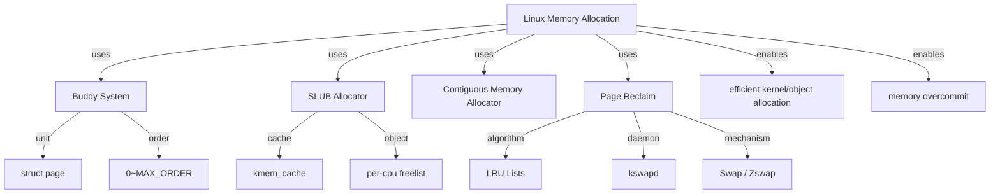
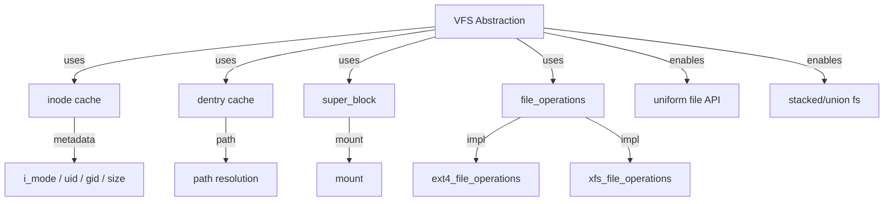
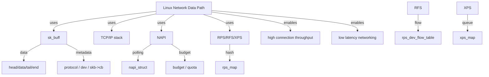
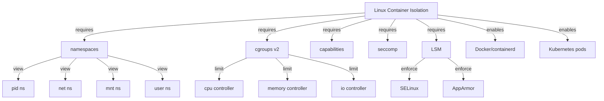

<!-- 创建理由：Linux 内核实现层需要独立的机制组合树，解释 Linux 特有机制（如 CFS、SLUB、VFS、netfilter、cgroup）如何组合成系统能力。 -->

# Linux 内核机制组合树（Linux Kernel Mechanism Composition Tree）

<!-- TOC START -->

- [Linux 内核机制组合树（Linux Kernel Mechanism Composition Tree）](#linux-内核机制组合树linux-kernel-mechanism-composition-tree)
  - [1. CFS 公平调度](#1-cfs-公平调度)
  - [2. 内存分配与回收](#2-内存分配与回收)
  - [3. VFS 与文件系统抽象](#3-vfs-与文件系统抽象)
  - [4. 网络数据路径](#4-网络数据路径)
  - [5. 设备发现与驱动绑定](#5-设备发现与驱动绑定)
  - [6. 容器隔离](#6-容器隔离)
  - [7. 国际来源映射](#7-国际来源映射)
  - [8. 相关文件](#8-相关文件)

<!-- TOC END -->

> **权威来源**：Linux Kernel Documentation, Robert Love *Linux Kernel Development*, Linux man-pages, kernel.org。
>
> **目标**：解释 Linux 内核底层机制如何组合成系统能力/性质。

---

## 1. CFS 公平调度

```mermaid
graph TD
    CFS[CFS Fair Scheduling] -->|requires| RBTREE[Red-Black Tree: vruntime ordered]
    CFS -->|requires| LOAD[Load Weight]
    CFS -->|requires| VRUNTIME[vruntime accounting]
    CFS -->|requires| TICK[scheduler tick]

    LOAD -->|derived-from| NICE[nice value]
    VRUNTIME -->|updated-by| UPDATE_CURR[update_curr()]
    TICK -->|driven-by| HRTIMER[hrtimer / tick]

    CFS -->|enables| FAIRNESS[CPU time fairness]
    CFS -->|enables| INTERACTIVE[interactive task responsiveness]
```

**组合语义**：

- 红黑树按 vruntime 排序 → 选择最小 vruntime 任务运行
- nice 值转换为权重 → 调整 CPU 时间份额
- scheduler tick 更新 vruntime → 实现抢占

---

## 2. 内存分配与回收



**组合语义**：

- Buddy System 管理物理页框，支持 2^order 连续页分配
- SLUB 基于 kmem_cache 快速分配/释放同尺寸内核对象
- LRU + kswapd 实现后台页面回收

---

## 3. VFS 与文件系统抽象



**组合语义**：

- inode/dentry/super_block 抽象不同文件系统的共性
- file_operations 提供统一接口，底层由具体文件系统实现
- page cache 缓存文件数据，提升 I/O 性能

---

## 4. 网络数据路径



**组合语义**：

- sk_buff 作为统一数据包描述符贯穿协议栈
- NAPI 混合中断与轮询，提升高吞吐下的 CPU 效率
- RPS/RFS/XPS 将数据包处理分布到多核

---

## 5. 设备发现与驱动绑定

```mermaid
graph TD
    DEV[Linux Device Model] -->|uses| BUS[bus_type]
    DEV -->|uses| DEVICE[struct device]
    DEV -->|uses| DRIVER[struct device_driver]
    DEV -->|uses| DT[Device Tree / ACPI]

    BUS -->|match| MATCH[bus->match()]
    DEVICE -->|of_node| OF[Device Tree node]
    DRIVER -->|compatible| COMPAT[of_match_table]

    DEV -->|lifecycle| PROBE[driver->probe()]
    DEV -->|lifecycle| REMOVE[driver->remove()]

    DEV -->|enables| HOTPLUG[hotplug / sysfs]
    DEV -->|enables| PM[power management]
```

**组合语义**：

- Device Tree / ACPI 提供硬件描述
- bus->match() + of_match_table 匹配设备与驱动
- sysfs 暴露设备层次结构，支持 udev 热插拔

---

## 6. 容器隔离



**组合语义**：

- namespaces 隔离进程视图
- cgroups 限制资源使用
- Capabilities + seccomp 裁剪特权与系统调用
- LSM 提供强制访问控制

---

## 7. 国际来源映射

| 系统能力 | 关键机制 | 来源类型 | 来源 | 位置 |
|----------|----------|----------|------|------|
| CFS 调度 | vruntime / RB-tree | SourceCode | Linux Kernel | kernel/sched/fair.c |
| 内存分配 | Buddy / SLUB | SourceCode | Linux Kernel | mm/page_alloc.c, mm/slub.c |
| VFS | inode/dentry/super_block | SourceCode | Linux Kernel | fs/ |
| 网络数据路径 | sk_buff / NAPI / RPS | SourceCode | Linux Kernel | net/core/, net/sched/ |
| 设备模型 | bus/device/driver | SourceCode | Linux Kernel | drivers/base/ |
| 容器隔离 | namespaces/cgroups/seccomp/LSM | SourceCode | Linux Kernel | kernel/nsproxy.c, kernel/cgroup/, security/ |

---

## 8. 相关文件

- [Linux 概念树](./linux-concept-tree.md)
- [Linux 属性-关系映射](./linux-attribute-relationship-map.md)
- [Linux 依赖树](./linux-dependency-tree.md)
- [Linux 场景分析树](./linux-scenario-analysis-tree.md)
- [Linux 源码地图](./linux-source-map.md)
