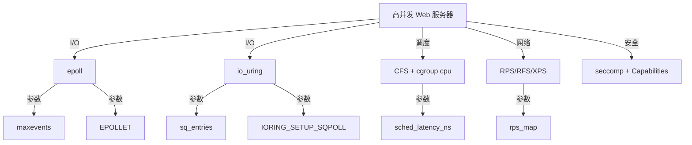
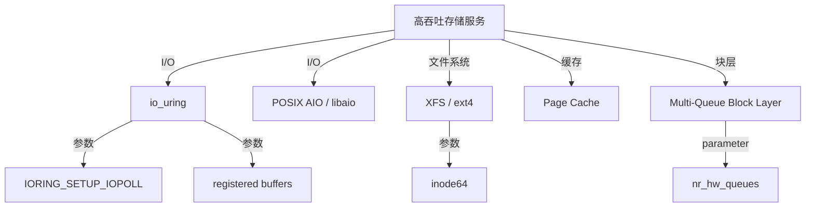
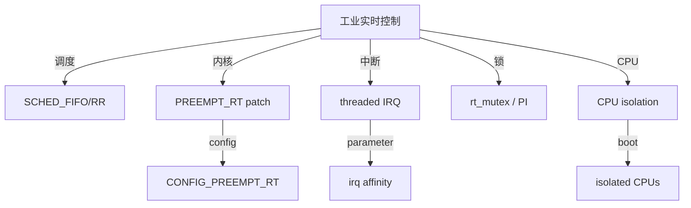
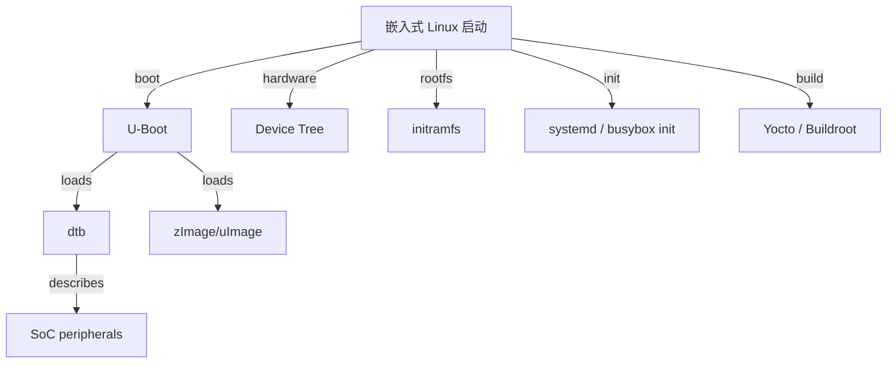
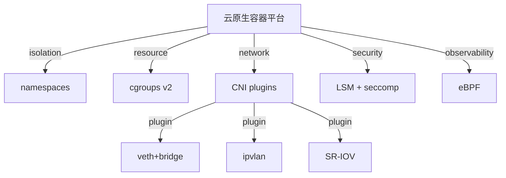
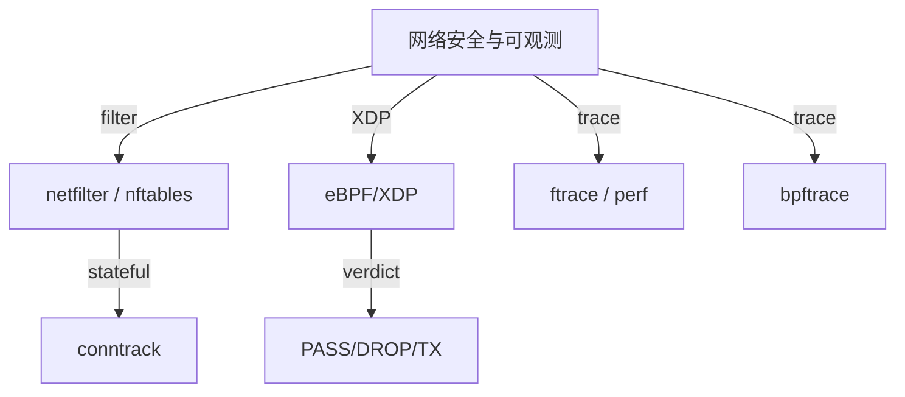

<!-- 创建理由：Linux 内核实现层需要独立的场景分析树，将 Linux 特有机制落地到高并发服务、实时系统、嵌入式启动、云原生容器等具体工程场景。 -->

# Linux 内核场景分析树（Linux Kernel Scenario Analysis Tree）

<!-- TOC START -->

- [Linux 内核场景分析树（Linux Kernel Scenario Analysis Tree）](#linux-内核场景分析树linux-kernel-scenario-analysis-tree)
  - [1. 高并发 Web 服务器](#1-高并发-web-服务器)
  - [2. 高吞吐存储服务](#2-高吞吐存储服务)
  - [3. 工业实时控制（Linux PREEMPT_RT）](#3-工业实时控制linux-preempt_rt)
  - [4. 嵌入式 Linux 启动](#4-嵌入式-linux-启动)
  - [5. 云原生容器平台](#5-云原生容器平台)
  - [6. 网络安全与可观测](#6-网络安全与可观测)
  - [7. 国际来源映射](#7-国际来源映射)
  - [8. 相关文件](#8-相关文件)

<!-- TOC END -->

> **权威来源**：Linux Kernel Documentation, Brendan Gregg *BPF Performance Tools*, Robert Love *Linux Kernel Development*, Michael Kerrisk *The Linux Programming Interface*, Jens Axboe io_uring paper。
>
> **目标**：把 Linux 内核机制落地到具体工程场景，提供“场景 → 负载特征 → 机制选择 → 关键参数 → 验证指标 → 典型系统”的决策支持。

---

## 1. 高并发 Web 服务器

| 场景 | 负载特征 | 机制选择 | 关键参数 | 验证指标 | 典型系统 |
|------|----------|----------|----------|----------|----------|
| 高并发 Web 服务器 | 10K+ 长连接，低延迟 | epoll / io_uring + CFS + RPS | `somaxconn`, `busy_poll`, `iodepth`, `sched_latency_ns` | P99 延迟 < 10ms, 连接数, 吞吐 | Nginx, Envoy, Caddy |
| 高并发 API 网关 | 短连接，高 QPS | io_uring + SO_REUSEPORT + XPS | `sq_entries`, `xps_map` | RPS, CPU%, P99 延迟 | Envoy, Kong |

---

## 2. 高吞吐存储服务

| 场景 | 负载特征 | 机制选择 | 关键参数 | 验证指标 | 典型系统 |
|------|----------|----------|----------|----------|----------|
| 高 IOPS KV 存储 | 大量随机读写 | io_uring + XFS + NVMe | `IORING_SETUP_IOPOLL`, `sq_thread_idle`, `nr_hw_queues` | IOPS, 99th 延迟 | ScyllaDB, RocksDB |
| 日志/流存储 | 顺序写，高吞吐 | ext4 + NOOP/MQ-Deadline + Page Cache | `journal_mode`, `dirty_ratio` | 写入吞吐, fsync 延迟 | Kafka, Pulsar |

---

## 3. 工业实时控制（Linux PREEMPT_RT）

| 场景 | 负载特征 | 机制选择 | 关键参数 | 验证指标 | 典型系统 |
|------|----------|----------|----------|----------|----------|
| 工业机器人控制 | 周期性硬实时任务，< 100us 延迟 | PREEMPT_RT + SCHED_FIFO + cpu isolation | `CONFIG_PREEMPT_RT`, `isolcpus`, IRQ affinity | 调度延迟 P99, 截止时间满足率 | KUKA, Siemens PLC |
| 数控机床 | 多轴同步，确定性 | SCHED_DEADLINE + threaded IRQ | runtime, period, deadline |  worst-case latency | LinuxCNC |

---

## 4. 嵌入式 Linux 启动

| 场景 | 负载特征 | 机制选择 | 关键参数 | 验证指标 | 典型系统 |
|------|----------|----------|----------|----------|----------|
| 工业网关 | 多协议，边缘计算 | Buildroot/Yocto + systemd + cgroup | boot time, rootfs size | 启动时间 < 10s | 工厂网关 |
| 智能摄像头 | 视频流 + AI 推理 | Yocto + GPU/NPU driver + cgroup | memory limit, GPU scheduling | 帧率, CPU% | 安防摄像头 |
| 车载信息娱乐 | 快速启动，多媒体 | Android Automotive + initramfs | boot animation time | 冷启动时间 | 车机系统 |

---

## 5. 云原生容器平台

| 场景 | 负载特征 | 机制选择 | 关键参数 | 验证指标 | 典型系统 |
|------|----------|----------|----------|----------|----------|
| Kubernetes 工作节点 | 高密度容器，资源隔离 | cgroups v2 + namespaces + CNI | `cpu.cfs_quota_us`, `memory.limit_in_bytes` | 容器密度, 资源利用率 | Kubernetes |
| 微服务网格 | L7 策略，可观测 | eBPF + Cilium/Calico | BPF map size, conntrack | 策略覆盖, P99 延迟 | Istio + Cilium |
| Serverless 运行时 | 快速启动，强隔离 | runc + seccomp + user namespace | seccomp profile, startup time | 冷启动时间, 隔离强度 | containerd, firecracker |

---

## 6. 网络安全与可观测

| 场景 | 负载特征 | 机制选择 | 关键参数 | 验证指标 | 典型系统 |
|------|----------|----------|----------|----------|----------|
| 云防火墙 | 有状态过滤，高吞吐 | nftables + conntrack | ruleset size, hash size | 吞吐, 连接数 | AWS Security Group |
| DDoS 清洗 | 高 Mpps 包过滤 | XDP/eBPF | BPF map capacity, batch size | Mpps, CPU% | Cloudflare |
| 网络故障排查 | 包级/流级追踪 | tcpdump + ftrace + bpftrace | probe points, sampling rate | 定位时间, 开销 | 任何 Linux 服务器 |

---

## 7. 国际来源映射

| 场景 | 来源类型 | 来源 | 位置 |
|------|----------|------|------|
| epoll/io_uring | SourceCode | Linux Kernel | fs/eventpoll.c, fs/io_uring.c |
| io_uring paper | Paper | Jens Axboe, 2020 | <https://kernel.dk/io_uring.pdf> |
| PREEMPT_RT | SourceCode | Linux Kernel | <https://wiki.linuxfoundation.org/realtime/> |
| 嵌入式启动 | Textbook | *Embedded Linux Primer* / *Linux Device Drivers* | Bootloader chapters |
| 容器隔离 | Standard | OCI Runtime Spec | <https://github.com/opencontainers/runtime-spec> |
| eBPF/XDP | SourceCode | Linux Kernel | Documentation/bpf/ |

---

## 8. 相关文件

- [Linux 概念树](./linux-concept-tree.md)
- [Linux 属性-关系映射](./linux-attribute-relationship-map.md)
- [Linux 机制组合树](./linux-mechanism-composition-tree.md)
- [Linux 依赖树](./linux-dependency-tree.md)
- [Linux 源码地图](./linux-source-map.md)
