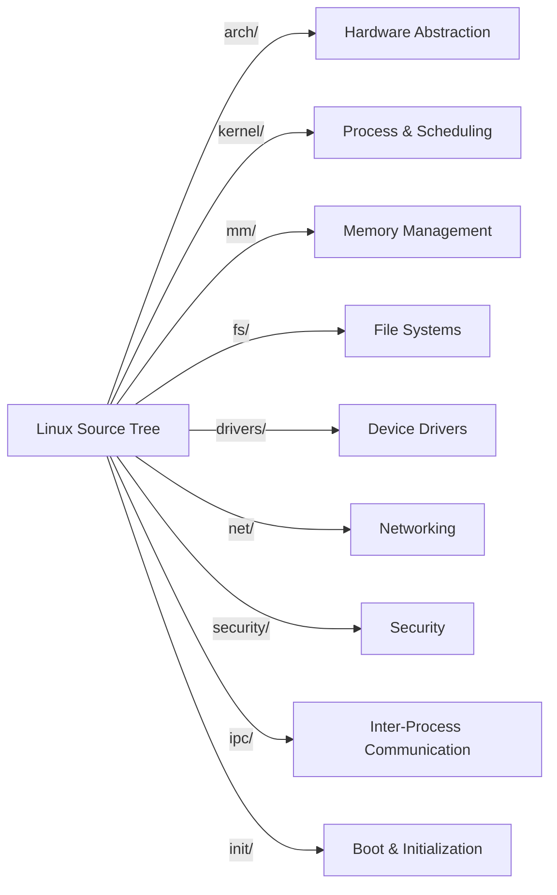
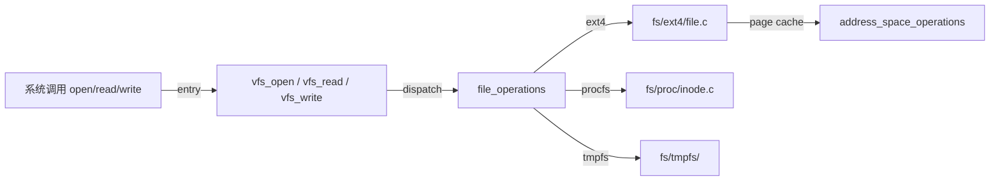
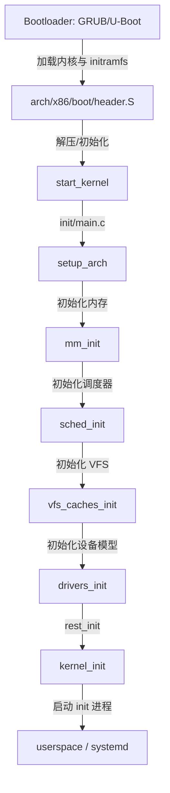

# Linux 内核源码与子系统映射

> **权威来源**：Linux Kernel Development (Robert Love), kernel.org Documentation, LWN.net, Linux 源码树 `Documentation/`。
>
> **目标**：把操作系统抽象概念锚定到 Linux 内核的具体源码目录、核心数据结构、关键函数与系统调用，建立“概念 → 实现 → 源码入口”的工程师级映射。

---

## 1. 内核源码顶层目录映射

| Linux 目录 | OS 概念域 | 核心职责 | 关键子目录/文件 |
|------------|-----------|----------|-----------------|
| `arch/` | 硬件抽象 | 架构相关代码：启动、中断、页表、系统调用入口 | `arch/x86/`, `arch/arm64/`, `arch/riscv/` |
| `kernel/` | 进程管理、调度、同步 | 进程生命周期、调度器、信号、定时器、锁 | `kernel/sched/`, `kernel/fork.c`, `kernel/signal.c` |
| `mm/` | 内存管理 | 虚拟内存、页分配、slab、swap、hugetlb | `mm/page_alloc.c`, `mm/vmscan.c`, `mm/slab.c` |
| `fs/` | 文件系统 | VFS、具体文件系统、页缓存、文件锁 | `fs/vfs/`, `fs/ext4/`, `fs/proc/`, `fs/sysfs/` |
| `drivers/` | 设备管理 | 设备驱动模型、各类硬件驱动 | `drivers/base/`, `drivers/net/`, `drivers/block/` |
| `net/` | 网络子系统 | 协议栈、套接字、路由、netfilter | `net/core/`, `net/ipv4/`, `net/unix/` |
| `ipc/` | 进程间通信 | 信号量、消息队列、共享内存 | `ipc/sem.c`, `ipc/msg.c`, `ipc/shm.c` |
| `security/` | 安全 | LSM 框架、SELinux、AppArmor、capabilities | `security/selinux/`, `security/apparmor/`, `security/commoncap.c` |
| `init/` | 启动流程 | 内核初始化、start_kernel | `init/main.c` |
| `block/` | 块 I/O | 块层、I/O 调度、请求队列 | `block/elevator.c`, `block/blk-mq.c` |
| `crypto/` | 加密 | 内核加密 API | `crypto/api.c` |
| `virt/` | 虚拟化 | KVM、hypervisor 支持 | `virt/kvm/` |
| `include/` | 头文件 | 内核 API、数据结构定义 | `include/linux/sched.h`, `include/linux/fs.h` |
| `scripts/` | 构建工具 | Kconfig、编译脚本 | `scripts/kconfig/` |



---

## 2. 进程管理实现映射

### 2.1 核心数据结构

| 概念 | Linux 数据结构 | 源码文件 | 关键字段说明 |
|------|----------------|----------|--------------|
| 进程/线程描述符 | `struct task_struct` | `include/linux/sched.h` | `pid`, `tgid`, `state`, `mm`, `files`, `signal`, `sched_class` |
| 调度实体 | `struct sched_entity` | `kernel/sched/sched.h` | `vruntime`, `load`, `run_node`（CFS 红黑树节点） |
| 调度类 | `struct sched_class` | `kernel/sched/sched.h` | `enqueue_task`, `dequeue_task`, `pick_next_task` |
| 进程地址空间 | `struct mm_struct` | `include/linux/mm_types.h` | `pgd`, `mmap`, `rss`, `total_vm` |
| 文件描述符表 | `struct files_struct` | `include/linux/fdtable.h` | `fdt`, `fd_array` |
| 信号处理 | `struct signal_struct` | `include/linux/sched/signal.h` | `shared_pending`, `action[]` |

### 2.2 关键函数与系统调用

| 概念 | 系统调用/函数 | 源码位置 | 说明 |
|------|---------------|----------|------|
| 创建进程 | `fork()` / `clone()` / `vfork()` | `kernel/fork.c` | `do_fork()` → `_do_fork()` → `copy_process()` |
| 执行新程序 | `execve()` | `fs/exec.c` | `do_execve()` → `load_binary()` |
| 进程退出 | `exit()` | `kernel/exit.c` | `do_exit()` 释放资源，进入 zombie |
| 等待子进程 | `wait4()` / `waitpid()` | `kernel/exit.c` | `do_wait()` |
| 调度入口 | `schedule()` | `kernel/sched/core.c` | 主动或被动让出 CPU |
| CFS 选下一个任务 | `pick_next_task_fair()` | `kernel/sched/fair.c` | 红黑树最左节点最小 vruntime |
| 实时调度 | `pick_next_task_rt()` | `kernel/sched/rt.c` | SCHED_FIFO / SCHED_RR |
| 线程本地存储 | `set_tid_address()` | `kernel/fork.c` | clone 标志与 TLS 设置 |

### 2.3 调度类层次

```mermaid
graph TD
    SCHED[schedule()] -->|优先级递减| RT[SCHED_FIFO / SCHED_RR]
    SCHED -->|优先级递减| CFS2[SCHED_NORMAL / SCHED_BATCH / SCHED_IDLE]
    SCHED -->|优先级递减| DL[SCHED_DEADLINE]
    RT -->|implementation| RT_SCHED[kernel/sched/rt.c]
    CFS2 -->|implementation| FAIR_SCHED[kernel/sched/fair.c]
    DL -->|implementation| DL_SCHED[kernel/sched/deadline.c]
```

---

## 3. 内存管理实现映射

### 3.1 核心数据结构

| 概念 | Linux 数据结构 | 源码文件 | 关键字段说明 |
|------|----------------|----------|--------------|
| 页描述符 | `struct page` | `include/linux/mm_types.h` | `_refcount`, `_mapcount`, `flags`, `private` |
| 内存区域 | `struct vm_area_struct` | `include/linux/mm_types.h` | `vm_start`, `vm_end`, `vm_mm`, `vm_flags`, `vm_ops` |
| 地址空间 | `struct mm_struct` | `include/linux/mm_types.h` | `pgd`, `mmap`, `rss`, `pgtables_bytes` |
| 页表项 | `pte_t` / `pmd_t` / `pud_t` | 架构相关头文件 | 物理页框号 + 标志位 |
| 内存节点 | `struct pglist_data` | `include/linux/mmzone.h` | `node_zones`, `node_mem_map`（NUMA） |
| 内存区 | `struct zone` | `include/linux/mmzone.h` | `free_area`, `watermark`, `pageset` |

### 3.2 关键函数与算法

| 概念 | 函数/文件 | 源码位置 | 说明 |
|------|-----------|----------|------|
| 物理页分配 | `alloc_pages()` / `__alloc_pages()` | `mm/page_alloc.c` | 伙伴系统核心 |
| 物理页释放 | `free_pages()` | `mm/page_alloc.c` | 合并伙伴块 |
| slab 分配器 | `kmem_cache_alloc()` / `kmalloc()` | `mm/slub.c` | 小对象高速分配 |
| 缺页异常 | `do_page_fault()` | `arch/x86/mm/fault.c` | 处理用户态/内核态缺页 |
| 请求调页 | `handle_mm_fault()` | `mm/memory.c` | `__handle_mm_fault()` 遍历页表 |
| 页面回收 | `shrink_lruvec()` | `mm/vmscan.c` | LRU 页面扫描与回收 |
| 交换区 | `swap_readpage()` / `swap_writepage()` | `mm/page_io.c` | 换入/换出 |
| 大页 | `hugetlbfs` | `fs/hugetlbfs/`, `mm/hugetlb.c` | 透明大页 THP 在 `mm/huge_memory.c` |
| NUMA 平衡 | `numa balancing` | `mm/mempolicy.c`, `kernel/sched/fair.c` | 跨节点页迁移 |

### 3.3 地址空间布局（x86-64）

```
高地址
├─ Kernel Space (128 TiB ~ 256 TiB，取决于配置)
│   ├─ Direct mapping of physical memory
│   ├─ vmalloc / ioremap 区域
│   └─ Kernel text / data / bss
│
├─ User Space (0 ~ 128 TiB)
│   ├─ Stack
│   ├─ Memory Mapping Segment (mmap, libraries)
│   ├─ Heap
│   ├─ BSS
│   ├─ Data
│   └─ Text
低地址
```

---

## 4. 文件系统实现映射

### 4.1 VFS 核心数据结构

| 概念 | Linux 数据结构 | 源码文件 | 关键字段说明 |
|------|----------------|----------|--------------|
| 超级块 | `struct super_block` | `include/linux/fs.h` | `s_type`, `s_root`, `s_op`, `s_bdev` |
| 索引节点 | `struct inode` | `include/linux/fs.h` | `i_ino`, `i_mode`, `i_sb`, `i_op`, `i_mapping` |
| 目录项缓存 | `struct dentry` | `include/linux/dcache.h` | `d_name`, `d_inode`, `d_parent`, `d_subdirs` |
| 打开文件 | `struct file` | `include/linux/fs.h` | `f_inode`, `f_op`, `f_pos`, `private_data` |
| 文件操作 | `struct file_operations` | `include/linux/fs.h` | `open`, `read`, `write`, `mmap`, `ioctl` |
| 地址空间 | `struct address_space` | `include/linux/fs.h` | `page_tree`, `a_ops`（页缓存操作） |

### 4.2 关键函数与系统调用

| 概念 | 系统调用/函数 | 源码位置 | 说明 |
|------|---------------|----------|------|
| 打开文件 | `openat()` | `fs/open.c` | `do_sys_open()` → `path_openat()` |
| 读文件 | `read()` | `fs/read_write.c` | `vfs_read()` → `file->f_op->read_iter()` |
| 写文件 | `write()` | `fs/read_write.c` | `vfs_write()` → `file->f_op->write_iter()` |
| 关闭文件 | `close()` | `fs/open.c` | `filp_close()` |
| 路径解析 | `link_path_walk()` | `fs/namei.c` | 路径名 → dentry |
| 页缓存读 | `generic_file_read_iter()` | `mm/filemap.c` |  buffered I/O 默认实现 |
| 页缓存写 | `generic_file_write_iter()` | `mm/filemap.c` | 标记 dirty 页，由 pdflush/writeback 刷盘 |
| 文件系统注册 | `register_filesystem()` | `fs/filesystems.c` | 注册 `struct file_system_type` |

### 4.3 VFS 调用链



---

## 5. 设备管理实现映射

### 5.1 Linux 设备模型

| 概念 | 数据结构 | 源码位置 | 说明 |
|------|----------|----------|------|
| 总线 | `struct bus_type` | `include/linux/device/bus.h` | `match`, `probe`, `remove` |
| 设备 | `struct device` | `include/linux/device.h` | `parent`, `bus`, `driver`, `knode_class` |
| 驱动 | `struct device_driver` | `include/linux/device/driver.h` | `name`, `bus`, `probe`, `remove` |
| 设备类 | `struct class` | `include/linux/device/class.h` | 聚合同类设备，生成 /dev/ 节点 |
| 平台设备 | `struct platform_device` | `include/linux/platform_device.h` | 非总线型嵌入式设备 |

### 5.2 关键源码

| 概念 | 源码位置 | 说明 |
|------|----------|------|
| 设备模型核心 | `drivers/base/core.c` | `device_register()`, `driver_register()` |
| 平台总线 | `drivers/base/platform.c` | `platform_driver_register()` |
| sysfs 实现 | `fs/sysfs/` | 内核对象到 /sys 的映射 |
| uevent / udev | `lib/kobject_uevent.c` | 热插拔事件通知 |
| 中断注册 | `kernel/irq/manage.c` | `request_irq()` / `request_threaded_irq()` |
| DMA 映射 | `kernel/dma/mapping.c` | `dma_alloc_coherent()` |

### 5.3 设备树映射

| 概念 | Linux 数据结构 | 源码位置 | 说明 |
|------|----------------|----------|------|
| 设备树节点 | `struct device_node` | `include/linux/of.h` | DTB 解析后的节点 |
| 属性 | `struct property` | `include/linux/of.h` | `name`, `value`, `length` |
| 匹配驱动 | `of_match_table` | 驱动代码中 | `compatible` 字符串匹配 |
| 解析 API | `of_get_property()` / `of_property_read_u32()` | `drivers/of/base.c` | 读取 DT 属性 |

---

## 6. 网络子系统实现映射

| 概念 | 数据结构/函数 | 源码位置 | 说明 |
|------|---------------|----------|------|
| 套接字 | `struct socket` / `struct sock` | `include/linux/net.h`, `include/linux/sock.h` | BSD socket 与协议栈 socket |
| 网络设备 | `struct net_device` | `include/linux/netdevice.h` | `netdev_ops`, `dev_addr` |
| TCP 协议 | `tcp_v4_rcv()` / `tcp_sendmsg()` | `net/ipv4/tcp_ipv4.c`, `net/ipv4/tcp.c` | TCP 输入/输出 |
| netfilter | `NF_HOOK()` | `include/linux/netfilter.h` | 钩子框架 |
| epoll | `epoll_create()` / `epoll_ctl()` / `epoll_wait()` | `fs/eventpoll.c` | 多路复用 I/O |
| io_uring | `io_uring_setup()` | `fs/io_uring.c` | 异步 I/O 接口 |

---

## 7. 安全子系统实现映射

| 概念 | 数据结构/函数 | 源码位置 | 说明 |
|------|---------------|----------|------|
| capabilities | `cap_capable()` / `struct cred` | `security/commoncap.c`, `include/linux/cred.h` | 细粒度特权 |
| LSM 钩子 | `security_hook_list` | `include/linux/lsm_hook_defs.h` | 安全策略挂载点 |
| SELinux | `selinux_inode_permission()` | `security/selinux/` | MAC 策略 |
| AppArmor | `apparmor_file_receive()` | `security/apparmor/` | 基于路径的 MAC |
| seccomp | `seccomp_attach_filter()` | `kernel/seccomp.c` | 系统调用过滤 |
| namespaces | `struct nsproxy` | `include/linux/nsproxy.h` | PID/mount/net/user/IPC/UTS/cgroup/time 隔离 |
| cgroups | `struct cgroup` | `kernel/cgroup/cgroup.c` | 资源限制与统计 |

---

## 8. 启动流程映射



| 阶段 | 函数/文件 | 说明 |
|------|-----------|------|
| 实模式/启动扇区 | `arch/x86/boot/header.S` | 内核入口汇编 |
| 解压内核 | `arch/x86/boot/compressed/head_64.S` | 解压 bzImage |
| 初始化入口 | `start_kernel()` | `init/main.c` |
| 架构初始化 | `setup_arch()` | `arch/x86/kernel/setup.c` |
| 内存初始化 | `mm_init()` | `init/main.c` |
| 调度器初始化 | `sched_init()` | `kernel/sched/core.c` |
| rest_init | `rest_init()` | 创建 kernel_init 与 kthreadd |
| 用户空间 init | `kernel_init()` | 执行 `/sbin/init` 或 initramfs |

---

## 9. 术语表

| 中文 | 英文 | 一句话定义 |
|------|------|------------|
| 任务结构体 | task_struct | Linux 描述进程/线程的核心数据结构 |
| 调度类 | sched_class | Linux 调度器抽象，支持 CFS/RT/DEADLINE/IDLE |
| 红黑树 | red-black tree | CFS 用于按 vruntime 排序可运行任务的数据结构 |
| 页框 | page frame | 物理内存的最小管理单位 |
| 伙伴系统 | buddy system | Linux 物理页分配算法，减少外部碎片 |
| SLUB | SLUB allocator | Linux 当前默认的小对象分配器 |
| 目录项缓存 | dcache | 加速路径名到 inode 解析的内存缓存 |
| 设备树 | Device Tree | 描述嵌入式硬件的数据结构，替代硬编码板级代码 |
| LSM | Linux Security Modules | Linux 安全策略框架 |

---

## 10. 国际来源映射

| 概念 | 来源类型 | 来源 | 位置 | 状态 |
|------|----------|------|------|------|
| Linux 源码结构 | Textbook | Linux Kernel Development (Love) | Ch. 2 Getting Started with the Kernel | 已覆盖 |
| 进程调度 | SourceCode | Linux Kernel | `kernel/sched/` | 已覆盖 |
| 内存管理 | SourceCode | Linux Kernel | `mm/` | 已覆盖 |
| VFS | SourceCode | Linux Kernel | `fs/` | 已覆盖 |
| 设备模型 | SourceCode | Linux Kernel | `drivers/base/` | 已覆盖 |
| 安全 | SourceCode | Linux Kernel | `security/` | 已覆盖 |
| 启动流程 | SourceCode | Linux Kernel | `init/main.c`, `arch/x86/` | 已覆盖 |
| POSIX | Standard | POSIX.1-2024 | §System Interfaces | 已映射 |
| LSB | Standard | Linux Standard Base 5.0 | Core Specification | 已映射 |
