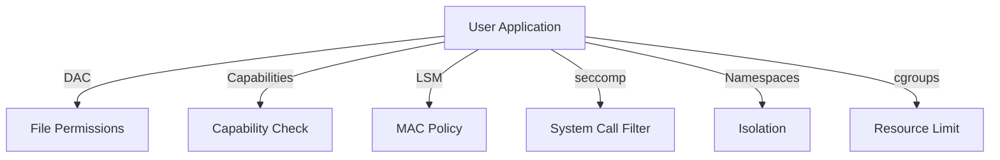

# Linux 安全子系统

<!-- TOC START -->

- [Linux 安全子系统](#linux-安全子系统)
  - [1. Linux 安全层次](#1-linux-安全层次)
  - [2. Capabilities](#2-capabilities)
  - [3. LSM（Linux Security Modules）](#3-lsmlinux-security-modules)
    - [3.1 框架](#31-框架)
    - [3.2 SELinux](#32-selinux)
    - [3.3 AppArmor](#33-apparmor)
    - [3.4 其他 LSM](#34-其他-lsm)
  - [4. seccomp](#4-seccomp)
    - [4.1 seccomp-bpf Action](#41-seccomp-bpf-action)
  - [5. Namespaces](#5-namespaces)
  - [6. cgroups](#6-cgroups)
  - [7. 场景分析](#7-场景分析)
  - [8. 术语表](#8-术语表)
  - [9. 相关文件](#9-相关文件)
  - [国际权威来源链接 / Authoritative Sources](#国际权威来源链接--authoritative-sources)

<!-- TOC END -->

> **权威来源**：Linux Kernel Development, Linux Security Modules (LSM) Docs, SELinux Docs, AppArmor Docs, kernel.org `Documentation/security/`。
>
> **目标**：深入 Linux capabilities、LSM、SELinux/AppArmor、seccomp、namespaces、cgroups 安全机制。

---

## 1. Linux 安全层次

---

## 2. Capabilities

| Capability | 说明 |
|------------|------|
| `CAP_CHOWN` | 修改文件所有者 |
| `CAP_DAC_OVERRIDE` | 绕过文件读/写/执行权限检查 |
| `CAP_NET_ADMIN` | 网络管理操作 |
| `CAP_NET_RAW` | 原始套接字 |
| `CAP_SYS_ADMIN` | 大量系统管理操作 |
| `CAP_SYS_PTRACE` | ptrace 任意进程 |
| `CAP_IPC_LOCK` | 锁定共享内存 |
| `CAP_SYS_RESOURCE` | 资源限制相关 |

---

## 3. LSM（Linux Security Modules）

### 3.1 框架

- 钩子点遍布内核关键路径：文件访问、网络、IPC、进程等。
- 源码：`security/security.c`，`include/linux/lsm_hook_defs.h`。

### 3.2 SELinux

| 概念 | 说明 |
|------|------|
| TE | Type Enforcement，类型强制 |
| MLS/MCS | 多级别/多类别安全 |
| Context | `user:role:type:level` |
| Policy | 策略文件 |
| AVC | Access Vector Cache |

### 3.3 AppArmor

| 概念 | 说明 |
|------|------|
| Profile | 基于路径的配置文件 |
| Mode | enforce / complain |
| Hat | 子配置文件 |

### 3.4 其他 LSM

| LSM | 用途 |
|-----|------|
| Smack | Simplified Mandatory Access Control |
| TOMOYO | 基于路径的 MAC |
| Yama | ptrace 限制 |
| LoadPin | 限制模块加载来源 |
| Lockdown | 内核锁定模式 |

---

## 4. seccomp

| 模式 | 说明 |
|------|------|
| strict | 只允许 read/write/exit/sigreturn |
| filter | BPF 过滤任意 syscall |

### 4.1 seccomp-bpf Action

| Action | 说明 |
|--------|------|
| `SCMP_ACT_ALLOW` | 允许 |
| `SCMP_ACT_ERRNO(errno)` | 返回错误 |
| `SCMP_ACT_KILL` | 终止进程 |
| `SCMP_ACT_TRAP` | 发送 SIGSYS |
| `SCMP_ACT_TRACE` | 通知 tracer |

---

## 5. Namespaces

| Namespace | 隔离资源 |
|-----------|----------|
| PID | 进程 ID |
| Network | 网络栈 |
| Mount | 挂载点 |
| IPC | 进程间通信 |
| UTS | hostname |
| User | UID/GID |
| Cgroup | cgroup 视图 |
| Time | 系统时间 |

---

## 6. cgroups

| Controller | 作用 |
|------------|------|
| cpu | CPU 时间分配 |
| cpuacct | CPU 使用统计 |
| cpuset | CPU/内存节点绑定 |
| memory | 内存限制与统计 |
| blkio | 块 I/O 限制 |
| pids | 进程数限制 |
| devices | 设备访问控制 |
| freezer | 进程暂停/恢复 |
| net_cls/net_prio | 网络分类/优先级 |

---

## 7. 场景分析

| 场景 | 机制 | 关键参数 | 验证指标 |
|------|------|----------|----------|
| 容器隔离 | namespaces + cgroups | netns, pidns, memory.limit | 隔离有效性 |
| 容器安全 | seccomp + capabilities + AppArmor/SELinux | seccomp profile | syscall 攻击面 |
| 最小权限服务 | capabilities drop | CAP_NET_BIND_SERVICE 等 | 权限最小化 |
| 受信启动 | IMA/EVM + lockdown | integrity policy | 启动链完整性 |

---

## 8. 术语表

| 中文 | 英文 | 一句话定义 |
|------|------|------------|
| Capability | 权能 | Linux 细粒度特权机制 |
| LSM | Linux Security Modules | Linux 安全策略框架 |
| SELinux | Security-Enhanced Linux | 基于标签的强制访问控制 |
| AppArmor | AppArmor | 基于路径的强制访问控制 |
| seccomp | Secure Computing Mode | 系统调用过滤机制 |
| Namespace | 命名空间 | Linux 资源隔离机制 |
| cgroup | Control Group | Linux 资源限制与统计机制 |

---

## 9. 相关文件

- [Linux 内核源码映射](./linux-source-map.md)
- [系统调用接口](../08-interfaces/syscall-interface.md)
- [操作系统机制组合树](../00-concept-atlas/mechanism-composition-tree-os.md)

## 国际权威来源链接 / Authoritative Sources

- [Linux Kernel - Security documentation](https://docs.kernel.org/security/)
- [Linux Kernel - LSM](https://docs.kernel.org/admin-guide/LSM/index.html)
- [Linux Kernel - seccomp](https://docs.kernel.org/userspace-api/seccomp_filter.html)
- [SELinux Project](https://selinuxproject.org/)
- [AppArmor Documentation](https://apparmor.net/)
