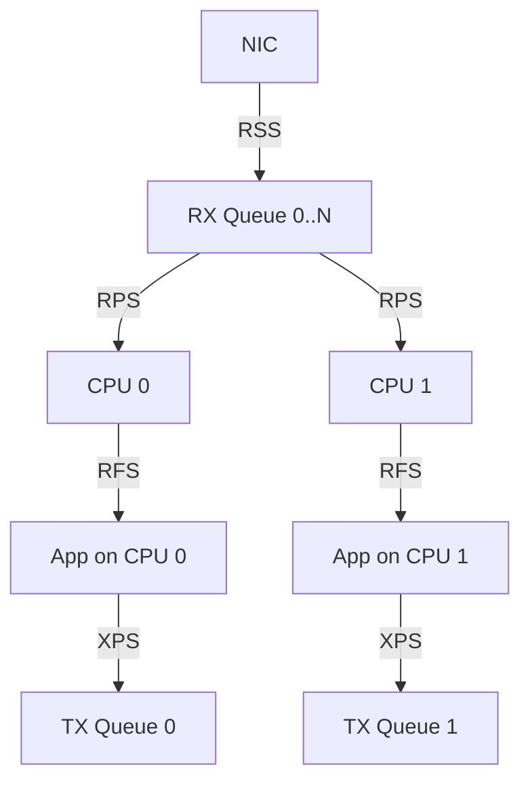

# 内核网络卸载与多队列


<!-- TOC START -->

- [内核网络卸载与多队列](#内核网络卸载与多队列)
  - [1. NAPI（New API）](#1-napinew-api)
    - [1.1 传统中断 vs NAPI](#11-传统中断-vs-napi)
    - [1.2 NAPI 流程](#12-napi-流程)
    - [1.3 关键参数](#13-关键参数)
  - [2. 硬件卸载（Offload）](#2-硬件卸载offload)
    - [2.1 GSO（Generic Segmentation Offload）](#21-gsogeneric-segmentation-offload)
    - [2.2 TSO（TCP Segmentation Offload）](#22-tsotcp-segmentation-offload)
    - [2.3 GRO（Generic Receive Offload）](#23-grogeneric-receive-offload)
    - [2.4 LRO（Large Receive Offload）](#24-lrolarge-receive-offload)
    - [2.5 Checksum Offload](#25-checksum-offload)
  - [3. 多队列与分发](#3-多队列与分发)
    - [3.1 RSS（Receive Side Scaling）](#31-rssreceive-side-scaling)
    - [3.2 RPS（Receive Packet Steering）](#32-rpsreceive-packet-steering)
    - [3.3 RFS（Receive Flow Steering）](#33-rfsreceive-flow-steering)
    - [3.4 XPS（Transmit Packet Steering）](#34-xpstransmit-packet-steering)
  - [4. 配置示例](#4-配置示例)
- [查看网卡特性](#查看网卡特性)
- [开启 GRO/TSO](#开启-grotso)
- [配置 RPS](#配置-rps)
- [配置 RFS](#配置-rfs)
- [配置 XPS](#配置-xps)
  - [5. 场景分析](#5-场景分析)
  - [6. 术语表](#6-术语表)
  - [7. 相关文件](#7-相关文件)
  - [国际权威来源链接 / Authoritative Sources](#国际权威来源链接--authoritative-sources)

<!-- TOC END -->

> **权威来源**：Linux Kernel Networking, LWN.net, kernel.org `Documentation/networking/`。
>
> **目标**：深入 NAPI、GRO/GSO/TSO/LSO、RPS/RFS/XPS/RSS 等网络性能优化机制。

---

## 1. NAPI（New API）

### 1.1 传统中断 vs NAPI

| 模式 | 低负载 | 高负载 |
|------|--------|--------|
| 纯中断 | 低延迟 | 中断风暴，高 CPU |
| NAPI | 中断触发 | 关闭中断，轮询一批包 |

### 1.2 NAPI 流程

```
NIC 硬中断
  ↓ napi_schedule()
    ↓ NET_RX_SOFTIRQ
      ↓ napi_poll()
        ↓ 驱动 poll 函数处理一批包
        ↓ netif_receive_skb()
        ↓ 达到预算或包处理完
      ↓ napi_complete()
    ↓ 重新开启 NIC 硬中断
```

### 1.3 关键参数

| 参数 | 说明 | 默认值 |
|------|------|--------|
| `netdev_budget` | 所有 NAPI 轮询总预算 | 300 |
| `netdev_budget_usecs` | 轮询时间预算 | 8us |
| `net.core.netdev_max_backlog` | 每个 CPU 输入队列长度 | 1000 |

---

## 2. 硬件卸载（Offload）

### 2.1 GSO（Generic Segmentation Offload）

- 软件实现大 TCP/UDP 段分片。
- 在接近发送时才分段。

### 2.2 TSO（TCP Segmentation Offload）

- 网卡硬件执行 TCP 分段。
- 减少 CPU 拷贝和计算。

### 2.3 GRO（Generic Receive Offload）

- 接收侧合并多个同流小包。
- 减少协议栈处理次数。

### 2.4 LRO（Large Receive Offload）

- 网卡硬件合并接收包。
- 已逐渐被 GRO 替代。

### 2.5 Checksum Offload

| 方向 | 标志 | 说明 |
|------|------|------|
| TX | NETIF_F_IP_CSUM / NETIF_F_HW_CSUM | 网卡计算发送校验和 |
| RX | NETIF_F_RXCSUM | 网卡验证接收校验和 |

---

## 3. 多队列与分发

### 3.1 RSS（Receive Side Scaling）

- 网卡硬件根据 hash 将包分发到多个 RX queue。
- hash 可基于 4-tuple 或 5-tuple。

### 3.2 RPS（Receive Packet Steering）

- 软件将接收包分发到多个 CPU。
- 适用于无 RSS 或多队列不足的网卡。

### 3.3 RFS（Receive Flow Steering）

- 根据应用所在 CPU 分发包。
- 减少跨 CPU 缓存失效。

### 3.4 XPS（Transmit Packet Steering）

- 将发送队列映射到特定 CPU。
- 减少发送锁竞争。



---

## 4. 配置示例

```bash
# 查看网卡特性
ethtool -k eth0

# 开启 GRO/TSO
ethtool -K eth0 gro on tso on

# 配置 RPS
echo f > /sys/class/net/eth0/queues/rx-0/rps_cpus

# 配置 RFS
echo 32768 > /proc/sys/net/core/rps_sock_flow_entries
echo 4096 > /sys/class/net/eth0/queues/rx-0/rps_flow_cnt

# 配置 XPS
echo 1 > /sys/class/net/eth0/queues/tx-0/xps_cpus
```

---

## 5. 场景分析

| 场景 | 关键机制 | 关键参数 | 验证指标 |
|------|----------|----------|----------|
| 高吞吐网卡 | RSS + RPS + GRO/TSO | queues, rps_cpus | pps, Gbps, CPU% |
| 低延迟网络 | busy_poll + XPS | `busy_poll`, `busy_budget` | P99 延迟 |
| 多核 Web 服务器 | RFS + XPS | rps_flow_cnt | 跨 CPU 迁移 |
| 虚拟化 | virtio-net multiqueue | `num_queues` | vhost 吞吐 |

---

## 6. 术语表

| 中文 | 英文 | 一句话定义 |
|------|------|------------|
| NAPI | New API | 混合中断/轮询的网络接收机制 |
| GSO | Generic Segmentation Offload | 软件大段分片 |
| TSO | TCP Segmentation Offload | 网卡 TCP 分段卸载 |
| GRO | Generic Receive Offload | 接收侧包合并 |
| RSS | Receive Side Scaling | 网卡硬件多队列接收分发 |
| RPS | Receive Packet Steering | 软件接收包 CPU 分发 |
| RFS | Receive Flow Steering | 按应用 CPU 分发接收包 |
| XPS | Transmit Packet Steering | 发送队列 CPU 映射 |

---

## 7. 相关文件

- [Linux 网络协议栈](./linux-network-stack.md)
- [Socket 与多路复用](./socket-and-multiplexing.md)
- [Netfilter/eBPF/XDP](./netfilter-ebpf-xdp.md)

## 国际权威来源链接 / Authoritative Sources

- [Linux Networking - NAPI](https://docs.kernel.org/networking/napi.html)
- [Linux Kernel - Generic Receive Offload (GRO)](https://docs.kernel.org/networking/gro.html)
- [Linux Kernel - Segmentation Offloads](https://docs.kernel.org/networking/segmentation-offloads.html)
- [Linux Kernel - RPS/RFS/XPS](https://docs.kernel.org/networking/scaling.html)
- [Linux Kernel Networking (Rami Rosen)](https://www.apress.com/gp/book/9781430261964)
- [Linux netdev subsystem documentation](https://docs.kernel.org/process/maintainer-netdev.html)
