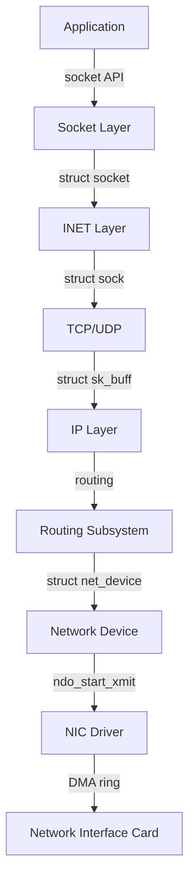
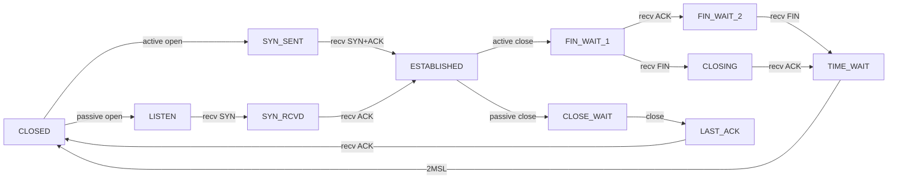

# Linux 网络协议栈实现映射

> **权威来源**：Linux Kernel Networking (Rami Rosen), TCP/IP Illustrated Vol. 1 (Stevens), RFC 791/793/1122, kernel.org `Documentation/networking/`, LWN.net。
>
> **目标**：把 OSI/TCP/IP 概念映射到 Linux `net/` 子系统的数据结构、函数与数据路径。

---

## 1. Linux 网络栈全景



---

## 2. 核心数据结构

| 概念 | Linux 数据结构 | 源码文件 | 关键字段 |
|------|----------------|----------|----------|
| BSD Socket | `struct socket` | `include/linux/net.h` | `state`, `type`, `ops`, `file`, `sk` |
| INET Socket | `struct sock` / `struct inet_sock` | `include/net/sock.h`, `include/net/inet_sock.h` | `sk_state`, `sk_rcvbuf`, `sk_sndbuf`, `sk_receive_queue` |
| TCP Socket | `struct tcp_sock` | `include/linux/tcp.h` | `snd_una`, `snd_nxt`, `rcv_nxt`, `srtt_us`, `cong_control` |
| 数据包 | `struct sk_buff` | `include/linux/skbuff.h` | `data`, `len`, `protocol`, `dev`, `cb` |
| 路由 | `struct rtable` / `struct dst_entry` | `include/net/route.h` | `rt_dst`, `rt_gateway`, `dst_input`, `dst_output` |
| 邻居 | `struct neighbour` | `include/net/neighbour.h` | `ha`, `dev`, `ops`, `nud_state` |
| 网络设备 | `struct net_device` | `include/linux/netdevice.h` | `name`, `mtu`, `netdev_ops`, `ethtool_ops`, `priv_flags` |
| 设备操作 | `struct net_device_ops` | `include/linux/netdevice.h` | `ndo_open`, `ndo_stop`, `ndo_start_xmit`, `ndo_set_config` |
| 协议操作 | `struct packet_type` | `include/linux/netdevice.h` | `type`, `func`, `dev` |

---

## 3. Socket 创建与状态机

### 3.1 创建流程

```
socket(AF_INET, SOCK_STREAM, 0)
  ↓ sys_socket()
    ↓ sock_create() → __sock_create()
      ↓ inet_create() (inet_family_ops)
        ↓ sk_alloc() → inet_sk() → tcp_sk()
```

| 系统调用 | 内核函数 | 说明 |
|----------|----------|------|
| `socket()` | `sys_socket()` | 创建 `socket` + `sock` |
| `bind()` | `sys_bind()` → `inet_bind()` | 绑定本地地址/端口 |
| `listen()` | `sys_listen()` → `inet_listen()` | 设置 `TCP_LISTEN` |
| `accept()` | `sys_accept4()` → `inet_accept()` | 从 `icsk_accept_queue` 取连接 |
| `connect()` | `sys_connect()` → `tcp_v4_connect()` | 主动建立 TCP 连接 |
| `send()` | `sys_sendto()` → `inet_sendmsg()` → `tcp_sendmsg()` | 发送数据 |
| `recv()` | `sys_recvfrom()` → `inet_recvmsg()` → `tcp_recvmsg()` | 接收数据 |
| `close()` | `sys_close()` → `inet_release()` → `tcp_close()` | 释放 socket |

### 3.2 TCP 状态机



---

## 4. 数据接收路径

```
NIC 硬中断
  ↓ napi_schedule()
    ↓ NET_RX_SOFTIRQ 软中断
      ↓ napi_poll() → drv->poll()
        ↓ netif_receive_skb()
          ↓ __netif_receive_skb_core()
            ↓ ptype_all / ptype_base 分发
              ↓ ip_rcv()
                ↓ ip_rcv_finish() → dst_input()
                  ↓ ip_local_deliver()
                    ↓ ip_local_deliver_finish()
                      ↓ tcp_v4_rcv()
                        ↓ tcp_v4_do_rcv()
                          ↓ tcp_rcv_established() / tcp_rcv_state_process()
                            ↓ tcp_data_queue() / tcp_queue_rcv()
                              ↓ 唤醒用户态 recv()
```

| 阶段 | 关键函数 | 源码位置 | 说明 |
|------|----------|----------|------|
| 硬中断 | `irq_handler` | 驱动代码 | NIC 收到数据包触发 |
| NAPI 调度 | `napi_schedule()` | `net/core/dev.c` | 关闭硬中断，软中断轮询 |
| 协议分发 | `netif_receive_skb()` | `net/core/dev.c` | 根据协议类型分发 |
| IP 输入 | `ip_rcv()` | `net/ipv4/ip_input.c` | IP 头校验、路由 |
| TCP 输入 | `tcp_v4_rcv()` | `net/ipv4/tcp_ipv4.c` | TCP 校验、状态机处理 |
| 数据入队 | `tcp_data_queue()` | `net/ipv4/tcp_input.c` | 排序、SACK、窗口管理 |
| 唤醒用户 | `sk->sk_data_ready()` | `include/net/sock.h` | 通知 epoll/select |

---

## 5. 数据发送路径

```
send() / sendmsg()
  ↓ sys_sendmsg()
    ↓ sock_sendmsg() → inet_sendmsg()
      ↓ tcp_sendmsg()
        ↓ tcp_sendmsg_locked()
          ↓ tcp_write_xmit()
            ↓ tcp_transmit_skb()
              ↓ ip_queue_xmit()
                ↓ ip_local_out()
                  ↓ dst_output() → dev_queue_xmit()
                    ↓ sch_direct_xmit() / __dev_queue_xmit()
                      ↓ ndo_start_xmit()
                        ↓ NIC Driver → DMA ring → NIC
```

| 阶段 | 关键函数 | 源码位置 | 说明 |
|------|----------|----------|------|
| 系统调用 | `sys_sendmsg()` | `net/socket.c` | 用户态发送入口 |
| TCP 发送 | `tcp_sendmsg()` | `net/ipv4/tcp.c` | 拷贝数据到 send buffer |
| 发送决策 | `tcp_write_xmit()` | `net/ipv4/tcp_output.c` | 拥塞窗口、Nagle |
| IP 输出 | `ip_queue_xmit()` | `net/ipv4/ip_output.c` | 路由、分片 |
| 设备队列 | `dev_queue_xmit()` | `net/core/dev.c` | 进入 qdisc 或直接发送 |
| 驱动发送 | `ndo_start_xmit()` | 驱动代码 | 写入 DMA ring |

---

## 6. 性能优化机制

### 6.1 NAPI（New API）

- **机制**：收到数据包时关闭 NIC 硬中断，通过软中断轮询一批数据包，再重新开启中断。
- **关键函数**：`napi_schedule()`, `napi_complete()`, `net_rx_action()`。
- **收益**：减少硬中断风暴，提高高吞吐场景 CPU 效率。

### 6.2 硬件卸载（Offload）

| 机制 | 方向 | 作用 | 相关字段 |
|------|------|------|----------|
| TSO | 发送 | TCP 分段卸载到网卡 | `net_device->features` NETIF_F_TSO |
| GSO | 发送 | 软件实现大段分片 | `sk_buff->gso_size` |
| LRO/GRO | 接收 | 合并多个小包 | `napi_gro_receive()` |
| Checksum Offload | 收发 | 校验和计算卸载 | NETIF_F_RXCSUM/TXCSUM |

### 6.3 多队列与 RSS/RPS/RFS/XPS

| 机制 | 层级 | 作用 | 关键参数 |
|------|------|------|----------|
| RSS | 硬件 | 网卡多队列哈希分发 | `ethtool -L eth0 combined N` |
| RPS | 内核 | 软中断分发到多 CPU | `/sys/class/net/eth0/queues/rx-*/rps_cpus` |
| RFS | 内核 | 根据应用所在 CPU 分发 | `/proc/sys/net/core/rps_sock_flow_entries` |
| XPS | 内核 | 发送队列按 CPU 映射 | `/sys/class/net/eth0/queues/tx-*/xps_cpus` |

---

## 7. Netfilter 钩子点

```
         Local Process
              ↑
       [NF_INET_LOCAL_OUT]
              ↑
           Routing
              ↑
      [NF_INET_POST_ROUTING]
              ↑
        IP Forward
              ↑
       [NF_INET_PRE_ROUTING]
              ↑
         NIC RX
              ↓
       [NF_INET_LOCAL_IN]
              ↓
         Local Process
```

| 钩子 | 位置 | 典型用途 |
|------|------|----------|
| `NF_INET_PRE_ROUTING` | 路由前 | DNAT, XDP 后处理 |
| `NF_INET_LOCAL_IN` | 路由到本机 | 防火墙 INPUT 链 |
| `NF_INET_FORWARD` | 转发路径 | 防火墙 FORWARD 链 |
| `NF_INET_LOCAL_OUT` | 本机发出 | 防火墙 OUTPUT 链 |
| `NF_INET_POST_ROUTING` | 路由后 | SNAT, MASQUERADE |

---

## 8. 网络命名空间与虚拟设备

| 概念 | 数据结构 | 源码位置 | 说明 |
|------|----------|----------|------|
| 网络命名空间 | `struct net` | `include/net/net_namespace.h` | 隔离网络栈 |
| veth pair | `struct veth_priv` | `drivers/net/veth.c` | 一对虚拟网卡 |
| bridge | `struct net_bridge` | `net/bridge/br_private.h` | 二层桥接 |
| macvlan | `struct macvlan_dev` | `drivers/net/macvlan.c` | 虚拟 MAC |
| ipvlan | `struct ipvlan_dev` | `drivers/net/ipvlan/ipvlan.h` | 共享宿主 MAC |

---

## 9. 术语表

| 中文 | 英文 | 一句话定义 |
|------|------|------------|
| 套接字 | Socket | 应用层与传输层之间的通信端点抽象 |
| sk_buff | Socket Buffer | Linux 内核网络数据包的核心数据结构 |
| 网络设备 | net_device | Linux 中表示网络接口的数据结构 |
| NAPI | New API | 混合中断/轮询的高性能网络接收机制 |
| GRO | Generic Receive Offload | 接收侧合并多个小包减少协议栈处理 |
| TSO | TCP Segmentation Offload | 发送侧 TCP 分段卸载到网卡 |
| RPS | Receive Packet Steering | 软件多 CPU 接收包分发 |
| XPS | Transmit Packet Steering | 发送队列按 CPU 映射 |

---

## 10. 国际来源映射

| 概念 | 来源类型 | 来源 | 位置 | 状态 |
|------|----------|------|------|------|
| TCP/IP | Textbook | TCP/IP Illustrated Vol. 1 | Ch. 1~12 | 已覆盖 |
| TCP 状态机 | RFC | IETF | RFC 793 | 已覆盖 |
| Linux 网络栈 | Book | Linux Kernel Networking (Rami Rosen) | Ch. 1~9 | 已覆盖 |
| sk_buff | SourceCode | Linux Kernel | `include/linux/skbuff.h` | 已覆盖 |
| NAPI | SourceCode | Linux Kernel | `net/core/dev.c` | 已覆盖 |
| Netfilter | SourceCode | Linux Kernel | `net/netfilter/` | 已覆盖 |
| 网络命名空间 | SourceCode | Linux Kernel | `net/core/net_namespace.c` | 已覆盖 |

---

## 11. 相关文件

- [Socket 与多路复用](./socket-and-multiplexing.md)
- [内核卸载](./kernel-offload.md)
- [Netfilter/eBPF/XDP](./netfilter-ebpf-xdp.md)
- [流量控制](./traffic-control.md)
- [操作系统场景分析树](../00-concept-atlas/scenario-analysis-tree-os.md)

## 国际权威来源链接 / Authoritative Sources

- [RFC 791 - Internet Protocol](https://datatracker.ietf.org/doc/html/rfc791)
- [RFC 793 - Transmission Control Protocol](https://datatracker.ietf.org/doc/html/rfc793)
- [RFC 768 - User Datagram Protocol](https://datatracker.ietf.org/doc/html/rfc768)
- [RFC 792 - Internet Control Message Protocol](https://datatracker.ietf.org/doc/html/rfc792)
- [RFC 826 - Address Resolution Protocol](https://datatracker.ietf.org/doc/html/rfc826)
- [RFC 8200 - Internet Protocol, Version 6 (IPv6)](https://datatracker.ietf.org/doc/html/rfc8200)
- [IEEE 802.3-2022 Ethernet](https://standards.ieee.org/standard/802.3-2022.html)
- [IEEE 802.1Q-2024 VLAN](https://standards.ieee.org/standard/802.1Q-2024.html)
- [Linux netdev subsystem documentation](https://docs.kernel.org/process/maintainer-netdev.html)
- [Linux Kernel Networking (Rami Rosen) - Apress](https://www.apress.com/gp/book/9781430261964)
- [TCP/IP Illustrated, Vol. 1 (Stevens)](https://www.amazon.com/TCP-Illustrated-Protocols-Addison-Wesley-Professional/dp/0321336313)
