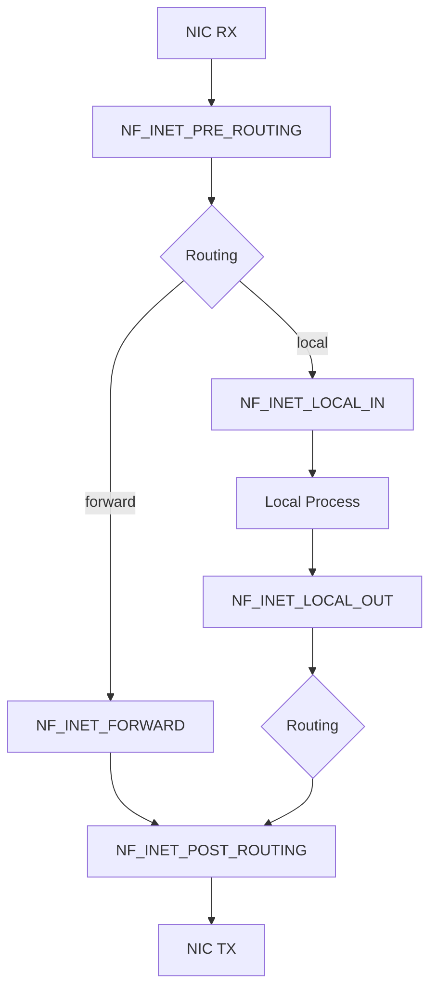
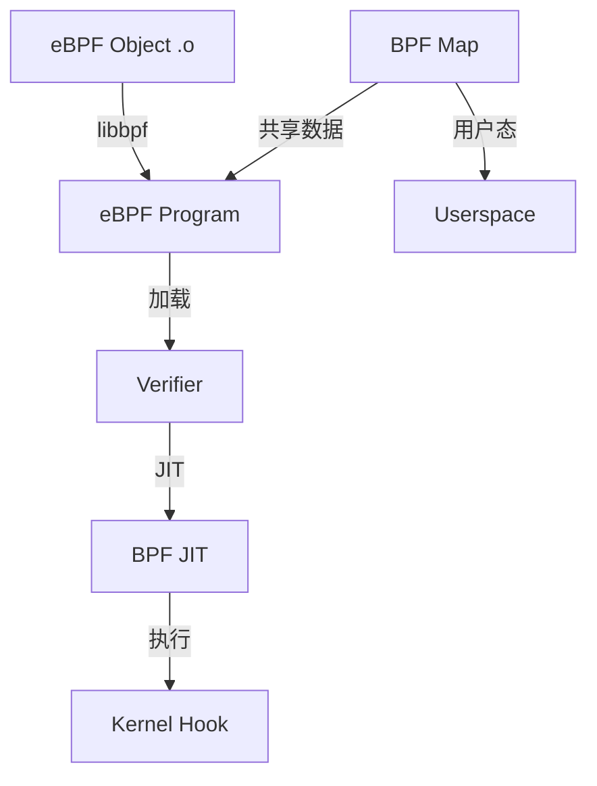

# Netfilter / eBPF / XDP


<!-- TOC START -->

- [Netfilter / eBPF / XDP](#netfilter--ebpf--xdp)
  - [1. Netfilter 框架](#1-netfilter-框架)
    - [1.1 钩子点](#11-钩子点)
    - [1.2 iptables / nftables](#12-iptables--nftables)
    - [1.3 conntrack](#13-conntrack)
  - [2. eBPF 架构](#2-ebpf-架构)
    - [2.1 组件](#21-组件)
    - [2.2 BPF 程序类型](#22-bpf-程序类型)
    - [2.3 BPF Map 类型](#23-bpf-map-类型)
    - [2.4 加载流程](#24-加载流程)
  - [3. XDP（eXpress Data Path）](#3-xdpexpress-data-path)
    - [3.1 执行位置](#31-执行位置)
    - [3.2 XDP Action](#32-xdp-action)
    - [3.3 XDP 模式](#33-xdp-模式)
  - [4. tc（Traffic Control）与 eBPF](#4-tctraffic-control与-ebpf)
  - [5. 对比：iptables / nftables / eBPF / XDP](#5-对比iptables--nftables--ebpf--xdp)
  - [6. 场景分析](#6-场景分析)
  - [7. 术语表](#7-术语表)
  - [8. 国际来源映射](#8-国际来源映射)
  - [9. 相关文件](#9-相关文件)
  - [国际权威来源链接 / Authoritative Sources](#国际权威来源链接--authoritative-sources)

<!-- TOC END -->

> **权威来源**：Linux Kernel Networking (Rami Rosen), Brendan Gregg *BPF Performance Tools*, LWN.net, Linux Kernel `net/netfilter/`, `kernel/bpf/`, `net/core/filter.c`。
>
> **目标**：系统讲解 Linux 网络数据包过滤、修改、转发的三层机制：netfilter、tc、eBPF/XDP。

---

## 1. Netfilter 框架

### 1.1 钩子点



### 1.2 iptables / nftables

| 工具 | 表/链 | 说明 |
|------|-------|------|
| iptables | raw → mangle → nat → filter → security | 传统防火墙工具 |
| nftables | table → chain → rule | 新一代统一框架，替代 iptables |

### 1.3 conntrack

- 连接跟踪：维护连接状态表（NEW, ESTABLISHED, RELATED, INVALID）。
- 源码：`net/netfilter/nf_conntrack_core.c`。

---

## 2. eBPF 架构

### 2.1 组件



### 2.2 BPF 程序类型

| 类型 | 挂载点 | 用途 |
|------|--------|------|
| `BPF_PROG_TYPE_KPROBE` | kprobe | 内核函数跟踪 |
| `BPF_PROG_TYPE_TRACEPOINT` | tracepoint | 内核事件跟踪 |
| `BPF_PROG_TYPE_XDP` | 网卡驱动 | 高性能包处理 |
| `BPF_PROG_TYPE_SCHED_CLS` | tc classifer | 流量分类 |
| `BPF_PROG_TYPE_SCHED_ACT` | tc action | 流量动作 |
| `BPF_PROG_TYPE_CGROUP_SKB` | cgroup | cgroup 网络策略 |
| `BPF_PROG_TYPE_SOCKET_FILTER` | socket | 套接字过滤 |

### 2.3 BPF Map 类型

| 类型 | 用途 |
|------|------|
| `BPF_MAP_TYPE_HASH` | 键值对 |
| `BPF_MAP_TYPE_ARRAY` | 数组 |
| `BPF_MAP_TYPE_LRU_HASH` | LRU 缓存 |
| `BPF_MAP_TYPE_PERCPU_ARRAY` | 每个 CPU 数组 |
| `BPF_MAP_TYPE_RINGBUF` | 环形缓冲区 |
| `BPF_MAP_TYPE_SOCKHASH` | socket 哈希 |

### 2.4 加载流程

```
用户态 eBPF C 程序
  ↓ clang -target bpf
eBPF ELF .o
  ↓ libbpf
  ↓ bpf() 系统调用
  ↓ verifier 检查安全性
  ↓ JIT 编译为机器码
  ↓ 挂载到 hook
```

---

## 3. XDP（eXpress Data Path）

### 3.1 执行位置

```
NIC RX
  ↓ 网卡驱动 XDP hook
    ↓ XDP prog
      ↓ verdict: XDP_DROP / XDP_PASS / XDP_TX / XDP_REDIRECT
```

### 3.2 XDP Action

| Action | 说明 |
|--------|------|
| `XDP_DROP` | 丢弃数据包 |
| `XDP_PASS` | 继续进入内核网络栈 |
| `XDP_TX` | 从同一网卡转发出去 |
| `XDP_REDIRECT` | 重定向到另一网卡或 CPU |
| `XDP_ABORTED` | 异常丢弃 |

### 3.3 XDP 模式

| 模式 | 说明 |
|------|------|
| Native | 网卡驱动原生支持，性能最高 |
| Offloaded | 智能网卡硬件执行 |
| Generic | 不依赖驱动，性能较低 |

---

## 4. tc（Traffic Control）与 eBPF

| 挂载点 | eBPF 类型 | 用途 |
|--------|-----------|------|
| cls_bpf | `BPF_PROG_TYPE_SCHED_CLS` | 分类数据包 |
| act_bpf | `BPF_PROG_TYPE_SCHED_ACT` | 对数据包执行动作 |

---

## 5. 对比：iptables / nftables / eBPF / XDP

| 特性 | iptables | nftables | eBPF/tc | XDP |
|------|----------|----------|---------|-----|
| 层级 | L3/L4 | L3/L4 | L2~L4 | L2 |
| 性能 | 中 | 中 | 高 | 极高 |
| 可编程性 | 低 | 中 | 高 | 高 |
| 状态跟踪 | conntrack | conntrack | 手动 map | 手动 map |
| 适用场景 | 通用防火墙 | 现代防火墙 | 复杂策略/可观测 | DDoS/高性能转发 |

---

## 6. 场景分析

| 场景 | 推荐方案 | 关键参数 | 验证指标 |
|------|----------|----------|----------|
| 服务器防火墙 | nftables | ruleset, conntrack | 吞吐, 规则数 |
| DDoS 清洗 | XDP DROP | BPF map, batch | Mpps, CPU% |
| 微服务 L7 策略 | eBPF + Cilium | L7 policy map | 延迟, 策略覆盖 |
| 流量镜像/采样 | tc cls_bpf | classifier | 采样率 |
| 可观测性 | eBPF kprobe/tracepoint | ringbuf | 事件吞吐 |

---

## 7. 术语表

| 中文 | 英文 | 一句话定义 |
|------|------|------------|
| Netfilter | Netfilter | Linux 内核网络包过滤框架 |
| eBPF | Extended Berkeley Packet Filter | 可在内核安全执行的字节码虚拟机 |
| XDP | Express Data Path | 网卡驱动层的高性能包处理机制 |
| tc | Traffic Control | Linux 流量控制子系统 |
| conntrack | Connection Tracking | 连接状态跟踪 |
| Verifier | BPF Verifier | 确保 eBPF 程序安全的静态检查器 |
| JIT | Just-In-Time | 将 BPF 字节码编译为本地机器码 |
| Map | BPF Map | BPF 程序与用户态共享数据的键值存储 |

---

## 8. 国际来源映射

| 概念 | 来源类型 | 来源 | 位置 |
|------|----------|------|------|
| Netfilter | SourceCode | Linux Kernel | `net/netfilter/` |
| eBPF | SourceCode | Linux Kernel | `kernel/bpf/` |
| XDP | SourceCode | Linux Kernel | `net/core/filter.c`, drivers |
| tc | SourceCode | Linux Kernel | `net/sched/` |
| BPF Performance | Book | Brendan Gregg | BPF Performance Tools |
| Linux Networking | Book | Rami Rosen | Linux Kernel Networking |

---

## 9. 相关文件

- [Linux 网络协议栈](./linux-network-stack.md)
- [Socket 与多路复用](./socket-and-multiplexing.md)
- [流量控制](./traffic-control.md)
- [操作系统场景分析树](../00-concept-atlas/scenario-analysis-tree-os.md)

## 国际权威来源链接 / Authoritative Sources

- [Linux BPF documentation](https://docs.kernel.org/bpf/)
- [Linux XDP documentation](https://docs.kernel.org/networking/xdp.html)
- [Cilium BPF and XDP Reference Guide](https://docs.cilium.io/en/latest/bpf/)
- [eBPF.io - What is eBPF?](https://ebpf.io/what-is-ebpf/)
- [Brendan Gregg - BPF Performance Tools](http://www.brendangregg.com/bpf-performance-tools-book.html)
- [Netfilter project](https://www.netfilter.org/)
- [nftables documentation](https://wiki.nftables.org/wiki-nftables/index.php/Main_Page)
