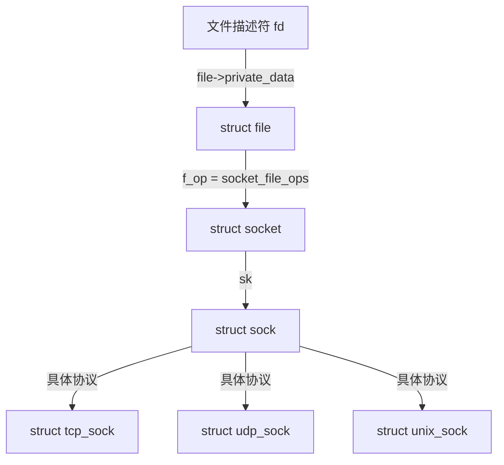

# Socket 与 I/O 多路复用

> **权威来源**：POSIX.1-2024 §16, OSTEP Ch. 33, Linux Kernel `net/socket.c`, `fs/eventpoll.c`, `fs/io_uring.c`, LWN.net。
>
> **目标**：系统讲解 socket API、select/poll/epoll/io_uring 的原理、源码映射与决策场景。

---

## 1. Socket API 核心系统调用

| 系统调用 | 内核入口 | 关键函数 | 说明 |
|----------|----------|----------|------|
| `socket()` | `sys_socket()` | `__sys_socket()` | 创建 socket 与 inode |
| `bind()` | `sys_bind()` | `inet_bind()` | 绑定地址端口 |
| `listen()` | `sys_listen()` | `inet_listen()` | 设置监听状态 |
| `accept()` | `sys_accept4()` | `inet_accept()` | 接受连接 |
| `connect()` | `sys_connect()` | `tcp_v4_connect()` | 发起连接 |
| `send()` / `sendmsg()` | `sys_sendmsg()` | `sock_sendmsg()` → `tcp_sendmsg()` | 发送数据 |
| `recv()` / `recvmsg()` | `sys_recvmsg()` | `sock_recvmsg()` → `tcp_recvmsg()` | 接收数据 |
| `shutdown()` | `sys_shutdown()` | `tcp_shutdown()` | 关闭连接方向 |
| `close()` | `sys_close()` | `inet_release()` | 释放 socket |

---

## 2. Socket 与文件描述符



- `struct socket`：BSD 层抽象，管理 socket 状态、类型、ops。
- `struct sock`：协议无关的 INET 层。
- `struct tcp_sock` / `struct udp_sock`：协议特定状态。

---

## 3. select / poll

### 3.1 select

```c
int select(int nfds, fd_set *readfds, fd_set *writefds, fd_set *exceptfds, struct timeval *timeout);
```

- **机制**：每次调用将 fd 集合从用户态拷贝到内核态，遍历所有 fd 检查状态。
- **复杂度**：O(n)，n 为最大 fd 值。
- **限制**：`FD_SETSIZE` 默认 1024。
- **源码**：`fs/select.c` → `core_sys_select()` → `do_select()` → `poll()`。

### 3.2 poll

```c
int poll(struct pollfd *fds, nfds_t nfds, int timeout);
```

- **机制**：使用 `pollfd` 数组，无 1024 限制，但仍需 O(n) 遍历。
- **源码**：`fs/select.c` → `do_sys_poll()` → `do_poll()` → `poll()`。

---

## 4. epoll

### 4.1 核心数据结构

| 数据结构 | 源码位置 | 说明 |
|----------|----------|------|
| `struct eventpoll` | `fs/eventpoll.c` | epoll 实例，管理就绪列表与红黑树 |
| `struct epitem` | `fs/eventpoll.c` | 每个被监控 fd 对应一个节点 |
| `struct eppoll_entry` | `fs/eventpoll.c` | 等待队列回调 |
| `struct ep_pqueue` | `fs/eventpoll.c` | poll 表封装 |

### 4.2 关键函数

| 系统调用 | 内核函数 | 说明 |
|----------|----------|------|
| `epoll_create()` | `epoll_create1()` | 创建 `eventpoll` |
| `epoll_ctl()` | `epoll_ctl()` | 增删改监控 fd：插入/删除红黑树，注册回调 |
| `epoll_wait()` | `epoll_wait()` | 等待事件，将就绪 `epitem` 拷贝到用户态 |

### 4.3 工作原理

```
epoll_ctl(EPOLL_CTL_ADD)
  ↓ ep_insert()
    ↓ 创建 epitem，插入红黑树
    ↓ ep_ptable_queue_proc() → 注册 file->f_op->poll 回调
    ↓ 当事件发生时，ep_poll_callback() 将 epitem 加入 rdllist

epoll_wait()
  ↓ ep_poll()
    ↓ 检查 rdllist 是否为空
    ↓ 空则睡眠等待
    ↓ 非空则 ep_send_events() 拷贝到用户态
```

### 4.4 LT 与 ET 模式

| 模式 | 触发条件 | 使用注意 |
|------|----------|----------|
| Level-Triggered (LT) | 只要 fd 就绪，持续触发 | 默认模式，易用 |
| Edge-Triggered (ET) | 状态变化时触发一次 | 必须一次性读/写完，配合非阻塞 |

---

## 5. io_uring

### 5.1 核心数据结构

| 数据结构 | 源码位置 | 说明 |
|----------|----------|------|
| `struct io_ring_ctx` | `fs/io_uring.c` | io_uring 上下文 |
| `struct io_uring_sqe` | `include/uapi/linux/io_uring.h` | 提交队列条目 |
| `struct io_uring_cqe` | `include/uapi/linux/io_uring.h` | 完成队列条目 |
| `struct io_sq_data` | `fs/io_uring.c` | 提交队列内存映射数据 |

### 5.2 队列模型

```
用户态                   内核态
┌─────────┐             ┌─────────┐
│  SQE    │ ──mmap────> │ SQ Ring │
│  Array  │             │ Head/Tail
└─────────┘             └─────────┘
┌─────────┐             ┌─────────┐
│  CQE    │ <──mmap──── │ CQ Ring │
│  Array  │             │ Head/Tail
└─────────┘             └─────────┘
```

### 5.3 关键特性

| 特性 | 说明 | 标志 |
|------|------|------|
| 零拷贝提交 | SQE/CQE 通过 mmap 共享，避免系统调用拷贝 | 默认 |
| 轮询模式 | 内核线程轮询 SQ，无需系统调用 | `IORING_SETUP_SQPOLL` |
| IOPOLL | 对文件 I/O 使用轮询 | `IORING_SETUP_IOPOLL` |
| Registered Buffers | 预注册缓冲区，避免每次 pin 内存 | `IORING_REGISTER_BUFFERS` |
| 链接操作 | 一个 SQE 完成后触发下一个 | `IOSQE_IO_LINK` |

### 5.4 操作类型

| 操作 | SQE Opcode | 说明 |
|------|------------|------|
| 读 | `IORING_OP_READV` / `IORING_OP_READ` | 文件/套接字读 |
| 写 | `IORING_OP_WRITEV` / `IORING_OP_WRITE` | 文件/套接字写 |
| 接收 | `IORING_OP_RECV` / `IORING_OP_RECVMSG` | 网络接收 |
| 发送 | `IORING_OP_SEND` / `IORING_OP_SENDMSG` | 网络发送 |
| accept | `IORING_OP_ACCEPT` | 接受连接 |
| connect | `IORING_OP_CONNECT` | 发起连接 |
| 超时 | `IORING_OP_TIMEOUT` | 超时控制 |

---

## 6. select / poll / epoll / io_uring 对比

| 特性 | select | poll | epoll | io_uring |
|------|--------|------|-------|----------|
| 最大 fd | 1024 | 无限制 | 无限制 | 无限制 |
| 时间复杂度 | O(n) | O(n) | O(活跃 fd) | O(提交/完成) |
| 用户态-内核态拷贝 | 每次调用拷贝 fd 集 | 每次调用拷贝 pollfd | epoll_ctl 时注册 | mmap 共享 |
| 触发模式 | LT | LT | LT/ET | 异步完成 |
| 适用场景 | 小规模、跨平台 | 小规模 | 高并发网络 | 高 I/O 吞吐 |
| 系统调用次数 | 每次事件循环 | 每次事件循环 | 只在 fd 变化时 | 批量异步 |

---

## 7. 决策树

```mermaid
graph TD
    Q[需要多路复用？] -->|fd < 1024, 跨平台| A[select / poll]
    Q -->|Linux, 高并发网络| B[epoll]
    Q -->|高吞吐磁盘/网络, 批量异步| C[io_uring]

    A -->|注意| A1[O(n) 扫描, fd 上限]
    B -->|选择| B1[LT 易用 / ET 高性能]
    C -->|选择| C1[SQPOLL 进一步减少 syscall]
```

| 场景 | 推荐 | 关键参数 | 验证指标 |
|------|------|----------|----------|
| 小型服务/跨平台 | select/poll | `FD_SETSIZE`, timeout | 可移植性 |
| 10K+ 连接 Web 服务 | epoll LT | `maxevents`, `somaxconn` | P99 延迟 |
| 超高并发代理 | epoll ET + 非阻塞 | `EPOLLET` | 连接数, CPU% |
| 高 IOPS 数据库/存储 | io_uring | `sq_entries`, `flags` | IOPS, 99th 延迟 |

---

## 8. 国际来源映射

| 概念 | 来源类型 | 来源 | 位置 |
|------|----------|------|------|
| Socket API | Standard | POSIX.1-2024 | §16 BSD Socket API |
| select/poll | SourceCode | Linux Kernel | `fs/select.c` |
| epoll | SourceCode | Linux Kernel | `fs/eventpoll.c` |
| io_uring | SourceCode | Linux Kernel | `fs/io_uring.c` |
| 事件驱动并发 | Textbook | OSTEP | Ch. 33 |
| Linux 异步 I/O | Article | LWN.net | Lord of the io_uring |

---

## 9. 相关文件

- [Linux 网络协议栈实现映射](./linux-network-stack.md)
- [操作系统场景分析树](../00-concept-atlas/scenario-analysis-tree-os.md)

## 国际权威来源链接 / Authoritative Sources

- [POSIX.1-2024 - BSD Socket API](https://pubs.opengroup.org/onlinepubs/9799919799/)
- [RFC 793 - Transmission Control Protocol (state machine)](https://datatracker.ietf.org/doc/html/rfc793)
- [Linux epoll(7) manual](https://man7.org/linux/man-pages/man7/epoll.7.html)
- [Linux io_uring documentation](https://docs.kernel.org/io_uring/)
- [io_uring paper by Jens Axboe (PDF)](https://kernel.dk/io_uring.pdf)
- [LWN.net - Lord of the io_uring](https://lwn.net/Articles/776703/)
