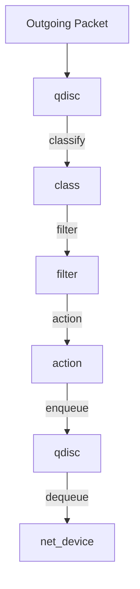

# Linux 流量控制（tc）


<!-- TOC START -->

- [Linux 流量控制（tc）](#linux-流量控制tc)
  - [1. tc 架构](#1-tc-架构)
  - [2. 核心组件](#2-核心组件)
  - [3. 常见 qdisc](#3-常见-qdisc)
    - [3.1 fq\_codel](#31-fq_codel)
    - [3.2 HTB](#32-htb)
    - [3.3 CAKE](#33-cake)
  - [4. filter 与 action](#4-filter-与-action)
    - [4.1 常见 filter](#41-常见-filter)
    - [4.2 常见 action](#42-常见-action)
  - [5. 配置示例](#5-配置示例)
  - [6. 场景分析](#6-场景分析)
  - [7. 术语表](#7-术语表)
  - [8. 相关文件](#8-相关文件)
  - [国际权威来源链接 / Authoritative Sources](#国际权威来源链接--authoritative-sources)

<!-- TOC END -->

> **权威来源**：Linux Advanced Routing & Traffic Control (LARTC), kernel.org `Documentation/networking/sched/`, LWN.net。
>
> **目标**：系统讲解 tc qdisc、class、filter、action，以及常见队列规则与工程调优。

---

## 1. tc 架构



---

## 2. 核心组件

| 组件 | 说明 |
|------|------|
| qdisc | 排队规则，决定包如何入队/出队 |
| class | 流量类别，用于层次化调度 |
| filter | 分类器，决定包进入哪个 class |
| action | 对匹配包执行的动作（drop/mirror/redirect） |

---

## 3. 常见 qdisc

| qdisc | 说明 | 适用 |
|-------|------|------|
| `pfifo_fast` | 默认，三个 band 的 FIFO | 通用 |
| `sfq` | Stochastic Fairness Queueing | 公平共享 |
| `tbf` | Token Bucket Filter | 限速 |
| `htb` | Hierarchical Token Bucket | 带宽分配 |
| `fq_codel` | Fair Queueing + Controlled Delay | 抗 bufferbloat |
| `cake` | Common Applications Kept Enhanced | 家庭/边缘 QoS |
| `mq` | Multi-Queue | 多队列网卡 |

### 3.1 fq_codel

- 每个流一个队列。
- 使用 codel 算法控制延迟。
- 默认 qdisc 推荐。

### 3.2 HTB

```
root 1:
  class 1:1 rate 100mbit ceil 100mbit
    class 1:10 rate 50mbit ceil 100mbit   # 关键业务
    class 1:20 rate 30mbit ceil 100mbit   # 普通业务
    class 1:30 rate 20mbit ceil 100mbit   # 后台业务
```

### 3.3 CAKE

- 集成带宽整形、ACK 压缩、流隔离、DSCP 处理。
- 适合家庭路由器和边缘网关。

---

## 4. filter 与 action

### 4.1 常见 filter

| filter | 说明 |
|--------|------|
| `u32` | 基于包头的 u32 匹配 |
| `flower` | 基于 flow key 的匹配 |
| `bpf` | eBPF 分类器 |
| `cgroup` | 基于 cgroup 分类 |

### 4.2 常见 action

| action | 说明 |
|--------|------|
| `drop` | 丢弃 |
| `pass` | 放行 |
| `mirred` | 镜像/重定向 |
| `vlan` | VLAN 修改 |
| `skbedit` | 修改 skb 元数据 |

---

## 5. 配置示例

```bash
# 查看当前 qdisc
tc qdisc show dev eth0

# 设置 fq_codel
tc qdisc replace dev eth0 root fq_codel

# HTB 限速与分类
tc qdisc add dev eth0 root handle 1: htb default 30
tc class add dev eth0 parent 1: classid 1:1 htb rate 100mbit
tc class add dev eth0 parent 1:1 classid 1:10 htb rate 50mbit ceil 100mbit
tc class add dev eth0 parent 1:1 classid 1:20 htb rate 30mbit ceil 100mbit
tc filter add dev eth0 protocol ip parent 1:0 u32 match ip dport 443 0xffff classid 1:10
```

---

## 6. 场景分析

| 场景 | qdisc | 关键参数 | 验证指标 |
|------|-------|----------|----------|
| 家庭宽带 QoS | cake | bandwidth, overhead | 延迟，bufferbloat |
| 数据中心带宽分配 | htb | rate, ceil | 带宽利用率 |
| 低延迟网络 | fq_codel | target, interval | P99 延迟 |
| 流量镜像 | tc filter + mirred | mirror port | 镜像完整性 |
| DDoS 缓解 | tc filter + police | rate limit | 丢包率 |

---

## 7. 术语表

| 中文 | 英文 | 一句话定义 |
|------|------|------------|
| qdisc | Queueing Discipline | 网络包排队规则 |
| HTB | Hierarchical Token Bucket | 层次令牌桶带宽分配 |
| TBF | Token Bucket Filter | 令牌桶流量整形 |
| fq_codel | Fair Queueing + CoDel | 公平队列 + 控制延迟 |
| CAKE | Common Applications Kept Enhanced | 集成 QoS 队列 |
| Bufferbloat | 缓冲膨胀 | 网络设备缓冲区过大导致的延迟 |
| DSCP | Differentiated Services Code Point | 差分服务代码点 |

---

## 8. 相关文件

- [Linux 网络协议栈](./linux-network-stack.md)
- [Netfilter/eBPF/XDP](./netfilter-ebpf-xdp.md)
- [内核卸载](./kernel-offload.md)

## 国际权威来源链接 / Authoritative Sources

- [Linux tc(8) manual](https://man7.org/linux/man-pages/man8/tc.8.html)
- [Linux Traffic Control - Kernel Scheduler Docs](https://docs.kernel.org/networking/sched/)
- [HTB manual](http://luxik.cdi.cz/~devik/qos/htb/)
- [CoDel and fq_codel (ACM Queue/Van Jacobson)](https://queue.acm.org/detail.cfm?id=2209336)
- [RFC 2475 - An Architecture for Differentiated Services](https://datatracker.ietf.org/doc/html/rfc2475)
- [RFC 2998 - A Framework for Integrated Services Operation over Diffserv](https://datatracker.ietf.org/doc/html/rfc2998)
