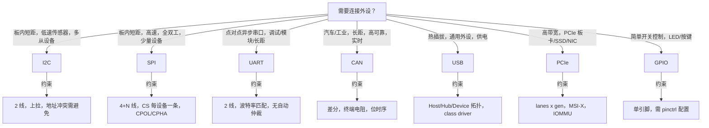
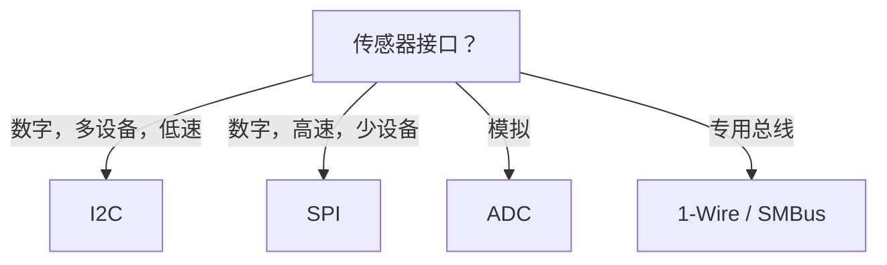
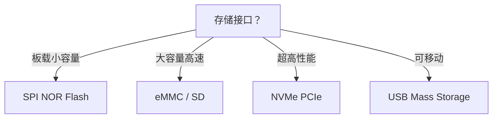
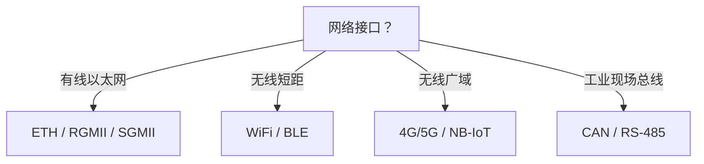

# 外设总线选择决策树

> **权威来源**：NXP I2C-bus Spec, SPI Block Guide, USB-IF, PCI-SIG, ISO 11898, Linux Device Drivers。
>
> **目标**：根据距离、速度、节点数、成本、实时性、供电等约束，给出外设总线/接口的选择决策。

---

## 1. 决策树

---

## 2. 总线对比矩阵

| 特性 | I2C | SPI | UART | CAN | USB | PCIe | GPIO |
|------|-----|-----|------|-----|-----|------|------|
| 信号线 | 2 (SDA/SCL) | 4+N (SCK/MOSI/MISO/CS) | 2 (TX/RX) | 2 (CANH/CANL) | 2/4/9 (VBUS/D+/D-/...) | 1~32 lanes | 1 |
| 同步/异步 | 同步 | 同步 | 异步 | 异步 | 同步 | 同步 | - |
| 双工 | 半双工 | 全双工 | 全双工 | 半双工 | 半双工 | 全双工 | - |
| 速度 | 100k~3.4Mbps | 1~50+ Mbps | 300bps~4Mbps | 125k~1Mbps | 1.5Mbps~20Gbps+ | 2.5GT/s~64GT/s | - |
| 多主/多从 | 多主多从 | 一主多从 | 点对点 | 多主多从 | 一主多从 | Root-Endpoint | - |
| 距离 | 板内 | 板内 | 数米~数十米 | 数十米~千米 | 数米 | 板内/背板 | 板内 |
| 错误检测 | ACK | 无（应用层） | 可选校验 | CRC + ACK | CRC | LCRC/ECRC | 无 |
| 硬件复杂度 | 低 | 中 | 低 | 中 | 高 | 高 | 极低 |
| Linux 驱动框架 | `i2c-core` | `spi-core` | `tty/serial` | `socketcan` | `usb-core` | `pci-core` | `gpiolib` |

---

## 3. 场景决策表

| 场景 | 约束 | 推荐总线 | 关键参数 | 典型设备 |
|------|------|----------|----------|----------|
| 环境传感器阵列 | 多设备，低速，2 线 | I2C | 地址，上拉电阻，速率 | BME280, MPU6050 |
| 高速 Flash/显示屏 | 高吞吐，板内 | SPI | CPOL/CPHA, CS, 时钟 | W25Q128, TFT |
| GPS/蓝牙/WiFi 模块 | 异步串口，调试 | UART | 波特率，流控，FIFO | u-blox, HC-05 |
| 汽车 ECU 通信 | 高可靠，抗干扰，长距 | CAN | 波特率，采样点，终端电阻 | 汽车传感器 |
| 键盘/U盘/摄像头 | 热插拔，供电，通用 | USB | class, endpoint, 版本 | HID, UVC, MSC |
| NVMe SSD/高速网卡 | 高带宽，DMA | PCIe | lanes, gen, MSI-X | NVMe, NIC |
| LED/按键/继电器 | 简单开关 | GPIO | 方向，电平，中断触发 | 基础 IO |

---

## 4. 多层决策

### 4.1 传感器接口选择

### 4.2 存储接口选择

### 4.3 网络接口选择

---

## 5. Linux 设备树绑定影响

| 总线 | 设备树关键属性 | 驱动匹配 |
|------|----------------|----------|
| I2C | `reg = <0x76>`（地址） | `of_match_table` + `i2c_device_id` |
| SPI | `reg = <0>`（CS 索引） | `spi_device_id` |
| UART | `compatible = "ns16550a"` | `of_match_table` |
| CAN | `compatible = "bosch,m_can"` | `platform_driver` |
| USB | VID/PID 自动枚举 | `usb_device_id` |
| PCIe | Vendor/Device ID | `pci_device_id` |
| GPIO | `gpio-controller`, `#gpio-cells` | `gpiochip` |

---

## 6. 常见陷阱

| 总线 | 常见问题 | 解决 |
|------|----------|------|
| I2C | 地址冲突，上拉电阻不匹配 | 使用 I2C mux，计算上拉 |
| SPI | CPOL/CPHA 不匹配，CS 时序 | 核对 datasheet |
| UART | 波特率误差，流控不一致 | 使用自动流控或统一配置 |
| CAN | 终端电阻缺失，采样点不对 | 总线两端 120Ω，正确位时序 |
| USB | 供电不足，枚举失败 | 检查 VBUS，hub 电流 |
| PCIe | 链路训练失败，BAR 映射错误 | 检查 clock/power/BIOS |
| GPIO | 中断触发方式不对 | 配置 rising/falling/both |

---

## 7. 国际来源映射

| 总线 | 来源类型 | 来源 |
|------|----------|------|
| I2C | Datasheet | NXP I2C-bus Specification |
| SPI | Datasheet | Motorola SPI Block Guide |
| USB | Standard | USB-IF USB 3.2 Spec |
| PCIe | Standard | PCI-SIG PCIe Base Spec |
| CAN | Standard | ISO 11898 |
| UART | Standard | RS-232 / 16550 UART |

---

## 8. 相关文件

- [外设概念树](./peripheral-concept-tree.md)
- [中断与 DMA](./interrupts-and-dma.md)
- [操作系统场景分析树](../00-concept-atlas/scenario-analysis-tree-os.md)
