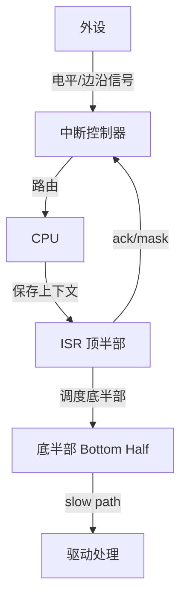
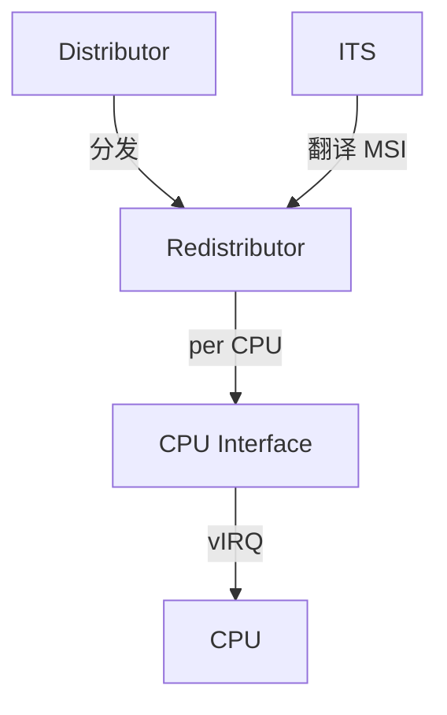
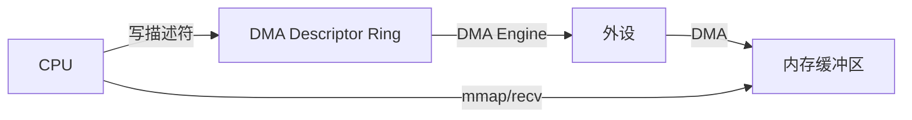

# 中断与 DMA


<!-- TOC START -->

- [中断与 DMA](#中断与-dma)
  - [1. 中断全景](#1-中断全景)
  - [2. 中断控制器](#2-中断控制器)
    - [2.1 ARM GICv3 组件](#21-arm-gicv3-组件)
  - [3. Linux 中断处理](#3-linux-中断处理)
    - [3.1 核心 API](#31-核心-api)
    - [3.2 顶半部与底半部](#32-顶半部与底半部)
    - [3.3 中断处理流程](#33-中断处理流程)
  - [4. DMA](#4-dma)
    - [4.1 DMA 类型](#41-dma-类型)
    - [4.2 Linux DMA API](#42-linux-dma-api)
    - [4.3 DMA 数据流](#43-dma-数据流)
  - [5. Cache Coherence](#5-cache-coherence)
  - [6. IOMMU](#6-iommu)
    - [6.1 IOMMU 映射](#61-iommu-映射)
  - [7. 中断亲和性与负载均衡](#7-中断亲和性与负载均衡)
  - [8. 场景分析](#8-场景分析)
  - [9. 术语表](#9-术语表)
  - [10. 国际来源映射](#10-国际来源映射)
  - [11. 相关文件](#11-相关文件)
  - [国际权威来源链接 / Authoritative Sources](#国际权威来源链接--authoritative-sources)

<!-- TOC END -->

> **权威来源**：Hennessy & Patterson, *Computer Architecture: A Quantitative Approach*; Linux Kernel Development (Love); ARM Generic Interrupt Controller Spec; Intel SDM Vol. 3A; Linux Device Drivers。
>
> **目标**：系统讲解中断控制器、中断处理流程、DMA 引擎、cache coherence、IOMMU，并映射到 Linux 源码。

---

## 1. 中断全景



---

## 2. 中断控制器

| 架构 | 中断控制器 | Linux 源码 | 关键特性 |
|------|------------|------------|----------|
| x86 | APIC / IO-APIC / x2APIC | `arch/x86/kernel/apic/` | Local APIC  per CPU, IO-APIC 路由 |
| ARM | GICv2 / GICv3 / GICv4 | `drivers/irqchip/irq-gic-v3.c` | Distributor, Redistributor, CPU interface |
| RISC-V | PLIC / APLIC / IMSIC | `drivers/irqchip/irq-riscv-intc.c` | 平台级中断控制器 |

### 2.1 ARM GICv3 组件



| 组件 | 作用 |
|------|------|
| Distributor | 接收外设中断，决定分发到哪个 Redistributor |
| Redistributor | 每个 CPU 一个，管理 PPI/SGI，控制中断属性 |
| CPU Interface | 向 CPU 发送虚拟/物理中断 |
| ITS | Interrupt Translation Service，处理 MSI/MSI-X |

---

## 3. Linux 中断处理

### 3.1 核心 API

| API | 说明 | 源码 |
|-----|------|------|
| `request_irq()` | 注册中断处理函数 | `kernel/irq/manage.c` |
| `request_threaded_irq()` | 注册 threaded IRQ | `kernel/irq/manage.c` |
| `free_irq()` | 释放中断 | `kernel/irq/manage.c` |
| `enable_irq()` / `disable_irq()` | 使能/禁止中断 | `kernel/irq/manage.c` |
| `irq_set_affinity()` | 设置中断亲和性 | `kernel/irq/manage.c` |

### 3.2 顶半部与底半部

| 机制 | 执行上下文 | 特点 | 适用 |
|------|------------|------|------|
| 顶半部（ISR） | 硬中断上下文 | 快速、不可阻塞 | ack 设备、调度底半部 |
| softirq | 软中断上下文 | 比 tasklet 更底层，同类型不能并行 | 网络、块设备 |
| tasklet | 软中断上下文 | 同一 tasklet 不能并行，不同 tasklet 可并行 | 普通驱动 |
| workqueue | 进程上下文 | 可睡眠 | 慢速 I/O、用户态通知 |
| threaded IRQ | 内核线程 | 可睡眠，实时性好 | PREEMPT_RT |

### 3.3 中断处理流程

```
外设触发中断
  ↓ 中断控制器路由到 CPU
  ↓ 保存现场，进入 ISR
    ↓ 顶半部：读取状态寄存器，ack 中断
    ↓ 如果需要更多处理，调度底半部
  ↓ 恢复现场，返回用户态
  ↓ 软中断/线程处理底半部
```

---

## 4. DMA

### 4.1 DMA 类型

| 类型 | 说明 | 例子 |
|------|------|------|
| Coherent DMA | 一致性内存，CPU 与 DMA 无需显式同步 | `dma_alloc_coherent()` |
| Streaming DMA | 流式映射，需要 cache sync | `dma_map_sg()` / `dma_unmap_sg()` |
| Cyclic DMA | 循环 DMA，用于音频等 | `dmaengine_prep_dma_cyclic()` |
| Slave DMA | 外设到内存或内存到外设 | `dmaengine_prep_slave_sg()` |
| Memcpy DMA | 内存到内存拷贝 | `dmaengine_prep_dma_memcpy()` |

### 4.2 Linux DMA API

| API | 说明 | 源码 |
|-----|------|------|
| `dma_alloc_coherent()` | 分配一致性 DMA 内存 | `kernel/dma/mapping.c` |
| `dma_free_coherent()` | 释放一致性 DMA 内存 | `kernel/dma/mapping.c` |
| `dma_map_sg()` | 映射 scatterlist | `kernel/dma/mapping.c` |
| `dma_unmap_sg()` | 解除映射 | `kernel/dma/mapping.c` |
| `dma_sync_sg_for_cpu()` | sync for CPU 访问 | `kernel/dma/mapping.c` |
| `dma_sync_sg_for_device()` | sync for device 访问 | `kernel/dma/mapping.c` |

### 4.3 DMA 数据流



---

## 5. Cache Coherence

| 场景 | 问题 | 解决方案 |
|------|------|----------|
| CPU 写数据，DMA 读 | CPU cache 中数据未写回内存 | `dma_sync_sg_for_device()` |
| DMA 写数据，CPU 读 | CPU cache 中数据是旧值 | `dma_sync_sg_for_cpu()` |
| 一致性内存 | 硬件保证 cache coherence | `dma_alloc_coherent()` |
| 非一致性内存 | 需要显式 flush/invalidate | streaming DMA mapping |

---

## 6. IOMMU

| 概念 | 说明 | 例子 |
|------|------|------|
| IOMMU | I/O 内存管理单元，把设备 DMA 地址翻译为物理地址 | Intel VT-d, AMD-Vi, ARM SMMU |
| DMA Remapping | 隔离设备 DMA 访问，防止恶意/错误设备访问全部内存 | - |
| ATS | Address Translation Services，PCIe 设备缓存翻译 | - |
| PASID | Process Address Space ID，设备支持多进程地址空间 | - |

### 6.1 IOMMU 映射

```
Device DMA Address
        ↓
    IOMMU Page Table
        ↓
Physical Address
```

| Linux 框架 | 说明 | 源码 |
|------------|------|------|
| IOMMU API | 通用 IOMMU 接口 | `drivers/iommu/iommu.c` |
| DMA ops | 透明使用 IOMMU | `kernel/dma/iommu.c` |
| VFIO | 用户态直接设备访问 + IOMMU | `drivers/vfio/` |

---

## 7. 中断亲和性与负载均衡

| 工具/参数 | 说明 |
|-----------|------|
| `/proc/irq/<n>/smp_affinity` | 设置中断 CPU 亲和性 |
| `irqbalance` | 自动平衡中断到各 CPU |
| `smp_affinity_list` | CPU 列表形式 |
| `RPS/RFS/XPS` | 网络软中断与发送队列分发 |

---

## 8. 场景分析

| 场景 | 关键机制 | 关键参数 | 验证指标 |
|------|----------|----------|----------|
| 高吞吐网卡 | NAPI + MSI-X + RSS/RPS | `smp_affinity`, `rps_cpus` | pps, CPU% |
| 低延迟实时 | threaded IRQ + CPU isolation | `irq_affinity`, `isolcpus` | 中断延迟 |
| 高性能存储 | MSI-X + NVMe queue + IOMMU | queue depth, NUMA | IOPS, 延迟 |
| 音频采集 | cyclic DMA + coherent memory | period size, buffer size |  underrun |

---

## 9. 术语表

| 中文 | 英文 | 一句话定义 |
|------|------|------------|
| 中断 | Interrupt | 外设异步通知 CPU 的机制 |
| ISR | Interrupt Service Routine | 中断服务例程，处理中断事件 |
| 底半部 | Bottom Half | 延迟执行的中断处理路径 |
| DMA | Direct Memory Access | 外设不经过 CPU 直接与内存交换数据 |
| Scatter-Gather | SG | 分散/聚合，支持非连续内存的 DMA |
| IOMMU | I/O Memory Management Unit | 设备 DMA 地址翻译与隔离单元 |
| Cache Coherence | 缓存一致性 | 多主访问同一内存时缓存数据一致 |
| MSI | Message Signaled Interrupts | 通过内存写消息触发的中断 |

---

## 10. 国际来源映射

| 概念 | 来源类型 | 来源 | 位置 |
|------|----------|------|------|
| 中断与 I/O | Textbook | Hennessy & Patterson | Ch. I/O Systems |
| Linux 中断 | SourceCode | Linux Kernel | `kernel/irq/`, `include/linux/interrupt.h` |
| ARM GIC | Datasheet | ARM | ARM Generic Interrupt Controller Spec |
| Intel APIC | Datasheet | Intel | Intel SDM Vol. 3A |
| Linux DMA | Book | Linux Device Drivers | Ch. 15 Memory Mapping and DMA |
| IOMMU | Standard | Intel VT-d / ARM SMMU | Spec |

---

## 11. 相关文件

- [外设概念树](./peripheral-concept-tree.md)
- [外设总线选择决策树](./decision-tree-peripheral-bus.md)
- [Linux 设备驱动](../05-linux-kernel/devices-drivers-linux.md)
- [系统调用接口](../08-interfaces/syscall-interface.md)

## 国际权威来源链接 / Authoritative Sources

- [Intel 64 and IA-32 Architectures Software Developer's Manual, Vol. 3A](https://www.intel.com/content/www/us/en/developer/articles/technical/intel-sdm.html)
- [ARM Generic Interrupt Controller (GIC) Architecture Specification](https://developer.arm.com/documentation/198123/0100)
- [RISC-V PLIC Specification](https://github.com/riscv/riscv-plic-spec)
- [RISC-V ACLINT Specification](https://github.com/riscv/riscv-aclint)
- [Linux DMAEngine documentation](https://docs.kernel.org/driver-api/dmaengine/)
- [Linux IRQ subsystem documentation](https://docs.kernel.org/core-api/irq/index.html)
- [Linux Device Drivers - Memory Mapping and DMA](https://static.lwn.net/images/pdf/LDD3/ch15.pdf)
