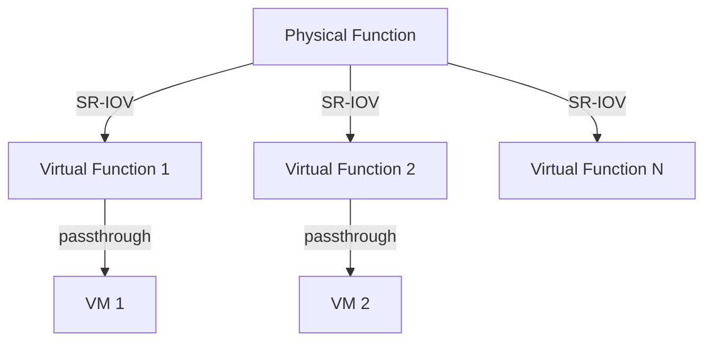
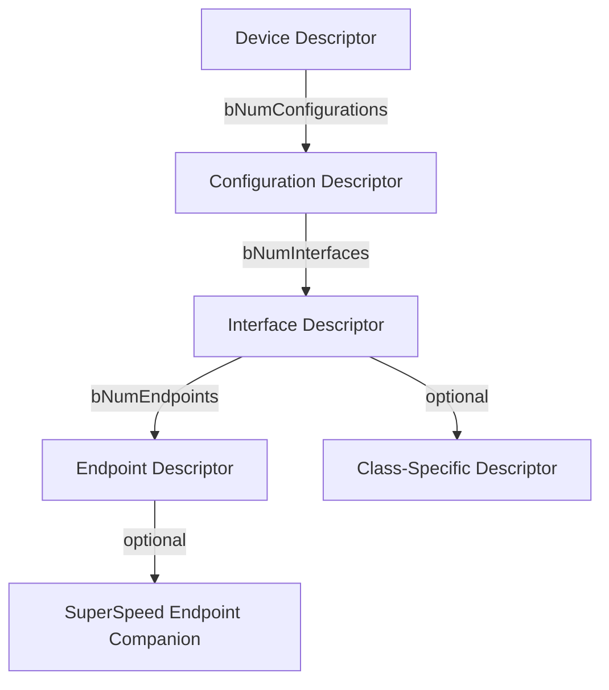

# PCIe / USB 描述符与配置空间结构化描述

<!-- TOC START -->

- [PCIe / USB 描述符与配置空间结构化描述](#pcie--usb-描述符与配置空间结构化描述)
  - [1. PCIe 配置空间](#1-pcie-配置空间)
    - [1.1 Type 0 Header（Endpoint）](#11-type-0-headerendpoint)
    - [1.2 BAR 类型](#12-bar-类型)
  - [2. PCIe 能力结构](#2-pcie-能力结构)
    - [2.1 MSI / MSI-X](#21-msi--msi-x)
    - [2.2 PCIe 链路能力](#22-pcie-链路能力)
  - [3. SR-IOV](#3-sr-iov)
  - [4. USB 描述符](#4-usb-描述符)
    - [4.1 设备描述符](#41-设备描述符)
    - [4.2 配置/接口/端点描述符](#42-配置接口端点描述符)
    - [4.3 端点类型](#43-端点类型)
  - [5. USB 请求与 URB](#5-usb-请求与-urb)
    - [5.1 控制传输 Setup 包](#51-控制传输-setup-包)
    - [5.2 URB（USB Request Block）](#52-urbusb-request-block)
  - [6. 国际来源映射](#6-国际来源映射)
  - [7. 相关文件](#7-相关文件)

<!-- TOC END -->

> **权威来源**：PCI Express Base Specification 6.0/7.0, PCI-SIG SR-IOV, USB 2.0/3.2/USB4 Specifications, USB-IF。
>
> **目标**：建立 PCIe 配置空间/USB 描述符的结构化描述，为驱动开发与跨层映射提供参考。

---

## 1. PCIe 配置空间

PCIe 配置空间大小：

- 传统配置空间：256 bytes
- 扩展配置空间：4 KB

### 1.1 Type 0 Header（Endpoint）

| 偏移 | 长度 | 字段 | 说明 |
|------|------|------|------|
| 0x00 | 2 | Vendor ID | 厂商标识 |
| 0x02 | 2 | Device ID | 设备标识 |
| 0x04 | 2 | Command | 设备命令寄存器 |
| 0x06 | 2 | Status | 设备状态寄存器 |
| 0x08 | 1 | Revision ID | 版本号 |
| 0x09 | 3 | Class Code | 类别代码（Base/Sub/Interface） |
| 0x0C | 1 | Cache Line Size | 缓存行大小 |
| 0x0D | 1 | Latency Timer | 主设备延迟计时器 |
| 0x0E | 1 | Header Type | 0=Endpoint, 1=Bridge |
| 0x0F | 1 | BIST | 内置自测 |
| 0x10~0x27 | 24 | BAR[0~5] | 基地址寄存器 |
| 0x28 | 4 | CardBus CIS | - |
| 0x2C | 2 | Subsystem Vendor ID | 子系统厂商 |
| 0x2E | 2 | Subsystem ID | 子系统 ID |
| 0x30 | 4 | ROM BAR | 扩展 ROM 基地址 |
| 0x34 | 1 | Capabilities Pointer | 能力链表指针 |
| 0x3C | 1 | Interrupt Line | 中断线（PIC IRQ） |
| 0x3D | 1 | Interrupt Pin | 中断引脚 |
| 0x3E | 2 | Min/Max Gnt/Lat | - |

### 1.2 BAR 类型

| BAR 位 | 含义 |
|--------|------|
| bit 0 | 0=32-bit MMIO, 1=I/O space |
| bit 1~2 | 32/64-bit 类型指示 |
| bit 3 | Prefetchable |
| 高位 | 基地址 |

---

## 2. PCIe 能力结构

PCIe 通过 Capabilities List 链接扩展能力：

### 2.1 MSI / MSI-X

| 特性 | MSI | MSI-X |
|------|-----|-------|
| 中断向量数 | 1~32 | 1~2048 |
| 每个向量独立地址 | 否 | 是 |
| 配置位置 | Capability 0x05 | Capability 0x11 |
| Linux API | `pci_enable_msi()` | `pci_enable_msix_range()` |

### 2.2 PCIe 链路能力

| 寄存器 | 说明 |
|--------|------|
| Link Capabilities | 最大链路速度/宽度 |
| Link Status | 当前协商速度/宽度 |
| Link Control | ASPM、链路重训练 |

---

## 3. SR-IOV

Single Root I/O Virtualization 允许单个物理功能（PF）创建多个虚拟功能（VF）。

| 概念 | 说明 |
|------|------|
| PF (Physical Function) | 完整 PCIe 功能，可配置 SR-IOV |
| VF (Virtual Function) | 轻量级 PCIe 功能，仅数据路径 |
| TotalVFs | PF 可创建的 VF 数量 |
| InitialVFs | 初始化时创建的 VF 数量 |
| VF Stride / Offset | VF 在配置空间/BAR 中的排列 |

---

## 4. USB 描述符

USB 设备通过层次化描述符描述自身：

### 4.1 设备描述符

| 偏移 | 长度 | 字段 | 说明 |
|------|------|------|------|
| 0 | 1 | bLength | 描述符长度 |
| 1 | 1 | bDescriptorType | 0x01 |
| 2 | 2 | bcdUSB | USB 版本 |
| 4 | 1 | bDeviceClass | 设备类 |
| 5 | 1 | bDeviceSubClass | 子类 |
| 6 | 1 | bDeviceProtocol | 协议 |
| 7 | 1 | bMaxPacketSize0 | 端点 0 最大包大小 |
| 8 | 2 | idVendor | 厂商 ID |
| 10 | 2 | idProduct | 产品 ID |
| 12 | 2 | bcdDevice | 设备版本 |
| 14 | 1 | iManufacturer | 厂商字符串索引 |
| 15 | 1 | iProduct | 产品字符串索引 |
| 16 | 1 | iSerialNumber | 序列号字符串索引 |
| 17 | 1 | bNumConfigurations | 配置数 |

### 4.2 配置/接口/端点描述符

| 描述符 | bDescriptorType | 关键字段 |
|--------|-----------------|----------|
| Configuration | 0x02 | bNumInterfaces, bConfigurationValue, bmAttributes, bMaxPower |
| Interface | 0x04 | bInterfaceNumber, bAlternateSetting, bNumEndpoints, bInterfaceClass |
| Endpoint | 0x05 | bEndpointAddress, bmAttributes, wMaxPacketSize, bInterval |
| String | 0x03 | 语言 ID / Unicode 字符串 |
| Interface Association | 0x0B | 多个接口组合（如 CDC） |

### 4.3 端点类型

| 类型 | 用途 |
|------|------|
| Control | 配置/枚举 |
| Isochronous | 音视频流 |
| Bulk | 大容量存储、以太网 |
| Interrupt | HID、传感器 |

---

## 5. USB 请求与 URB

### 5.1 控制传输 Setup 包

| 偏移 | 长度 | 字段 | 说明 |
|------|------|------|------|
| 0 | 1 | bmRequestType | 请求类型/方向/接收者 |
| 1 | 1 | bRequest | 请求码 |
| 2 | 2 | wValue | 参数 |
| 4 | 2 | wIndex | 索引/接口/端点 |
| 6 | 2 | wLength | 数据阶段长度 |

### 5.2 URB（USB Request Block）

Linux 中 USB 传输的基本单位：

| 字段 | 说明 |
|------|------|
| `pipe` | 端点管道 |
| `transfer_buffer` | 数据缓冲区 |
| `transfer_dma` | DMA 地址 |
| `status` | 完成状态 |
| `actual_length` | 实际传输长度 |
| `complete` | 完成回调 |

---

## 6. 国际来源映射

| 概念 | 来源类型 | 来源 | 位置 |
|------|----------|------|------|
| PCIe 配置空间 | Standard | PCI-SIG | PCI Express Base Spec 6.0/7.0 |
| SR-IOV | Standard | PCI-SIG | SR-IOV Specification |
| USB 描述符 | Standard | USB-IF | USB 2.0/3.2/USB4 Spec |
| Linux PCIe 驱动 | SourceCode | Linux Kernel | `drivers/pci/` |
| Linux USB 驱动 | SourceCode | Linux Kernel | `drivers/usb/` |

---

## 7. 相关文件

- [外设概念树](./peripheral-concept-tree.md)
- [外设总线决策树](./decision-tree-peripheral-bus.md)
- [中断与 DMA](./interrupts-and-dma.md)
- [I²C/SPI/CAN 时序与协议](./timing-diagrams-i2c-spi-can.md)
