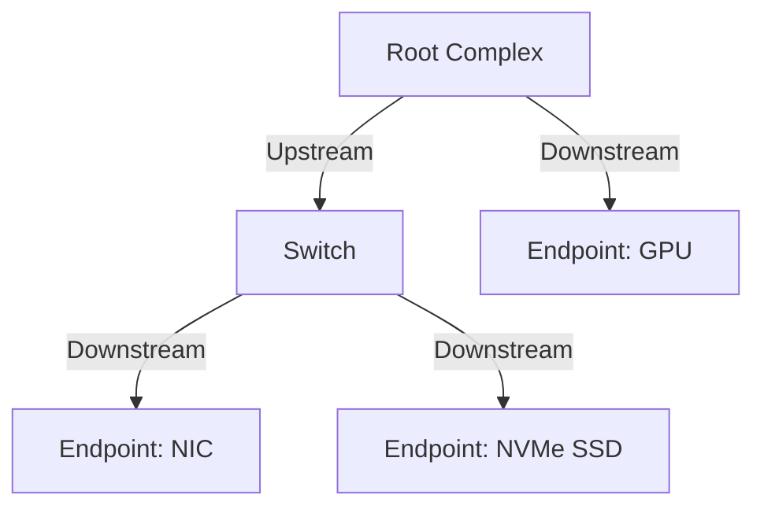

# PCIe 总线

> **权威来源**：PCI-SIG PCIe Base Specification, Linux Kernel `drivers/pci/`, LWN.net。
>
> **目标**：系统讲解 PCIe 拓扑、枚举、配置空间、BAR、MSI/MSI-X、IOMMU、SR-IOV。

---

## 1. PCIe 拓扑



---

## 2. 配置空间

| 区域 | 偏移 | 说明 |
|------|------|------|
| Common Header | 0x00~0x3F | Vendor ID, Device ID, Command, Status 等 |
| Type 0/1 Header | 0x00~0x3F | Endpoint/Bridge |
| Capabilities | 0x40+ | PCI/PCIe 能力链表 |
| Extended Config | 0x100~0xFFF | PCIe 扩展能力 |

### 2.1 关键寄存器

| 寄存器 | 说明 |
|--------|------|
| Vendor ID / Device ID | 厂商/设备标识 |
| Command | 使能 IO/Memory/Bus Master/MSI |
| Status | 设备状态 |
| BAR0~BAR5 | Base Address Registers |
| Capabilities Pointer | 能力链表头 |

### 2.2 BAR

| BAR 类型 | 说明 |
|----------|------|
| 32-bit Memory | 32-bit 内存映射 |
| 64-bit Memory | 64-bit 内存映射 |
| I/O Space | x86 I/O 端口空间 |

---

## 3. 枚举过程

```
Root Complex
  ↓ 扫描 Bus 0
    ↓ 读取 Vendor ID
      ↓ 发现 Bridge
        ↓ 分配次级总线号
        ↓ 递归扫描下游设备
      ↓ 发现 Endpoint
        ↓ 分配 BAR 地址
        ↓ 使能 Bus Master
```

---

## 4. 中断机制

| 机制 | 说明 |
|------|------|
| INTx | 传统中断，共享 |
| MSI | Message Signaled Interrupt，1~32 个向量 |
| MSI-X | 扩展 MSI，最多 2048 个向量 |
| ATS | Address Translation Services |

---

## 5. Linux PCI 子系统

### 5.1 核心数据结构

| 数据结构 | 源码 | 说明 |
|----------|------|------|
| `struct pci_dev` | `include/linux/pci.h` | PCI 设备 |
| `struct pci_driver` | `include/linux/pci.h` | PCI 驱动 |
| `struct pci_bus` | `include/linux/pci.h` | PCI 总线 |

### 5.2 驱动 API

| API | 说明 |
|-----|------|
| `pci_register_driver()` | 注册驱动 |
| `pci_enable_device()` | 使能设备 |
| `pci_request_regions()` | 请求 BAR 区域 |
| `pci_iomap()` | 映射 BAR |
| `pci_set_master()` | 使能 Bus Master |
| `pci_enable_msix_range()` | 启用 MSI-X |

---

## 6. IOMMU 与 SR-IOV

### 6.1 IOMMU

- 隔离设备 DMA 访问。
- 支持 PCI PASID，设备可访问多进程地址空间。

### 6.2 SR-IOV

| 概念 | 说明 |
|------|------|
| PF | Physical Function，管理 SR-IOV |
| VF | Virtual Function，轻量虚拟网卡 |
| `sriov_numvfs` | 启用 VF 数量 |

---

## 7. 场景分析

| 场景 | 关键参数 | 验证指标 |
|------|----------|----------|
| 高速网卡 | lanes, gen, MSI-X | Gbps, pps |
| NVMe SSD | lanes x gen, queue depth | IOPS, 延迟 |
| GPU 直通 | IOMMU, large BAR | 带宽 |
| NFV | SR-IOV VF | 吞吐接近裸机 |

---

## 8. 术语表

| 中文 | 英文 | 一句话定义 |
|------|------|------------|
| PCIe | Peripheral Component Interconnect Express | 高速串行扩展总线标准 |
| Root Complex | 根复合体 | CPU 与 PCIe 拓扑的连接点 |
| Endpoint | 端点 | PCIe 终端设备 |
| BAR | Base Address Register | 配置空间中的基址寄存器 |
| MSI-X | Message Signaled Interrupts Extended | 扩展消息信号中断 |
| IOMMU | I/O Memory Management Unit | I/O 内存管理单元 |
| SR-IOV | Single Root I/O Virtualization | 单根 I/O 虚拟化 |
| ATS | Address Translation Services | PCIe 地址翻译服务 |

---

## 9. 相关文件

- [外设概念树](./peripheral-concept-tree.md)
- [中断与 DMA](./interrupts-and-dma.md)

## 国际权威来源链接 / Authoritative Sources

- [PCI-SIG Specifications (PCI Express Base Spec 6.0/7.0)](https://pcisig.com/specifications)
- [Linux PCI subsystem documentation](https://docs.kernel.org/PCI/)
- [PCI Express I/O Virtualization (SR-IOV)](https://pcisig.com/specifications/iov)
- [Intel VT-d / IOMMU specification](https://www.intel.com/content/www/us/en/developer/articles/technical/intel-virtualization-technology-for-directed-io-io-virtualization-technology.html)
