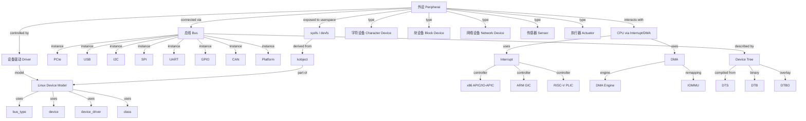
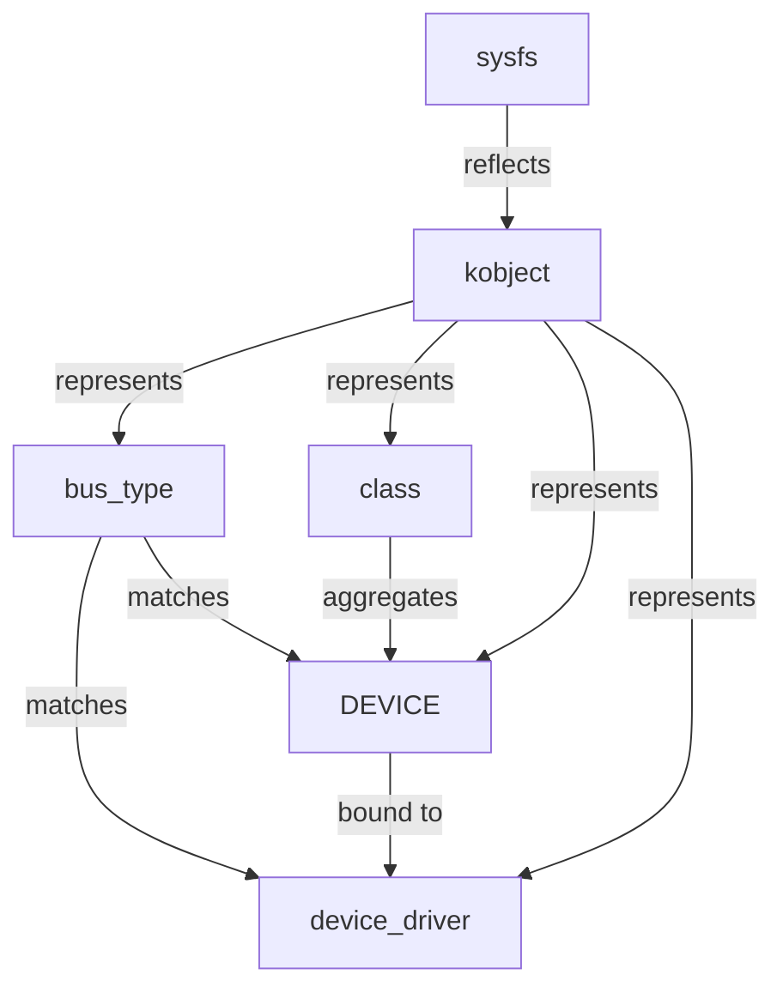

# 外设与总线概念树（Peripheral & Bus Concept Tree）

> **权威来源**：Linux Device Drivers (Corbet, Rubini, Kroah-Hartman), PCI-SIG PCIe Base Spec, USB-IF, NXP I2C-bus Spec, SPI Block Guide, ARM Device Tree Spec。
>
> **目标**：建立计算机外设、总线、接口的完整概念树，覆盖分类、属性、关系、Linux 驱动框架与典型场景。

---

## 1. 全局概念树

---

## 2. 外设分类与属性

| 类别 | 说明 | 例子 | Linux 访问方式 |
|------|------|------|----------------|
| 字符设备 | 字节流，顺序访问 | 串口、键盘、传感器 | `/dev/ttyS0`, `/dev/iio:device0` |
| 块设备 | 随机访问，按块读写 | SSD、HDD、SD 卡 | `/dev/sda`, `/dev/nvme0n1` |
| 网络设备 | 发送/接收网络帧 | 网卡、WiFi | `eth0`, `wlan0` |
| 传感器 | 采集环境数据 | 温度、加速度、光线 | `iio` 子系统 |
| 执行器 | 输出控制信号 | LED、电机、继电器 | `gpio`, `pwm` |

### 2.1 通用属性

| 属性 | 类型 | 说明 |
|------|------|------|
| `vendor_id` | String/ℕ | 厂商标识 |
| `device_id` | String/ℕ | 设备标识 |
| `bus` | BusType | 所属总线 |
| `registers` | List<(addr, size)> | 寄存器基地址与范围 |
| `interrupts` | List<IRQ> | 中断号/中断-parent |
| `clocks` | List<Clock> | 所需时钟源 |
| `power_domain` | String | 电源域 |

---

## 3. 总线概念展开

### 3.1 PCIe

| 概念 | 说明 | 关键属性 |
|------|------|----------|
| Root Complex | 根复合体，连接 CPU 与 PCIe 拓扑 | - |
| Endpoint | 端点设备，如网卡、SSD | Vendor ID, Device ID |
| Switch | 扩展 PCIe 端口 | 上游/下游端口 |
| Configuration Space | 配置空间，256/4096 字节 | Header Type, BAR, Capabilities |
| BAR | 基址寄存器，映射 MMIO/I/O 空间 | BAR0~BAR5 |
| MSI/MSI-X | 消息信号中断 | Message Address/Data |
| SR-IOV | 单根 I/O 虚拟化 | PF, VF |

### 3.2 USB

| 概念 | 说明 | 关键属性 |
|------|------|----------|
| Host Controller | 主机控制器：xHCI/ehci/ohci/uhci | 速度等级 |
| Device | USB 设备 | Vendor ID, Product ID, bConfigurationValue |
| Configuration | 配置 | 一个设备可有多个配置 |
| Interface | 接口 | 对应一个功能/驱动 |
| Endpoint | 端点 | 传输方向与类型 (bulk/int/iso/control) |
| URB | USB Request Block | 异步传输单元 |
| Gadget | USB 从设备模式 | 设备侧控制器 |

### 3.3 I2C

| 概念 | 说明 | 关键属性 |
|------|------|----------|
| SDA | 数据线 | 开漏，需上拉 |
| SCL | 时钟线 | 主机驱动 |
| Start/Stop | 起始/停止条件 | SDA 在 SCL 高时变化 |
| ACK/NACK | 应答/非应答 | 每字节后 1 bit |
| 7-bit/10-bit Address | 设备地址 | 0x03-0x77（7-bit） |
| Clock Stretching | 时钟拉伸 | 从机拉低 SCL |

### 3.4 SPI

| 概念 | 说明 | 关键属性 |
|------|------|----------|
| SCK | 串行时钟 | 主机输出 |
| MOSI | 主机出从机入 | - |
| MISO | 主机入从机出 | - |
| CS/SS | 片选 | 每个从机独立 |
| CPOL | 时钟极性 | 0/1 |
| CPHA | 时钟相位 | 0/1 |
| Mode | {0,1,2,3} | CPOL+CPHA 组合 |

### 3.5 UART

| 概念 | 说明 | 关键属性 |
|------|------|----------|
| TX | 发送 | - |
| RX | 接收 | - |
| Baud Rate | 波特率 | 9600/115200/921600 |
| Data Bits | 数据位 | 8 |
| Stop Bits | 停止位 | 1/2 |
| Parity | 校验 | None/Even/Odd |
| Flow Control | 流控 | None/RTS/CTS/XON/XOFF |
| FIFO | 硬件 FIFO | 16550 兼容 |

### 3.6 GPIO

| 概念 | 说明 | 关键属性 |
|------|------|----------|
| Pin | 引脚 | 物理 GPIO 编号 |
| Direction | 方向 | in/out |
| Value | 电平 | 0/1 |
| Edge | 触发边沿 | none/rising/falling/both |
| pinctrl | 引脚复用控制 | mux function |
| gpiochip | GPIO 控制器抽象 | base, ngpio |

### 3.7 CAN

| 概念 | 说明 | 关键属性 |
|------|------|----------|
| Frame | 帧 | ID, DLC, Data |
| Standard/Extended ID | 11-bit / 29-bit | - |
| Bit Timing | 位时序 | TSEG1, TSEG2, SJW, BRP |
| ACK Slot | 应答槽 | 多节点 ACK |
| Bus Arbitration | 总线仲裁 | 线与逻辑，ID 小优先 |
| SocketCAN | Linux CAN 框架 | `can0`, `socketcan` |

---

## 4. Linux 设备模型

### 4.1 核心数据结构

| 概念 | 数据结构 | 源码 | 说明 |
|------|----------|------|------|
| 总线 | `struct bus_type` | `include/linux/device/bus.h` | `match`, `probe`, `remove` |
| 设备 | `struct device` | `include/linux/device.h` | `parent`, `bus`, `driver`, `knode_class` |
| 驱动 | `struct device_driver` | `include/linux/device/driver.h` | `name`, `bus`, `probe`, `remove` |
| 类 | `struct class` | `include/linux/device/class.h` | 生成 `/dev/` 节点 |
| 平台设备 | `struct platform_device` | `include/linux/platform_device.h` | 非总线型设备 |
| 平台驱动 | `struct platform_driver` | `include/linux/platform_device.h` | 匹配 `compatible` |

---

## 5. 中断与 DMA

| 概念 | 说明 | Linux 关键元素 |
|------|------|----------------|
| 中断 | 外设通知 CPU 事件 | `request_irq()`, `request_threaded_irq()` |
| 中断控制器 | 路由中断到 CPU | x86 APIC, ARM GIC, RISC-V PLIC |
| 顶半部 | 硬中断，快速处理 | ISR |
| 底半部 | 延迟处理 | softirq, tasklet, workqueue, threaded IRQ |
| DMA | 直接内存访问 | `dma_map_sg()`, `dma_alloc_coherent()` |
| DMA Engine | 统一 DMA 控制器框架 | `dmaengine` API |
| IOMMU | I/O 内存管理单元 | Intel VT-d, ARM SMMU |

---

## 6. 设备树（Device Tree）

### 6.1 核心概念

| 概念 | 说明 | 示例 |
|------|------|------|
| DTS | 设备树源文件 | `arch/arm64/boot/dts/xxx.dts` |
| DTB | 编译后的二进制设备树 | 由 bootloader 传给内核 |
| DTBO | 设备树覆盖层 | 动态加载 overlay |
| Node | 设备节点 | `/soc/i2c@12340000` |
| Property | 节点属性 | `compatible`, `reg`, `interrupts` |

### 6.2 标准属性

| 属性 | 说明 | 示例 |
|------|------|------|
| `compatible` | 驱动匹配字符串 | `"nxp,pca9555"` |
| `reg` | 寄存器地址与长度 | `reg = <0x12340000 0x100>` |
| `interrupts` | 中断描述 | `interrupts = <0 42 4>` |
| `clocks` | 时钟引用 | `clocks = <&clk_uart>` |
| `pinctrl-0` | 引脚配置 | `pinctrl-0 = <&uart0_pins>` |
| `status` | 节点状态 | `"okay"` / `"disabled"` |

---

## 7. 术语表

| 中文 | 英文 | 一句话定义 |
|------|------|------------|
| 总线 | Bus | 连接 CPU 与外设的通信通道 |
| 设备驱动 | Device Driver | 操作系统中控制特定硬件设备的软件模块 |
| 设备树 | Device Tree | 描述硬件配置的数据结构，用于驱动匹配 |
| 中断 | Interrupt | 外设异步通知 CPU 的机制 |
| DMA | Direct Memory Access | 外设直接与内存交换数据，无需 CPU 参与 |
| 设备模型 | Linux Device Model | 总线-设备-驱动-类的统一抽象框架 |
| GPIO | General Purpose Input/Output | 通用输入输出引脚 |
| pinctrl | Pin Controller | 引脚复用与电气特性控制 |

---

## 8. 国际来源映射

| 概念 | 来源类型 | 来源 | 位置 |
|------|----------|------|------|
| Linux 设备模型 | Book | Linux Device Drivers, 3rd Ed. | Ch. 14 The Linux Device Model |
| 设备树 | Standard | ARM Devicetree Specification | Release 0.3 |
| PCIe | Standard | PCI-SIG PCIe Base Spec | Rev 6.0 |
| USB | Standard | USB-IF USB 3.2 Spec | - |
| I2C | Datasheet | NXP I2C-bus Specification | UM10204 |
| SPI | Datasheet | Motorola SPI Block Guide | - |
| CAN | Standard | ISO 11898 | - |
| ARM GIC | Datasheet | ARM Generic Interrupt Controller | ARM GICv3/v4 Spec |

---

## 9. 相关文件

- [中断与 DMA](./interrupts-and-dma.md)
- [外设总线选择决策树](./decision-tree-peripheral-bus.md)
- [I2C](./i2c.md)
- [SPI](./spi.md)
- [UART](./uart.md)
- [GPIO](./gpio.md)
- [PCIe](./pcie.md)
- [USB](./usb.md)
- [系统调用接口](../08-interfaces/syscall-interface.md)
- [HAL/BSP/设备树](../08-interfaces/hal-bsp-device-tree.md)
