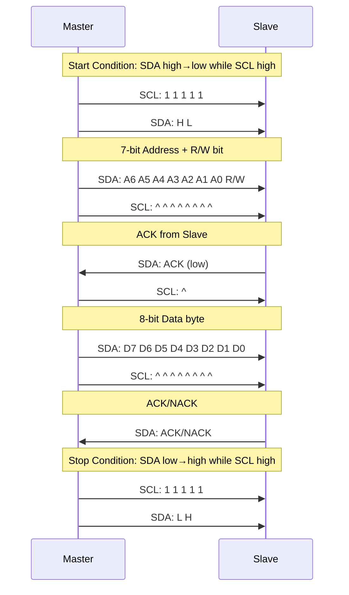
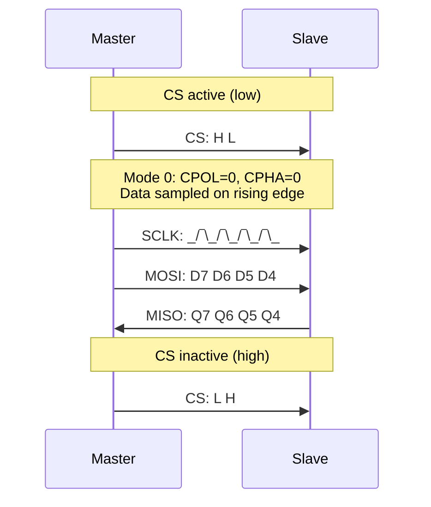
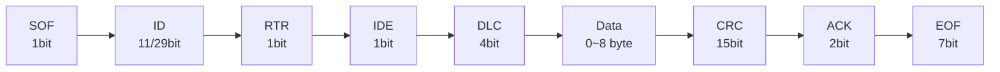
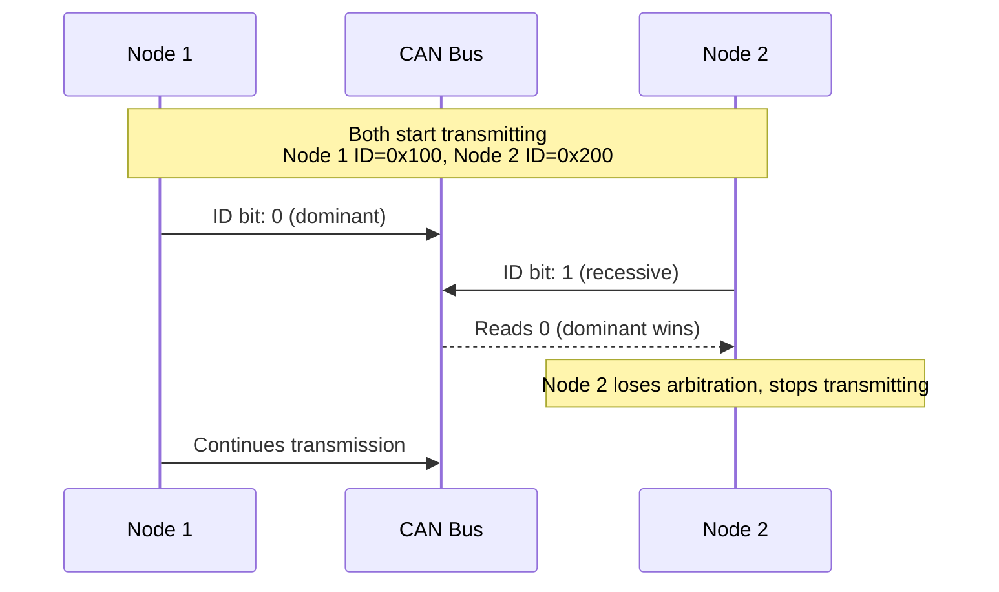

# 外设总线时序与协议细节：I²C / SPI / CAN

<!-- TOC START -->

- [外设总线时序与协议细节：I²C / SPI / CAN](#外设总线时序与协议细节ic--spi--can)
  - [1. I²C 时序与协议](#1-ic-时序与协议)
    - [1.1 信号线](#11-信号线)
    - [1.2 时序图](#12-时序图)
    - [1.3 关键时序参数](#13-关键时序参数)
    - [1.4 地址与帧格式](#14-地址与帧格式)
    - [1.5 错误处理](#15-错误处理)
  - [2. SPI 时序与协议](#2-spi-时序与协议)
    - [2.1 信号线](#21-信号线)
    - [2.2 时序图](#22-时序图)
    - [2.3 SPI 模式](#23-spi-模式)
    - [2.4 关键时序参数](#24-关键时序参数)
    - [2.5 错误处理](#25-错误处理)
  - [3. CAN 时序与协议](#3-can-时序与协议)
    - [3.1 信号线](#31-信号线)
    - [3.2 帧格式](#32-帧格式)
    - [3.3 位时序](#33-位时序)
    - [3.4 仲裁机制](#34-仲裁机制)
    - [3.5 错误处理](#35-错误处理)
  - [4. 错误处理机制](#4-错误处理机制)
  - [5. 选型对比](#5-选型对比)
  - [6. 国际来源映射](#6-国际来源映射)
  - [7. 相关文件](#7-相关文件)

<!-- TOC END -->

> **权威来源**：NXP I²C-bus Specification UM10204 Rev. 7, Motorola SPI Block Guide V04.01, ISO 11898-1:2015, Bosch CAN Specification 2.0。
>
> **目标**：建立 I²C/SPI/CAN 的时序图、电气特性、错误处理与场景选型的结构化描述。

---

## 1. I²C 时序与协议

### 1.1 信号线

| 信号 | 方向 | 说明 |
|------|------|------|
| SDA | 双向 | 数据线，开漏输出 |
| SCL | 主机驱动 | 时钟线，开漏输出 |

### 1.2 时序图

### 1.3 关键时序参数

| 参数 | 标准模式 | 快速模式 | 快速模式+ | 高速模式 |
|------|----------|----------|-----------|----------|
| SCL 时钟频率 | 100 kHz | 400 kHz | 1 MHz | 3.4 MHz |
| 建立时间 tSU;DAT | 250 ns | 100 ns | 50 ns | 10 ns |
| 保持时间 tHD;DAT | 0 ns | 0 ns | 0 ns | 0 ns |
| 上升时间 tR | 1000 ns | 300 ns | 120 ns | 80 ns |
| 下降时间 tF | 300 ns | 300 ns | 120 ns | 80 ns |

### 1.4 地址与帧格式

- 7-bit 地址：最高 7 位为地址，最低位为 R/W（0=写，1=读）
- 10-bit 地址：11110 + A9~A8 + R/W + A7~A0
- 广播地址：0x00

### 1.5 错误处理

| 错误 | 检测方式 | 处理 |
|------|----------|------|
| 仲裁丢失 | SDA 读回与发送不一致 | 主设备停止发送，等待总线空闲 |
| NACK | 从设备返回 NACK | 主机重试或终止传输 |
| 时钟拉伸 | SCL 被从设备拉低 | 主机等待 SCL 释放 |
| 总线死锁 | SDA/SCL 长期低电平 | 发送 9 个时钟脉冲或复位 |

---

## 2. SPI 时序与协议

### 2.1 信号线

| 信号 | 方向 | 说明 |
|------|------|------|
| MOSI | 主机→从机 | 主机输出，从机输入 |
| MISO | 从机→主机 | 主机输入，从机输出 |
| SCLK | 主机驱动 | 串行时钟 |
| CS/SS | 主机驱动 | 片选，低有效 |

### 2.2 时序图

### 2.3 SPI 模式

| 模式 | CPOL | CPHA | 时钟空闲 | 采样边沿 |
|------|------|------|----------|----------|
| 0 | 0 | 0 | 低 | 上升沿 |
| 1 | 0 | 1 | 低 | 下降沿 |
| 2 | 1 | 0 | 高 | 下降沿 |
| 3 | 1 | 1 | 高 | 上升沿 |

### 2.4 关键时序参数

| 参数 | 说明 | 典型值 |
|------|------|--------|
| fSCLK | 最大时钟频率 | 1~50+ MHz |
| tCS_setup | CS 建立时间 | 数 ns~数 us |
| tCS_hold | CS 保持时间 | 数 ns~数 us |
| tSU | 数据建立时间 | 数 ns |
| tHO | 数据保持时间 | 数 ns |

### 2.5 错误处理

| 错误 | 检测方式 | 处理 |
|------|----------|------|
| 数据溢出 | 从机接收缓冲满 | 丢弃新数据或置位状态标志 |
| 时钟模式不匹配 | 通信失败 | 配置正确的 CPOL/CPHA |
| CS 毛刺 | 意外片选 | 硬件滤波或软件去抖 |

---

## 3. CAN 时序与协议

### 3.1 信号线

| 信号 | 说明 |
|------|------|
| CAN_H | 高电平差分线 |
| CAN_L | 低电平差分线 |

### 3.2 帧格式

### 3.3 位时序

| 段 | 名称 | 说明 |
|----|------|------|
| Sync Seg | 同步段 | 1 TQ，用于边沿同步 |
| Prop Seg | 传播段 | 补偿总线传播延迟 |
| Phase Seg 1 | 相位缓冲段 1 | 采样点前 |
| Phase Seg 2 | 相位缓冲段 2 | 采样点后 |

采样点通常位于 Phase Seg1 结束处，常见配置为 75%~87.5%。

### 3.4 仲裁机制

CAN 使用线与（wired-AND）仲裁：显性位（0）覆盖隐性位（1）。ID 越小优先级越高。

### 3.5 错误处理

| 错误类型 | 说明 | 处理 |
|----------|------|------|
| 位错误 | 发送节点读回与发送不一致 | 发送错误帧 |
| 填充错误 | 连续 6 个相同位违反位填充规则 | 发送错误帧 |
| CRC 错误 | 接收 CRC 与计算不一致 | 发送错误帧 |
| 格式错误 | 固定格式位错误 | 发送错误帧 |
| ACK 错误 | 无节点发送 ACK | 发送错误帧 |

错误状态：

| 状态 | TEC/REC | 行为 |
|------|---------|------|
| 主动错误 | TEC<128, REC<128 | 发送主动错误帧 |
| 被动错误 | 128≤TEC<256 或 128≤REC | 发送被动错误帧，延迟下一个报文 |
| 总线关闭 | TEC≥256 | 从总线断开 |

---

## 4. 错误处理机制

| 总线 | 主要错误 | 检测 | 恢复 |
|------|----------|------|------|
| I²C | 仲裁丢失、NACK、时钟拉伸 | 主机读回 SDA | 重试、停止条件、时钟脉冲复位 |
| SPI | 溢出、模式不匹配 | 状态寄存器 | 复位 FIFO、重新配置 CPOL/CPHA |
| CAN | 位/CRC/格式/ACK 错误 | 硬件错误计数器 | 自动重传、错误帧、总线关闭 |

---

## 5. 选型对比

| 特性 | I²C | SPI | CAN |
|------|-----|-----|-----|
| 线数 | 2 (SDA + SCL) | 4 (MOSI+MISO+SCLK+CS) | 2 (CAN_H + CAN_L) |
| 拓扑 | 多主多从 | 一主多从 | 多主总线 |
| 速率 | 100 kHz~3.4 MHz | 1~50+ MHz | 125 kbps~1 Mbps (CAN FD 8 Mbps) |
| 距离 | 短距离 | 短距离 | 长距离（可达 1 km@125kbps） |
| 仲裁 | 有线与仲裁 | 无 | 非破坏性仲裁 |
| 错误检测 | ACK + 简单 | 无内置 | CRC + 多级错误检测 |
| 典型应用 | 传感器、EEPROM | Flash、显示屏、ADC | 汽车、工业控制 |

---

## 6. 国际来源映射

| 概念 | 来源类型 | 来源 | 位置 |
|------|----------|------|------|
| I²C 时序 | Datasheet | NXP | UM10204 Rev. 7 |
| SPI 时序 | Datasheet | Motorola/NXP | SPI Block Guide V04.01 |
| CAN 协议 | Standard | ISO / Bosch | ISO 11898-1:2015, Bosch CAN 2.0 |
| Linux I²C/SPI/CAN 驱动 | SourceCode | Linux Kernel | `drivers/i2c/`, `drivers/spi/`, `drivers/net/can/` |

---

## 7. 相关文件

- [外设概念树](./peripheral-concept-tree.md)
- [外设总线决策树](./decision-tree-peripheral-bus.md)
- [中断与 DMA](./interrupts-and-dma.md)
- [PCIe/USB 描述符形式化](./pcie-usb-descriptors-formal.md)
