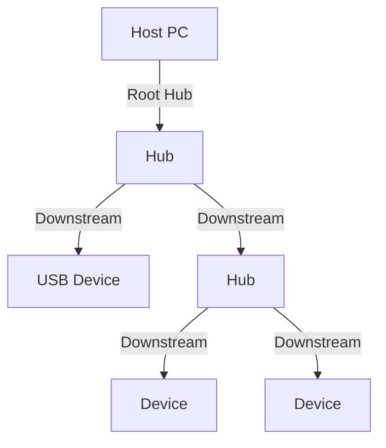

# USB 总线

> **权威来源**：USB-IF USB 3.2 Specification, Linux Kernel `drivers/usb/`, Linux Device Drivers。
>
> **目标**：系统讲解 USB 拓扑、描述符、URB、Host Controller、Gadget、Linux USB 子系统。

---

## 1. USB 拓扑



---

## 2. USB 速度

| 版本 | 速度 |
|------|------|
| USB 1.1 Low Speed | 1.5 Mbps |
| USB 1.1 Full Speed | 12 Mbps |
| USB 2.0 High Speed | 480 Mbps |
| USB 3.2 Gen 1 | 5 Gbps |
| USB 3.2 Gen 2 | 10 Gbps |
| USB 3.2 Gen 2x2 | 20 Gbps |
| USB4 | 40 Gbps |

---

## 3. 描述符

| 描述符 | 说明 |
|--------|------|
| Device Descriptor | 设备整体信息：VID/PID/bDeviceClass |
| Configuration Descriptor | 配置信息 |
| Interface Descriptor | 接口信息，一个驱动对应一个接口 |
| Endpoint Descriptor | 端点信息：地址、方向、类型、最大包大小 |
| String Descriptor | 厂商/产品/序列号字符串 |

---

## 4. 传输类型

| 类型 | 特点 | 例子 |
|------|------|------|
| Control | 可靠，双向，用于配置 | 枚举、GET_DESCRIPTOR |
| Bulk | 可靠，大数据量 | U 盘、网卡 |
| Interrupt | 小数据量，有保证延迟 | 键盘、鼠标 |
| Isochronous | 实时，不可靠 | 摄像头、音频 |

---

## 5. Host Controller

| 控制器 | 速度 |
|--------|------|
| OHCI | USB 1.1 |
| UHCI | USB 1.1 |
| EHCI | USB 2.0 |
| xHCI | USB 3.x |

---

## 6. Linux USB 子系统

### 6.1 核心结构

| 数据结构 | 源码 | 说明 |
|----------|------|------|
| `struct usb_device` | `include/linux/usb.h` | USB 设备 |
| `struct usb_interface` | `include/linux/usb.h` | USB 接口 |
| `struct usb_driver` | `include/linux/usb.h` | USB 驱动 |
| `struct urb` | `include/linux/usb.h` | USB Request Block |

### 6.2 URB 生命周期

```
usb_alloc_urb()
  ↓ 填充 urb
  ↓ usb_submit_urb()      # 异步提交
  ↓ 完成回调
  ↓ usb_free_urb()
```

### 6.3 常见 API

| API | 说明 |
|-----|------|
| `usb_register_driver()` | 注册驱动 |
| `usb_control_msg()` | 同步控制传输 |
| `usb_bulk_msg()` | 同步批量传输 |
| `usb_submit_urb()` | 异步提交 URB |

---

## 7. USB Gadget

- USB 设备模式（Device Mode）。
- Linux 通过 `configfs` 配置复合 gadget。
- 常见功能：mass storage、RNDIS、CDC ECM、serial。

---

## 8. 场景分析

| 场景 | 关键参数 | 验证指标 |
|------|----------|----------|
| 存储设备 | Bulk endpoint, max packet | 读写吞吐 |
| HID 设备 | Interrupt endpoint interval | 延迟 |
| 摄像头 | Isochronous bandwidth | 帧率 |
| 网络共享 | RNDIS/CDC ECM | 吞吐 |

---

## 9. 术语表

| 中文 | 英文 | 一句话定义 |
|------|------|------------|
| USB | Universal Serial Bus | 通用串行总线 |
| URB | USB Request Block | USB 异步传输单元 |
| Endpoint | 端点 | USB 设备上的数据收发点 |
| Configuration | 配置 | 设备的一种工作模式 |
| Interface | 接口 | 配置下的一个功能 |
| Gadget | USB Gadget | USB 从设备模式 |
| xHCI | eXtensible Host Controller Interface | USB 3.x 主机控制器 |

---

## 10. 相关文件

- [外设概念树](./peripheral-concept-tree.md)
- [外设总线选择决策树](./decision-tree-peripheral-bus.md)
