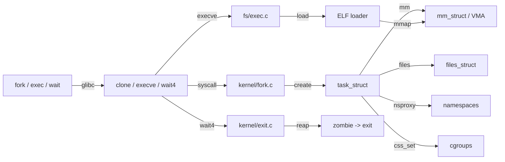
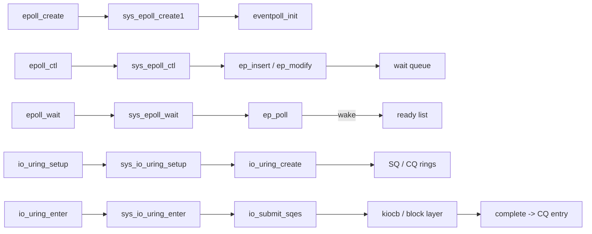

# 跨层映射图（Cross-Layer Mapping）

<!-- TOC START -->

- [跨层映射图（Cross-Layer Mapping）](#跨层映射图cross-layer-mapping)
  - [1. `printf` → 屏幕/文件](#1-printf--屏幕文件)
  - [2. `socket()` + `send()` → 网络](#2-socket--send--网络)
  - [3. 传感器读取 → I2C → 用户态](#3-传感器读取--i2c--用户态)
  - [4. `fork()` / `exec()` / `wait()` → 进程控制](#4-fork--exec--wait--进程控制)
  - [5. `mmap()` / Page Fault → 内存映射](#5-mmap--page-fault--内存映射)
  - [6. 中断处理跨层路径](#6-中断处理跨层路径)
  - [7. `epoll()` / `io_uring()` 跨层路径](#7-epoll--io_uring-跨层路径)
  - [8. 跨层接口映射表](#8-跨层接口映射表)
  - [9. 开销分析](#9-开销分析)
  - [10. 国际来源映射](#10-国际来源映射)
  - [11. 相关文件](#11-相关文件)
  - [12. 国际权威来源链接 / Authoritative Sources](#12-国际权威来源链接--authoritative-sources)

<!-- TOC END -->

> **目标**：展示关键用户操作如何经过应用层、glibc、系统调用、内核子系统、驱动、硬件的完整路径。

---

## 1. `printf` → 屏幕/文件

| 层级 | 关键函数/结构 | 说明 |
|------|---------------|------|
| 应用层 | `printf()` | glibc 格式化输出 |
| glibc | `write()` wrapper | 行缓冲后触发系统调用 |
| 系统调用 | `sys_write()` | `SYSCALL_DEFINE3(write, ...)` |
| VFS | `vfs_write()` | 通用写入口 |
| 文件系统 | `ext4_file_write_iter()` | ext4 写处理 |
| 页缓存 | `generic_perform_write()` | 拷贝到 page cache |
| 日志 | `jbd2` | 事务日志 |
| 块层 | `submit_bio()` | 构造 bio |
| 驱动 | `nvme_queue_rq()` | NVMe 队列请求 |
| 硬件 | DMA + SSD | 物理写入 |

---

## 2. `socket()` + `send()` → 网络

| 层级 | 关键函数/结构 | 说明 |
|------|---------------|------|
| 应用层 | `send()` / `sendmsg()` | 用户态发送 |
| glibc | `sendto()` wrapper | - |
| 系统调用 | `sys_sendmsg()` | - |
| Socket 层 | `sock_sendmsg()` / `inet_sendmsg()` | BSD socket → INET |
| TCP | `tcp_sendmsg()` | 拷贝到 send buffer |
| TCP 输出 | `tcp_write_xmit()` | 拥塞控制、Nagle |
| IP | `ip_queue_xmit()` | 路由、分片 |
| 网络设备 | `dev_queue_xmit()` | qdisc 或直接发送 |
| 驱动 | `ndo_start_xmit()` | NIC 驱动发送 |
| 硬件 | DMA + PHY/MAC | 物理发送 |

---

## 3. 传感器读取 → I2C → 用户态

| 层级 | 关键函数/结构 | 说明 |
|------|---------------|------|
| 应用层 | `read()` / `sysfs` | 读取传感器数据 |
| 系统调用 | `sys_read()` | - |
| VFS | `vfs_read()` | - |
| IIO 子系统 | `iio_device_read()` / `iio_triggered_buffer_postenable()` | Industrial I/O |
| I2C 核心 | `i2c_transfer()` / `i2c_smbus_read_byte_data()` | 总线传输 |
| I2C 适配器 | `i2c_adapter` | 控制器抽象 |
| 驱动 | I2C controller driver | 控制 I2C 时序 |
| 硬件 | GPIO/SCL/SDA | 物理信号 |
| 传感器 | BME280/MPU6050 | 数据采集 |

---

## 4. `fork()` / `exec()` / `wait()` → 进程控制

| 层级 | 关键函数/结构 | 说明 |
|------|---------------|------|
| 应用层 | `fork()` / `execvp()` / `waitpid()` | glibc POSIX 封装 |
| glibc | `__clone()` / `execve()` / `wait4()` | 系统调用封装 |
| 系统调用 | `sys_clone()` / `sys_execve()` / `sys_wait4()` | 入口 |
| 进程管理 | `copy_process()` / `do_fork()` | 创建 task_struct |
| 内存管理 | `dup_mm()` / `mm_init()` / `setup_arg_pages()` | 复制或新建 mm_struct |
| 文件表 | `copy_files()` | 复制 files_struct（`CLONE_FILES` 时共享） |
| 命名空间 | `copy_namespaces()` | 复制或共享 nsproxy |
| cgroup | `cgroup_fork()` / `sched_cgroup_fork()` | 关联 css_set |
| ELF 加载 | `load_elf_binary()` | 解析 ELF，建立 VMA，映射程序段 |
| 退出 | `do_exit()` / `release_task()` | 资源回收，唤醒父进程 |

---

## 5. `mmap()` / Page Fault → 内存映射

| 层级 | 关键函数/结构 | 说明 |
|------|---------------|------|
| 应用层 | `mmap()` / `mprotect()` / `munmap()` | 用户态内存映射 API |
| glibc | `mmap64()` wrapper | 大文件偏移支持 |
| 系统调用 | `sys_mmap()` / `sys_munmap()` | 入口 |
| VMA 管理 | `do_mmap()` / `do_munmap()` | 创建/删除 vm_area_struct |
| 缺页处理 | `handle_mm_fault()` | 处理 #PF 异常 |
| 页表遍历 | `__handle_mm_fault()` / `pgd_offset`→`pud_offset`→... | 四级/五级页表 walk |
| 匿名页 | `do_anonymous_page()` | 分配零页或新页 |
| 文件映射 | `do_fault()` → `ext4_filemap_fault()` | 从文件读取到 page cache |
| 物理分配 | `alloc_pages()` / `buddy system` | 分配 page frame |
| TLB/MMU | `local_flush_tlb_*()` / MMU | 地址翻译与缓存 |

---

## 6. 中断处理跨层路径

| 层级 | 关键函数/结构 | 说明 |
|------|---------------|------|
| 用户态 | 应用代码 | 被中断或系统调用触发 |
| CPU 异常/中断入口 | IDT / IVT / vector table | x86 IDT, ARM VIC/GIC, RISC-V PLIC |
| 汇编入口 | `entry_IRQ_64()` / `__irq_svc` | 保存上下文 |
| IRQ 核心 | `generic_handle_irq()` / `handle_irq_event()` | 调用注册 ISR |
| 顶半部 | `irq_handler_t` (ISR) | 快速响应，禁用/启用本地中断 |
| 线程化中断 | `request_threaded_irq()` | ISR 返回 `IRQ_WAKE_THREAD`，kirqsd 执行 thread_fn |
| 底半部 | tasklet / workqueue / softirq | 延后处理 |
| 设备驱动 | `driver->interrupt_handler()` | 读取状态寄存器，处理数据 |
| 硬件 | 设备寄存器 / DMA | 清除中断源，完成 I/O |

---

## 7. `epoll()` / `io_uring()` 跨层路径

| 层级 | 关键函数/结构 | 说明 |
|------|---------------|------|
| 应用层 | `epoll_create1()` / `epoll_ctl()` / `epoll_wait()` | 高并发 I/O 多路复用 |
| 系统调用 | `sys_epoll_create1()` / `sys_epoll_ctl()` / `sys_epoll_wait()` | 入口 |
| eventpoll | `struct eventpoll` | 红黑树 + 就绪链表 |
| 文件就绪 | `ep_insert()` / `ep_poll_callback()` | 注册 wait_queue 回调 |
| 等待队列 | `wait_queue_entry_t` | 文件状态变化时唤醒 |
| io_uring 上下文 | `struct io_ring_ctx` | SQ/CQ ring buffer |
| 提交队列 | `struct io_uring_sqe` | 用户态提交操作 |
| 完成队列 | `struct io_uring_cqe` | 内核返回完成结果 |
| IO 提交 | `io_submit_sqes()` / `io_queue_sqe()` | 构造 kiocb，分发到文件系统/块层 |
| 块层 | `submit_bio()` / NVMe queue | 与 `write()` 路径汇合 |

---

## 8. 跨层接口映射表

| 用户操作 | 用户 API | 系统调用 | 内核子系统 | 驱动/硬件 |
|----------|----------|----------|------------|-----------|
| 写文件 | `write()` | `sys_write` | VFS → ext4 → block | NVMe/SATA → DMA → SSD |
| 发网络包 | `send()` | `sys_sendmsg` | socket → TCP → IP → net_device | NIC driver → DMA → PHY |
| 读传感器 | `read()` / sysfs | `sys_read` | IIO → I2C core | I2C controller → sensor |
| 控制 GPIO | `libgpiod` | `sys_ioctl` | GPIO chardev → gpiolib | gpiochip → GPIO 寄存器 |
| 打开串口 | `open()` | `sys_open` | tty core → uart driver | UART controller → 外设 |
| 进程创建 | `fork()` / `clone()` | `sys_clone` | fork.c → task_struct → mm/files/ns | - |
| 程序执行 | `execve()` | `sys_execve` | fs/exec.c → ELF loader → mmap | - |
| 内存映射 | `mmap()` | `sys_mmap` | mm/mmap.c → VMA → page fault | MMU/TLB/DRAM |
| 中断处理 | - | 硬件中断 | kernel/irq/ → ISR → threaded IRQ | 中断控制器 → 设备 |
| 异步 I/O | `io_uring_enter()` | `sys_io_uring_enter` | fs/io_uring.c → kiocb → block | DMA → 存储/网络 |

---

## 9. 开销分析

| 路径 | 主要开销 | 优化方向 |
|------|----------|----------|
| `printf` → SSD | 系统调用 + 拷贝 + 块层 + DMA | 缓冲、O_DIRECT、io_uring |
| `send` → NIC | 系统调用 + TCP/IP 处理 + 拷贝 | GSO/TSO、zero-copy、DPDK |
| 传感器读取 | 系统调用 + I2C 时延 | batch 读取、中断触发、DMA |
| GPIO 控制 | 系统调用 + gpiolib | mmap GPIO 寄存器、内核事件 |
| `fork()` → 新进程 | 拷贝页表/文件表/命名空间 | `clone()` flags、COW、vfork |
| `execve()` → 新程序 | ELF 解析 + VMA 建立 + 页缓存读取 | 预读、映射可执行文件 |
| `mmap()` → 首次访问 | 缺页异常 + 页表建立 + 物理页分配 | hugepage、prefault、mlock |
| 中断处理 | 上下文保存 + 顶半部执行 + 调度 | threaded IRQ、NAPI、中断亲和性 |
| `epoll_wait()` → 事件就绪 | 等待队列回调 + 就绪链表拷贝 | ET 模式、busy polling |
| `io_uring` → 完成 | SQ/CQ 内存映射 + 批量提交 | SQPOLL、registered buffers、polling |

---

## 10. 国际来源映射

| 跨层主题 | 来源类型 | 来源 | 位置 |
|----------|----------|------|------|
| 文件 I/O 路径 | Textbook | OSTEP | Ch. 17~20 |
| 网络数据路径 | Book | Linux Kernel Networking | Ch. 3~4 |
| IIO 子系统 | SourceCode | Linux Kernel | `drivers/iio/` |
| GPIO 用户态接口 | SourceCode | Linux Kernel | `drivers/gpio/gpiolib.c` |
| 进程创建/执行 | SourceCode | Linux Kernel | `kernel/fork.c`, `fs/exec.c` |
| 内存管理 | SourceCode | Linux Kernel | `mm/mmap.c`, `mm/memory.c` |
| 中断子系统 | SourceCode | Linux Kernel | `kernel/irq/` |
| epoll | SourceCode | Linux Kernel | `fs/eventpoll.c` |
| io_uring | Paper/SourceCode | Jens Axboe, 2020 / Linux Kernel | `fs/io_uring.c` |

---

## 11. 相关文件

- [系统调用接口](./syscall-interface.md)
- [Linux 网络协议栈](../06-networking/linux-network-stack.md)
- [外设概念树](../07-peripherals/peripheral-concept-tree.md)
- [Linux 内核源码映射](../05-linux-kernel/linux-source-map.md)
- [Linux 概念树](../05-linux-kernel/linux-concept-tree.md)
- [Linux 属性-关系映射](../05-linux-kernel/linux-attribute-relationship-map.md)

## 12. 国际权威来源链接 / Authoritative Sources

- [POSIX.1-2024](https://pubs.opengroup.org/onlinepubs/9799919799/)
- [Linux Kernel Documentation](https://docs.kernel.org/)
- [System V AMD64 ABI](https://gitlab.com/x86-psABIs/x86-64-ABI)
- [RFC 793 - TCP](https://datatracker.ietf.org/doc/html/rfc793)
- [NXP I²C-bus Specification UM10204](https://www.nxp.com/docs/en/user-guide/UM10204.pdf)
- [Motorola SPI Block Guide V04.01](https://www.nxp.com/docs/en/reference-manual/S12SPIV4.pdf)
- [PCI-SIG PCI Express Base Specification](https://pcisig.com/specifications)
- [USB-IF Document Library](https://www.usb.org/documents)
