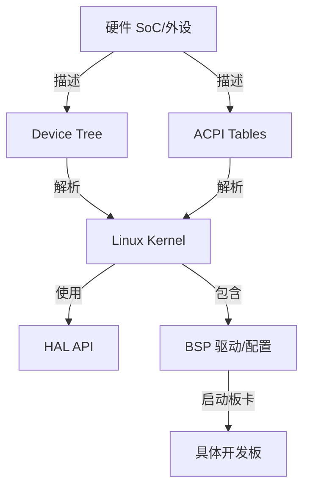
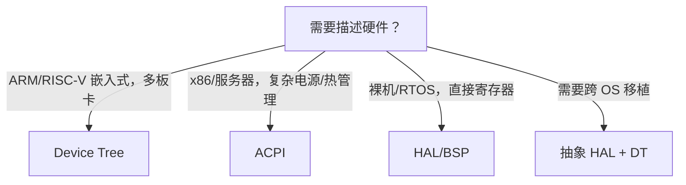

# HAL、BSP 与设备树

> **权威来源**：ARM Devicetree Specification, Linux Device Drivers, U-Boot Docs, ACPI Spec, FreeRTOS/Zephyr HAL docs。
>
> **目标**：对比硬件抽象层（HAL）、板级支持包（BSP）、设备树（Device Tree）、ACPI 的设计思想、适用场景与 Linux/RTOS 实现。

---

## 1. 概念对比

| 概念 | 全称 | 作用 | 典型位置 |
|------|------|------|----------|
| HAL | Hardware Abstraction Layer | 将硬件差异封装为统一 API | RTOS / 厂商 SDK |
| BSP | Board Support Package | 针对特定板卡的启动、驱动、配置文件 | 嵌入式 Linux 发行版 |
| Device Tree | Device Tree | 以数据结构描述硬件，内核启动时解析 | ARM/RISC-V Linux |
| ACPI | Advanced Configuration and Power Interface | 固件描述硬件与电源管理 | x86/部分 ARM 服务器 |
| 板级文件 | Board File | 早期 Linux 硬编码板级信息 | 旧 ARM Linux |



---

## 2. 设备树（Device Tree）

### 2.1 设计目标

- 把硬件描述从内核源码中分离。
- 同一内核镜像支持多种板卡。
- 便于 OTA 更新与第三方硬件适配。

### 2.2 编译流程

```
.dts + .dtsi
  ↓ dtc
.dtb
  ↓ bootloader (U-Boot/EFI) 传给内核
内核解析
  ↓ of_platform_populate()
驱动 probe
```

### 2.3 关键节点与属性

| 节点/属性 | 说明 | 示例 |
|-----------|------|------|
| `/` | 根节点 | - |
| `/cpus` | CPU 描述 | `cpu@0 { compatible = "arm,cortex-a53"; }` |
| `/memory` | 内存布局 | `reg = <0x0 0x80000000>;` |
| `/soc` | SoC 内部外设 | `uart0: serial@12340000` |
| `compatible` | 驱动匹配 | `"nxp,imx6q-uart"` |
| `reg` | 寄存器地址/大小 | `reg = <0x12340000 0x4000>` |
| `interrupts` | 中断 | `interrupts = <GIC_SPI 26 IRQ_TYPE_LEVEL_HIGH>` |
| `clocks` | 时钟 | `clocks = <&clk_uart0>` |
| `pinctrl-0` | 引脚配置 | `pinctrl-0 = <&uart0_pins>` |
| `status` | 启用/禁用 | `"okay"` / `"disabled"` |

### 2.4 设备树覆盖（Overlay）

```
base.dtb
  + overlay.dtbo
  ----------------
  = merged.dtb
```

- 用于运行时加载 cape/HAT 等扩展板配置。
- Linux 通过 `configfs` 或 `dtoverlay` 加载。

---

## 3. HAL（硬件抽象层）

### 3.1 设计模式

| 模式 | 说明 | 例子 |
|------|------|------|
| 统一 API + 后端驱动 | HAL 提供 API，不同平台实现后端 | Zephyr GPIO API |
| 寄存器封装 | 直接封装寄存器访问 | STM32 HAL Library |
| OS 抽象层 | 抽象 RTOS/OS 差异 | FreeRTOS+POSIX |

### 3.2 Zephyr HAL 示例

```c
// 统一 API
gpio_pin_configure(dev, pin, GPIO_OUTPUT_ACTIVE);
gpio_pin_set(dev, pin, 1);

// 后端由具体 SoC 实现
```

### 3.3 Linux 是否有 HAL？

- Linux 内核不使用传统 HAL，而是通过：
  - 设备模型（bus_type/device/driver）
  - 设备树
  - 平台驱动 / 总线驱动
  - 统一子系统（iio, input, pwm, rtc, hwmon）
- 用户态 HAL 可由 systemd/udev/libgpiod 等提供。

---

## 4. BSP（板级支持包）

### 4.1 典型内容

```
bsp/<board>/
  ├── bootloader/          # U-Boot 配置/补丁
  ├── dts/                 # 设备树源文件
  ├── kernel-config/       # 内核 defconfig
  ├── drivers/             # 板卡专属驱动
  ├── rootfs-overlay/      # 根文件系统定制
  ├── init-scripts/        # 启动脚本
  └── documentation/       # 硬件手册
```

### 4.2 与 Yocto/Buildroot 的关系

| 构建系统 | 作用 |
|----------|------|
| Yocto | 完整发行版构建，包含 BSP layer |
| Buildroot | 精简根文件系统，手动集成 BSP |
| 厂商 SDK | 预配置 BSP，快速启动 |

---

## 5. ACPI vs Device Tree

| 特性 | ACPI | Device Tree |
|------|------|-------------|
| 主导架构 | x86, 部分 ARM 服务器 | ARM, RISC-V, PowerPC |
| 描述能力 | 硬件 + 电源管理 + 配置 | 硬件拓扑 |
| 可发现性 | 固件提供 | bootloader 提供 |
| 运行时修改 | ACPI SSDT overlay | Device Tree overlay |
| 标准化 | UEFI/ACPI 论坛 | ARM Devicetree Spec |
| 复杂度 | 高 | 中 |

---

## 6. RTOS 中的 HAL/BSP

| RTOS | HAL/BSP 方式 |
|------|--------------|
| FreeRTOS | 厂商提供 HAL（如 STM32 HAL），FreeRTOS 提供内核 API |
| Zephyr | 统一驱动 API + 板级设备树 + SoC HAL |
| RTEMS | BSP 目录包含启动、时钟、中断、控制台代码 |
| VxWorks | BSP + vxBus 驱动框架 |
| RIOT | 统一 `periph_*` API + 板级配置 |

---

## 7. 决策：何时用 DT，何时用 ACPI，何时用 HAL



| 场景 | 推荐 | 原因 |
|------|------|------|
| ARM Linux 单板 | Device Tree | 内核统一，板卡差异外置 |
| x86 服务器 | ACPI | 固件成熟，支持 S3/S4/热插拔 |
| 资源受限 MCU | HAL/BSP | 无 MMU，不需要复杂描述 |
| 工业控制器 | DT + 实时补丁 | 硬件描述 + 确定性 |
| 跨平台应用 | Zephyr/RIOT HAL | 统一 API 屏蔽 SoC 差异 |

---

## 8. 术语表

| 中文 | 英文 | 一句话定义 |
|------|------|------------|
| 设备树 | Device Tree | 以树形数据结构描述硬件配置 |
| HAL | Hardware Abstraction Layer | 屏蔽硬件差异的统一软件接口层 |
| BSP | Board Support Package | 针对特定板卡的软件支持包 |
| ACPI | Advanced Configuration and Power Interface | 固件级硬件配置与电源管理规范 |
| DTS | Device Tree Source | 设备树源文件 |
| DTB | Device Tree Blob | 编译后的二进制设备树 |
| Overlay | Device Tree Overlay | 动态叠加的设备树片段 |

---

## 9. 国际来源映射

| 概念 | 来源类型 | 来源 | 位置 |
|------|----------|------|------|
| Device Tree | Standard | ARM Devicetree Specification | Release 0.3 |
| ACPI | Standard | UEFI/ACPI Forum | ACPI Spec 6.5 |
| Linux 设备模型 | Book | Linux Device Drivers | Ch. 14 |
| Zephyr HAL | Docs | Zephyr Project | Device Driver Model |
| FreeRTOS BSP | Docs | FreeRTOS | FreeRTOS-Plus/BSP |
| RTEMS BSP | Docs | RTEMS | Board Support Packages |

---

## 10. 相关文件

- [系统调用接口](./syscall-interface.md)
- [跨层映射](./cross-layer-mapping.md)
- [外设概念树](../07-peripherals/peripheral-concept-tree.md)
- [中断与 DMA](../07-peripherals/interrupts-and-dma.md)
